# Multi-Agent Orchestration Guide

**Generated from**: `context/` directory
**Workflow**: `default` - Full TDD workflow with comprehensive reviews and testing
**Auto-generated**: Do not edit manually. Run `uv run python context/scripts/generators/generate_claude_md.py` to regenerate.

---

## Overview

This guide describes the orchestration of specialised agents for software development tasks. Each agent has specific capabilities, follows defined standards, and produces specific outputs.

**Context Directory**: All standards, rules, and agent definitions are in `context/`. See [context/README.md](context/README.md) for complete index.

**Orchestrator**: When spawning agents, use the task prompt template at `context/templates/TASK-PROMPT-TEMPLATE.md`. The template ensures agents read their definition file and receive consistent task structure. Never inline agent definitions—agents will read them from `context/agents/{agent-name}.md`. See [workflow-standards.md §8](context/standards/workflow-standards.md#8-orchestrator-agent-invocation).

---

## Session Initialisation Checklist

**Use this checklist after context compaction or at session start:**

**For the orchestrator (you), before beginning work:**

1. **Core Standards** (Read if compacted or unfamiliar):
   - `context/standards/agent-standards.md` - Agent behaviour, tool usage, handoffs
   - `context/standards/workflow-standards.md` - Development workflow, TDD process
   - `context/standards/doc-standards.md` - Documentation structure, artefact organisation

2. **Technical Standards** (Read when working on implementation):
   - `context/standards/tech-standards.md` - Tech stack (uv, yarn, FastAPI, React)
   - `context/standards/coding-standards.md` - Code quality, patterns, error handling
   - `context/standards/testing-standards.md` - TDD cycle, coverage requirements

3. **Project Context** (Read when unfamiliar with current work):
   - `artefacts/product/requirements.md` - System requirements
   - `artefacts/architecture/architecture.md` - System architecture
   - `artefacts/build/tasks.md` - Current task list

4. **Verification**:
   - ✅ I know which workflow phase we're in (discovery/design/tdd-red/tdd-green/review/etc.)
   - ✅ I understand the TDD workflow (RED then GREEN then BLUE - three separate phases, never combined)
   - ✅ I will include TOOL REQUIREMENTS in every agent prompt (Write/Edit not bash, uv not pip, yarn dlx not npx)
   - ✅ I will present parallel options before spawning 2+ agents
   - ✅ I know agents read their definitions from `context/agents/{agent-name}.md`

**After compaction:** The conversation summary provides what happened, but standards may have changed. Re-read core standards to ensure compliance.

**When spawning agents:** Spawned agents do NOT inherit your context. You MUST explicitly tell them to read relevant standards. See "Agent Spawning Protocol" below.

---

## State Recovery After Context Compaction

**CRITICAL**: After context compaction or at session start, the orchestrating agent SHALL:


### Recovery Checklist

- [ ] Read artefacts/build/tasks.md for current task status
- [ ] Read HANDOFF.md in current service directory for latest handoff
- [ ] Read artefacts/shared/handoffs/integration-status.md for inter-service status
- [ ] Check git log for recent commits since last conversation
- [ ] Verify current phase by checking which tasks are complete

### Critical State Files


These files maintain project state across sessions:

- `artefacts/build/tasks.md`
- `{service}/HANDOFF.md`
- `artefacts/shared/handoffs/integration-status.md`
- `artefacts/architecture/architecture.md`
- `artefacts/product/requirements.md`

**Read these files immediately after compaction to understand current state.**

---

## Effort Estimation Guidance

**IMPORTANT**: Estimate effort in tokens, NOT time. Time estimates are unreliable.

- Estimate effort in tokens, not time
- Token ranges: Small (10-30k), Medium (30-80k), Large (80-150k), XLarge (150k+)
- Time estimates are unreliable and should not be provided
- Consider context duplication when estimating parallel work
- Factor in coordination overhead for multi-agent tasks

---

## Parallel Execution Planning

**When spawning multiple agents**, the orchestrator SHALL present parallel execution options:

- Always present parallel execution options when spawning multiple agents
- Show token trade-offs between sequential and parallel approaches
- Let user choose based on priorities (speed vs cost vs quality)
- Identify dependencies before suggesting parallelisation
- Define clear boundaries and contracts for parallel work

See workflow-standards.md §11 for complete parallel execution template.

---

## Workflow: default

Full TDD workflow with comprehensive reviews and testing

### Understanding Parallelism

This workflow uses two types of parallelism:

**1. Phase-Level Parallelism (Inter-Phase)**
- Multiple **phases** run simultaneously when they don't depend on each other
- Example: If phase A and B both depend on phase C, then A and B can run in parallel after C completes
- Determined by: `depends_on` field (implicit - no dependency = can be parallel)
- Current workflow: **Linear chain** - no phase-level parallelism

**2. Agent-Level Parallelism (Intra-Phase)**
- Multiple **agents** within a single phase run simultaneously
- Example: `@python-coder` and `@typescript-coder` in tdd-green phase
- Determined by: `parallel: true` flag (explicit)
- If `sequential: true`, agents run one after another in order

**Phase Dependencies in This Workflow:**
```
discovery → design → design-review → tdd-red → tdd-green → tdd-blue →
unit-test → integration-test → e2e-test → quality-review →
docs-cleanup → deployment → deployment-review → retrospective (optional)
```
Each phase waits for the previous phase to complete (strict sequence).

**Quality Gates:** design-review, quality-review, deployment-review
**Optional:** retrospective (workflow efficiency analysis)

### Workflow Diagram

```mermaid
flowchart TD
    subgraph discovery["Requirements & Planning"]
        discovery_product_expert["@product-expert"]
        discovery_product_owner["@product-owner"]
    end
    subgraph design["Architecture & Design"]
        design_solution_architect["@solution-architect"]
        design_database_designer["@database-designer"]
        design_api_designer["@api-designer"]
        design_ui_designer["@ui-designer"]
        design_visual_designer["@visual-designer"]
    end
    discovery --> design
    subgraph design-review["Design Review Gate"]
        design-review_tech_lead["@tech-lead"]
        design-review_code_reviewer["@code-reviewer"]
        design-review_principles_reviewer["@principles-reviewer"]
        design-review_visual_designer["@visual-designer"]
        design-review_security_tester["@security-tester"]
    end
    design --> design-review
    design-review:::gateStyle
    subgraph tdd-red["TDD Red: Write Failing Tests"]
        tdd-red_functional_tester["@functional-tester"]
    end
    design-review --> tdd-red
    subgraph tdd-green["TDD Green: Implement to Pass Tests"]
        tdd-green_python_coder["@python-coder"]
        tdd-green_typescript_coder["@typescript-coder"]
    end
    tdd-red --> tdd-green
    subgraph tdd-blue["TDD Blue: Refactor"]
        tdd-blue_python_coder["@python-coder"]
        tdd-blue_typescript_coder["@typescript-coder"]
    end
    tdd-green --> tdd-blue
    subgraph unit-test["Unit Testing"]
        unit-test_functional_tester["@functional-tester"]
    end
    tdd-blue --> unit-test
    subgraph integration-test["Integration Testing"]
        integration-test_functional_tester["@functional-tester"]
    end
    unit-test --> integration-test
    subgraph e2e-test["UI E2E Testing"]
        e2e-test_ui_tester["@ui-tester"]
    end
    integration-test --> e2e-test
    subgraph quality-review["Quality Review Gate"]
        quality-review_tech_lead["@tech-lead"]
        quality-review_code_reviewer["@code-reviewer"]
        quality-review_principles_reviewer["@principles-reviewer"]
        quality-review_visual_designer["@visual-designer"]
        quality-review_security_tester["@security-tester"]
    end
    e2e-test --> quality-review
    quality-review:::gateStyle
    subgraph docs-cleanup["Documentation Cleanup"]
        docs-cleanup_documentation["@documentation"]
    end
    quality-review --> docs-cleanup
    subgraph deployment["Infrastructure & Deployment"]
        deployment_gcp_devops["@gcp-devops"]
    end
    docs-cleanup --> deployment
    subgraph deployment-review["Deployment Review"]
        deployment-review_tech_lead["@tech-lead"]
    end
    deployment --> deployment-review
    deployment-review:::gateStyle
    subgraph retrospective["Workflow Efficiency Analysis"]
        retrospective_workflow_analyst["@workflow-analyst"]
    end
    deployment-review --> retrospective
    classDef gateStyle fill:#ff6b6b,stroke:#c92a2a,stroke-width:3px
```



### Phases

#### Requirements & Planning
**Phase ID**: `discovery`
**Execution**: Sequential (agents run in order)

**Agents:**
- `@product-expert` - See `context/agents/product-expert.md`
- `@product-owner` - See `context/agents/product-owner.md`

**Outputs:**
- artefacts/product/

#### Architecture & Design
**Phase ID**: `design`
**Depends On**: `discovery`
**Execution**: Parallel (agents run simultaneously)

**Agents:**
- `@solution-architect` - See `context/agents/solution-architect.md`
- `@database-designer` - See `context/agents/database-designer.md`
- `@api-designer` - See `context/agents/api-designer.md`
- `@ui-designer` - See `context/agents/ui-designer.md`
- `@visual-designer` - See `context/agents/visual-designer.md`

**Outputs:**
- artefacts/architecture/
- artefacts/design/

#### Design Review Gate
**Phase ID**: `design-review`
**Depends On**: `design`
**Execution**: Sequential (agents run in order)
**Quality Gate**: ⚠️ Approval required before proceeding

**Agents:**
- `@tech-lead` - See `context/agents/tech-lead.md`
- `@code-reviewer` - See `context/agents/code-reviewer.md`
- `@principles-reviewer` - See `context/agents/principles-reviewer.md`
- `@visual-designer` - See `context/agents/visual-designer.md`
- `@security-tester` - See `context/agents/security-tester.md`

**Outputs:**
- artefacts/build/

**Validation:**
- tech-lead must APPROVE before next reviewer
- CHANGES REQUIRED → return to design phase
- No architectural security issues
- Design meets LESS principles
- Visual design standards met

#### TDD Red: Write Failing Tests
**Phase ID**: `tdd-red`
**Depends On**: `design-review`

**Agents:**
- `@functional-tester` - See `context/agents/functional-tester.md`

**Outputs:**
- tests/

**Validation:**
- All tests must fail initially
- Coverage targets defined

**Notes:**
- Use Write/Edit tools for creating test files, not bash
- Python tests: use uv for running pytest
- TypeScript tests: use yarn for running tests

#### TDD Green: Implement to Pass Tests
**Phase ID**: `tdd-green`
**Depends On**: `tdd-red`
**Execution**: Parallel (agents run simultaneously)

**Agents:**
- `@python-coder` - See `context/agents/python-coder.md`
- `@typescript-coder` - See `context/agents/typescript-coder.md`

**Outputs:**
- Source code
- Tests passing

**Validation:**
- All tests must pass
- No test modifications allowed

**Notes:**
- Python: use uv for all package management and script execution
- TypeScript: use yarn for all package management, yarn dlx for one-off tools
- Use Write/Edit tools for code files, not bash with echo/cat/heredoc

#### TDD Blue: Refactor
**Phase ID**: `tdd-blue`
**Depends On**: `tdd-green`
**Execution**: Parallel (agents run simultaneously)

**Agents:**
- `@python-coder` - See `context/agents/python-coder.md`
- `@typescript-coder` - See `context/agents/typescript-coder.md`

**Outputs:**
- Refactored code
- Tests still passing

**Validation:**
- All tests must still pass
- Code quality improved (reduced duplication, better naming, clearer structure)
- No new functionality added

**Notes:**
- Focus on improving code structure without changing behaviour
- Remove duplication, improve naming, simplify logic
- Maintain 100% test pass rate throughout refactoring

#### Unit Testing
**Phase ID**: `unit-test`
**Depends On**: `tdd-blue`
**Execution**: Parallel (agents run simultaneously)

**Agents:**
- `@functional-tester` - See `context/agents/functional-tester.md`

**Outputs:**
- artefacts/test-results/unit/

**Validation:**
- Coverage >= 90%
- All edge cases tested

#### Integration Testing
**Phase ID**: `integration-test`
**Depends On**: `unit-test`
**Execution**: Parallel (agents run simultaneously)

**Agents:**
- `@functional-tester` - See `context/agents/functional-tester.md`

**Outputs:**
- artefacts/test-results/integration/

**Validation:**
- API contracts verified
- Service interactions tested
- Database migrations validated

#### UI E2E Testing
**Phase ID**: `e2e-test`
**Depends On**: `integration-test`

**Agents:**
- `@ui-tester` - See `context/agents/ui-tester.md`

**Outputs:**
- artefacts/test-results/e2e/
- artefacts/test-results/e2e/screenshots/

**Validation:**
- At least one screenshot per user workflow
- Browser interactions documented (not just API calls)
- Complete user workflows tested
- Visual regression tests pass (threshold configurable)

**Notes:**
- REQUIRED: Screenshots in artefacts/test-results/e2e/screenshots/
- Test log must show browser interactions, not just API calls
- Must test actual UI, not just backend APIs
- RECOMMENDED: Automated visual diff checking (see tech-standards.md for Puppeteer + pixelmatch)

#### Quality Review Gate
**Phase ID**: `quality-review`
**Depends On**: `e2e-test`
**Execution**: Sequential (agents run in order)
**Quality Gate**: ⚠️ Approval required before proceeding

**Agents:**
- `@tech-lead` - See `context/agents/tech-lead.md`
- `@code-reviewer` - See `context/agents/code-reviewer.md`
- `@principles-reviewer` - See `context/agents/principles-reviewer.md`
- `@visual-designer` - See `context/agents/visual-designer.md`
- `@security-tester` - See `context/agents/security-tester.md`

**Outputs:**
- artefacts/build/

**Validation:**
- tech-lead must APPROVE before next reviewer
- CHANGES REQUIRED → return to appropriate phase
- No critical security issues
- UI meets design standards

#### Documentation Cleanup
**Phase ID**: `docs-cleanup`
**Depends On**: `quality-review`

**Agents:**
- `@documentation` - See `context/agents/documentation.md`

**Outputs:**
- README.md updates
- artefacts/ cleanup
- API documentation

**Validation:**
- Old documentation archived (not deleted)
- All documentation follows doc-standards.md
- README.md updated with current information
- API documentation complete and accurate
- build/tasks.md reflects current status
- HANDOFF.md includes final handoff entry

**Notes:**
- Archive superseded artefacts (do not delete)
- Update build/tasks.md status
- Update HANDOFF.md with final status

#### Infrastructure & Deployment
**Phase ID**: `deployment`
**Depends On**: `docs-cleanup`

**Agents:**
- `@gcp-devops` - See `context/agents/gcp-devops.md`

**Outputs:**
- Infrastructure code
- Deployment configs

**Validation:**
- Deployment tested in staging
- Rollback plan documented

#### Deployment Review
**Phase ID**: `deployment-review`
**Depends On**: `deployment`
**Quality Gate**: ⚠️ Approval required before proceeding

**Agents:**
- `@tech-lead` - See `context/agents/tech-lead.md`

**Outputs:**
- artefacts/build/

**Validation:**
- Deployment successful
- Monitoring configured
- Rollback tested

#### Workflow Efficiency Analysis
**Phase ID**: `retrospective`
**Depends On**: `deployment-review`
**Optional**: Can be skipped

**Agents:**
- `@workflow-analyst` - See `context/agents/workflow-analyst.md`

**Outputs:**
- artefacts/build/efficiency-report.md
- artefacts/build/efficiency-data/

**Validation:**
- All data sources analyzed (tasks, handoffs, git, conversation)
- Metrics calculated for all phases
- Top 3-5 bottlenecks identified
- Actionable recommendations provided
- Workflow health score calculated

**Notes:**
- Run after deployment for post-mortem analysis
- Can skip for urgent deployments (optional phase)
- Requires git history access for commit analysis
- Compare metrics to previous cycles for trend analysis

---

## Agent Reference

All agents are defined in `context/agents/`. Each agent:
- Follows specific standards (listed in frontmatter)
- Enforces specific rules (validated automatically)
- Uses `{project-root}` placeholders for portability

### Pre-Spawn Checklist

**BEFORE spawning any agent, verify ALL of these:**

- [ ] Agent prompt includes "Read context/standards/tech-standards.md first"
- [ ] Agent prompt includes TOOL REQUIREMENTS block (Write/Edit not bash, uv not pip, yarn dlx not npx)
- [ ] If TDD phase: Specified which phase (RED/GREEN/BLUE) and requirements
- [ ] If spawning 2+ agents: Presented parallel vs sequential options to user
- [ ] Task is clear and unambiguous

**If any checkbox is unchecked, do NOT spawn the agent yet.**

### Agent Spawning Protocol

**CRITICAL**: When spawning agents, the orchestrator MUST explicitly provide standards context. Spawned agents start with fresh context and do NOT automatically inherit standards.

**Template for spawning agents:**

```
@agent-name [task description]

BEFORE starting, read these standards:
1. context/standards/tech-standards.md - Tech stack (uv, yarn, Puppeteer)
2. context/standards/agent-standards.md - Tool usage (Write/Edit not bash)
3. context/standards/[relevant-standard].md

Key reminders:
- Python: use `uv add`, `uv run` (NOT pip)
- TypeScript: use `yarn add`, `yarn dlx` (NOT npm, npx)
- Files: use Write/Edit tools (NOT bash echo/cat/sed)

Then: [specific task instructions]
```

**Why this is required:**
- Spawned agents don't have access to CLAUDE.md/AGENTS.md
- Standards are NOT inherited automatically
- Explicit reading prevents common violations (npx vs yarn dlx, pip vs uv, bash vs Write/Edit)

### Invocation Examples

**Correct (with standards context):**
```
@python-coder Implement authentication service

Read context/standards/tech-standards.md first.
Use `uv add` for packages (NOT pip).
Use Write/Edit tools for files (NOT bash).

Implement: [task details]
```

**Incorrect (missing standards):**
```
@python-coder Implement authentication service
```
❌ Agent will likely use pip, bash for files, default behaviors

### Critical Adherence Protocols

**These protocols are MANDATORY. Violations indicate orchestrator failure.**

#### Protocol 1: Tool Usage Enforcement

**BEFORE spawning any agent, verify agent prompt includes:**

```
TOOL REQUIREMENTS (MANDATORY):
- File operations: Use Write/Edit tools ONLY (NEVER bash echo/cat/sed/awk)
- Python packages: Use `uv add` ONLY (NEVER pip)
- TypeScript packages: Use `yarn add` ONLY (NEVER npm)
- One-off TypeScript tools: Use `yarn dlx` ONLY (NEVER npx)
- Find files: Use Glob tool (NEVER bash find/ls)
- Search files: Use Grep tool (NEVER bash grep/rg)

If you use bash for file operations, the task will be rejected.
```

**Validation**: After agent completes, check tool usage in transcript. Reject if violations found.

#### Protocol 2: TDD Workflow Enforcement

**TDD phases are SEPARATE. They CANNOT be combined.**

**When starting TDD work:**

```
Phase 1: TDD RED (write failing tests)
@functional-tester Write tests for [feature]

Requirements:
- Tests MUST fail when first run
- Do NOT write implementation code
- Report: "All tests failing as expected"

Phase 2: TDD GREEN (implement to pass)
@python-coder / @typescript-coder Implement [feature]

Requirements:
- Tests MUST pass when done
- Do NOT modify tests
- Do NOT refactor yet
- Report: "All tests passing"

Phase 3: TDD BLUE (refactor)
@python-coder / @typescript-coder Refactor [feature]

Requirements:
- Tests MUST still pass
- Improve code quality only
- No new functionality
- Report: "Refactored, all tests still passing"
```

**Validation**: Each phase must complete before next begins. No combining phases.

#### Protocol 3: Parallel Execution Planning

**BEFORE spawning 2+ agents, ALWAYS present parallel options to user.**

**Mandatory template:**

```
I'm about to spawn [N] agents: [@agent1, @agent2, ...]

EXECUTION OPTIONS:

Option A: Sequential
- Agents run one after another: @agent1 → @agent2 → @agent3
- Time: ~X minutes total
- Tokens: Y tokens (baseline)
- Risk: Low (easier to debug, clear order)

Option B: Parallel
- Agents run simultaneously: @agent1 + @agent2 + @agent3
- Time: ~Z minutes (~40-50% faster)
- Tokens: Y + N tokens (~10-20% more due to context duplication)
- Risk: Medium (merge conflicts possible, coordination overhead)

Which option do you prefer?
```

**Validation**: If spawning 2+ agents without presenting options, this is a protocol violation.

### Tool Usage Reminders

**CRITICAL**: Agents must use the correct tools for each operation:

| Operation | ✅ Use | ❌ Don't Use |
|-----------|--------|--------------|
| Create/modify files | Write, Edit tools | bash with echo, cat, sed, awk, heredoc |
| Run tests | bash with `uv run pytest` or `yarn test` | N/A |
| Python package management | `uv add`, `uv remove`, `uv run` | pip, manual edits |
| TypeScript package management | `yarn add`, `yarn remove` | npm, pnpm |
| One-off TypeScript tools | `yarn dlx <tool>` | npx, global installs |
| Find files | Glob tool | bash find, ls |
| Search file contents | Grep tool | bash grep, rg |
| Git operations | bash | N/A |

**Why this matters:**
- Write/Edit tools don't require user permission (faster execution)
- Bash file operations require permission prompts (slower, interrupts flow)
- Using correct package managers ensures consistent environments

See agent-standards.md §3.3 for complete tool usage guidelines.

### Discovery

**@product-owner** - See `context/agents/product-owner.md`

### Design

**@solution-architect** - See `context/agents/solution-architect.md`

**@database-designer** - See `context/agents/database-designer.md`

**@api-designer** - See `context/agents/api-designer.md`

**@ui-designer** - See `context/agents/ui-designer.md`

**@visual-designer** - See `context/agents/visual-designer.md`

### Development

**@functional-tester** - See `context/agents/functional-tester.md`

**@python-coder** - See `context/agents/python-coder.md`

**@typescript-coder** - See `context/agents/typescript-coder.md`

### Review

**@tech-lead** - See `context/agents/tech-lead.md`

**@code-reviewer** - See `context/agents/code-reviewer.md`

### Testing

**@ui-tester** - See `context/agents/ui-tester.md`

**@security-tester** - See `context/agents/security-tester.md`

### Deployment

**@gcp-devops** - See `context/agents/gcp-devops.md`

### Documentation

**@documentation** - See `context/agents/documentation.md`

---

## Standards & Rules

### Standards (Guidance)

Located in `context/standards/`:
- **coding-standards.md** - Language patterns, frameworks, design principles
- **testing-standards.md** - TDD methodology, coverage requirements
- **tech-standards.md** - Tech stack, tools (uv), deployment
- **doc-standards.md** - Documentation structure, diagrams, writing
- **workflow-standards.md** - Processes, communication, retrospectives

### Rules (Enforced)

Located in `context/rules/` with automated validators:
- **conventional-commits.mdc** - Commit message format
- **EARS-notation-requirements.mdc** - Requirements notation
- **british-english.mdc** - Spelling conventions
- **metrics-logging.mdc** - Agent metrics format

**Pre-commit hooks** validate all rules automatically.

---

## Quality Gates

#### Design Review
**Type**: approval
**Required**: Yes

Design must be approved before implementation begins: tech-lead → code-reviewer → principles-reviewer → visual-designer → security-tester

**Criteria:**
- architecture_blockers == 0
- design_security_issues == 0

#### Quality Review
**Type**: approval
**Required**: Yes

Implementation must be approved before deployment: tech-lead → code-reviewer → principles-reviewer → visual-designer → security-tester

**Criteria:**
- test_coverage >= 90
- critical_security_issues == 0
- ui_screenshots >= 1
- visual_regression_pass == True

#### Deployment Review
**Type**: approval
**Required**: Yes

Tech lead must approve deployment before production

---

## Workflow Rules & Warnings

### Workflow Rules

- Tests written before implementation (TDD Red → Green → Blue)
- Sequential review (tech-lead → code-reviewer → principles-reviewer → visual-designer → security-tester)
- No test modifications during tdd-green or tdd-blue phases
- All quality gates must pass
- Use Write/Edit tools for file operations (not bash with echo/cat/sed)
- Python agents must use `uv` for all package management
- TypeScript agents must use `yarn` for all package management, `yarn dlx` for one-off tools
- UI tests must include screenshots and browser interactions
- Update build/tasks.md and HANDOFF.md after completing work
- Estimate effort in tokens, not time
- After context compaction, read state recovery section and update status

---

## Best Practices

### Agent Usage

1. **Start with the workflow** - Follow phase dependencies
2. **One task per agent** - Keep agent prompts focused
3. **Use quality gates** - Don't skip reviews for production code
4. **Let agents fail** - If tests fail, agent reports it (don't auto-fix)
5. **Check outputs** - Verify agent produced expected files

### Workflow Selection

- **Use `default.yaml`** for production code requiring quality and maintainability
- **Use `prototype.yaml`** for experiments, POCs, and throwaway code
- **Don't promote prototype code** to production without rewriting with default workflow

### Troubleshooting

**Agent can't find files:**
→ Check `{project-root}` is correctly set for your project structure

**Standards not loaded:**
→ Agent definitions list required standards in frontmatter

**Validation fails:**
→ Run `uv run pre-commit run --all-files` to see specific violations

**Tests fail but agent doesn't fix:**
→ Correct behaviour! `@functional-tester` reports failures; coders fix them

---

## Maintenance

### Updating This File

Regenerate AGENTS.md after changes to:
- `context/workflows/*.yaml`
- `context/agents/*.md`
- `context/README.md`

```bash
uv run python context/scripts/generators/generate_claude_md.py --workflow default
```

### Adding New Agents

1. Copy `context/agents/TEMPLATE.md`
2. Fill in standards/rules in frontmatter
3. Add to appropriate workflow phase
4. Regenerate AGENTS.md

### Switching Workflows

```bash
# Generate for prototype workflow
uv run python context/scripts/generators/generate-claude-md.py --workflow prototype
```

---

## Context Directory Structure

```
context/
├── README.md              # Complete index
├── standards/             # How to do things (guidance)
├── rules/                # What must be enforced (validators)
├── agents/               # Who does what (agent definitions)
├── workflows/            # Workflow patterns (this workflow: default)
└── scripts/              # Tools (validators, generators)
```

**Full documentation**: [context/README.md](context/README.md)

---

**Generated**: default workflow
**Agents**: 18 specialised agents
**Standards**: 5 guidance documents
**Rules**: 4 enforceable rules
