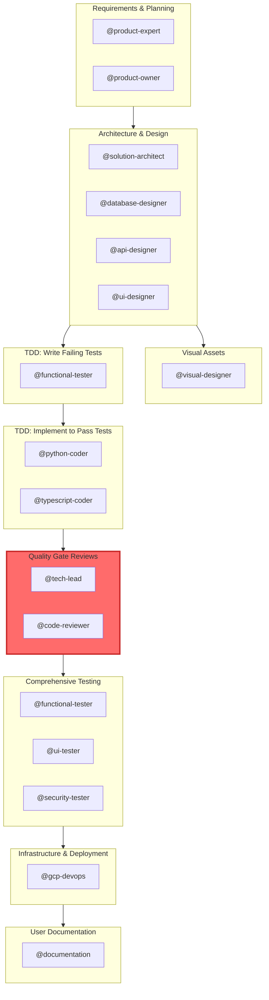

# Multi-Agent Orchestration Guide

**Generated from**: `context/` directory
**Workflow**: `default` - Full TDD workflow with comprehensive reviews and testing
**Auto-generated**: Do not edit manually. Run `uv run python context/scripts/generators/generate-claude-md.py` to regenerate.

---

## Overview

This guide describes the orchestration of specialised agents for software development tasks. Each agent has specific capabilities, follows defined standards, and produces specific outputs.

**Context Directory**: All standards, rules, and agent definitions are in `context/`. See [context/README.md](context/README.md) for complete index.

**Orchestrator**: When spawning agents, use the task prompt template at `context/templates/TASK-PROMPT-TEMPLATE.md`. The template ensures agents read their definition file and receive consistent task structure. Never inline agent definitions—agents will read them from `context/agents/{agent-name}.md`. See [workflow-standards.md §8](context/standards/workflow-standards.md#8-orchestrator-agent-invocation).

---

## Workflow: default

Full TDD workflow with comprehensive reviews and testing

### Workflow Diagram



### Phases

#### Requirements & Planning
**Phase ID**: `discovery`
**Execution**: Sequential (agents run in order)

**Agents:**
- `@product-expert` - See `context/agents/product-expert.md`
- `@product-owner` - See `context/agents/product-owner.md`

**Outputs:**
- artefacts/product/discovery-notes.md
- artefacts/product/requirements.md
- artefacts/product/user-stories.md
- artefacts/product/open-questions.md

#### Architecture & Design
**Phase ID**: `design`
**Depends On**: `discovery`
**Execution**: Parallel (agents run simultaneously)

**Agents:**
- `@solution-architect` - See `context/agents/solution-architect.md`
- `@database-designer` - See `context/agents/database-designer.md`
- `@api-designer` - See `context/agents/api-designer.md`
- `@ui-designer` - See `context/agents/ui-designer.md`

**Outputs:**
- artefacts/architecture/architecture.md
- artefacts/architecture/data-model.md
- artefacts/api/openapi.yaml
- artefacts/design/components.md

#### Visual Assets
**Phase ID**: `visual-design`
**Depends On**: `design`
**Optional**: Can be skipped

**Agents:**
- `@visual-designer` - See `context/agents/visual-designer.md`

**Outputs:**
- artefacts/design/visuals/

#### TDD: Write Failing Tests
**Phase ID**: `tdd-red`
**Depends On**: `design`

**Agents:**
- `@functional-tester` - See `context/agents/functional-tester.md`

**Outputs:**
- tests/

**Validation:**
- All tests must fail initially
- Coverage targets defined

#### TDD: Implement to Pass Tests
**Phase ID**: `tdd-green`
**Depends On**: `tdd-red`
**Execution**: Parallel (agents run simultaneously)

**Agents:**
- `@python-coder` - See `context/agents/python-coder.md`
- `@typescript-coder` - See `context/agents/typescript-coder.md`

**Outputs:**
- Source code
- Tests passing

**Validation:**
- All tests must pass
- No test modifications allowed

#### Quality Gate Reviews
**Phase ID**: `review-gate`
**Depends On**: `tdd-green`
**Execution**: Sequential (agents run in order)
**Quality Gate**: ⚠️ Approval required before proceeding

**Agents:**
- `@tech-lead` - See `context/agents/tech-lead.md`
- `@code-reviewer` - See `context/agents/code-reviewer.md`

**Outputs:**
- artefacts/build/tech-review.md
- artefacts/build/code-review.md

**Validation:**
- tech-lead must APPROVE before code-reviewer runs
- CHANGES REQUIRED → return to tdd-green

#### Comprehensive Testing
**Phase ID**: `verification`
**Depends On**: `review-gate`
**Execution**: Parallel (agents run simultaneously)

**Agents:**
- `@functional-tester` - See `context/agents/functional-tester.md`
- `@ui-tester` - See `context/agents/ui-tester.md`
- `@security-tester` - See `context/agents/security-tester.md`

**Outputs:**
- artefacts/test-results/

**Validation:**
- Coverage >= 90%
- No critical security issues

#### Infrastructure & Deployment
**Phase ID**: `deployment`
**Depends On**: `verification`

**Agents:**
- `@gcp-devops` - See `context/agents/gcp-devops.md`

**Outputs:**
- Infrastructure code
- Deployment configs

#### User Documentation
**Phase ID**: `documentation`
**Depends On**: `deployment`

**Agents:**
- `@documentation` - See `context/agents/documentation.md`

**Outputs:**
- User guides
- API documentation

---

## Agent Reference

All agents are defined in `context/agents/`. Each agent:
- Follows specific standards (listed in frontmatter)
- Enforces specific rules (validated automatically)
- Uses `{project-root}` placeholders for portability

### Invocation

Use `@agent-name` to invoke an agent:

```
@product-owner Define requirements for user authentication
@solution-architect Design the authentication system architecture
@functional-tester Write tests for authentication (TDD Red)
@python-coder Implement authentication service (TDD Green)
@tech-lead Review authentication implementation
```

### Discovery

**@product-owner** - See `context/agents/product-owner.md`

### Design

**@solution-architect** - See `context/agents/solution-architect.md`

**@database-designer** - See `context/agents/database-designer.md`

**@api-designer** - See `context/agents/api-designer.md`

**@ui-designer** - See `context/agents/ui-designer.md`

**@visual-designer** - See `context/agents/visual-designer.md`

### Development

**@functional-tester** - See `context/agents/functional-tester.md`

**@python-coder** - See `context/agents/python-coder.md`

**@typescript-coder** - See `context/agents/typescript-coder.md`

### Review

**@tech-lead** - See `context/agents/tech-lead.md`

**@code-reviewer** - See `context/agents/code-reviewer.md`

### Testing

**@ui-tester** - See `context/agents/ui-tester.md`

**@security-tester** - See `context/agents/security-tester.md`

### Deployment

**@gcp-devops** - See `context/agents/gcp-devops.md`

### Documentation

**@documentation** - See `context/agents/documentation.md`

---

## Standards & Rules

### Standards (Guidance)

Located in `context/standards/`:
- **coding-standards.md** - Language patterns, frameworks, design principles
- **testing-standards.md** - TDD methodology, coverage requirements
- **tech-standards.md** - Tech stack, tools (uv), deployment
- **doc-standards.md** - Documentation structure, diagrams, writing
- **workflow-standards.md** - Processes, communication, retrospectives

### Rules (Enforced)

Located in `context/rules/` with automated validators:
- **conventional-commits.mdc** - Commit message format
- **EARS-notation-requirements.mdc** - Requirements notation
- **british-english.mdc** - Spelling conventions
- **metrics-logging.mdc** - Agent metrics format

**Pre-commit hooks** validate all rules automatically.

---

## Quality Gates

#### Review Gate
**Type**: approval
**Required**: Yes

Tech lead must approve before proceeding

#### Verification
**Type**: metrics
**Required**: Yes


**Criteria:**
- test_coverage >= 90
- critical_security_issues == 0

---

## Workflow Rules & Warnings

### Workflow Rules

- Tests written before implementation (TDD)
- Sequential review (tech-lead → code-reviewer)
- No test modifications during tdd-green phase
- All quality gates must pass

---

## Best Practices

### Agent Usage

1. **Start with the workflow** - Follow phase dependencies
2. **One task per agent** - Keep agent prompts focused
3. **Use quality gates** - Don't skip reviews for production code
4. **Let agents fail** - If tests fail, agent reports it (don't auto-fix)
5. **Check outputs** - Verify agent produced expected files

### Workflow Selection

- **Use `default.yaml`** for production code requiring quality and maintainability
- **Use `prototype.yaml`** for experiments, POCs, and throwaway code
- **Don't promote prototype code** to production without rewriting with default workflow

### Troubleshooting

**Agent can't find files:**
→ Check `{project-root}` is correctly set for your project structure

**Standards not loaded:**
→ Agent definitions list required standards in frontmatter

**Validation fails:**
→ Run `uv run pre-commit run --all-files` to see specific violations

**Tests fail but agent doesn't fix:**
→ Correct behaviour! `@functional-tester` reports failures; coders fix them

---

## Maintenance

### Updating This File

Regenerate CLAUDE.md after changes to:
- `context/workflows/*.yaml`
- `context/agents/*.md`
- `context/README.md`

```bash
uv run python context/scripts/generators/generate-claude-md.py --workflow default
```

### Adding New Agents

1. Copy `context/agents/TEMPLATE.md`
2. Fill in standards/rules in frontmatter
3. Add to appropriate workflow phase
4. Regenerate CLAUDE.md

### Switching Workflows

```bash
# Generate for prototype workflow
uv run python context/scripts/generators/generate-claude-md.py --workflow prototype
```

---

## Context Directory Structure

```
context/
├── README.md              # Complete index
├── standards/             # How to do things (guidance)
├── rules/                # What must be enforced (validators)
├── agents/               # Who does what (agent definitions)
├── workflows/            # Workflow patterns (this workflow: default)
└── scripts/              # Tools (validators, generators)
```

**Full documentation**: [context/README.md](context/README.md)

---

**Generated**: default workflow
**Agents**: 16 specialised agents
**Standards**: 5 guidance documents
**Rules**: 4 enforceable rules
