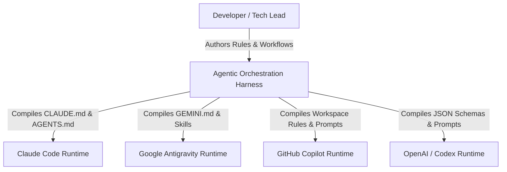
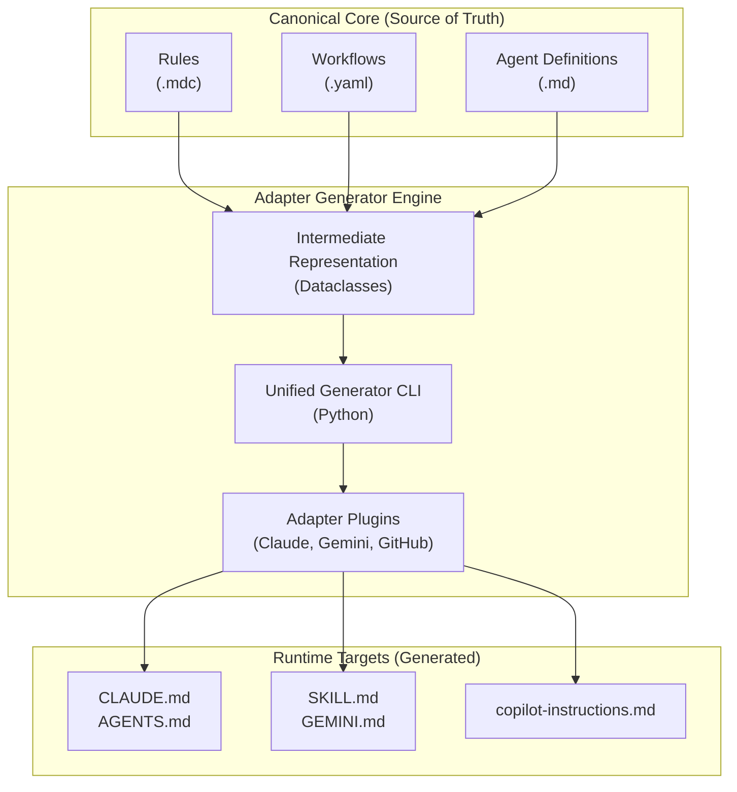
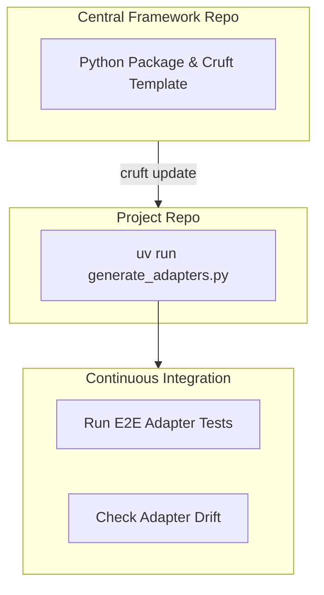

# Example Architecture: Agentic Orchestration Harness

THIS SECTION IS POPULATED AS AN EXAMPLE. THIS IS THE ARCHITECTURE FOR THE AGENTIC HARNESS AND SHOULD BE REPLACED BY THE ARCHITECTURE DEFINITION FOR YOUR PROJECT.

> This document is the authoritative reference for how the Agentic Orchestration Harness is built. Create it once the system has a deployed or locally-running form. Update it when the system changes — never let it describe intent; only describe reality. Consumed by: solution-architect, python-coder, tech-lead.

**Canonical references**:
>
> - **Product Requirements**: `artefacts/product/requirements.md`
> - **Build Tasks**: `artefacts/build/tasks-runtime-adapters.md`

---

## 1. System Purpose

The Agentic Orchestration Harness is a multi-agent coordination framework that decouples engineering workflows, rules, and agent definitions from specific LLM runtimes. It provides a canonical source of truth for how software is delivered and a suite of runtime adapters that compile this truth into platform-specific configurations (Claude Code, GitHub Copilot, Codex/OpenAI, and Gemini/Antigravity).

---

## 2. Key Design Decisions

### Separation of Canonical Core and Runtime Adapters

**Decision**: The engineering process (workflows, rules, agent roles) is authored purely in vendor-agnostic Markdown, MDC, and YAML inside the `context/` directory.

**Rationale**: AI developer tools leapfrog each other rapidly. Tying the engineering operating model to a single vendor's proprietary prompt format or execution engine creates massive lock-in.

**Consequences**: Enables swapping the underlying LLM runtime (e.g., moving from Claude Code to Google Antigravity) by simply swapping the adapter, without throwing away the team's established TDD rules and workflows.

### Adapter Maintenance via Python "Compilers"

**Decision**: Adapters are maintained exclusively as Python generator scripts (expanding on the existing `generate_claude_md.py` approach) rather than maintaining static target files.

**Rationale**: Target formats like `CLAUDE.md`, `.github/copilot-instructions.md`, or Gemini `.agents/skills/*/SKILL.md` require constant maintenance as vendors update their syntax and capabilities. Manually maintaining these files invites drift and human error. By reusing and expanding the Python generator approach, the generators act as a compiler. When a vendor format changes, platform engineers update the Python compilation logic once, and regenerate the targets deterministically.

**Consequences**: Manual edits to target files are strictly forbidden and enforced via a pre-commit drift validator (`adapter_drift.py`).

### Framework Distribution via Managed Template and Internal CLI Library

**Decision**: The framework is distributed to downstream projects using a template synchronisation tool (e.g., `cruft`) combined with an internal Python package, replacing manual `rsync` copying.

**Rationale**: When multiple projects adopt this framework, propagating upstream improvements (new agents, improved standards, bugfixes in generators) via `rsync` leads to messy merge conflicts and divergence. By packaging the generator scripts as a versioned internal library (e.g., `pip install acme-agent-harness`) and managing the `context/` directory boilerplate via a stateful templating tool like `cruft`, downstream repositories can receive upstream updates via automated 3-way git merges, while preserving their project-specific rule overrides.

**Consequences**: Centralises the maintenance of the core harness while allowing downstream projects to seamlessly pull updates and regenerate their platform-specific adapters.

---

## 3. System Context

| Actor / External System | Interaction | Protocol |
| ------------------------ | ------------- | ---------- |
| Developer | Defines engineering standards, rules, and workflows | File System (Markdown/YAML) |
| Target Runtimes | Consumes generated prompt payloads and tool schemas | File System & CLI |

---

## 4. Container Map

### Container Details

#### Canonical Core (`context/`)

- **Responsibility**: Holds the vendor-agnostic business logic of the software engineering process.
- **Technology**: Markdown, MDC (Markdown for Claude/AI), YAML.
- **Owns**: The single source of truth for team standards and multi-agent DAG topologies.

#### Adapter Generator Engine (`context/scripts/generators/`)

- **Responsibility**: Parses the Core into a strongly-typed intermediate representation (IR), resolves tool mappings, and compiles target-specific payloads.
- **Technology**: Python, `yaml`, `pydantic`/`dataclasses`.
- **Exposes**: CLI (`generate_adapters.py --target [all|claude|gemini|github]`).

#### Runtime Targets

- **Responsibility**: The projected, runtime-native instruction sets that govern actual LLM execution.
- **Technology**: Runtime-specific Markdown and JSON formats.

---

## 5. Cross-Cutting Concerns

| Concern | Approach | Where Implemented |
| --------- | ---------- | ------------------- |
| Drift Prevention | Pre-commit validation compares generated AST against on-disk files | `context/scripts/validators/adapter_drift.py` |
| Context Budgeting | Target-specific injection strategies (Inline vs Linked vs Indexed) | Generator Adapter Plugins |
| Telemetry & Metrics | Orchestrator commits inject token usage into git trailers | `context/scripts/prepare-commit-msg.py` |
| Style Consistency | Validation of EARS notation and British English | `context/scripts/validators/` |

---

## 6. Data Architecture

### Storage Split Rule

The framework operates entirely statelessly in memory during compilation. Runtime orchestration state is persisted exclusively to the local filesystem to survive LLM context compaction.

| Store | Technology | Purpose | Data Characteristics |
| ------- | ----------- | --------- | --------------------- |
| Authoritative Config | Git / Filesystem | `context/` containing rules and workflows | Versioned, human-readable |
| Session State | Git / Filesystem | `artefacts/build/tasks.md` and `HANDOFF.md` | Ephemeral but disk-durable between agent spawns |
| Target Output | Git / Filesystem | Generated `.md` and `.json` files | Overwritten deterministically |

---

## 7. Deployment Topology

The framework is "deployed" via two primary mechanisms:

1. **Local Developer Workstation**: Developers run the generator CLI locally before committing.
2. **CI/CD Pipeline**: GitHub Actions (or equivalent) runs the drift validator to ensure no PR merges with desynchronised adapters.

| Container | Compute | Region | Scaling | Notes |
|-----------|---------|--------|---------|-------|
| Generator CLI | Local / CI Runner | N/A | N/A | Sub-second execution time required |
| Pre-commit Hooks | Local git | N/A | N/A | Halts commit on validation failure |

---

## 8. Risks and Constraints

| Risk / Constraint | Impact | Mitigation |
| ------------------- | -------- | ------------ |
| Vendor API Changes | Generated instructions may become invalid if Claude/GitHub changes prompt schemas silently | E2E compilation tests; versioned adapter plugins track specific vendor API versions |
| Execution Engine Gap | Workflows (YAML) require an active orchestrator runner; GitHub Copilot lacks this natively | Develop a lightweight Python execution harness for runtimes without native orchestrators |
| Token Overhead | Injecting comprehensive rules into small context windows degrades reasoning | Implement `ON_DEMAND_LINK` context delivery strategy for constrained runtimes |

---

## Related Documents

- **API specification**: N/A
- **Architecture decisions**: Inline
- **Design documents**: `context/docs/agentic-framework-reference.md`
- **Product Requirements**: `artefacts/product/requirements.md`
