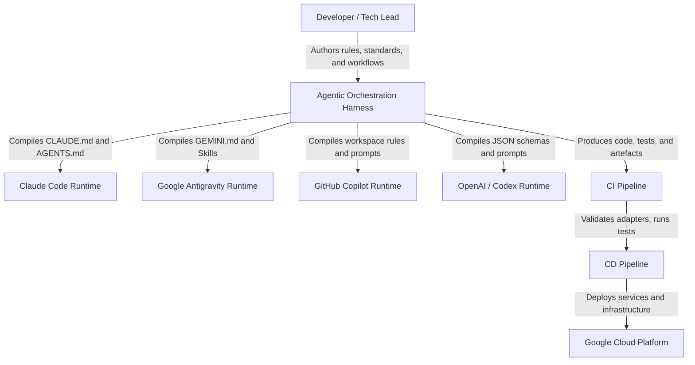
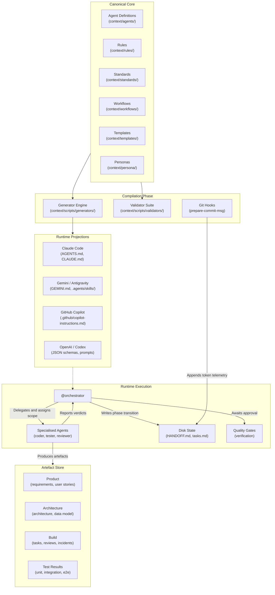
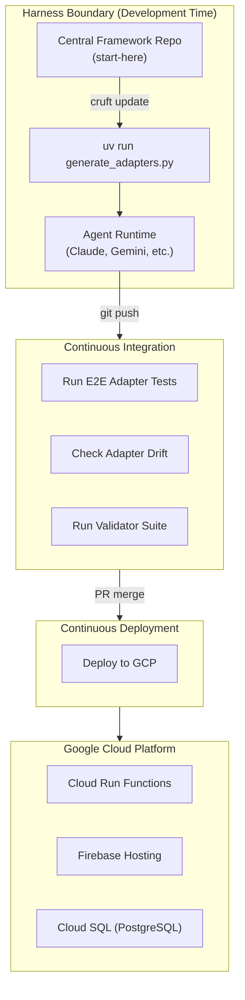

# Example Architecture: Agentic Orchestration Harness

THIS SECTION IS POPULATED AS AN EXAMPLE. THIS IS THE ARCHITECTURE FOR THE AGENTIC HARNESS AND SHOULD BE REPLACED BY THE ARCHITECTURE DEFINITION FOR YOUR PROJECT.

> This document is the authoritative reference for how the Agentic Orchestration Harness is built. Create it once the system has a deployed or locally-running form. Update it when the system changes — never let it describe intent; only describe reality. Consumed by: solution-architect, python-coder, tech-lead.

**Canonical references**:

> - **Product Requirements**: `artefacts/product/requirements.md`

---

## 1. System Purpose

The Agentic Orchestration Harness is a multi-agent coordination framework that decouples engineering workflows, rules, and agent definitions from specific LLM runtimes. It provides a canonical source of truth — the `context/` directory — for how software is delivered, and a suite of runtime adapters that compile this truth into platform-specific configurations for Claude Code, Google Gemini/Antigravity, GitHub Copilot, and OpenAI Codex. The framework is distributed to downstream projects as a portable directory that can be copied, templated, or packaged.

---

## 2. Key Design Decisions

### The Rules-Standards Split

**Decision**: Concise, binary rules (`context/rules/*.mdc`, <200 tokens each) are structurally separated from detailed reference standards (`context/standards/*.md`, 2,000–5,000 tokens each).

**Rationale**: A typical agent spawn injects 5–8 rules at ~100–200 tokens plus the agent definition at ~500–1,000 tokens, totalling roughly 1,500–2,500 tokens of framework overhead. Loading a single full standard would double or triple this cost for material the agent may not need. Merging rules and standards would force a choice between token-efficient prompts and comprehensive reference material. An agent executing a straightforward Python task needs the 15-token rule "run tests with `uv run pytest`." A reviewer evaluating test sufficiency needs the full testing standard. The split serves both without compromise.

**Consequences**: Every piece of framework guidance must be classified as rule (binary, actionable, cheap to inject) or standard (contextual, explanatory, loaded on demand). Ambiguous guidance that does not pass the three-test filter (binary? breaks things? actionable?) defaults to a standard.

### Specialist Agents with Orchestrator Delegation

**Decision**: A central `@orchestrator` agent coordinates work by delegating all implementation to specialised subagents (e.g. `@python-coder`, `@functional-tester`, `@tech-lead`) rather than performing implementation directly.

**Rationale**: A single agent that orchestrates, writes code, and tests rapidly degrades its context window, leading to rule amnesia and tool hallucinations. Specialised agents carry targeted environment rules and tools. The orchestrator dynamically resolves rules (`.mdc`), assigns disjoint file scopes for parallel execution, and dispatches subagents via a structured task prompt template.

**Consequences**: Imposes coordination overhead per task (subagent spawning, handoff writing, scope assignment). Justified by dramatically increased standards adherence, parallel execution without file conflicts, and contained blast radius. The orchestrator uses a context budget test (>2 files read or >50 lines produced → delegate) to decide when direct action is acceptable.

### Disk-Durable State (Compaction Resilience)

**Decision**: The framework uses `HANDOFF.md`, `tasks.md`, and durable artefacts on disk as the sole source of truth for session state, strictly eschewing long-term chat memory.

**Rationale**: Chat memory is ephemeral and subject to context compaction, where the LLM runtime silently truncates history. If an agent relies on chat history to know what phase it is in, it hallucinates upon compaction. Durable context is also the primary defence against the comprehension gap — where agent throughput outpaces the organisation's ability to understand what changed.

**Consequences**: The orchestrator must write its current phase to `HANDOFF.md` *before* spawning subagents, ensuring the phase survives compaction during execution. Every workflow YAML includes a `state_recovery` section listing files to read for reconstruction. The overhead (pre-spawn handoff writes, recovery blocks in every workflow) is justified because a single failed recovery wastes more tokens than cumulative pre-emptive recording.

### Workflow-as-Code (YAML Phase DAGs)

**Decision**: Development processes (TDD, design, bugfix, content, deployment) are codified as phase-based YAML files (`context/workflows/*.yaml`) enforcing linear phase transitions with explicit quality gates and review verdicts.

**Rationale**: Agent LLMs are eager to skip directly to implementation. Defining workflows strictly on disk forces the orchestrator to follow a process (e.g. TDD RED → GREEN → BLUE) and wait for explicit APPROVED verdicts at quality gates before proceeding. Storing orchestration logic in versionable YAML makes it inspectable, diffable, reviewable, and recoverable after compaction.

**Consequences**: The trade-off is reduced flexibility for novel situations. The `prototype.yaml` workflow addresses this by providing a minimal path with no gates or rigid sequencing, suited to exploratory work. For production work, inspectable process consistently outperforms adaptive improvisation.

### Generated Registries (Derived Projections)

**Decision**: `AGENTS.md` and `CLAUDE.md` are generated files, never hand-edited. A generator script reads every workflow YAML and every agent definition, then produces these as derived projections.

**Rationale**: The generator acts as both a compilation step and a consistency check. If an agent definition references a rule that does not exist, or a workflow references an agent with no definition, the mismatch surfaces at generation time rather than at runtime. The same authoritative sources can be projected into `AGENTS.md` for one runtime, `.github/copilot-instructions.md` for another, or Gemini skill folders for a third.

**Consequences**: Manual edits to derived files are always wrong. Editing the sources and regenerating is the only valid path. A `framework_docs_staleness.py` validator enforces that framework documentation is updated alongside `context/` changes.

### Git-Embedded Telemetry

**Decision**: Agent execution telemetry (models used, agent combinations, duration, token usage, human interaction count) is recorded as structured metadata (`Agent-Session:` trailers) within git commit messages, rather than external dashboards or runtime logs.

**Rationale**: Traditional APM tools are poorly suited for agentic orchestration where the primary metrics are autonomy (zero-interaction executions) and token overhead. By injecting telemetry directly into git history, it is perfectly correlated with the code changes it produced. The orchestrator records the task, tools, and human intervention counts; a `prepare-commit-msg` hook automatically appends token usage via a watermark file.

**Consequences**: Enables querying git history to measure framework effectiveness (e.g. how many tasks `@python-coder` completed with zero human interventions). Retrospective and continuous-improvement workflows consume this telemetry as a primary data source.

### Adapter Compilation Model

**Decision**: Runtime adapters are maintained exclusively as Python generator scripts (compiler plugins) rather than static target files. Each adapter compiles the canonical `context/` directory into a target runtime's native configuration format.

**Rationale**: Target formats (`CLAUDE.md`, `.github/copilot-instructions.md`, Gemini `.agents/skills/*/SKILL.md`) require maintenance as vendors update their syntax and capabilities. Manually maintaining these files invites drift and human error. The generator approach means platform engineers update the Python compilation logic once and regenerate deterministically. An `adapter_drift.py` pre-commit validator enforces that no manual edits survive in target files.

**Consequences**: Manual edits to target files are strictly forbidden. Adding a new runtime target requires writing a new adapter plugin and updating the unified CLI dispatcher.

### Claude Native Orchestration Reconciliation

**Decision**: The Claude adapter must reconcile the framework's orchestration model (centralised orchestrator, rule injection, file scopes, quality gates) with Claude Code's native multi-agent orchestration capabilities (built-in subagent spawning, Task tool, session management).

**Rationale**: Claude Code provides native delegation primitives that overlap with the framework's orchestration model. Naively generating a static `AGENTS.md` may under-utilise Claude's native capabilities, while fully deferring to Claude's built-in orchestration may lose framework governance (rule injection, file scope enforcement, gate sequencing). The adapter must find the intersection: expressing canonical workflow phases, quality gates, and spawn discipline within Claude's built-in primitives.

**Consequences**: The Claude adapter is the most complex adapter because it must balance two orchestration models. The adapter's output must preserve framework governance while leveraging Claude's native strengths (context management, subagent lifecycle, session telemetry).

### Framework Distribution via Managed Template and Internal CLI Library

**Decision**: The framework is distributed to downstream projects using a template synchronisation tool (e.g. `cruft`) combined with an internal Python package, replacing manual `rsync` copying.

**Rationale**: When multiple projects adopt this framework, propagating upstream improvements via `rsync` leads to merge conflicts and divergence. A stateful templating tool enables automated 3-way git merges; a versioned library packages the generator scripts so downstream repositories can regenerate their platform-specific adapters after pulling updates.

**Consequences**: Centralises the maintenance of the core harness while allowing downstream projects to seamlessly pull updates and regenerate their platform-specific adapters.

---

## 3. System Context

The harness operates at **development time**: it coordinates agents that produce code, tests, and artefacts. It does not deploy anything. CI validates adapter drift and runs the test suite. CD deploys to GCP.

| Actor / External System | Interaction | Protocol |
| ------------------------ | ------------- | ---------- |
| Developer | Defines engineering standards, rules, agents, workflows, and personas | File System (Markdown/YAML) |
| Target Runtimes (Claude, Gemini, Copilot, Codex) | Consume generated prompt payloads, tool schemas, and runtime configurations | File System and CLI |
| CI Pipeline | Validates adapter drift, runs pre-commit validators and test suites on PRs | GitHub Actions (or equivalent) |
| CD Pipeline | Deploys application services to production infrastructure | gcloud CLI, Terraform |
| Google Cloud Platform | Hosts deployed application services (Cloud Run, Firebase Hosting, Cloud SQL) | Managed services |

---

## 4. Container Map

### Container Details

#### Canonical Core (`context/`)

- **Responsibility**: Holds the vendor-agnostic business logic of the software engineering process — who does work, how it should be done, when it happens, what gets produced, and how quality is maintained.
- **Technology**: Markdown with YAML frontmatter (agents), MDC (rules), Markdown (standards, templates, personas), YAML (workflows).
- **Owns**: The single source of truth for team standards, multi-agent DAG topologies, and all framework governance.

#### Generator Engine (`context/scripts/generators/`)

- **Responsibility**: Parses the canonical core into a strongly-typed intermediate representation, resolves tool mappings, and compiles target-specific payloads for each runtime adapter.
- **Technology**: Python, `yaml`, `pydantic`/`dataclasses`.
- **Exposes**: CLI entry point (`generate_agents_md.py`; planned unified `generate_adapters.py` dispatcher).

#### Validator Suite (`context/scripts/validators/`)

- **Responsibility**: Enforces rules at commit time via pre-commit hooks. A rule without a validator is a suggestion; a rule with a validator is an enforceable standard.
- **Technology**: Python scripts invoked by `pre-commit`.
- **Owns**: Commit-time enforcement of EARS notation, British English spelling, conventional commits, design system compliance, framework doc staleness, agent definition integrity, metrics logging format, and Supabase boundary constraints.

#### Git Hooks (`context/scripts/prepare-commit-msg.*`)

- **Responsibility**: Automatically appends agent session telemetry (token usage deltas) to `Agent-Session:` commit trailers by reading Claude Code session JSONL and maintaining a watermark file.
- **Technology**: Python script with shell wrapper, symlinked from `.git/hooks/`.
- **Owns**: Token telemetry within the git history; the watermark file (session-local, not versioned).

#### Runtime Projections (`AGENTS.md`, `CLAUDE.md`, etc.)

- **Responsibility**: Surface framework information in runtime-friendly form. These are compilation outputs, never hand-edited.
- **Technology**: Generated Markdown, YAML, JSON — format determined by target runtime.
- **Owns**: Nothing — these are derived from the canonical core and regenerated deterministically.

#### Runtime Execution Engine (Orchestrator and Subagents)

- **Responsibility**: The active agents running the framework. The `@orchestrator` manages workflow phases, state recovery, and delegates implementation tasks to specialised agents (e.g. `@python-coder`, `@tech-lead`).
- **Technology**: Underlying LLM runtimes (Claude Code, Gemini, Copilot).
- **Owns**: Session state management via `HANDOFF.md` and `tasks.md`.

#### Artefact Store (`artefacts/`)

- **Responsibility**: Persistent, version-controlled outputs representing completed work across discovery, design, development, testing, and deployment.
- **Technology**: Markdown, YAML, JSON, screenshots — structured into product, architecture, API, design, build, test-results, and shared directories.
- **Owns**: System-wide project state: requirements, architecture, task plans, review findings, test results, and inter-agent handoffs.

### Communication Rules

| Boundary | Mechanism | Notes |
| ---------- | ----------- | ------- |
| Core → Generator | File system read | Generator parses Markdown/YAML directly |
| Generator → Projections | File system write | Deterministic overwrite; drift validator enforces |
| Orchestrator → Subagents | LLM runtime spawn (Task tool) | Task prompt template ensures rule injection and file scope |
| Subagents → Orchestrator | LLM runtime response | Verdicts, artefacts, and handoffs returned |
| Orchestrator → Disk | File system write | HANDOFF.md, tasks.md, artefacts/ |
| Hooks → Git | Commit message modification | Token telemetry appended to Agent-Session trailer |

---

## 5. Cross-Cutting Concerns

| Concern | Approach | Where Implemented |
| --------- | ---------- | ------------------- |
| Drift Prevention | Pre-commit validation compares generated output against on-disk files; planned `adapter_drift.py` extends to all adapter targets | `context/scripts/validators/`, `context/scripts/generators/` |
| Context Budgeting | Rules (<200 tokens) injected; standards loaded on demand; target-specific injection strategies (inline vs linked vs indexed) based on runtime context window capacity | Agent frontmatter, generator adapter plugins |
| Telemetry and Metrics | Orchestrator commits inject model, agents, duration, dispatch mode, interaction count, and token deltas into git trailers | `context/scripts/prepare-commit-msg.py`, `context/templates/commit-message-template.md` |
| Style Consistency | British English and EARS notation enforced at commit time; no-AI-slop rule for persona-driven content | `context/scripts/validators/british_english.py`, `ears_notation.py`, `context/rules/no-ai-slop.mdc` |
| Documentation Staleness | Changes to `context/` require framework docs to be updated in the same commit | `context/scripts/validators/framework_docs_staleness.py` |
| Secrets Management | Rule-enforced prevention of credentials in git or agent prompts | `context/rules/secrets-management.mdc` |
| Architecture Fidelity | Rule-enforced prevention of implementation drift from approved architecture | `context/rules/architecture-fidelity.mdc` |

---

## 6. Data Architecture

### Storage Split Rule

The framework operates entirely statelessly in memory during compilation. Runtime orchestration state is persisted exclusively to the local filesystem to survive LLM context compaction.

| Store | Technology | Purpose | Data Characteristics |
| ------- | ----------- | --------- | --------------------- |
| Authoritative Config | Git / Filesystem | `context/` containing rules, agents, standards, workflows, templates, and personas | Versioned, human-readable, vendor-agnostic |
| Session State | Git / Filesystem | `artefacts/build/tasks.md`, `HANDOFF.md`, and handoff files | Ephemeral but disk-durable between agent spawns; fully recoverable |
| Target Output | Git / Filesystem | Generated `.md`, `.json`, and skill folders | Overwritten deterministically by adapter generators |
| Telemetry | Git History | `Agent-Session:` trailers in commit messages with token deltas | Append-only, correlated with code changes |

---

## 7. Deployment Topology

The harness itself is not a deployed service — it is a development-time coordination framework that runs locally. The outputs it produces (code, tests, artefacts, configurations) flow through CI/CD pipelines to reach production.

1. **Local Developer Workstation** (harness boundary): Developers run the generator CLI locally before committing. Agent runtimes (Claude Code, Gemini, etc.) execute on the local machine, coordinated by the harness.
2. **Continuous Integration** (outside harness boundary): GitHub Actions (or equivalent) runs the drift validator, adapter tests, and the validator suite on PRs. The harness does not control CI — CI consumes the harness's outputs.
3. **Continuous Deployment** (outside harness boundary): CD pipelines deploy application services to GCP (Cloud Run, Firebase Hosting, Cloud SQL). The harness's `deploy.yaml` workflow produces the deployment artefacts and instructions; CD executes them.

| Component | Compute | Boundary | Notes |
| ----------- | --------- | ---------- | ------- |
| Generator CLI | Local / CI Runner | Harness | Sub-second execution time required |
| Pre-commit Hooks | Local git | Harness | Halts commit on validation failure |
| Agent Runtimes | Local workstation | Harness | Claude Code, Gemini, Copilot — determined by developer |
| CI Validators | GitHub Actions runner | Outside harness | Consumes harness outputs; enforces drift and quality |
| CD Pipeline | GitHub Actions / Cloud Build | Outside harness | Deploys application services to GCP |
| Application Services | GCP Cloud Run | Outside harness | Deployed by CD, not by the harness |
| Frontend | Firebase Hosting | Outside harness | Static SPA or SSR; deployed by CD |
| Database | Cloud SQL (PostgreSQL) | Outside harness | Managed; with pgvector for future ML workloads |

---

## 8. Risks and Constraints

| Risk / Constraint | Impact | Mitigation |
| ------------------- | -------- | ------------ |
| Rule compliance is probabilistic | Injecting a rule into a spawn prompt does not guarantee the agent will follow it; models sometimes ignore injected instructions under context pressure | Validators catch violations post-hoc at commit time; review gates provide human checkpoints; continuous-improvement workflow traces repeated violations to rule or standard defects |
| Personal agent settings undermine framework authority | User-level configuration (`~/.claude/CLAUDE.md`, Cursor user rules) and accumulated agent memories load before project-level files, silently overriding framework rules | Onboarding requires disabling agent memories for governed repositories; user-level config must not overlap with framework concerns; audit when behaviour diverges |
| Vendor API changes | Generated instructions may become invalid if Claude, GitHub, or other runtimes change prompt schemas silently | E2E compilation tests; versioned adapter plugins track specific vendor API versions |
| Execution engine gap | Workflows (YAML) require an active orchestrator runner; not all runtimes (e.g. GitHub Copilot) support native multi-agent orchestration | Develop lightweight execution harnesses for runtimes without native orchestrators |
| Token overhead in small context windows | Injecting comprehensive rules into constrained runtimes degrades reasoning quality | Implement `ON_DEMAND_LINK` context delivery strategy for constrained runtimes; rules stay under 200 tokens each |
| Claude native orchestration complexity | Claude Code's built-in multi-agent primitives overlap with and partially compete with the framework's orchestration model | Claude adapter must reconcile both models, preserving framework governance while leveraging Claude's native strengths |
| Framework adoption friction | Downstream projects face setup overhead when first adopting the framework | Cruft template and CLI library reduce onboarding to a single command; pre-commit config template standardises hook installation |

---

## Related Documents

- **Product Requirements**: `artefacts/product/requirements.md`
- **Build Tasks (Runtime Adapters)**: `artefacts/build/tasks-runtime-adapters.md`
- **Architecture Decisions**: Inline (§2 above)
- **Context Directory Index**: `context/README.md`
