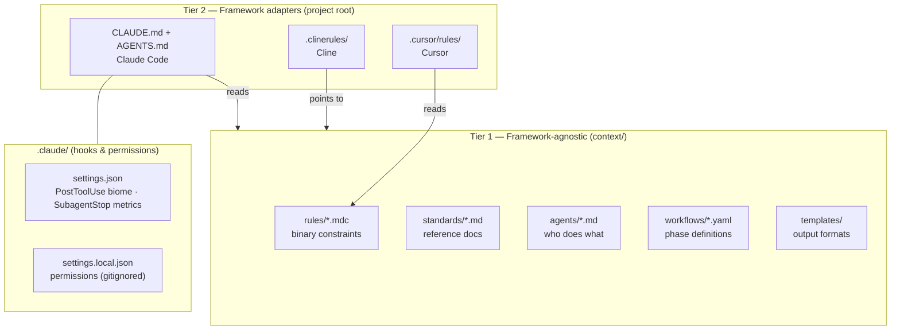

# Context Directory

Portable standards, rules, and agent definitions for multi-agent development workflows.

---

## Quick Reference

| What                       | Where                            | When                                                 |
| -------------------------- | -------------------------------- | ---------------------------------------------------- |
| **Non-negotiable rules**   | `rules/*.mdc`                    | Agent frontmatter lists applicable rules             |
| **Reference docs**         | `standards/*.md`                 | Read when agent needs guidance                       |
| **Agent definitions**      | `agents/*.md`                    | Orchestrator spawns with Task tool                   |
| **Workflows**              | `workflows/*.yaml`               | Defines phase dependencies                           |
| **Workflow usage guides**  | `docs/workflow-*.md`             | How to use each workflow (with diagrams)             |
| **Orchestration patterns** | `docs/orchestration-patterns.md` | Multi-agent coordination patterns                    |
| **Output templates**       | `templates/`                     | Handoff, review, artefact formats                    |
| **Writing personas**       | `persona/*.md`                   | Voice/style for human-facing content (blogs, papers) |
| **Validators**             | `scripts/validators/`            | Pre-commit hooks, CI/CD, context integrity           |

---

## For Agents

**Quick scan** - Read these when spawned:

**Rules** (non-negotiable): [python-env](rules/python-environment.mdc) · [ts-env](rules/typescript-environment.mdc) · [secrets](rules/secrets-management.mdc) · [tdd](rules/tdd-workflow.mdc) · [types](rules/type-safety.mdc) · [outputs](rules/output-locations.mdc) · [commits](rules/conventional-commits.mdc) · [git-commit-format](rules/git-commit-format.mdc) · [spelling](rules/british-english.mdc) · [EARS](rules/EARS-notation-requirements.mdc) · [metrics](rules/metrics-logging.mdc) · [interruption-logging](rules/interruption-logging.mdc) · [file-ops](rules/file-operations.mdc) · [handoff](rules/handoff-hygiene.mdc) · [escalation](rules/escalation.mdc) · [arch-fidelity](rules/architecture-fidelity.mdc) · [ui-reuse](rules/ui-component-reuse.mdc) · [visual](rules/visual-fidelity.mdc) · [quality-gates](rules/quality-gates.mdc)

**Standards** (reference): [coding](standards/coding-standards.md) · [testing](standards/testing-standards.md) · [tech](standards/tech-standards.md) · [doc](standards/doc-standards.md) · [workflow](standards/workflow-standards.md) · [security](standards/security-standards.md) · [context](standards/context-framework.md) · [12-factor](standards/12-factor-principles.md) · [LESS](standards/LESS-Engineering-Principles.md) · [visual](standards/visual-standards.md)

**Workflows**: [build](workflows/build.yaml) · [design](workflows/design.yaml) · [deploy](workflows/deploy.yaml) · [full-test](workflows/full-test.yaml) · [content](workflows/content.yaml) · [retrospective](workflows/retrospective.yaml) · [default](workflows/default.yaml) · [prototype](workflows/prototype.yaml)

**Usage guides**: [default](docs/workflow-default.md) · [prototype](docs/workflow-prototype.md) · [effectiveness](docs/workflow-agent-effectiveness.md) · [documentation-for-humans](docs/workflow-documentation-for-humans.md) · [patterns](docs/orchestration-patterns.md) · [writing-personas](docs/writing-personas.md)

**Templates**: [handoffs](templates/handoffs/) · [reviews](templates/reviews/) · [artefacts](templates/artefacts/)

---

## Two-Tier Architecture



**Design principle**: `context/` is tool-agnostic. Framework adapters are thin pointers — they say "use `context/` for everything" without duplicating content.

---

## For Humans

### File Type Overview

**Rules** (`rules/*.mdc`):

- Things that **break** if not followed (not style preferences)
- Self-contained, actionable, binary (followed or not)
- Agents load these via frontmatter
- Examples: `uv run pytest` works, bare `pytest` fails; `/secrets/*.json` works, `.env` leaks

**Standards** (`standards/*.md`):

- **How** to do things well (context, rationale, examples)
- Comprehensive reference documentation
- Agents read on-demand (too verbose to preload)
- Examples: Python patterns, TDD philosophy, architecture decisions

**Agents** (`agents/*.md`):

- Specialised agent definitions (who does what)
- Frontmatter lists applicable rules + standards
- Orchestrator spawns with Task tool
- See `AGENTS.md` for the orchestrator protocol (~70 lines, hand-written)

**Workflows** (`workflows/*.yaml`):

- Phase definitions, dependencies, quality gates
- Each phase lists agents, outputs, validation
- Source of truth for phase ordering

**Workflow Usage Guides** (`docs/workflow-*.md`):

- How to use each workflow (when, how to invoke agents, phase-by-phase)
- Each includes mermaid diagram showing phase flow
- Best practices, common issues, tips

**Orchestration Patterns** (`docs/orchestration-patterns.md`):

- Multi-agent coordination patterns (single, chain, swarm, hive, loop)
- Decision tree for choosing patterns
- Token optimization strategies

**Templates** (`templates/`):

- Output formats for handoffs, reviews, artefacts
- Agents use these for consistent outputs
- Agent definitions include a `templates:` frontmatter field listing relevant templates for that agent

**Personas** (`persona/*.md`):

- Writing voice/style for human-facing content (blogs, papers, marketing)
- NOT for technical handoffs (README, API docs, architecture)
- See `docs/writing-personas.md` for complete guide

**Scripts** (`scripts/`):

- `log-agent-completion.sh`: SubagentStart/SubagentStop hook — writes per-agent metrics to `artefacts/build/agent-metrics.log`
- `prepare-commit-msg.sh`: Git hook — reads agent-metrics.log and appends `Agent-Session` trailer to commit messages automatically. Install once per clone (see [Git Hooks](#git-hooks) below).
- Validators: Pre-commit hooks for rule enforcement; `validate_context.py` checks context/ integrity
- Tests: Validator test suite

### Git Hooks

Two git hooks live in `context/scripts/` and must be installed once per clone:

| Hook | Script | Install |
|------|--------|---------|
| `prepare-commit-msg` | `context/scripts/prepare-commit-msg.sh` | `ln -sf ../../context/scripts/prepare-commit-msg.sh .git/hooks/prepare-commit-msg` |

**What it does**: reads `artefacts/build/agent-metrics.log` for entries written since the last commit, calculates aggregate tokens and duration, then appends:

```
Agent-Session: tool=claude-code model=sonnet agents=python-coder tokens=~18K duration=12m
Co-Authored-By: Claude Sonnet 4.6 <noreply@anthropic.com>
```

The hook is a no-op if no agent work occurred since the last commit (no meaningful log entries). See `context/templates/commit-message-template.md` for the full footer format spec.

---

### DRY Between Rules & Standards

Some duplication is **intentional**:

- Rules tell agents **what to do** (concise, actionable)
- Standards explain **why and how** (detailed, contextual)

An agent following a rule should succeed without reading standards. Standards exist for when someone asks "why?" or hits an edge case.

---

## Orchestrator Responsibilities

The orchestrator (main Claude session or coordinating agent) coordinates work but delegates implementation.

### Delegation Principle

**Rule**: For implementation work, delegate to specialised agents.

**Why**: Specialised agents have rules loaded in their context. If the orchestrator writes code directly, it may not follow rules like `python-environment.mdc`.

### When No Agent Exists

1. **Simple non-code tasks**: Orchestrator handles directly

   - File moves, git operations, task management
   - Reading/summarising files
   - Coordinating between agents

2. **Code-adjacent tasks**: Follow relevant rules directly

   - Read applicable rules before starting
   - State which rules you're following
   - Example: "Following `python-environment.mdc`, using `uv run python`..."

3. **New domain requiring repeated work**: Create new agent

   - Copy `agents/TEMPLATE.md`
   - Define rules and standards in frontmatter
   - Add to workflow if ongoing

---

## Workflows

See `docs/workflow-*.md` for complete usage guides with diagrams.

**Build** (`workflows/build.yaml`):

- Primary development loop: planning → TDD → sprint review → regression → holistic review → deployment
- Replaces default.yaml as the recommended workflow for most work
- Includes hive subtask execution model with context bundles per subtask
- Optional retrospective phase for efficiency analysis

**Design** (`workflows/design.yaml`):

- Discovery through design review gate
- Run before build workflow

**Deploy** (`workflows/deploy.yaml`):

- GCP cloud deployment and deployment review
- Run after build workflow local-deployment

**Full-Test** (`workflows/full-test.yaml`):

- Full-suite testing across all modules
- Run before merge to master or on demand

**Content** (`workflows/content.yaml`):

- Human-facing content: blogs, papers, guides with writing personas
- NOT for API docs/handoffs (use docs-cleanup phase in build.yaml)

**Retrospective** (`workflows/retrospective.yaml`):

- Standalone efficiency analysis
- Run after deployment or on demand mid-cycle

**Default** (`workflows/default.yaml`) *(superseded by build.yaml for most work)*:

- Full TDD: 14 phases, 3 quality gates, 18 agents
- Production code, critical features

**Prototype** (`workflows/prototype.yaml`):

- Fast iteration: 4 phases, 0 quality gates, 5 agents
- POCs, experiments, throwaway code
- ⚠️ Must rewrite with build workflow before production

**Orchestration patterns**: Single Agent, Sequential Chain, Parallel Swarm, Hive, Iterative Loop (see `docs/orchestration-patterns.md`)

**Framework adapters**: Claude Code (`CLAUDE.md` → `AGENTS.md`), Cursor (reads `context/rules/` natively), Cline (`.clinerules/` pointer). See `docs/framework-adapters.md` for others.

---

## Directory Structure

```
context/
├── README.md                      # This file
├── standards/                     # Reference docs (how to do things well)
│   └── *.md                      # coding, testing, tech, doc, workflow, security, 12-factor, LESS, visual
├── rules/                         # Non-negotiables (break if ignored)
│   └── *.mdc                     # python-env, ts-env, secrets, tdd, types, outputs, commits, etc.
├── agents/                        # Agent definitions (who does what)
│   ├── TEMPLATE.md               # Template for new agents
│   └── *.md                      # 19 specialised agents (see AGENTS.md for complete list)
├── workflows/                     # Workflow patterns (phase dependencies)
│   ├── build.yaml                # Primary dev loop: planning → TDD → review → deployment
│   ├── design.yaml               # Discovery through design review
│   ├── deploy.yaml               # GCP cloud deployment
│   ├── full-test.yaml            # Full-suite testing
│   ├── content.yaml              # Human-facing content with personas
│   ├── retrospective.yaml        # Standalone efficiency analysis
│   ├── default.yaml              # Full TDD with quality gates (superseded by build.yaml)
│   └── prototype.yaml            # Fast iteration
├── docs/                          # Usage guides
│   ├── README.md                       # Guide index and maintenance notes
│   ├── orchestration-patterns.md       # Multi-agent coordination
│   ├── workflow-default.md             # Default workflow guide (with diagram)
│   ├── workflow-prototype.md           # Prototype workflow guide (with diagram)
│   ├── workflow-agent-effectiveness.md # Effectiveness guide (stale — renamed to retrospective)
│   ├── workflow-documentation-for-humans.md # Content guide (stale — renamed to content)
│   ├── how-to-measure-agent-effectiveness.md # Detailed measurement examples
│   ├── writing-personas.md             # When/how to use writing personas
│   └── framework-adapters.md           # Cross-framework compatibility
├── templates/                     # Output templates
│   ├── handoffs/                 # Handoff formats
│   ├── reviews/                  # Review formats
│   └── artefacts/                # Artefact templates
├── persona/                       # Writing voice for human-facing content
│   ├── technical-writer.md       # Dr. Sarah Chen persona (blogs, papers)
│   ├── editor.md                 # Editorial voice
│   └── expert-reviewer.md        # Review voice
├── mcp/                          # MCP server configuration (gitignored — contains API keys)
│   └── mcp.json                  # Local config — do NOT commit
└── scripts/                      # Portable tools
    ├── log-agent-completion.sh   # SubagentStart/Stop hook → agent-metrics.log
    ├── prepare-commit-msg.sh     # Git hook → Agent-Session commit trailer (install: see Git Hooks section)
    ├── validators/               # Rule validators (pre-commit hooks)
    └── tests/                    # Validator test suite
```

---

## Seeding Context Across Projects

The `context/` directory is seeded into each new project from a "golden source" repo (e.g. `start-here`). Each project owns its own copy — symlinks were tried but agents don't follow them reliably.

### Adding context to a new project

```bash
cp -r /path/to/start-here/context /path/to/new-project/context
```

### Keeping context in sync

When you improve `context/` in one project:
1. Copy the changed files to your golden source: `cp -r context/ /path/to/start-here/context/`
2. From there, propagate to other projects as needed

### What changes per project

The `context/` directory is identical across projects. Project-specific configuration lives in:
- `.claude/` — Claude Code adapter (hooks, permissions)
- `CLAUDE.md` — Claude Code project preferences
- `AGENTS.md` — orchestrator protocol (usually identical across projects)

---

## Adding New Rules

When something keeps failing because agents don't follow it:

1. **Is it binary?** Can you definitively say "followed" or "not followed"?
2. **Does it break things?** Not just style—actual failures?
3. **Is it actionable?** Can you give clear DO/DON'T commands?

If yes to all three, create a rule in `rules/*.mdc` (keep under 200 tokens).

---

## Adding New Agents

When a task domain needs repeated specialised work:

1. Copy `agents/TEMPLATE.md`
2. Set `name`, `description`, `model` in frontmatter
3. List applicable `rules` and `standards` in frontmatter
4. Write concise body with rules summary and workflow
5. Add to workflow YAML if part of standard process
6. Validate context integrity: `uv run python context/scripts/validators/validate_context.py`

---

## See Also

- **Orchestration reference**: `AGENTS.md` (hand-written orchestrator protocol)
- **Root README**: `../README.md` (deployment instructions for context system)
  - **Standards index**: `standards/README.md` (detailed standards catalogue)

---
