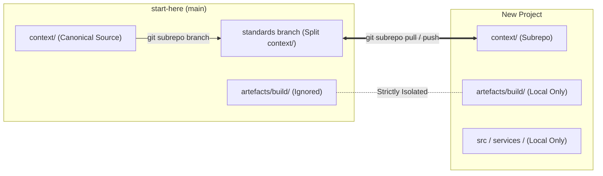

# Context Directory

Portable standards, rules, and agent definitions for multi-agent development workflows.

---

## Quick Reference

| What                       | Where                            | When                                                 |
| -------------------------- | -------------------------------- | ---------------------------------------------------- |
| What                       | Where                            | When                                                 |
| -------------------------- | -------------------------------- | ---------------------------------------------------- |
| **Non-negotiable rules**   | `rules/*.md`                     | Invariant boundaries; verified by scripts/linters    |
| **Reference docs**         | `standards/*.md`                 | Reference manuals; benchmarks used by review rubrics |
| **Agent definitions**      | `agents/*.md`                    | Orchestrator spawns with Task tool                   |
| **Workflows**              | `workflows/*.yaml`               | Defines phase dependencies and agent assignments     |
| **Model profiles (LUT)**   | `models.yaml`                    | Maps abstract intent tiers to provider families and telemetry |
| **Procedural skills**      | `skills/*.md`                    | JIT workflows; evaluated by LLM-as-a-judge rubrics   |
| **Downstream integration** | `#downstream-integration--standards-synchronisation-git-subrepo` | Bi-directional standards synchronisation via `git-subrepo` |
| **Output templates**       | `templates/`                     | Handoff, review, artefact formats                    |
| **Writing personas**       | `persona/*.md`                   | Voice/style for human-facing content (blogs, papers) |
| **Validators**             | `scripts/validators/`            | Pre-commit hooks, CI/CD, adapter drift               |
| **Generators**             | `scripts/generators/`            | Unified runtime adapter CLI (Gemini, Claude, Copilot, Codex) |

---

## The Control Flow: Forward Orchestration

The system strictly executes from **intent down to governed execution**:

1. **Workflows (`workflows/`)**: Orchestrate the sequence of phases and assign specialised **Agents** to the work based on human intent.
2. **Agents (`agents/`)**: Execute specific roles within a workflow phase (e.g. `@python-coder`, `@tech-author`).
3. **Rules (`rules/`)**: Set the non-negotiable invariant boundaries and constraints that govern the agent during execution.
4. **Skills (`skills/`)**: JIT procedural runbooks and craft recipes loaded on-demand by agents.
5. **Verifiers (`scripts/validators/` & reviewer agents)**: Validate that the agent's work adhered to rules (via deterministic code) and standards/skills (via LLM-as-a-judge).

---

## For Agents

**Quick scan** - Read these when spawned:

**Rules** (non-negotiable): [python-env](rules/python-environment.md) · [ts-env](rules/typescript-environment.md) · [secrets](rules/secrets-management.md) · [tdd](rules/tdd-workflow.md) · [types](rules/type-safety.md) · [outputs](rules/output-locations.md) · [commits](rules/git-commits.md) · [spelling](rules/british-english.md) · [EARS](rules/EARS-notation-requirements.md) · [bash](rules/bash-environment.md) · [handoff](rules/handoff-hygiene.md) · [escalation](rules/escalation.md) · [arch-fidelity](rules/architecture-fidelity.md) · [ui-reuse](rules/ui-component-reuse.md) · [visual](rules/visual-fidelity.md) · [quality-gates](rules/quality-gates.md) · [browser](rules/browser-automation.md) · [git-subrepo](rules/git-subrepo.md)

**Standards** (reference): [coding](standards/coding-standards.md) · [testing](standards/testing-standards.md) · [tech](standards/tech-standards.md) · [doc](standards/doc-standards.md) · [workflow](standards/workflow-standards.md) · [security](standards/security-standards.md) · [context](standards/context-framework.md) · [12-factor](standards/12-factor-principles.md) · [LESS](standards/LESS-Engineering-Principles.md) · [visual](standards/visual-standards.md)

**Skills** (procedural JIT): [python-scripting](skills/python-scripting.md) · [technical-authoring](skills/technical-authoring.md)

**Model Profiles (LUT)**: [models](models.yaml) — Abstract model intent tiers (`small`, `medium`, `large`), provider mapping, and telemetry locations.

**Workflows**: [build](workflows/build.yaml) · [design](workflows/design.yaml) · [prototype](workflows/prototype.yaml) · [deploy](workflows/deploy.yaml) · [bugfix](workflows/bugfix.yaml) · [full-test](workflows/full-test.yaml) · [content](workflows/content.yaml) · [continuous-improvement](workflows/continuous-improvement.yaml)

**Downstream integration**: [downstream-subrepo](#downstream-integration--standards-synchronisation-git-subrepo)

**Templates**: [index](templates/README.md)

---

## For Humans

### The Rules vs. Skills Separation (The Verification Test)

Our architecture enforces a strict physical split between `rules/`, `skills/`, and `standards/` based on **Verification Mechanism** and **Runtime Projection**.

- **Rules (`rules/*.md`)**: Deterministic invariants. "Thou shalt" and "Thou shalt not".
  - **Verification**: **0 token cost**. Evaluated by code (pre-commit hooks, linters, AST parsers). *If it requires an LLM to verify, it is not a rule.*
  - **Projection**:
    - `alwaysApply: true`: Injected into the global system prompt. Must be aggressively succinct to minimise overhead. Currently consumes ~1,300 tokens, representing < 1% of a standard 128k–200k context window (and < 0.1% on 1M+ models). Only the most critical global invariants (e.g. environment constraints, universal conventions) should be global.
    - `alwaysApply: false`: Injected JIT based on globs. Still succinct, but domain-specific.
  - **Content**: Pure constraints. No tutorials, no explanations.

- **Skills (`skills/*.md`)**: Procedural runbooks, craft, and workflows. "How to accomplish X".
  - **Verification**: **LLM-as-a-judge**. An agent executes the skill, and a reviewer agent verifies the outcome.
  - **Projection**: Injected JIT when an agent matches globs or needs to perform a specific task.
  - **Content**: Step-by-step instructions, code snippets, tool commands.

- **Standards (`standards/*.md`)**: The reference canon and rubrics. "What good looks like and why".
  - **Verification**: Used as the **benchmark rubric** against which LLM judges evaluate skills.
  - **Projection**: Read JIT by any agent that needs them. Design and dev agents load them for deep context on a decision; reviewer agents (`@tech-lead`, `@code-reviewer`) load them when evaluating output.
  - **Content**: Architectural patterns, design philosophy, trade-offs, and detailed explanations.

### File Type Overview

**Rules** (`rules/*.md`):

- Invariant boundaries and constraints that **break** if not followed
- Self-contained, actionable, binary (followed or not)
- Pre-commit hooks enforce these locally before any commit is recorded
- **On Add / Edit / Delete**: Create or edit with frontmatter (`description`, `globs`, `alwaysApply`). When adding or deleting, update applicable `agents/*.md` under `rules:`, then recompile adapters (`uv run python context/scripts/generators/generate_adapters.py`) and verify with `adapter_drift.py`.

**Standards** (`standards/*.md`):

- **How** to do things well (context, rationale, architectural benchmarks)
- Comprehensive reference documentation used by human and LLM reviewers
- Agents read on-demand (too verbose to preload)
- Examples: Python patterns, TDD philosophy, architecture decisions

- **On Add / Edit / Delete**: Create or edit ensuring `---` precedes all `##` headings (Typst rule). Add to `context/README.md` Quick Reference and reference in applicable `agents/*.md` under `standards:`. If agent frontmatter was modified, recompile adapters (`generate_adapters.py`) and verify drift.

**Agents** (`agents/*.md`):

- Specialised agent definitions (who does what)
- Frontmatter lists applicable `rules`, `standards`, `skills`, and `model`
- `orchestrator.md` defines orchestrator behaviour — read at session start
- Orchestrator spawns with Task tool; see AGENTS.md for the complete registry
- **On Add / Edit / Delete**: Create from `agents/TEMPLATE.md` with required frontmatter (`name`, `model`, `rules`, `standards`, `skills`). Validate via `uv run python context/scripts/validate_agent_definitions.py`. Update any `workflows/*.yaml` referencing the agent. **Mandatory recompile**: run `uv run python context/scripts/generators/generate_adapters.py` to project to `AGENTS.md`, `CLAUDE.md`, `.claude/prompts/`, and `.agents/skills/`. Verify with `adapter_drift.py`.

**Model Profiles & Runtime Telemetry LUT** (`models.yaml`):

- Decouples agent definitions from vendor-specific model identifiers
- Defines abstract intent tiers (`small`, `medium`, `large`) mapped to model families
- Delegates precise model resolution to runtime adapters / environment configurations
- Catalogues multi-platform telemetry locations (Git trailers, Claude JSONL & Managed Agents Dreams, Antigravity transcripts)
- **On Add / Edit / Delete**: Update provider model names or aliases. **Mandatory recompile**: run `uv run python context/scripts/generators/generate_adapters.py` to update model mappings in `GEMINI.md` and `CLAUDE.md`. Verify with `adapter_drift.py`.

**Workflows** (`workflows/*.yaml`):

- Phase definitions, dependencies, quality gates
- Each phase lists agents, outputs, validation, and skills
- Source of truth for phase ordering
- **On Add / Edit / Delete**: Create or edit phase DAG. All referenced agents must exist in `context/agents/`. **Mandatory recompile**: run `uv run python context/scripts/generators/generate_adapters.py` to refresh workflow tables in `AGENTS.md` and `CLAUDE.md`. Verify with `adapter_drift.py`.

**Framework reference** (`docs/agentic-framework-reference.md`):

- Default and prototype workflows (phase-by-phase, diagrams)
- Orchestration patterns (single, chain, hive, loop — see `docs/agentic-framework-reference.md`; swarm is vision-level only)
- Writing personas, portability adapters, effectiveness measurement
- Standards, rules, agents, templates, and scripts at operational depth
- **On Add / Edit / Delete**: Update architectural documentation. Verify documentation freshness with `uv run python context/scripts/validators/framework_docs_staleness.py`.

**Templates** (`templates/`):

- Output formats for artefacts, handoffs, reviews, git, and agent definitions
- The orchestrator selects the appropriate template when constructing a task prompt; agents use whichever template the task prompt specifies
- See `templates/README.md` for the full index
- **On Add / Edit / Delete**: Create or edit template files. Update `templates/README.md` index. No adapter recompilation needed.

**Skills** (`skills/*.md`):

- Technology-specific procedural instructions and operational safeguards (Python scripting, git-subrepo, etc.)
- Injected just-in-time into subagent prompts based on matched file scopes or workflow hints
- **On Add / Edit / Delete**: Create or edit file with frontmatter (`name`, `description`, `globs`). Ensure `---` precedes `##` headings (Typst rule). Bind to relevant `agents/*.md` under `skills:` or workflow phases. **Mandatory recompile**: run `uv run python context/scripts/generators/generate_adapters.py` to update the `## Skills` index in `AGENTS.md` and project runtime skills in `.agents/skills/<name>/SKILL.md`. Verify with `adapter_drift.py`.

**Personas** (`persona/*.md`):

- Writing voice/style for human-facing content (blogs, papers, marketing)
- NOT for technical handoffs (README, API docs, architecture)
- See `docs/agentic-framework-reference.md` (Writing Personas) for when and how to use them
- **On Add / Edit / Delete**: Create or edit persona file (`name`, `description`, `traits`). No adapter recompilation needed.

**Scripts** (`scripts/`):

- `prepare-commit-msg.py` / `.sh`: Git hook — extracts and injects session token usage across Claude Code, Google Antigravity, GitHub Copilot, and Codex into the Agent-Session commit trailer
- Validators (`validators/`): Pre-commit hooks for rule enforcement (conventional commits, British English, EARS notation, design system, API docs, Supabase boundary, framework docs staleness, Typst formatting)
- Generators (`generators/`): Auto-generate CLAUDE.md/AGENTS.md from agent definitions and workflows
- Tests (`tests/`): Test suite for validators, runtime adapters, and telemetry extractors
- **On Add / Edit / Delete**: For standalone scripts, declare dependencies via PEP 723 inline metadata (`# /// script`). Add accompanying tests in `context/scripts/tests/`. Run test suite: `uv run --with pytest pytest context/scripts/tests/ -v`. If generator logic was altered, run `generate_adapters.py` and `adapter_drift.py`.

---

### Summary: When to Recompile Adapters

Whenever you add, edit, or delete canonical context files, recompile projections and verify zero drift:

| Changed Directory | Recompile Required? | Generated Projections | Command |
|---|---|---|---|
| `context/skills/` | **Yes** | `AGENTS.md`, `.agents/skills/<name>/SKILL.md` | `uv run python context/scripts/generators/generate_adapters.py` |
| `context/agents/` | **Yes** | `AGENTS.md`, `CLAUDE.md`, `.claude/prompts/`, `.agents/skills/` | `uv run python context/scripts/generators/generate_adapters.py` |
| `context/workflows/` | **Yes** | `AGENTS.md`, `CLAUDE.md` (workflow tables) | `uv run python context/scripts/generators/generate_adapters.py` |
| `context/models.yaml` | **Yes** | `GEMINI.md`, `CLAUDE.md` (model mappings) | `uv run python context/scripts/generators/generate_adapters.py` |
| `context/rules/` | Only if `agents/*.md` changed | Rule bindings in agent projections | Recompile if agent frontmatter changed |
| `context/standards/` | Only if `agents/*.md` changed | Standard bindings in agent projections | Recompile if agent frontmatter changed |
| `context/templates/` | No | None (direct file reference) | Update `templates/README.md` |
| `context/persona/` | No | None (direct file reference) | None |
| `context/scripts/` | If generators changed | All projections | `generate_adapters.py` + `pytest context/scripts/tests/` |

Always verify zero drift after recompiling:

```bash
uv run python context/scripts/validators/adapter_drift.py
```


### DRY Between Rules & Standards

Some duplication is **intentional**:

- Rules tell agents **what to do** (concise, actionable)
- Standards explain **why and how** (detailed, contextual)

An agent following a rule should succeed without reading standards. Standards exist for when someone asks "why?" or hits an edge case.

---

## Orchestrator Responsibilities

The orchestrator (main Claude session) coordinates work but delegates implementation. Full behaviour defined in `context/agents/orchestrator.md` — read at session start.

**Core rule**: Delegate all implementation to specialised agents. The orchestrator writing code directly silently bypasses the environment rules those agents carry.

**When no agent exists for a task**: create one from `agents/TEMPLATE.md`, then delegate. Do not write implementation directly.

---

## Workflows

See `AGENTS.md` for the workflow index. Full phase definitions in `workflows/*.yaml`.

**build** — Primary development loop: task planning → TDD (red/green/blue) → regression → deployment. Quality gates at tasks-review, coverage, quality-review, final-holistic-review.

**design** — Discovery through design review. Run before `build`. Produces requirements, architecture, API specs, UI designs.

**prototype** — Fast iteration for POCs and experiments. No quality gates. Must rewrite with `build` before production.

**deploy** — GCP cloud deployment. Run after `build` local-deployment phase.

**full-test** — Full regression suite across all modules. Run before merge to master or on demand.

**content** — Human-facing content (blogs, papers, guides) using writing personas.

**bugfix** — Empirical bug reproduction, fix, and verification.

**continuous-improvement** — Framework improvement: reactive (human reports incident) or proactive (review interruptions, incidents, and git log metrics).

**Orchestration patterns**: Single Agent, Sequential Chain, Hive, Iterative Loop (see `docs/agentic-framework-reference.md`; exploration “swarm” is out of scope for shipped YAML — `docs/vision.md`)

---

## Directory Structure

```text
context/
├── README.md                      # This file
├── standards/                     # Reference docs (how to do things well)
│   └── *.md                      # coding, testing, tech, doc, workflow, security, 12-factor, LESS, visual
├── rules/                         # Non-negotiables (break if ignored)
│   └── *.mdc                     # python-env, ts-env, secrets, tdd, types, outputs, commits, etc.
├── agents/                        # Agent definitions (who does what)
│   ├── TEMPLATE.md               # Template for new agents
│   ├── orchestrator.md           # Orchestrator behaviour (read at session start)
│   └── *.md                      # Specialised agents (see AGENTS.md for registry)
├── workflows/                     # Workflow patterns (phase dependencies)
│   ├── build.yaml                # Primary TDD development loop
│   ├── design.yaml               # Discovery through design review
│   ├── prototype.yaml            # Fast iteration / POC
│   ├── deploy.yaml               # GCP cloud deployment
│   ├── bugfix.yaml               # Bug reproduction, fix, verification
│   ├── full-test.yaml            # Full regression suite
│   ├── content.yaml              # Human-facing content with personas
│   └── continuous-improvement.yaml # Incident response + retrospective
├── templates/                     # Output templates (flat — see templates/README.md for index)
├── skills/                        # Procedural context (JIT instructions by technology)
│   └── *.md                       # python-scripting, technical-authoring
├── persona/                       # Writing voice for human-facing content
│   ├── author.md                 # AS persona (books, foundational thought leadership, punchy & dense)
│   ├── technical-writer.md       # Amara Osei persona (practitioner guides, technical prose)
│   ├── opinionated-blogger.md   # Dr. Sarah Chen persona (blogs, opinion pieces)
│   ├── editor.md                 # Editorial voice
│   └── expert-reviewer.md        # Review voice
├── mcp/                          # MCP server configuration
│   └── mcp.json                  # Template config
└── scripts/                      # Portable tools
    ├── prepare-commit-msg.py    # Hook: inject token metrics into commits
    ├── prepare-commit-msg.sh    # Shell wrapper (symlinked from .git/hooks/)
    ├── validators/               # Rule validators (pre-commit hooks, incl. adapter_drift.py)
    ├── generators/               # Runtime adapter generators
    │   ├── generate_adapters.py  # Unified CLI dispatcher
    │   └── adapters/             # Platform adapters (core, gemini, claude, github, openai)
    └── tests/                    # Test suites (validators, adapters, E2E compilation)
```

---

## Downstream Integration & Standards Synchronisation (`git-subrepo`)

**Golden source**: `agents-framework` repository (`main` branch)

The framework distributes canonical context as a self-contained directory (`context/`). Downstream repositories import standards, workflows, and agents without inheriting project-specific tracking state (`artefacts/build/`, `artefacts/product/`, or application code).

Bi-directional synchronisation is managed via `git-subrepo` targeting an upstream `standards` distribution branch:




### 1. Prerequisites

Downstream workstations and CI runners require:

1. **Git** (version 2.30+)
2. **`git-subrepo`**:

   ```bash
   brew install git-subrepo
   ```

   *Note: Ensure Bash 4+ is available in your PATH (`brew install bash`).*
3. **`uv`**:

   ```bash
   curl -LsSf https://astral.sh/uv/install.sh | sh
   ```

### 2. Initial Project Setup

To adopt the framework in a new or existing repository:

#### Step 1: Import Canonical Context

Run `git subrepo clone` targeting the upstream `standards` branch:

```bash
git subrepo clone https://github.com/Schmoiger/agents-framework.git context -b main
```

This creates a local `context/` directory with its own `.gitrepo` tracking file. To developers on your team, `context/` appears as regular files in git—no detached `HEAD` states or recursive submodule commands are needed.

#### Step 2: Configure Pre-Commit Hooks

Add the adapter drift validator to your downstream `.pre-commit-config.yaml`:

```yaml
repos:
  - repo: local
    hooks:
      - id: adapter-drift
        name: Validate Runtime Adapter Drift
        entry: uv run python context/scripts/validators/adapter_drift.py
        language: system
        files: ^(context/|AGENTS\.md|GEMINI\.md|CLAUDE\.md|\.agents/|\.claude/|\.github/|\.openai/)
```

Install the pre-commit hook:

```bash
uv run pre-commit install
```

#### Step 3: Compile Runtime Projections

Run the adapter generator to produce runtime projections (`AGENTS.md`, `GEMINI.md`, `CLAUDE.md`, etc.):

```bash
uv run python context/scripts/generators/generate_adapters.py
```

Commit the generated projections:

```bash
git add .
git commit -m "chore(infra): import standards via git-subrepo and compile projections"
```

### 3. Ongoing Synchronisation Workflows

#### Pulling Upstream Updates

When standards, rules, or agent definitions are updated in `agents-framework`, pull changes into your downstream repository:

```bash
# 1. Pull upstream changes into context/
git subrepo pull context

# 2. Re-compile runtime adapter projections
uv run python context/scripts/generators/generate_adapters.py

# 3. Verify zero drift
uv run python context/scripts/validators/adapter_drift.py

# 4. Commit updated projections
git add -A
git commit -m "chore(standards): update canonical context and regenerate adapters"
```

#### Pushing Improvements Back Upstream

If your project enhances or fixes a standard, rule, or agent prompt inside `context/`, you can push the improvement back to the upstream `standards` branch:

```bash
# 1. Ensure tests and drift checks pass
uv run python context/scripts/validators/adapter_drift.py
uv run pytest context/scripts/tests -v

# 2. Push context/ changes directly upstream
git subrepo push context
```

Once pushed, changes are committed upstream to `agents-framework` `main`.

### 4. Testing Downstream Standards

All validator, adapter, and compilation tests are packaged inside `context/scripts/tests/` and accompany `context/` when cloned via subrepo. Downstream projects can run the test suite at any time:

```bash
uv run pytest context/scripts/tests -v
```

### 5. Upstream Maintenance & Automated Distribution (`start-here`)

The `start-here` repository automatically maintains the upstream `standards` distribution branch using the GitHub Actions workflow in `.github/workflows/sync-standards.yml`:

#### Automated Synchronisation

Whenever pull requests touching `context/**` are merged into `master`, the `sync-standards` workflow:

1. Checks out the repository with complete commit history (`fetch-depth: 0`).
2. Installs `git-subrepo`.
3. Runs `git subrepo branch context -f` to isolate `context/` commits into a clean distribution branch.
4. Pushes the branch directly to `origin/standards` using `GITHUB_TOKEN` with write permissions.

This ensures downstream projects always receive the latest approved standards via `git subrepo pull context` without requiring manual extraction by maintainers.

#### Manual Fallback

Maintainers can also manually extract and push the `standards` distribution branch locally:

```bash
# 1. Extract context/ commits into subrepo branch (requires Bash 4.0+)
PATH="/opt/homebrew/bin:$PATH" git subrepo branch context -f

# 2. Push to remote standards branch
git push origin subrepo/context:standards
```

---

## Runtime Telemetry & Session Token Tracking

The framework tracks cumulative token consumption directly from the underlying AI development runtimes and injects incremental deltas into the `Agent-Session:` git trailer at commit time via `.git/hooks/prepare-commit-msg` (delegating to `context/scripts/prepare-commit-msg.py`).

### Multi-Runtime Comparison Matrix

| Runtime | Local Telemetry Path | Repo Mapping Mechanism | Storage Format | Extracted Token Fields |
|---|---|---|---|---|
| **Anthropic Claude Code** | `~/.claude/projects/{mangled}/` | Path hash: `repo.replace('/', '-')` | JSONL (`{session}.jsonl` & `subagents/*.jsonl`) | `message.usage.input_tokens` (+ cache creation/read) & `output_tokens` |
| **Google Antigravity** | `~/.gemini/antigravity-ide/conversations/*.db` | SQLite `trajectory_metadata_blob` (`file://{repo}`) | SQLite + Protobuf binary in `gen_metadata` | Protobuf Field 1.4: Varint 2 (prompt), Varint 5 (cached), Varint 3 (output), Varint 9/10 (thinking/candidates) |
| **GitHub Copilot Chat** | `Code/User/workspaceStorage/<id>/chatSessions/` | `workspace.json` (`"folder": "file://{repo}"`) | JSONL (`<session-id>.jsonl`) | `metadata.promptTokens`, `metadata.outputTokens` / `completionTokens`, `toolCallRounds[].thinking.tokens` |
| **OpenAI Codex** | `~/.codex/` or API run logs | Project directory or API run trace | JSON / SQLite | `prompt_tokens`, `completion_tokens`, `reasoning_tokens` |

### Architectural Principles

1. **Separation of Runtime Container vs Model**:
   - The `tool=` field in `Agent-Session:` dictates the **execution container** (e.g. `tool=antigravity`, `tool=copilot`, `tool=claude-code`).
   - The `model=` field specifies the LLM (e.g. `model=gemini-flash`, `model=sonnet`, `model=gpt-5-mini`).
   - For example, running Claude Sonnet inside Google Antigravity produces `tool=antigravity model=sonnet`, causing the hook to query Antigravity's local session DB rather than Claude Code CLI storage.
2. **$O(\Delta)$ Incremental Token & Compute Efficiency**:
   - Never re-parse entire conversational histories on each commit.
   - **Antigravity**: Watermark stores `last_idx` and queries SQLite incrementally:
     `SELECT idx, data FROM gen_metadata WHERE idx > ? ORDER BY idx ASC`
   - **Copilot & Claude**: Watermark stores the file byte offset and `seek()`s directly to newly appended lines.
3. **Transparent Error Surfacing over Silent Failure**:
   - If an agent commit trailer (`Agent-Session:`) is present but telemetry extraction fails (e.g., unexpected schema change or missing session), the hook injects:

     ```text
     Agent-Session: tool=antigravity model=gemini-flash ... tokens=error(schema_drift)
     ```

   - Diagnostic warnings are written to `stderr`, and the commit is allowed to succeed with exit code 0.
4. **Brittleness & Maintenance**:
   - Neither Antigravity nor Copilot provides a public, frozen API for local telemetry; extraction relies on internal storage patterns.
   - The test suite in `context/scripts/tests/test_runtime_telemetry.py` includes live runtime sanity checks that run in local development:
     - **Not installed**: Skipped cleanly.
     - **Installed but idle**: Skipped with diagnostic note (`"Runtime installed but no active sessions found for validation"`).
     - **Installed with active sessions**: Fails immediately if vendor schema changes or data formats drift.

---

## Adding New Rules

When something keeps failing because agents don't follow it:

1. **Is it binary?** Can you definitively say "followed" or "not followed"?
2. **Does it break things?** Not just style—actual failures?
3. **Is it actionable?** Can you give clear DO/DON'T commands?

If yes to all three, create a rule in `rules/*.mdc` (keep under 200 tokens).

---

## Adding New Agents

When a task domain needs repeated specialised work:

1. Copy `agents/TEMPLATE.md`
2. Set `name`, `description`, `model` in frontmatter
3. List applicable `rules` and `standards` in frontmatter
4. Write concise body with rules summary and workflow
5. Add to workflow YAML if part of standard process
6. Regenerate adapter projections: `uv run python context/scripts/generators/generate_adapters.py`

---

## See Also

- **AGENTS.md** / **CLAUDE.md** / **GEMINI.md** — auto-generated workflow + agent registries (run `generate_adapters.py` to update)
- **Root README**: `../README.md` — deployment instructions for context system and runtime adapters
- **Standards index**: `standards/README.md` — detailed standards catalogue
