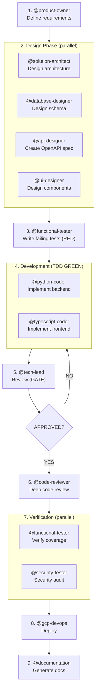

# Claude Code Multi-Agent Orchestration Setup

You've got everything needed to run specialised agents in Claude Code. This uses Claude's native subagent system, not external frameworks.

## What You Have

### Subagent Definitions (`.md` files for Claude Code)

**Phase 0: Discovery**
- `product-owner.md` - Requirements gathering and user stories

**Phase 1: Design**
- `solution-architect.md` - System architecture and API contracts
- `database-designer.md` - Database schema and migrations
- `api-designer.md` - OpenAPI specifications
- `ui-designer.md` - UI wireframes, components, design tokens
- `visual-designer.md` - Visual assets using AI tools (Gemini, Napkin, etc.)

**Phase 2-3: Development**
- `python-coder.md` - Python backend development
- `typescript-coder.md` - TypeScript frontend development

**Phase 4: Review**
- `tech-lead.md` - Architecture compliance and standards gate
- `code-reviewer.md` - Deep bug hunting and code quality

**Phase 5: Testing**
- `functional-tester.md` - Unit/integration tests (pytest, vitest)
- `ui-tester.md` - UI testing with Chrome DevTools
- `security-tester.md` - Security audits, OWASP, prompt injection

**Phase 6-7: Deploy & Docs**
- `gcp-devops.md` - Infrastructure-as-code with Terraform
- `documentation.md` - API references and guides

### Knowledge Base
- `CLAUDE.md` - Orchestration guide for agent coordination
- `MODEL-RECOMMENDATIONS.md` - Which LLM model for each agent

## How to Set Up

### Step 1: Copy subagent files to your project
Place all `.md` files into your project's `.claude/agents/` directory:

```bash
mkdir -p your-project/.claude/agents
cp *.md your-project/.claude/agents/
```

### Step 2: Add CLAUDE.md to your project root
This is your coordinated knowledge base that agents will reference:

```bash
cp CLAUDE.md your-project/
```

### Step 3: Initialise agent working directories
Either run the helper or create manually:

```bash
# Option A: Use the script
cp coordinate.sh your-project/
cd your-project
chmod +x coordinate.sh
./coordinate.sh init

# Option B: Create manually
mkdir -p your-project/artifacts/{python/tests,typescript/tests,test-results,ui-test-results/screenshots,security-audit,gcp/terraform,database/migrations,api,design/visuals,docs}
```

### Step 4: Open your project in Claude Code
```bash
cd your-project
claude
```

## How to Use (TDD Workflow)

This system follows **Test-Driven Development**. Tests are written BEFORE implementation.

### The TDD Flow



### Example Session

```bash
# Start with requirements
@product-owner define requirements for a task management API

# Design the system
@solution-architect design the system architecture
@database-designer design the database schema
@api-designer create OpenAPI specification

# Write tests FIRST (TDD RED)
@functional-tester write failing tests for task management API

# Implement to make tests pass (TDD GREEN)
@python-coder implement the task service (make tests pass)
@typescript-coder create the frontend client (make tests pass)

# Review gate
@tech-lead review the implementation
# Wait for APPROVED, then:
@code-reviewer perform detailed code review

# Verify and deploy
@functional-tester run all tests and verify coverage
@security-tester audit for vulnerabilities
@gcp-devops create Cloud Run deployment
@documentation generate API reference
```

## Key Principles

**Standards Compliance**
All agents follow standards in `./context/standards/` and rules in `./context/rules/`. Compliance is inherited.

**TDD Workflow**
Tests are written BEFORE implementation. Coders make tests pass, not the other way around.

**All context is in `./artifacts/`**
Agents read/write from a shared filesystem directory during development. This is ephemeral workspace.

**Final docs go to `./context/`**
After approval, outputs are promoted from `./artifacts/` to `./context/`.

**Agents don't spawn other agents**
The main Claude Code session orchestrates everything. Agents are isolated specialists.

**Sequential dependencies with gates**
Tech-lead must approve before code-reviewer runs. Tests must exist before coders implement.

**Test failures are reports, not fixes**
When `@functional-tester` finds failing tests, it reports them. The relevant coder then fixes the code.

## Coverage Requirements

| Metric | Threshold |
|--------|-----------|
| Minimum | 90% (build fails below) |
| Target | 100% |
| Gap Documentation | Required if < 100% |

## Model Recommendations

| Model | Agents |
|-------|--------|
| **Opus** | solution-architect, tech-lead, security-tester |
| **Sonnet** | Most agents (default) |
| **Haiku** | visual-designer, ui-tester, documentation |

See `MODEL-RECOMMENDATIONS.md` for rationale.

## Why This Approach

You're using Claude Code's native architecture instead of external orchestration frameworks like LangGraph. This means:

- **Zero external dependencies** - Just Claude Code + your tools
- **Clear agent boundaries** - Each agent has explicit tools and constraints
- **Filesystem-based memory** - No database, just `./artifacts/`
- **Lean system prompts** - CLAUDE.md provides condensed knowledge, not massive prompts
- **Native parallelisation** - Claude Code handles multiple agent invocations
- **TDD enforced** - Tests define behaviour before implementation

This maps directly to how Claude natively thinks about work decomposition.

## Customisation

Want to add a new agent? Create a new `.md` file in `.claude/agents/`:

```markdown
---
name: my-agent
description: What this agent does and when to use it
model: sonnet  # or opus, haiku
allowed_tools:
  - Read
  - Write
  - Bash
---

You are a [role]. Your job is to [responsibility].

## Context Paths
- Read X from `./artifacts/...`

## Constraints
- Rule 1
- Rule 2

## Deliverables
- Write output to `./artifacts/...`

## Task
{$ARGUMENTS}
```

Then invoke it as `@my-agent your task here`.

## Troubleshooting

**Agent can't find files?**
→ Run `./coordinate.sh init` to set up directory structure.

**Agents not appearing in Claude Code?**
→ Make sure subagent files are in `.claude/agents/` with `.md` extension.

**Tests don't exist yet?**
→ Run `@functional-tester` in TDD mode BEFORE running coders.

**Tech lead says CHANGES REQUIRED?**
→ Read `tech-review.md` for blockers. Fix with relevant coder, then re-review.

**Coverage below 90%?**
→ Build will fail. Add more tests or document gaps in `test-gaps.md`.

**Need more detail on coordination?**
→ Read `CLAUDE.md`. It's your knowledge base.

## Next Steps

1. Copy all files to your project
2. Run `claude` to open Claude Code
3. Run `./coordinate.sh init` to set up directories
4. Start with `@product-owner` for requirements
5. Follow the TDD workflow: tests first, then implementation
6. Refer to `CLAUDE.md` for patterns and best practices

Good luck! You're using the same patterns that power Claude Code's own agent architecture.
