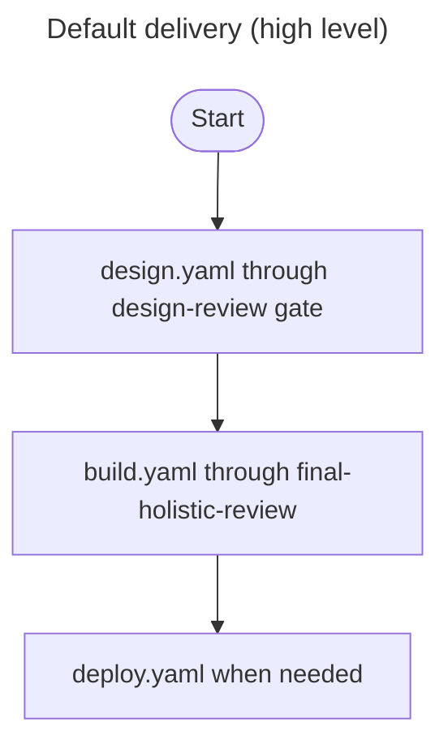
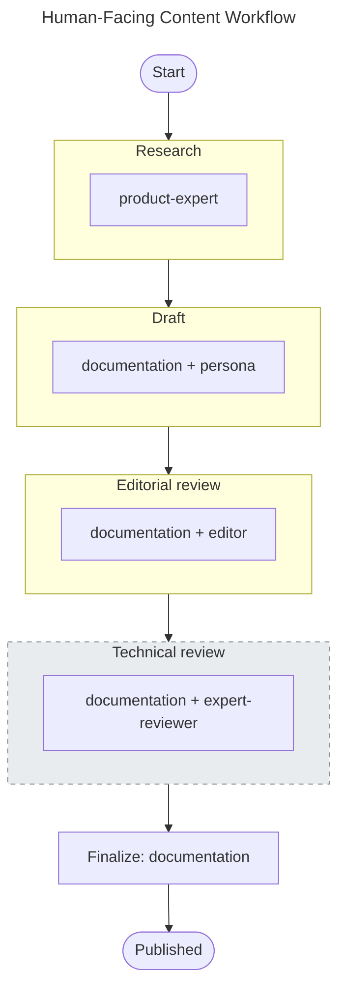

# Hive Mind: Framework Reference

**Document Status**: Draft
**Version**: 1.2
**Last Updated**: 13 April 2026
**Word Count**: ~8,400 words
**Reading Time**: ~35 minutes
**Companion**: *Hive Mind: Designing an Orchestration Framework for Multi-Agent Software Delivery* (`context/docs/agentic-framework.md`)

---

## Table of Contents

1. [How To Use This Reference](#how-to-use-this-reference)
2. [Framework Topology](#framework-topology)
3. [Source of Truth Hierarchy](#source-of-truth-hierarchy)
4. [Root-Level Framework Files](#root-level-framework-files)
5. [Standards](#standards)
6. [Rules](#rules)
7. [Agents](#agents)
   - [Tool and MCP surfaces (runtime vs frontmatter)](#tool-and-mcp-surfaces-runtime-vs-frontmatter)
   - [Writing Personas](#writing-personas)
8. [Workflows](#workflows)
   - [Design (`design.yaml`)](#design-designyaml)
   - [Build (`build.yaml`)](#build-buildyaml)
   - [Prototype (`prototype.yaml`)](#prototype-prototypeyaml)
   - [Deploy (`deploy.yaml`)](#deploy-deployyaml)
   - [Bugfix (`bugfix.yaml`)](#bugfix-bugfixyaml)
   - [Full-test (`full-test.yaml`)](#full-test-full-testyaml)
   - [Content (`content.yaml`)](#content-contentyaml)
   - [Continuous improvement (`continuous-improvement.yaml`)](#continuous-improvement-continuous-improvementyaml)
   - [Retrospective (`retrospective.yaml`)](#retrospective-retrospectiveyaml)
   - [Other workflows](#other-workflows)
9. [Orchestration Patterns](#orchestration-patterns)
10. [Templates](#templates)
11. [Scripts and Automation](#scripts-and-automation)
12. [Portability and Framework Adapters](#portability-and-framework-adapters)
13. [How the Parts Connect](#how-the-parts-connect)
14. [Reading Paths](#reading-paths)

---

## How To Use This Reference

The companion technical paper explains why the framework exists and the design principles behind it. This reference explains what the framework contains and how each part works. It is structured so that either document can be read first, or independently.

Use this document when you need to answer questions such as:

- What is this directory for?
- How does rule injection work at spawn time?
- What does the default workflow look like phase by phase?
- How would I port an agent definition to a different orchestration system?
- How do I measure whether the framework is working?

Each section covers one structural area of the framework: what it contains, how it operates, and where to make changes.

The companion paper develops the *why* and the trade-offs behind those choices. As you read the catalogue below, the same posture shows up repeatedly: **explicitness** (written phases, gates, paths, recovery—not tacit convention); **durability** (artefacts and handoffs—not chat memory); **reuse** (templates, shared agents, generated registries—not one-off prose); **portability** (Markdown and YAML at the core—not a single vendor runtime); and **verification** (validators, tests, reviews, gates, telemetry—not unevidenced claims). For the full argument, see `context/docs/agentic-framework.md`.

This reference summarises the tree on disk. If anything here disagrees with an authoritative file (a workflow YAML, an agent definition, a rule, or a generator script), **trust the file** and treat the mismatch as documentation drift to fix.

---

## Framework Topology

The framework is organised as a layered directory structure inside `context/`. The layers are ordered below by how frequently each is accessed during execution. Layers that touch every agent spawn sit at the top; layers consulted once per task or occasionally sit at the bottom.

| Layer | Location | Responsibility | Access Frequency |
|-------|----------|---------------|-----------------|
| Rules | `context/rules/` | State *what must happen*: short, binary, injectable constraints | Every agent spawn |
| Agents | `context/agents/` | Define *who*: specialised roles with frontmatter linking rules and standards | Every agent spawn |
| Templates | `context/templates/` | Define *what shape*: standardised formats for reviews, tasks, handoffs, design docs | Every output |
| Standards | `context/standards/` | Explain *why* and *how*: engineering rationale for coding, testing, security, documentation | On demand |
| Scripts | `context/scripts/` | Enforce *everything above*: validators, generators, git hooks | Every commit |
| Workflows | `context/workflows/` | Define *when*: phase order, dependencies, gates, outputs, recovery | Once per task |
| Docs | `context/docs/` | Provide *further reading*: design rationale, strategic context, orchestration patterns, workflow guides | Human reference |
| Personas | `context/persona/` | Provide *voice*: writing style for human-facing content only | Content workflows only |

The layering determines where changes should be made. To change what agents do, edit a workflow. To change how they do it, edit a standard or rule. To change who does it, edit an agent definition. To change what the output looks like, edit a template. Nothing bleeds across boundaries unless explicitly designed to.

The design pattern is consistent throughout:

- **define** the role or rule
- **explain** how to use it
- **standardise** the output
- **validate** the result

---

## Source of Truth Hierarchy

Not all framework files carry equal authority. Some define behaviour; others project or summarise it.

| Tier | Examples | Role |
|------|----------|------|
| **Authoritative source** | `context/agents/*.md`, `context/workflows/*.yaml`, `context/rules/*.mdc`, `context/standards/*.md`, `context/templates/*.md`, `context/persona/*.md` | These define how the framework behaves. Edit these to change it. |
| **Derived projection** | `AGENTS.md`, `CLAUDE.md` | These surface framework information in runtime-friendly form. Never hand-edit; regenerate from source. |
| **Operator guidance** | `context/docs/*.md`, `README.md` | These explain how to use, extend, or evaluate the framework. |
| **Enforcement** | `context/scripts/validators/*`, `context/scripts/prepare-commit-msg.*` | These keep the repository aligned with the design. |

The principle: change the authoritative source, let derived projections follow. Contributors should be able to look at any file and know whether it is the right place to make a change or whether the real change needs to happen upstream.

---

## Root-Level Framework Files

### `AGENTS.md`

Auto-generated registry of workflows and agents. It acts as the root-level entry point for agent runtimes and humans. The generator script (`context/scripts/generators/generate_agents_md.py`) reads every workflow YAML and every agent definition, then produces `AGENTS.md` as a single derived file containing the phase sequence, agent dispatch rules, spawn patterns, and state recovery procedures. If an agent definition references a rule that does not exist, or a workflow references an agent with no definition, the mismatch surfaces at generation time rather than at runtime.

Editing `AGENTS.md` by hand is always wrong. Edit the sources and regenerate.

### `CLAUDE.md`

Root agent guidance surfaced to the runtime. In this repository it points to `AGENTS.md`, making the generated registry the durable entry point instead of duplicating framework detail in multiple places.

### `README.md`

Repository-level onboarding and setup document. It complements `context/README.md`: the root README explains the repository; `context/README.md` explains the framework. This split keeps newcomer setup instructions close to the repository root whilst leaving framework theory in the portable context package.

---

## Standards

Standards are detailed reference material stored in `context/standards/`. They are intentionally longer and more explanatory than rules. An agent consults a standard when it needs deeper guidance than a rule provides: the reasoning behind a technology choice, the criteria for a good handoff, the philosophy behind the testing approach.

### How Standards Are Used

Each agent definition lists the standards it depends on in its frontmatter. When the orchestrator spawns an agent, it includes the standard references in the spawn prompt. The agent reads the relevant standards before starting work. Standards are loaded on demand rather than injected wholesale, because a single standard can run to 2,000-5,000 tokens and loading all of them would overwhelm the context window.

### The Rules-Standards Split

Rules and standards serve different purposes, and the separation is the framework's most consequential structural decision.

**Rules** are under 200 tokens each. They state what must happen: "use `uv run pytest`, not bare `pytest`"; "agents do not commit; the orchestrator commits on their behalf." They are designed for repeated injection into spawn prompts without significant context window cost. A typical agent spawn injects 5-8 rules at ~100-200 tokens each, plus the agent definition at ~500-1,000 tokens, totalling roughly 1,500-2,500 tokens of framework overhead.

**Standards** run to hundreds of lines. They explain *why* the framework uses `uv`, how TDD phases relate to each other, what constitutes a good handoff, and when to escalate versus assume.

An agent executing a straightforward Python task needs the 15-token rule that says "run tests with `uv run pytest`." A reviewer evaluating whether the tests are sufficient needs the full testing standard. The framework serves both without forcing either to carry the other's weight.

### Standards Catalogue

`context/standards/README.md` is the lightweight index for humans navigating the folder. The tables below describe **what each standard is for** when you are editing behaviour or answering an agent's "where do I read more?" question. They intentionally omit the README itself, which is navigation—not a behavioural standard agents load from frontmatter.

#### Foundational

| Standard | Purpose |
|----------|---------|
| `agent-standards.md` | Defines how agents should behave, recover state, use tools, and coordinate. The behavioural contract around agents, not just their roles. |
| `context-framework.md` | The framework's theory of context: reference vs actionable context, priority, handoff format, terse formats, and context quality. A foundational design text. |
| `workflow-standards.md` | Shared workflow conventions, invocation practices, and orchestration rules. The operating model that spans multiple workflow YAML files. |

#### Technical

| Standard | Purpose |
|----------|---------|
| `coding-standards.md` | Language and implementation guidance for code quality. Patterns, error handling, naming. |
| `tech-standards.md` | Primary technology stack reference. Tools, libraries, deployment targets, environment setup. |
| `testing-standards.md` | Testing philosophy and practice, including TDD expectations, coverage requirements, and phase-based thresholds. |
| `security-standards.md` | Security guidance for design, implementation, and review. |
| `tech-mobile-standards.md` | Mobile-specific technical guidance, separated to avoid bloating the main technology standard. |

#### Quality and Documentation

| Standard | Purpose |
|----------|---------|
| `doc-standards.md` | Documentation structure, quality, archival, diagram, and maintenance guidance. |
| `build-standards.md` | How build-phase work should be structured and assessed. |
| `visual-standards.md` | Guidance for design consistency, UI quality, and visual review concerns. |
| `12-factor-principles.md` | Maps framework work onto twelve-factor application principles. |
| `LESS-Engineering-Principles.md` | Captures the LESS principles used by review agents and design discussions. |

---

## Rules

Rules are short, enforceable constraints stored in `context/rules/` as `.mdc` files. Each rule addresses a real failure mode: something that breaks, drifts, or degrades if the rule is not followed. They are designed for injection into agent prompts and for validator-backed enforcement.

### How Rules Work

Each rule file has YAML frontmatter with three fields:

```yaml
---
description: Python environment setup and command execution
globs: ["**/*.py", "**/pyproject.toml", "**/requirements.txt"]
alwaysApply: false
---
```

**`description`**: A short summary of what the rule covers.

**`globs`**: File patterns that determine when this rule applies. The orchestrator matches the task's files against these globs and injects only the rules whose patterns match.

**`alwaysApply`**: If `true`, the rule is injected into every agent spawn regardless of file scope.

The body of the rule is concise instruction text, typically structured as a table of correct vs incorrect usage, followed by a brief rationale. The entire rule stays under 200 tokens.

### Example: Python Environment Rule

```
| Action          | Correct               | Wrong                         |
|-----------------|-----------------------|-------------------------------|
| Run tests       | uv run pytest         | pytest                        |
| Install package | uv add package        | pip install package           |
| Run script      | uv run python script  | python script.py              |
```

The rationale section explains that bare `python` or `pytest` commands fail because no virtual environment is activated and dependencies are not available. `uv run` automatically uses the project's virtual environment, ensures dependencies are installed, and respects `.python-version`.

### Rules Catalogue

Only a subset of rules currently have matching Python validators under `context/scripts/validators/` (see [Scripts and Automation](#scripts-and-automation)). A rule without a validator is still binding for agents via prompt injection; a rule *with* a validator is also mechanically checkable at commit time.

#### Environment and Tooling

| Rule | Purpose |
|------|---------|
| `python-environment.mdc` | Enforces `uv` for all Python commands |
| `typescript-environment.mdc` | Enforces `yarn` for package management, `yarn dlx` for one-off tools |
| `bash-environment.mdc` | Prevents unsafe or inconsistent shell usage; pushes work toward approved tools |
| `mermaid-environment.mdc` | Constrains Mermaid diagram syntax, layout direction, and node label conventions |
| `supabase.mdc` | Defines constraints around Supabase-related usage |

#### Quality and Process

| Rule | Purpose |
|------|---------|
| `tdd-workflow.mdc` | Enforces RED then GREEN then BLUE discipline |
| `quality-gates.mdc` | Encodes non-negotiable review and release criteria |
| `output-locations.mdc` | Keeps artefacts in the correct directories |
| `handoff-hygiene.mdc` | Enforces durable, useful handoffs |
| `escalation.mdc` | Defines when agents may assume, flag, or escalate |
| `git-commits.mdc` | Standardises commit structure and agent session metadata |
| `metrics-logging.mdc` | Constrains how workflow and performance signals are recorded |
| `no-ai-slop.mdc` | Eliminates AI-generated writing tics from persona-driven documentation |

#### Architecture, Design, and Safety

| Rule | Purpose |
|------|---------|
| `architecture-fidelity.mdc` | Prevents implementation drift from approved architecture |
| `visual-fidelity.mdc` | Prevents drift from approved UI and visual design |
| `ui-component-reuse.mdc` | Encourages reuse and discourages needless UI duplication |
| `type-safety.mdc` | Protects typed contracts and discourages unsafe shortcuts |
| `browser-automation.mdc` | Constrains browser-based test and automation behaviour |
| `secrets-management.mdc` | Prevents unsafe handling of secrets and credentials |

#### Language and Requirements Hygiene

| Rule | Purpose |
|------|---------|
| `british-english.mdc` | Enforces consistent spelling in framework outputs |
| `EARS-notation-requirements.mdc` | Enforces the chosen requirements notation |

### Writing New Rules

A candidate for a new rule should pass three tests:

1. **Is it binary?** Can you definitively say "followed" or "not followed"?
2. **Does it break things?** Not just a style preference; actual failures result from ignoring it.
3. **Is it actionable?** Can you give clear DO/DON'T commands?

If all three are true, create a rule in `rules/*.mdc` and keep it under 200 tokens. If the topic requires nuance, explanation, or judgement, it belongs in a standard, not a rule.

---

## Agents

Agent definitions are markdown files with YAML frontmatter and an instruction body, stored in `context/agents/`. They are the role catalogue of the framework: each file defines a single specialist with a bounded responsibility, a curated set of rules and standards, and clear instructions for how to execute its work.

The repository ships **one orchestrator** plus **eighteen** delegatable specialists (nineteen role files in total, excluding `README.md`). The roster below groups them by concern; `context/agents/README.md` lists the same roles with **recommended model tiers** for operators who tune cost versus capability. Which agent runs in which phase is **never** implied by the roster alone; it is declared in `context/workflows/*.yaml` and reflected in regenerated `AGENTS.md`.

### Agent Definition Format

Every agent follows this structure:

```yaml
---
name: python-coder
description: Writes production Python code with testing in mind.
model: sonnet
standards:
  - tech-standards.md
  - coding-standards.md
  - security-standards.md
  - doc-standards.md
rules:
  - python-environment.mdc
  - tdd-workflow.mdc
  - type-safety.mdc
  - git-commits.mdc
  # ... additional rules
# Optional — see "Tool and MCP surfaces" below
# mcp_tools:
#   - context7
---

You are an expert Python engineer. Your job is to write clean,
testable, production-grade Python code.

## Required Standards (Read First!)
1. context/standards/tech-standards.md
2. context/standards/coding-standards.md
...

## Workflow
1. Read standards
2. Read task context
3. Implement
4. Run tests
5. Write handoff
```

**`name`**: Identifier used in workflow YAML and spawn prompts.

**`description`**: Brief role summary. Helps the orchestrator select the right agent.

**`model`**: Recommended model tier (e.g. `opus`, `sonnet`, `haiku`). The orchestrator uses this as guidance, not a hard constraint.

**`standards`**: List of standard files the agent should read before starting work. These are loaded on demand, not injected automatically.

**`rules`**: List of rule files that apply to this agent's work. The orchestrator injects these into the spawn prompt.

**`mcp_tools`** (optional, common on specialists here): MCP server identifiers the author expects the runtime to attach for that role (for example library docs or database inspection). Other products use **`allowed_tools`** or an equivalent allow-list instead. Neither field executes by itself—it documents **intent** for whoever configures the runtime.

The body below the frontmatter is the agent's system prompt: role definition, workflow steps, output expectations, and any role-specific constraints.

### Tool and MCP surfaces (runtime vs frontmatter)

Agent YAML declares what a role *should* be able to reach; the **orchestrator runtime** (Cursor, Claude Code, a headless worker, and so on) still decides which tools and MCP servers actually exist, which paths are writable, and which invocations require human approval. Those layers live outside `context/agents/`—often in **workspace or user settings** that are **not** committed. In Cursor, permissions and MCP wiring frequently sit in **`.cursor/settings.local.json`** (typically git-ignored), so two machines with the same checkout can behave differently.

When frontmatter and local configuration **diverge**, the failure mode is friction: endless approval prompts, subagents that cannot attach a listed MCP server, or specialists that appear “fully defined” in markdown but never receive the tools their prompt assumes. Treat that as a **deployment alignment** problem: update the local settings (or your organisation’s standard Cursor profile) when you add `mcp_tools:` entries, add a new agent, or enable a new server—**and** keep frontmatter honest about what is truly required versus optional.

Rule injection and file scope (see `context/agents/orchestrator.md`) remain mandatory regardless of tool lists; missing rules cause as much pain as missing MCP entries.

### How the Orchestrator Resolves an Agent

When spawning an agent, the orchestrator:

1. Reads the agent definition from `context/agents/{name}.md`
2. Extracts the `rules` list from frontmatter
3. Glob-matches the task's files against each rule's scope to confirm applicability
4. Injects the applicable rules into the spawn prompt alongside the agent's system prompt
5. Constrains the agent to a defined file scope so it cannot make changes outside its boundaries
6. Constructs the full prompt using the task prompt template (`context/templates/task-prompt-template.md`)

Agents do not commit to git. Only the orchestrator commits, one at a time, preventing ref-lock collisions when parallel agents finish simultaneously.

### The Agent Roster

The framework defines 18 specialised agents, organised by kind of judgement.

#### Core Coordinator

| Agent | Purpose |
|-------|---------|
| `orchestrator` | Coordinates the system, resolves rules, assigns file scope, validates phase outputs, manages quality gates |

#### Product and Discovery

| Agent | Purpose |
|-------|---------|
| `product-expert` | Elicits problem understanding and discovery insight from the user |
| `product-owner` | Turns clarified needs into structured requirements and stories |

#### Design

| Agent | Purpose |
|-------|---------|
| `solution-architect` | Designs architecture, boundaries, and data flow |
| `database-designer` | Designs schemas, relationships, and migrations |
| `api-designer` | Designs APIs and contract artefacts |
| `ui-designer` | Designs UI structure, component behaviour, and user flow |
| `visual-designer` | Produces visuals, mockups, and visual review input |

#### Implementation and Test

| Agent | Purpose |
|-------|---------|
| `python-coder` | Implements Python production work |
| `typescript-coder` | Implements TypeScript and frontend work |
| `functional-tester` | Writes and runs tests in the TDD flow |
| `ui-tester` | Executes browser-based UI verification |

#### Review and Governance

| Agent | Purpose |
|-------|---------|
| `tech-lead` | Acts as the principal architecture and quality gate reviewer |
| `code-reviewer` | Performs implementation-focused review for bugs, risks, and maintainability |
| `principles-reviewer` | Reviews designs and code against higher-level engineering principles |
| `security-tester` | Reviews for vulnerabilities and security risks |

#### Operations and Maintenance

| Agent | Purpose |
|-------|---------|
| `devops` | Handles deployment and infrastructure-related work |
| `documentation` | Cleans up, archives, and maintains human-facing documentation |
| `workflow-analyst` | Reviews process effectiveness and supports retrospectives |

### Creating a New Agent

1. Copy `context/templates/agent-template.md` to `context/agents/{name}.md` (some deployments also keep a `context/agents/TEMPLATE.md` copy; the templates directory is the canonical scaffold in this tree)
2. Set `name`, `description`, `model` in frontmatter
3. List applicable `rules` and `standards` in frontmatter
4. Write a concise body with role definition, workflow steps, and output expectations
5. Add the agent to the appropriate workflow YAML phase
6. Regenerate `AGENTS.md`

### Writing Personas

Personas are stored in `context/persona/` and provide voice guidance for human-facing content. They are used by the `documentation` agent when writing blogs, technical papers, user guides, and marketing materials. They are explicitly *not* used for technical handoffs, API documentation, architecture documents, or internal artefacts.

For the phased pipeline (research through publish) used for blogs, papers, and similar content, see [Content (`content.yaml`)](#human-facing-content-workflow) under Workflows.

#### When to Use a Persona

**Use a persona for**: blog posts, articles, thought leadership, technical papers, user-facing guides for non-technical audiences, marketing materials, conference talks.

**Do not use a persona for**: technical handoffs (README, HANDOFF.md, build notes), API documentation, code references, architecture documents, design specifications, internal artefacts (requirements, tasks, review reports), code comments, error messages.

#### Available Personas

##### Technical Writer

**File**: `context/persona/technical-writer.md`
**Character**: Amara Osei. Eight years at Stripe documenting payment APIs, four years at Hashicorp writing infrastructure guides.
**Use for**: Technical guides, framework documentation, practitioner reference material.

Key traits: leads with the problem, not a hook. Explains the mechanism step by step. Working examples with inputs and outputs. Names trade-offs and costs directly. Structured for reference use with scannable headings and front-loaded information. No filler.

##### Opinionated Blogger

**File**: `context/persona/opinionated-blogger.md`
**Character**: Dr. Sarah Chen. PhD from MIT, 10 years as principal engineer at Google.
**Use for**: Blog posts, opinion pieces, thought leadership.

Key traits: provocative opening hooks. Conversational with contractions and parenthetical asides. Personal anecdotes as entry points. Self-deprecating honesty. Question-driven framing. Memorable one-liners. Short paragraphs, 2-4 minute read times.

##### Editor

**File**: `context/persona/editor.md`
**Use for**: Refining and polishing existing content. Checking voice consistency, removing AI slop, verifying British English.

##### Expert Reviewer

**File**: `context/persona/expert-reviewer.md`
**Use for**: Reviewing technical accuracy and completeness of human-facing content.

#### Selecting a Persona

The selection depends on audience and content type:

- Writing a practitioner guide with code examples? **Technical writer.**
- Writing a blog post or opinion piece? **Opinionated blogger.**
- Writing for a non-technical audience about high-level concepts? **Opinionated blogger.**
- Writing implementation details for developers? **Technical writer.**
- Polishing an existing draft? **Editor.**
- Checking technical claims? **Expert reviewer.**

All personas use British English throughout (colour, optimise, behaviour, whilst, programme, organisation).

---

## Workflows

Workflows are YAML files in `context/workflows/` that encode phase dependencies, agent assignments, quality gates, validation criteria, state recovery procedures, and execution rules. Storing orchestration logic in versionable YAML rather than ad hoc conversation makes it inspectable, diffable, reviewable, and recoverable after context compaction.

| Workflow | File | Purpose |
|----------|------|---------|
| **design** | `design.yaml` | Discovery through design review; run before build |
| **build** | `build.yaml` | Primary TDD loop: plan, red, green, blue, review, regress, docs cleanup |
| **prototype** | `prototype.yaml` | Fast iteration, no quality gates; rewrite before production |
| **deploy** | `deploy.yaml` | GCP cloud deployment after local verification |
| **bugfix** | `bugfix.yaml` | Empirical reproduction, diagnosis, fix, verification |
| **full-test** | `full-test.yaml` | Complete regression across all modules |
| **content** | `content.yaml` | Human-facing writing with personas |
| **continuous-improvement** | `continuous-improvement.yaml` | Incident response and retrospective analysis (framework evolution) |
| **retrospective** | `retrospective.yaml` | Standalone process review and pattern identification |

<a id="design-designyaml"></a>
<a id="the-default-workflow"></a>

### Design (`design.yaml`)

**Purpose**: Discovery through design review; run before `build.yaml`.

**Pattern**: Six phases, one approval gate at the end (`design-review`).

| Phase | Agents (pattern) | Role |
|-------|------------------|------|
| `discovery` | `product-expert` then `product-owner` (sequential) | Discovery notes → formal requirements and user stories in `artefacts/product/` |
| `design-architecture` | `solution-architect` | Architecture, logical API contracts, data model, component design docs |
| `design-contracts` | `database-designer` and `api-designer` (**parallel**) | Physical schema and migrations; OpenAPI with HTTP semantics |
| `design-ui` | `ui-designer` | Component specs, tokens, wireframes, user flows |
| `design-visuals` | `visual-designer` | Visual assets under `artefacts/design/visuals/` |
| `design-review` | `tech-lead` → `code-reviewer` → `principles-reviewer` → `visual-designer` → `security-tester` (sequential gate) | Design approval; `tech-lead` must approve before the next reviewer runs |

**Design gate** (`design-review`): zero architecture blockers; zero design security issues; complex components need a design doc per `design_doc_standard` in the workflow file.

<a id="build-buildyaml"></a>

### Build (`build.yaml`)

**Purpose**: Primary TDD implementation pipeline after design approval.

**Pattern**: Subtask-driven TDD with automated coverage gate, per-sprint review, local deployment, scoped regression, documentation cleanup, and two final approval gates. Runs against `artefacts/build/subtask-plan.yaml` (subtasks, file scopes, acceptance criteria). Canonical phase order and validation live in the YAML; this is a digest.

Sixteen phases (plus a **sprint loop** that repeats for each sprint in `subtask-plan.yaml`). High-level shape:

```
task-planning → tasks-review (gate) → schema-migration →
  [ per sprint: tdd-red → test-plan-review → tdd-green → coverage-gate (gate) →
    tdd-blue → sprint-review ] →
local-deployment → unit-regression → integration-regression → e2e-regression →
docs-cleanup → quality-review (gate) → final-holistic-review (gate)
```

| Phase | Role |
|-------|------|
| `task-planning` | `tech-lead` decomposes work into subtasks with verifiable acceptance criteria and file scopes (`artefacts/build/subtask-plan.yaml`). |
| `tasks-review` | `tech-lead`, `solution-architect`, `principles-reviewer` in **parallel**; gate on subtask plan before implementation. |
| `schema-migration` | `devops` writes and applies migrations when the sprint changes schema (skippable if no schema work). |
| `tdd-red` | `functional-tester` writes failing tests for all ACs. |
| `test-plan-review` | `code-reviewer` checks every AC maps to a failing test before GREEN. |
| `tdd-green` | `python-coder` and `typescript-coder` in **parallel**; minimal code to pass tests; no test edits. |
| `coverage-gate` | `functional-tester`; **automated gate** — at least 95% coverage on **changed or new files** only; fail sends work back to RED. |
| `tdd-blue` | Both coders in **parallel**; refactor only; tests stay green. |
| `sprint-review` | `code-reviewer`, `ui-tester`, `security-tester` in **parallel**; browser screenshots for new UI; findings feed the next sprint. |
| `local-deployment` | `devops` local apply, smoke test, rollback notes. |
| `unit-regression` | `functional-tester` on changed modules (95% on changed scope). |
| `integration-regression` | `functional-tester` on changed interfaces. |
| `e2e-regression` | `ui-tester` and `code-reviewer` in **parallel**; screenshots and design compliance for changed workflows. |
| `docs-cleanup` | `documentation` archives and updates README, API docs, `HANDOFF.md`, tasks. |
| `quality-review` | `tech-lead` only; code and documentation gate before holistic review. |
| `final-holistic-review` | `solution-architect`, `tech-lead`, `visual-designer`, `principles-reviewer` in **parallel**; all must approve. |

**Build gates** (see `quality_gates` in `build.yaml`): `tasks-review` (approval), `coverage-gate` (automated threshold), `quality-review` (approval), `final-holistic-review` (approval). Thresholds and metrics are defined in YAML; aggregate coverage for quality-review is 95% on new or changed files, not a separate 97% deployment-review phase in this workflow file.

**Subtask execution**: RED, GREEN, and BLUE run as orchestrated subtasks per stream (Python and TypeScript can progress in parallel with disjoint `file_scope`). Recovery uses `HANDOFF.md`, `artefacts/build/dispatch.md`, and `subtask-plan.yaml` status fields (see `state_recovery` in `build.yaml`).



#### When to use design and build

Use **design** then **build** for production features and anything that will be maintained long-term. Duration scales with sprint count and scope.

Do not use this path for throwaway spikes; use [Prototype (`prototype.yaml`)](#the-prototype-workflow) instead. Run [Retrospective (`retrospective.yaml`)](#retrospective-retrospectiveyaml) or [Continuous improvement (`continuous-improvement.yaml`)](#measuring-effectiveness) when you want process or framework follow-up; they are not phases inside `build.yaml`.

<a id="prototype-prototypeyaml"></a>
<a id="the-prototype-workflow"></a>

### Prototype (`prototype.yaml`)

**Purpose**: Fast iteration without quality gates.

**Use for**: POCs, experiments, spikes, throwaway code.

The prototype workflow trades rigour for speed: 4 phases, no quality gates, 5 agents.

```
quick-plan → sketch-design → build → validate (optional)
```


#### Prototype rules

- Speed over quality. Technical debt is acceptable.
- No formal reviews, no coverage requirements, no security audits.
- Tests are optional; smoke tests covering the happy path are sufficient.
- Hard-coded values, skipped error handling, and incomplete documentation are all acceptable.
- Mark code clearly as prototype.

#### Migrating prototype to production

If a prototype validates its hypothesis and should become production code:

1. Archive the prototype on a separate branch
2. Extract learnings: document what worked and what did not
3. Start fresh with design then build (this section’s default path)
4. Do not copy-paste prototype code; rewrite with TDD from the beginning

Cleaning up a prototype takes longer than rewriting it properly. The technical debt in prototype code is architectural, not superficial.

<a id="deploy-deployyaml"></a>

### Deploy (`deploy.yaml`)

**Purpose**: GCP cloud deployment and deployment review **after** `build.yaml` has completed local deployment and verification.

| Phase | Agents | Role |
|-------|--------|------|
| `gcp-deployment` | `devops` | Terraform, Cloud Run or Firebase Hosting, staging validation, rollback plan under `artefacts/gcp/` |
| `deployment-review` | `tech-lead` (gate) | Approve production readiness; monitoring and rollback confirmed |

`quality_gates` in the YAML require tech-lead approval on `deployment-review`. Criteria include deployment success and coverage sign-off as defined in the file (see `deploy.yaml` for thresholds and notes).

<a id="bugfix-bugfixyaml"></a>

### Bugfix (`bugfix.yaml`)

**Purpose**: Reproduce, fix, and verify defects with **empirical evidence** (browser screenshots and file-cited causal chains), not feature-sized planning.

**Shape**: `reproduce` (gated; `ui-tester` and `functional-tester` in parallel) → `fix` (failing test first, then `python-coder` / `typescript-coder` as needed) → `verify` (gated; parallel UI and test confirmation). Evidence lands under `artefacts/bugfix/`.

**Quality gates**: Evidence gates on `reproduce` and `verify`—tests passing alone is not sufficient; see YAML for gate metrics and workflow rules (TDD on the fix, commit body records causal chain).

<a id="full-test-full-testyaml"></a>

### Full-test (`full-test.yaml`)

**Purpose**: Full-suite testing across **all** modules—release confidence, not the per-feature changed-scope regressions in `build.yaml`.

**Phases** (sequential): `full-unit-test` → `full-integration-test` → `full-e2e-test` → `quality-check` (tech-lead gate). Reports under `artefacts/test-results/`. **No code changes** in this workflow—failures are reported for follow-up elsewhere.

**When to run**: Before merging a long-running branch to main, after large refactors, or on demand for health checks (see YAML `workflow_rules`).

<a id="content-contentyaml"></a>
<a id="human-facing-content-workflow"></a>

### Content (`content.yaml`)

**File**: `context/workflows/content.yaml`
**Pattern**: Sequential chain — `product-expert` for research, then `documentation` with a **different persona per phase** (draft → editor → optional expert reviewer → finalize).
**Use for**: External-facing prose: blogs, papers, guides, talks, marketing where voice matters.
**Do not use for**: Technical handoffs, API or architecture reference, internal task or review artefacts, or anything that should stay neutral and repo-shaped — use [Design](#design-designyaml) then [Build](#build-buildyaml) with `doc-standards.md` without personas.

Five phases, **no** quality gates (YAML `quality_gates: []`); typical wall time about **2–4 hours**. Shape, validation strings, and `workflow_rules` live in **`content.yaml`**; this subsection is a digest only.

```
research → draft → review → technical-review (optional) → finalize
```



#### Phases

| Phase | Agent | Persona / role | Primary output |
|-------|--------|----------------|------------------|
| `research` | `product-expert` | Audience, purpose, key messages, sources | Research notes (see YAML `outputs`) |
| `draft` | `documentation` | `technical-writer` or `opinionated-blogger` | `artefacts/content/drafts/{title}-draft.md` |
| `review` | `documentation` | `editor` | `artefacts/content/drafts/{title}-reviewed.md` |
| `technical-review` | `documentation` | `expert-reviewer` (**optional** — skip for non-technical pieces) | `artefacts/content/drafts/{title}-tech-reviewed.md` |
| `finalize` | `documentation` | Publication formatting per task | `artefacts/content/published/{title}.md` |

Draft and review phases list concrete checks in YAML (persona voice, British English, opening hook, concrete examples; editorial pass strips patterns covered in **`context/rules/no-ai-slop.mdc`**). Spawn each phase with `context/templates/task-prompt-template.md`, the persona path, and file scope — long copy-paste invoke blocks belong in the task prompt, not in this reference.

### Continuous improvement (`continuous-improvement.yaml`)

<a id="measuring-effectiveness"></a>

Framework improvement and measurement are governed by **`context/workflows/continuous-improvement.yaml`**, not by ad hoc scorecards. That workflow defines two **modes** (incident and retrospective), explicit **phases**, what gets **written to disk**, and a **quality gate** in retrospective mode. The `workflow-analyst` agent appears only in retrospective **review**; other phases are orchestrator- and human-led as the YAML states.

#### Workflow file and modes

| Mode | Trigger | Purpose |
|------|---------|---------|
| **incident** | Human reports a specific failure | Capture, diagnose, fix, record one incident |
| **retrospective** | After deployment, after a sprint, or on demand | Mine logs and git for patterns, discuss with human, fix, record |

**Workflow rules** (from YAML): incident mode is human-triggered; retrospective mode is periodic or on demand; **every finding or incident must identify a fixable gap in the framework** (rules, standards, templates, scripts), not vanity metrics; in retrospective mode the **human decides** which findings to implement; incident mode proceeds once diagnosis is sound.

---

#### Incident mode (reactive)

Sequential phases:

| Phase | Agents | Role |
|-------|--------|------|
| `report` | None (orchestrator + human) | Append a new entry to `artefacts/build/agent-incidents.md`: severity, symptom, root cause and fix initially **pending** |
| `diagnose` | None | Trace **symptom → mechanism → file → gap** with path-level evidence; read configs and code, do not infer from names alone |
| `fix` | `python-coder`, `typescript-coder` (parallel) | Apply changes to rules, standards, templates, or small orchestration edits; commit after each logical fix |
| `record` | None | Update the incident entry with root cause, fix summary, and commit hash; optionally add a portability task to `artefacts/build/tasks-context-framework.md` |

**Validation highlights**: diagnosis must cite specific files and complete the causal chain; `fix` must satisfy acceptance checks (for example grep confirms an anti-pattern removed).

The YAML lists `fix` with `depends_on: [diagnose, discuss]`. **Retrospective** runs `discuss` (human gate) before `fix`. **Incident** runs `diagnose` after `report`; the orchestrator should advance to `fix` once diagnosis is complete (the `discuss` phase exists only in retrospective mode).

---

#### Retrospective mode (proactive)

Sequential phases:

| Phase | Agents | Role |
|-------|--------|------|
| `review` | `workflow-analyst` | Read **artefacts/build/agent-interruptions.md** (questions, tool approvals, escalations), **artefacts/build/agent-incidents.md**, and **git log** bodies for **Agent-Session** telemetry (tokens, duration, agents, dispatch, interactions, approvals injected by `prepare-commit-msg` and orchestrator). Aggregate to find **patterns** with counts and examples; each finding must point at **concrete files** that would change |
| `discuss` | None (**gate**: human approval) | Present **pattern → root cause → proposed fix**; human chooses what to act on |
| `fix` | `python-coder`, `typescript-coder` (parallel) | Same as incident mode: implement agreed fixes |
| `record` | None | Update incidents if relevant; append portability tasks to `artefacts/build/tasks-context-framework.md` when fixes should propagate to other repos |

**Quality gate**: `discuss` (retrospective only) requires **human approval** before fixes proceed.

**Validation highlights**: git log parsed for session metrics; interruption and incident logs read; patterns evidenced; no aggregate “health scores” (explicitly disallowed by workflow rules).

---

#### Data the retrospective `review` phase is built to consume

The YAML lists these sources explicitly:

- **`artefacts/build/agent-interruptions.md`**: blocking moments (questions, approvals, escalations)
- **`artefacts/build/agent-incidents.md`**: prior framework failures
- **`git log`** with `%H`, subject, body: reconstruct **tokens=**, **duration=**, **agents=**, **dispatch=**, **interactions=**, **approvals=** from commit trailers

From those, the analyst is expected to answer questions such as: total tokens per agent, sprint, or task; duration per task; which agents cost the most tokens relative to output; token trends; autonomy rate (commits with orchestrator dispatch and zero interactions); distribution of human interactions and approvals. **Repeated rule violations**, **agents over token budget**, and **incidents with shared root causes** are examples of valid pattern classes.

---

#### Relationship to other artefacts

**Tasks and handoffs** (`artefacts/build/tasks.md`, `HANDOFF.md`, `artefacts/shared/handoffs/`) remain useful **secondary** context when the orchestrator or `@workflow-analyst` widens an investigation, but they are **not** the primary contract of `continuous-improvement.yaml`; that contract is interruptions log, incidents log, and git telemetry as above.

The agent definition **`context/agents/workflow-analyst.md`** still describes broader analysis habits (for example task and handoff mining). When in doubt, **the workflow YAML wins** for phase order, outputs, and validation.

---

#### Common fix targets (illustrative)

These are examples of **fixable gaps**, not a separate scoring methodology:

- **Coverage discipline**: tests landed after GREEN instead of strengthening RED or failing `coverage-gate` (see `build.yaml`).
- **Tooling drift**: repeated bash-for-files or wrong package managers; tighten prompts or rules.
- **Integration cost**: missing fixtures or slow local setup; add shared fixtures or documented setup in standards.
- **Parallel misuse**: duplicated context without time savings; narrow parallel phases to truly independent work.

<a id="retrospective-retrospectiveyaml"></a>

### Retrospective (`retrospective.yaml`)

**Purpose**: Standalone proactive review—`workflow-analyst` reviews accumulated operational data, the orchestrator discusses findings with a human (gate), then coders fix and record portability tasks. **Not** the same file as `continuous-improvement.yaml` (that file adds **incident** mode and git **Agent-Session** mining in its retrospective path).

| Phase | Agents | Role |
|-------|--------|------|
| `review` | `workflow-analyst` | Read `agent-interruptions.md`, `agent-metrics.log`, `agent-incidents.md`; report patterns with file:line evidence |
| `discuss` | None (**human gate**) | Human selects which findings to implement |
| `fix` | `python-coder`, `typescript-coder` (**parallel**) | Approved framework changes |
| `record` | None | Append portability tasks to `artefacts/build/tasks-context-framework.md` |

See `retrospective.yaml` for `quality_gates`, `workflow_rules`, and `state_recovery`.

---

## Orchestration Patterns

This section documents the **four** coordination shapes the shipped workflows actually use: **single agent**, **sequential chain**, **hive** (parallel agents on a shared contract, with orchestrator scope rules), and **iterative loop** (gates and rework). They are vocabulary for reading YAML—not separate runtime features. On disk, behaviour is whatever each workflow file says: **phase order**, **`parallel: true`** (see `parallel_planning` in `build.yaml`), **disjoint `file_scope`** where required, and **gates**.

**Out of scope here:** “Swarm” exploration (many agents trying different approaches to the same problem, pick-or-merge the winner) is **not** represented in `context/workflows/*.yaml`. It appears only in forward-looking product narrative—see `context/docs/vision.md` (Build phase, glossary) and **Limitations** in `context/docs/agentic-framework.md`. Do not expect a `parallel: true` phase in this repository to mean swarm; almost all parallelism in **`design.yaml`** and **`build.yaml`** is **hive-style** (shared plan, tests, architecture, or release candidate).

### Single Agent

One specialist, one task, no dependencies. Use for isolated tasks with clear requirements: fix a specific bug, add a simple feature, write documentation.

### Sequential Chain

Agents in strict order, each depending on the previous output. Use for tasks with clear dependencies and quality gates: most of **design** and **build** is sequential between phases.

### Hive

Parallel agents working against a **shared contract** (same tests, same subtask plan, same architecture outputs) with orchestrator-enforced **scope** and merge discipline. The canonical case in **`build.yaml`** is **TDD GREEN** and **TDD BLUE**: `python-coder` and `typescript-coder` run together with **disjoint `file_scope`** but the **same** failing-then-passing test suite (`parallel_planning` and `subtask_execution` in the YAML spell this out). **`design-contracts`** is hive-like too: both designers extend the same architecture handoff. **Tasks review**, **sprint-review**, **e2e-regression**, and **final-holistic-review** are parallel **reviewers** on the same body of work—again shared-artefact coordination.

### Iterative Loop

Review-fix cycles until approval. Use at quality gates where output may be rejected: design review may require architectural changes before approval.

### Pattern Comparison

| Pattern | Speed | Token Cost | Coordination | Example in shipped YAML |
|---------|-------|------------|--------------|-------------------------|
| Single | Fast | Low | None | `tdd-red`, `coverage-gate`, many single-agent phases |
| Sequential | Slow | Low | Linear | Discovery, architecture → contracts → UI chain |
| Hive | Fast | High | Shared contract + scopes | `tdd-green` / `tdd-blue`; `design-contracts`; parallel review phases on one plan or codebase |
| Iterative | Varies | Medium | Approval loops | `design-review`, quality gates |

### How the default path uses patterns

**`design.yaml`**

- **Discovery**: Sequential (`product-expert` then `product-owner`).
- **Architecture**: Single agent (`solution-architect`).
- **Contracts**: Parallel **hive-like** pair (`database-designer` and `api-designer` on the same architecture outputs).
- **UI then visuals**: Sequential (`ui-designer` then `visual-designer`).
- **Design review**: Sequential reviewers with **iterative** return to earlier phases when required.

**`build.yaml`**

- **Planning and test planning**: Sequential (`tech-lead` then `code-reviewer` on the test plan).
- **Tasks review**, **sprint-review**, **e2e-regression**, **final-holistic-review**: `parallel: true`, but agents share the **same** plan, sprint surface, workflows under test, or release candidate—**hive-style** coordination.
- **TDD GREEN / BLUE**: Hive (parallel coders, **shared tests**, disjoint file scopes).
- **Coverage gate**: Single agent; may **loop** back to RED.
- **Regression after local deployment**: Sequential unit → integration → e2e (the e2e phase may list two agents in parallel with shared workflow scope).
- **Quality review** then **final holistic review**: Gate then parallel approvers on the same implementation.

### Choosing a pattern

1. Single isolated task? **Single agent.**
2. Same plan, tests, or design handoff for everyone? **Hive** (all `parallel: true` phases in default path YAML behave this way).
3. Strict A-then-B output dependency? **Sequential chain.**
4. Output needs iterative refinement? **Iterative loop.**

### Token Optimisation

Parallel execution increases token usage because context is duplicated across agents. Three agents running in parallel typically cost ~20% more tokens than the same three agents running sequentially.

Prefer parallel execution when time is critical, tasks are large (overhead is a small percentage of the total), or agents have different contexts (minimal duplication). Prefer sequential execution when the token budget is tight, tasks are small (overhead dominates), or context is large and identical across agents.

---

## Templates

Templates are stored in `context/templates/` and define standard output shapes for recurring artefacts. The orchestrator selects the appropriate template when constructing a task prompt; the producing agent uses it to structure its output.

`context/templates/README.md` indexes every template file, when to use it, and how it relates to workflows—use it when you are adding a new artefact shape rather than guessing from filenames alone.

### Why Templates Exist

Standardised shapes reduce ambiguity for both writers and readers. When every review follows the same structure, or every handoff includes the same fields, downstream agents and humans can consume the output predictably. Automation becomes reliable when the shape is known in advance.

### Available Templates

| Template | Purpose |
|----------|---------|
| `agent-template.md` | Starting point for creating a new specialised agent |
| `architecture-template.md` | Standard structure for system architecture documents |
| `bugs-template.md` | Standard bug tracker format |
| `commit-message-template.md` | Standard commit message structure with agent session metadata |
| `design-template.md` | Standard design document for complex features or screens |
| `domain-rules-template.yaml` | Template for domain-specific constraints |
| `handoff-template.md` | Standard agent handoff format |
| `pr-description-template.md` | Standard pull request description format |
| `requirements-template.md` | Standard requirements structure |
| `review-template.md` | Standard review finding format |
| `task-prompt-template.md` | Orchestrator prompt scaffold for spawning agents correctly |
| `tasks-template.md` | Standard task tracking format |
| `test-dashboard-template.md` | Standard structure for test dashboards |
| `user-stories-template.md` | Standard user story format |

The task prompt template deserves particular attention. It carries rule resolution and file-scope discipline into subagent execution. When the orchestrator spawns an agent, the task prompt template ensures the agent receives its definition file path, resolved rules, immediate context, file scope constraints, and escalation instructions in a consistent structure.

---

## Scripts and Automation

Scripts are stored in `context/scripts/` and form the automation layer that turns the framework from a collection of ideas into an operating system with enforcement.

Layout on disk: **`generators/`** holds workflow and registry generators (today the main entry point is `generate_agents_md.py`); **`validators/`** holds pre-commit Python checks; **`tests/`** exercises validators and generators against fixtures; **`prepare-commit-msg.*`** lives alongside those directories and backs the Agent-Session commit trailers described under [Measuring Effectiveness](#measuring-effectiveness). Anything invoked from git hooks or CI should stay small, deterministic, and safe to run on every commit.

### Generators

**`generators/generate_agents_md.py`**: Reads every workflow YAML and every agent definition, then produces the derived `AGENTS.md` registry. This is the framework's primary generation pipeline. Run it after changing any workflow or agent definition:

```bash
uv run python context/scripts/generators/generate_agents_md.py
```

The generator is also an enforcement point. If an agent definition references a non-existent rule, or a workflow references an agent with no definition, the mismatch surfaces at generation time.

### Validators

Validators are pre-commit hooks stored in `context/scripts/validators/`. Each validator enforces one or more rules at commit time.

| Validator | What It Checks |
|-----------|---------------|
| `conventional_commits.py` | Commit message format matches the conventional commits specification |
| `british_english.py` | British English spelling conventions in framework outputs |
| `ears_notation.py` | EARS requirements notation in requirements documents |
| `design_system.py` | Design system compliance |
| `metrics_logging.py` | Workflow or session metrics logging format |
| `supabase_boundary.py` | Supabase boundary constraints |

A rule without a validator is a suggestion. A rule with a validator is enforceable. Not every rule has automated enforcement yet; validator coverage is expanding.

### Agent Definition Validator

**`validate_agent_definitions.py`**: Validates structural integrity of agent definitions: frontmatter completeness, required sections, path conventions. Run to check that agent files conform to the expected format.

### Git Hooks

**`prepare-commit-msg.py`** and **`prepare-commit-msg.sh`**: A git hook that injects agent session telemetry into commit messages. Token usage, duration, and interaction count are recorded in commit trailers, making session metrics reconstructable from `git log` without a separate metrics database.

### Tests

The scripts directory includes its own test suite in `context/scripts/tests/`. Tests cover validators, generators, and agent definition validation using positive and negative fixture files in `tests/fixtures/`.

---

## Portability and Framework Adapters

The framework is designed to survive changes in agent runtime or orchestration platform. Agent definitions are markdown files. Workflows are YAML. The core logic lives in the system prompt body, which is framework-agnostic. The frontmatter carries runtime-specific metadata (tool names, model tiers) that adapts to each platform.

The code samples in this section are **illustrative**: they show how to load markdown prompts and map tool names, not a supported SDK matrix. Your runtime may use different client libraries, different tool primitives, or different sandbox rules—keep the portable assets (markdown, YAML, rules, standards) and replace the adapter glue per platform.

### Agent Definition Portability

Frontmatter may list **`mcp_tools:`** (this tree) or **`allowed_tools:`** (other runtimes)—both are platform-specific hints. The markdown **body** (role, workflow, constraints) is what ports cleanly. Moving to a new platform means mapping those hints onto that platform’s tool and MCP configuration (often a settings file or admin console, not something validators in this repo can see); the prompt itself travels unchanged.

### Adapter Examples

#### LangGraph

Load the agent markdown as a node system message, parse frontmatter for tool bindings:

```python
from langgraph.graph import StateGraph
from pathlib import Path

def load_agent(name: str) -> str:
    return Path(f"context/agents/{name}.md").read_text()

def python_coder_node(state):
    agent_prompt = load_agent("python-coder")
    task_prompt = f"{agent_prompt}\n\n## Task\n\n{state['task']}"
    response = llm.invoke(task_prompt)
    return {"output": response}

workflow = StateGraph(State)
workflow.add_node("python-coder", python_coder_node)
```

#### CrewAI

Load agent markdown as backstory, map tools to CrewAI equivalents:

```python
from crewai import Agent, Task, Crew

python_coder = Agent(
    role="Python Developer",
    goal="Write clean, tested Python code following standards",
    backstory=load_agent("python-coder"),
    tools=[WriteFileTool(), EditFileTool(), ReadFileTool()],
)

task = Task(
    description="Implement user authentication with FastAPI",
    agent=python_coder,
    expected_output="Working auth endpoints with tests"
)

crew = Crew(agents=[python_coder], tasks=[task])
```

#### AutoGen

Load agent markdown as system_message:

```python
from autogen import AssistantAgent

python_coder = AssistantAgent(
    name="python_coder",
    system_message=load_agent("python-coder"),
    llm_config={"model": "gpt-4", "functions": [write_file, edit_file]}
)
```

#### IDE-Based Systems (Cursor, Windsurf, Aider, Continue)

These are typically single-agent systems. Copy the agent definition to the IDE's context file:

```bash
# Cursor
cp context/agents/python-coder.md .cursor/rules/python-coder.md

# Windsurf
cp context/agents/python-coder.md .windsurfrules

# Aider (load as additional context)
aider --read context/agents/python-coder.md \
      --read context/standards/tech-standards.md
```

### Tool Mapping Reference

| Claude Code Tool | LangGraph | CrewAI | AutoGen | IDE-Based |
|-----------------|-----------|--------|---------|-----------|
| Write | `write_file()` | `FileWriterTool()` | `write_file()` func | Built-in |
| Edit | `edit_file()` | `FileWriterTool()` | `edit_file()` func | Built-in |
| Read | `read_file()` | `FileReadTool()` | `read_file()` func | Built-in |
| Glob | `glob.glob()` | `DirectorySearchTool()` | `glob()` func | Built-in |
| Grep | `grep_content()` | `FileSearchTool()` | `grep()` func | Built-in |
| Bash | `subprocess.run()` | `ShellTool()` | `execute_code()` | Built-in |

### Handling Frontmatter

Most frameworks do not parse YAML frontmatter automatically. Two approaches:

**Strip frontmatter** for frameworks that only need the system prompt:

```python
def load_prompt_only(name: str) -> str:
    content = Path(f"context/agents/{name}.md").read_text()
    parts = content.split("---")
    return "---".join(parts[2:]) if len(parts) > 2 else content
```

**Parse frontmatter** for frameworks that can use the metadata (model choice, tool list, rule references):

```python
import yaml

def load_with_metadata(name: str):
    content = Path(f"context/agents/{name}.md").read_text()
    parts = content.split("---")
    metadata = yaml.safe_load(parts[1]) if len(parts) > 2 else {}
    prompt = "---".join(parts[2:]) if len(parts) > 2 else content
    return {"prompt": prompt, "metadata": metadata}
```

---

## How the Parts Connect

End to end: **workflows** pick which **agent** runs in each phase and which **outputs** must exist; the orchestrator loads that agent's **rules** (injected) and **standards** (referenced), wraps the task in the **task prompt template**, and dispatches execution; agents write artefacts that match **templates**; **validators** and **hooks** ensure the committed tree still matches the declared rules; **state recovery** blocks in YAML plus `HANDOFF.md` let a new session resume after compaction. The subsections below spell out each pairwise relationship.

### Agents Read Rules and Standards

Agent files point to the rules and standards they depend on via frontmatter. The orchestrator resolves these references at spawn time, injecting rules and pointing the agent to the relevant standards. This keeps prompts small and composable: the agent definition is the single source of truth for what each specialist needs.

### Workflows Sequence Agents

Workflow YAML does not replace agent definitions; it arranges them. The design separates role definition (who does what and how) from phase sequencing (when they do it and in what order). This means the same agent can appear in multiple workflows with different sequencing.

### Templates Shape Outputs

Templates are chosen by the orchestrator and used by producing agents. Output conventions are an explicit part of orchestration rather than an afterthought. When an agent produces a review, a handoff, or a set of requirements, the template defines what "complete" looks like.

### Scripts Enforce the Model

Without validators, generators, and hooks, the framework would rely on memory and goodwill. The scripts directory turns expectations into checks: validators catch rule violations at commit time, generators keep derived files in sync with authoritative sources, and hooks record session telemetry automatically.

### Recovery is Built In

Every workflow YAML includes a `state_recovery` section listing the files an orchestrator should read to reconstruct its position after context compaction. Every agent handoff writes durable state to disk. The `HANDOFF.md` file records the active phase *before* agents are spawned, not after they report back, ensuring the phase survives even if compaction occurs during execution.

---

## Reading Paths

### Extending the Framework

1. `context/README.md`
2. `context/agents/orchestrator.md`
3. `context/workflows/build.yaml` and `context/workflows/design.yaml`
4. `context/templates/task-prompt-template.md`
5. Relevant rules and standards

### Adding a New Agent

1. `context/agents/README.md`
2. `context/templates/agent-template.md`
3. `context/agents/orchestrator.md`
4. The workflow where the new agent should appear
5. [Tool and MCP surfaces (runtime vs frontmatter)](#tool-and-mcp-surfaces-runtime-vs-frontmatter) (this document) — align local runtime settings (for example Cursor `.cursor/settings.local.json`) with any `mcp_tools:` you add

### Porting the Framework to Another Runtime

1. `README.md`
2. `context/README.md`
3. [Portability and Framework Adapters](#portability-and-framework-adapters) (this document)
4. `AGENTS.md`

### Understanding Quality Enforcement

1. `context/rules/`
2. `context/workflows/`
3. `context/scripts/validators/`
4. `context/standards/testing-standards.md`
5. `context/standards/doc-standards.md`

### Running a Default Workflow

1. [Design](#design-designyaml) and [Build](#build-buildyaml) (this document); optional [Deploy](#deploy-deployyaml)
2. `context/workflows/design.yaml` and `context/workflows/build.yaml` (and `deploy.yaml` when promoting to cloud)
3. `context/agents/orchestrator.md`
4. [Orchestration Patterns](#orchestration-patterns) (this document)

### Evaluating Workflow Health

1. `context/workflows/continuous-improvement.yaml`
2. [Continuous improvement (`continuous-improvement.yaml`)](#measuring-effectiveness) (this document — effectiveness and incident handling)
3. `context/agents/workflow-analyst.md`
4. `context/standards/workflow-standards.md`

### Writing Human-Facing Content (Blogs, Papers, Guides)

1. [Content (`content.yaml`)](#human-facing-content-workflow) (this document)
2. [Writing Personas](#writing-personas) (this document)
3. `context/workflows/content.yaml`
4. `context/rules/no-ai-slop.mdc`
