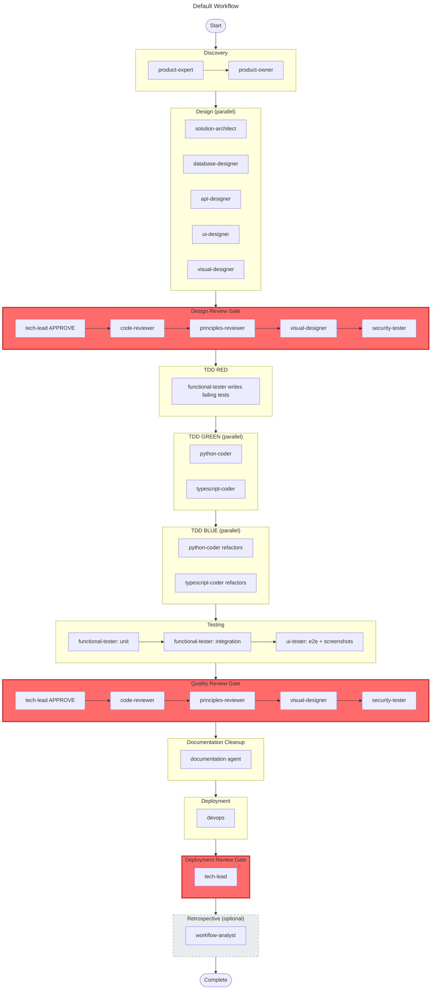

# Hive Mind: Framework Reference

**Document Status**: Draft
**Version**: 0.1
**Last Updated**: 13 April 2026
**Word Count**: ~6,500 words
**Reading Time**: ~28 minutes
**Companion**: *Hive Mind: Designing an Orchestration Framework for Multi-Agent Software Delivery* (`context/docs/agentic-framework.md`)

---

## Table of Contents

1. [How To Use This Reference](#how-to-use-this-reference)
2. [Framework Topology](#framework-topology)
3. [Source of Truth Hierarchy](#source-of-truth-hierarchy)
4. [Root-Level Framework Files](#root-level-framework-files)
5. [Standards](#standards)
6. [Rules](#rules)
7. [Agents](#agents)
8. [Workflows](#workflows)
   - [The Default Workflow](#the-default-workflow)
   - [The Prototype Workflow](#the-prototype-workflow)
   - [Other Workflows](#other-workflows)
9. [Orchestration Patterns](#orchestration-patterns)
10. [Templates](#templates)
11. [Writing Personas](#writing-personas)
12. [Scripts and Automation](#scripts-and-automation)
13. [Portability and Framework Adapters](#portability-and-framework-adapters)
14. [Measuring Effectiveness](#measuring-effectiveness)
15. [How the Parts Connect](#how-the-parts-connect)
16. [Design Themes](#design-themes)
17. [Reading Paths](#reading-paths)

---

## How To Use This Reference

The companion technical paper explains why the framework exists and the design principles behind it. This reference explains what the framework contains and how each part works. It is structured so that either document can be read first, or independently.

Use this document when you need to answer questions such as:

- What is this directory for?
- How does rule injection work at spawn time?
- What does the default workflow look like phase by phase?
- How would I port an agent definition to a different orchestration system?
- How do I measure whether the framework is working?

Each section covers one structural area of the framework: what it contains, how it operates, and where to make changes.

---

## Framework Topology

The framework is organised as a layered directory structure inside `context/`. The layers are ordered below by how frequently each is accessed during execution. Layers that touch every agent spawn sit at the top; layers consulted once per task or occasionally sit at the bottom.

| Layer | Location | Responsibility | Access Frequency |
|-------|----------|---------------|-----------------|
| Rules | `context/rules/` | State *what must happen*: short, binary, injectable constraints | Every agent spawn |
| Agents | `context/agents/` | Define *who*: specialised roles with frontmatter linking rules and standards | Every agent spawn |
| Templates | `context/templates/` | Define *what shape*: standardised formats for reviews, tasks, handoffs, design docs | Every output |
| Standards | `context/standards/` | Explain *why* and *how*: engineering rationale for coding, testing, security, documentation | On demand |
| Scripts | `context/scripts/` | Enforce *everything above*: validators, generators, git hooks | Every commit |
| Workflows | `context/workflows/` | Define *when*: phase order, dependencies, gates, outputs, recovery | Once per task |
| Docs | `context/docs/` | Provide *further reading*: design rationale, strategic context, orchestration patterns, workflow guides | Human reference |
| Personas | `context/persona/` | Provide *voice*: writing style for human-facing content only | Content workflows only |

The layering determines where changes should be made. To change what agents do, edit a workflow. To change how they do it, edit a standard or rule. To change who does it, edit an agent definition. To change what the output looks like, edit a template. Nothing bleeds across boundaries unless explicitly designed to.

The design pattern is consistent throughout:

- **define** the role or rule
- **explain** how to use it
- **standardise** the output
- **validate** the result

---

## Source of Truth Hierarchy

Not all framework files carry equal authority. Some define behaviour; others project or summarise it.

| Tier | Examples | Role |
|------|----------|------|
| **Authoritative source** | `context/agents/*.md`, `context/workflows/*.yaml`, `context/rules/*.mdc`, `context/standards/*.md`, `context/templates/*.md`, `context/persona/*.md` | These define how the framework behaves. Edit these to change it. |
| **Derived projection** | `AGENTS.md`, `CLAUDE.md` | These surface framework information in runtime-friendly form. Never hand-edit; regenerate from source. |
| **Operator guidance** | `context/docs/*.md`, `README.md` | These explain how to use, extend, or evaluate the framework. |
| **Enforcement** | `context/scripts/validators/*`, `context/scripts/prepare-commit-msg.*` | These keep the repository aligned with the design. |

The principle: change the authoritative source, let derived projections follow. Contributors should be able to look at any file and know whether it is the right place to make a change or whether the real change needs to happen upstream.

---

## Root-Level Framework Files

### `AGENTS.md`

Auto-generated registry of workflows and agents. It acts as the root-level entry point for agent runtimes and humans. The generator script (`context/scripts/generators/generate_agents_md.py`) reads every workflow YAML and every agent definition, then produces `AGENTS.md` as a single derived file containing the phase sequence, agent dispatch rules, spawn patterns, and state recovery procedures. If an agent definition references a rule that does not exist, or a workflow references an agent with no definition, the mismatch surfaces at generation time rather than at runtime.

Editing `AGENTS.md` by hand is always wrong. Edit the sources and regenerate.

### `CLAUDE.md`

Root agent guidance surfaced to the runtime. In this repository it points to `AGENTS.md`, making the generated registry the durable entry point instead of duplicating framework detail in multiple places.

### `README.md`

Repository-level onboarding and setup document. It complements `context/README.md`: the root README explains the repository; `context/README.md` explains the framework. This split keeps newcomer setup instructions close to the repository root whilst leaving framework theory in the portable context package.

---

## Standards

Standards are detailed reference material stored in `context/standards/`. They are intentionally longer and more explanatory than rules. An agent consults a standard when it needs deeper guidance than a rule provides: the reasoning behind a technology choice, the criteria for a good handoff, the philosophy behind the testing approach.

### How Standards Are Used

Each agent definition lists the standards it depends on in its frontmatter. When the orchestrator spawns an agent, it includes the standard references in the spawn prompt. The agent reads the relevant standards before starting work. Standards are loaded on demand rather than injected wholesale, because a single standard can run to 2,000-5,000 tokens and loading all of them would overwhelm the context window.

### The Rules-Standards Split

Rules and standards serve different purposes, and the separation is the framework's most consequential structural decision.

**Rules** are under 200 tokens each. They state what must happen: "use `uv run pytest`, not bare `pytest`"; "agents do not commit; the orchestrator commits on their behalf." They are designed for repeated injection into spawn prompts without significant context window cost. A typical agent spawn injects 5-8 rules at ~100-200 tokens each, plus the agent definition at ~500-1,000 tokens, totalling roughly 1,500-2,500 tokens of framework overhead.

**Standards** run to hundreds of lines. They explain *why* the framework uses `uv`, how TDD phases relate to each other, what constitutes a good handoff, and when to escalate versus assume.

An agent executing a straightforward Python task needs the 15-token rule that says "run tests with `uv run pytest`." A reviewer evaluating whether the tests are sufficient needs the full testing standard. The framework serves both without forcing either to carry the other's weight.

### Standards Catalogue

#### Foundational

| Standard | Purpose |
|----------|---------|
| `agent-standards.md` | Defines how agents should behave, recover state, use tools, and coordinate. The behavioural contract around agents, not just their roles. |
| `context-framework.md` | The framework's theory of context: reference vs actionable context, priority, handoff format, terse formats, and context quality. A foundational design text. |
| `workflow-standards.md` | Shared workflow conventions, invocation practices, and orchestration rules. The operating model that spans multiple workflow YAML files. |

#### Technical

| Standard | Purpose |
|----------|---------|
| `coding-standards.md` | Language and implementation guidance for code quality. Patterns, error handling, naming. |
| `tech-standards.md` | Primary technology stack reference. Tools, libraries, deployment targets, environment setup. |
| `testing-standards.md` | Testing philosophy and practice, including TDD expectations, coverage requirements, and phase-based thresholds. |
| `security-standards.md` | Security guidance for design, implementation, and review. |
| `tech-mobile-standards.md` | Mobile-specific technical guidance, separated to avoid bloating the main technology standard. |

#### Quality and Documentation

| Standard | Purpose |
|----------|---------|
| `doc-standards.md` | Documentation structure, quality, archival, diagram, and maintenance guidance. |
| `build-standards.md` | How build-phase work should be structured and assessed. |
| `visual-standards.md` | Guidance for design consistency, UI quality, and visual review concerns. |
| `12-factor-principles.md` | Maps framework work onto twelve-factor application principles. |
| `LESS-Engineering-Principles.md` | Captures the LESS principles used by review agents and design discussions. |

---

## Rules

Rules are short, enforceable constraints stored in `context/rules/` as `.mdc` files. Each rule addresses a real failure mode: something that breaks, drifts, or degrades if the rule is not followed. They are designed for injection into agent prompts and for validator-backed enforcement.

### How Rules Work

Each rule file has YAML frontmatter with three fields:

```yaml
---
description: Python environment setup and command execution
globs: ["**/*.py", "**/pyproject.toml", "**/requirements.txt"]
alwaysApply: false
---
```

**`description`**: A short summary of what the rule covers.

**`globs`**: File patterns that determine when this rule applies. The orchestrator matches the task's files against these globs and injects only the rules whose patterns match.

**`alwaysApply`**: If `true`, the rule is injected into every agent spawn regardless of file scope.

The body of the rule is concise instruction text, typically structured as a table of correct vs incorrect usage, followed by a brief rationale. The entire rule stays under 200 tokens.

### Example: Python Environment Rule

```
| Action          | Correct               | Wrong                         |
|-----------------|-----------------------|-------------------------------|
| Run tests       | uv run pytest         | pytest                        |
| Install package | uv add package        | pip install package           |
| Run script      | uv run python script  | python script.py              |
```

The rationale section explains that bare `python` or `pytest` commands fail because no virtual environment is activated and dependencies are not available. `uv run` automatically uses the project's virtual environment, ensures dependencies are installed, and respects `.python-version`.

### Rules Catalogue

#### Environment and Tooling

| Rule | Purpose |
|------|---------|
| `python-environment.mdc` | Enforces `uv` for all Python commands |
| `typescript-environment.mdc` | Enforces `yarn` for package management, `yarn dlx` for one-off tools |
| `bash-environment.mdc` | Prevents unsafe or inconsistent shell usage; pushes work toward approved tools |
| `mermaid-environment.mdc` | Constrains Mermaid diagram syntax, layout direction, and node label conventions |
| `supabase.mdc` | Defines constraints around Supabase-related usage |

#### Quality and Process

| Rule | Purpose |
|------|---------|
| `tdd-workflow.mdc` | Enforces RED then GREEN then BLUE discipline |
| `quality-gates.mdc` | Encodes non-negotiable review and release criteria |
| `output-locations.mdc` | Keeps artefacts in the correct directories |
| `handoff-hygiene.mdc` | Enforces durable, useful handoffs |
| `escalation.mdc` | Defines when agents may assume, flag, or escalate |
| `git-commits.mdc` | Standardises commit structure and agent session metadata |
| `metrics-logging.mdc` | Constrains how workflow and performance signals are recorded |
| `no-ai-slop.mdc` | Eliminates AI-generated writing tics from persona-driven documentation |

#### Architecture, Design, and Safety

| Rule | Purpose |
|------|---------|
| `architecture-fidelity.mdc` | Prevents implementation drift from approved architecture |
| `visual-fidelity.mdc` | Prevents drift from approved UI and visual design |
| `ui-component-reuse.mdc` | Encourages reuse and discourages needless UI duplication |
| `type-safety.mdc` | Protects typed contracts and discourages unsafe shortcuts |
| `browser-automation.mdc` | Constrains browser-based test and automation behaviour |
| `secrets-management.mdc` | Prevents unsafe handling of secrets and credentials |

#### Language and Requirements Hygiene

| Rule | Purpose |
|------|---------|
| `british-english.mdc` | Enforces consistent spelling in framework outputs |
| `EARS-notation-requirements.mdc` | Enforces the chosen requirements notation |

### Writing New Rules

A candidate for a new rule should pass three tests:

1. **Is it binary?** Can you definitively say "followed" or "not followed"?
2. **Does it break things?** Not just a style preference; actual failures result from ignoring it.
3. **Is it actionable?** Can you give clear DO/DON'T commands?

If all three are true, create a rule in `rules/*.mdc` and keep it under 200 tokens. If the topic requires nuance, explanation, or judgement, it belongs in a standard, not a rule.

---

## Agents

Agent definitions are markdown files with YAML frontmatter and an instruction body, stored in `context/agents/`. They are the role catalogue of the framework: each file defines a single specialist with a bounded responsibility, a curated set of rules and standards, and clear instructions for how to execute its work.

### Agent Definition Format

Every agent follows this structure:

```yaml
---
name: python-coder
description: Writes production Python code with testing in mind.
model: sonnet
standards:
  - tech-standards.md
  - coding-standards.md
  - security-standards.md
  - doc-standards.md
rules:
  - python-environment.mdc
  - tdd-workflow.mdc
  - type-safety.mdc
  - git-commits.mdc
  # ... additional rules
---

You are an expert Python engineer. Your job is to write clean,
testable, production-grade Python code.

## Required Standards (Read First!)
1. context/standards/tech-standards.md
2. context/standards/coding-standards.md
...

## Workflow
1. Read standards
2. Read task context
3. Implement
4. Run tests
5. Write handoff
```

**`name`**: Identifier used in workflow YAML and spawn prompts.

**`description`**: Brief role summary. Helps the orchestrator select the right agent.

**`model`**: Recommended model tier (e.g. `opus`, `sonnet`, `haiku`). The orchestrator uses this as guidance, not a hard constraint.

**`standards`**: List of standard files the agent should read before starting work. These are loaded on demand, not injected automatically.

**`rules`**: List of rule files that apply to this agent's work. The orchestrator injects these into the spawn prompt.

The body below the frontmatter is the agent's system prompt: role definition, workflow steps, output expectations, and any role-specific constraints.

### How the Orchestrator Resolves an Agent

When spawning an agent, the orchestrator:

1. Reads the agent definition from `context/agents/{name}.md`
2. Extracts the `rules` list from frontmatter
3. Glob-matches the task's files against each rule's scope to confirm applicability
4. Injects the applicable rules into the spawn prompt alongside the agent's system prompt
5. Constrains the agent to a defined file scope so it cannot make changes outside its boundaries
6. Constructs the full prompt using the task prompt template (`context/templates/task-prompt-template.md`)

Agents do not commit to git. Only the orchestrator commits, one at a time, preventing ref-lock collisions when parallel agents finish simultaneously.

### The Agent Roster

The framework defines 18 specialised agents, organised by kind of judgement.

#### Core Coordinator

| Agent | Purpose |
|-------|---------|
| `orchestrator` | Coordinates the system, resolves rules, assigns file scope, validates phase outputs, manages quality gates |

#### Product and Discovery

| Agent | Purpose |
|-------|---------|
| `product-expert` | Elicits problem understanding and discovery insight from the user |
| `product-owner` | Turns clarified needs into structured requirements and stories |

#### Design

| Agent | Purpose |
|-------|---------|
| `solution-architect` | Designs architecture, boundaries, and data flow |
| `database-designer` | Designs schemas, relationships, and migrations |
| `api-designer` | Designs APIs and contract artefacts |
| `ui-designer` | Designs UI structure, component behaviour, and user flow |
| `visual-designer` | Produces visuals, mockups, and visual review input |

#### Implementation and Test

| Agent | Purpose |
|-------|---------|
| `python-coder` | Implements Python production work |
| `typescript-coder` | Implements TypeScript and frontend work |
| `functional-tester` | Writes and runs tests in the TDD flow |
| `ui-tester` | Executes browser-based UI verification |

#### Review and Governance

| Agent | Purpose |
|-------|---------|
| `tech-lead` | Acts as the principal architecture and quality gate reviewer |
| `code-reviewer` | Performs implementation-focused review for bugs, risks, and maintainability |
| `principles-reviewer` | Reviews designs and code against higher-level engineering principles |
| `security-tester` | Reviews for vulnerabilities and security risks |

#### Operations and Maintenance

| Agent | Purpose |
|-------|---------|
| `devops` | Handles deployment and infrastructure-related work |
| `documentation` | Cleans up, archives, and maintains human-facing documentation |
| `workflow-analyst` | Reviews process effectiveness and supports retrospectives |

### Creating a New Agent

1. Copy `context/agents/TEMPLATE.md`
2. Set `name`, `description`, `model` in frontmatter
3. List applicable `rules` and `standards` in frontmatter
4. Write a concise body with role definition, workflow steps, and output expectations
5. Add the agent to the appropriate workflow YAML phase
6. Regenerate `AGENTS.md`

---

## Workflows

Workflows are YAML files in `context/workflows/` that encode phase dependencies, agent assignments, quality gates, validation criteria, state recovery procedures, and execution rules. Storing orchestration logic in versionable YAML rather than ad hoc conversation makes it inspectable, diffable, reviewable, and recoverable after context compaction.

### The Default Workflow

**File**: `context/workflows/build.yaml` and `context/workflows/design.yaml`
**Pattern**: Full TDD with comprehensive reviews and testing
**Use for**: Production code, critical features, quality-focused development

The default workflow runs 14 phases through 3 quality gates using all 18 agents.

```
discovery → design → design-review (GATE) →
tdd-red → tdd-green → tdd-blue →
unit-test → integration-test → e2e-test →
quality-review (GATE) → docs-cleanup →
deployment → deployment-review (GATE) → retrospective (optional)
```



#### Phase-by-Phase Guide

**Discovery** (sequential): `product-expert` clarifies requirements through conversation, then `product-owner` formalises them into structured requirements and user stories. Outputs land in `artefacts/product/`.

**Design** (parallel): Five agents work simultaneously on architecture, database schema, API specification, UI structure, and visual design. This is the framework's primary use of the parallel swarm pattern. Outputs land in `artefacts/architecture/` and `artefacts/design/`.

**Design Review** (sequential gate): Five reviewers assess the design in order. The `tech-lead` must approve before subsequent reviewers begin. A "CHANGES REQUIRED" result returns the workflow to the design phase. This gate has two hard criteria: zero architecture blockers and zero design security issues.

**TDD RED** (single agent): `functional-tester` writes tests that define the intended behaviour. All tests must fail when first run. This is the contract that implementation will satisfy.

**TDD GREEN** (parallel): `python-coder` and `typescript-coder` implement code to make the failing tests pass. They work simultaneously against the shared test suite. No test modifications are allowed during this phase; coders make the tests pass, not the other way around.

**TDD BLUE** (parallel): The same two coders refactor the implementation for quality: remove duplication, improve naming, simplify logic. Tests must still pass at 100%. No new functionality is added.

**Testing** (sequential): Unit tests verify coverage (target: 95%), integration tests verify API contracts and service interactions, and UI end-to-end tests verify complete user workflows with browser screenshots.

**Quality Review** (sequential gate): The same five reviewers as the design review, but now assessing the implementation. Hard criteria: 95% test coverage, zero critical security issues, at least one UI screenshot, and visual regression pass.

**Documentation Cleanup** (single agent): `documentation` updates README files, API documentation, and archives superseded artefacts.

**Deployment** (single agent): `devops` deploys to staging and prepares production deployment.

**Deployment Review** (gate): `tech-lead` reviews the deployment, confirms monitoring is configured, and verifies the rollback plan. Coverage threshold rises to 97% at this gate.

**Retrospective** (optional): `workflow-analyst` analyses the workflow cycle for bottlenecks and efficiency improvements.

#### Quality Gates Summary

| Gate | Phase | Key Thresholds |
|------|-------|---------------|
| Design Review | After design | 0 architecture blockers, 0 design security issues |
| Quality Review | After testing | 95% coverage, 0 critical issues, 1+ screenshot |
| Deployment Review | Before production | 97% coverage, deployment verified, rollback tested |

#### When to Use the Default Workflow

Use it for production features, quality-critical work, and anything that will be maintained long-term. Expect 2-3 days for a typical feature.

Do not use it for prototyping, experiments, or throwaway code. Use the prototype workflow instead.

### The Prototype Workflow

**File**: `context/workflows/prototype.yaml`
**Pattern**: Fast iteration without quality gates
**Use for**: POCs, experiments, spikes, throwaway code

The prototype workflow trades rigour for speed: 4 phases, no quality gates, 5 agents.

```
quick-plan → sketch-design → build → validate (optional)
```


#### Prototype Rules

- Speed over quality. Technical debt is acceptable.
- No formal reviews, no coverage requirements, no security audits.
- Tests are optional; smoke tests covering the happy path are sufficient.
- Hard-coded values, skipped error handling, and incomplete documentation are all acceptable.
- Mark code clearly as prototype.

#### Migrating Prototype to Production

If a prototype validates its hypothesis and should become production code:

1. Archive the prototype on a separate branch
2. Extract learnings: document what worked and what did not
3. Start fresh with the default workflow
4. Do not copy-paste prototype code; rewrite with TDD from the beginning

Cleaning up a prototype takes longer than rewriting it properly. The technical debt in prototype code is architectural, not superficial.

### Other Workflows

| Workflow | Purpose | Typical Duration |
|----------|---------|-----------------|
| `bugfix.yaml` | Reproduce, diagnose, fix, and verify defects. Empirical evidence pattern rather than feature-development pattern. | Hours |
| `deploy.yaml` | GCP cloud deployment after local verification. | 1-2 hours |
| `full-test.yaml` | Complete regression across all modules. Separated from targeted testing to distinguish changed-scope verification from release-confidence testing. | 1-2 hours |
| `content.yaml` | Human-facing written content using writing personas. Different outputs and style requirements from code work. | 2-4 hours |
| `continuous-improvement.yaml` | Incident response (reactive) and retrospective analysis (proactive). The framework's mechanism for evolving itself. | Variable |
| `retrospective.yaml` | Process review and pattern identification. Modelled directly rather than folded into informal meetings. | 1-2 hours |

---

## Orchestration Patterns

The framework documents five coordination patterns, from simple to complex. Production workflows combine them.

### Single Agent

One specialist, one task, no dependencies. Use for isolated tasks with clear requirements: fix a specific bug, add a simple feature, write documentation.

### Sequential Chain

Agents in strict order, each depending on the previous output. Use for tasks with clear dependencies and quality gates: design then implement then review.

### Parallel Swarm

Independent agents running simultaneously with no shared state. Use when tasks are truly independent and can be merged later: the design phase runs five agents in parallel. Token cost is higher (context duplicated across agents) but execution is 40-50% faster.

### Hive

Parallel agents sharing artefacts (tests, API specs, schemas) with coordination points before and after the parallel execution. Use when agents work simultaneously but need shared contracts: the TDD GREEN phase runs `python-coder` and `typescript-coder` in parallel against the same test suite. The hive pattern is the most complex to manage and where explicit orchestration adds the most value.

### Iterative Loop

Review-fix cycles until approval. Use at quality gates where output may be rejected: design review may require architectural changes before approval.

### Pattern Comparison

| Pattern | Speed | Token Cost | Coordination | Example Use |
|---------|-------|------------|--------------|-------------|
| Single | Fast | Low | None | Bug fix, documentation |
| Sequential | Slow | Low | Linear | TDD phases, review gates |
| Parallel Swarm | Fastest | High | None | Design phase |
| Hive | Fast | High | Shared artefacts | Parallel coders with shared tests |
| Iterative | Varies | Medium | Approval loops | Quality gates |

### How the Default Workflow Uses Patterns

- **Discovery**: Sequential chain (product-expert then product-owner)
- **Design**: Parallel swarm (five designers, independent)
- **Design review**: Sequential chain with iterative loop (five reviewers; may reject back to design)
- **TDD RED**: Single agent (functional-tester)
- **TDD GREEN / BLUE**: Hive (parallel coders, shared test suite)
- **Testing**: Sequential chain (unit then integration then e2e)
- **Quality review**: Sequential chain with iterative loop
- **Deployment**: Sequential chain (deploy then review)

### Choosing a Pattern

1. Single isolated task? **Single Agent.**
2. Tasks can run independently? **Parallel Swarm.**
3. Tasks share artefacts (tests, schemas)? **Hive.**
4. Tasks have sequential dependencies? **Sequential Chain.**
5. Output needs iterative refinement? **Iterative Loop.**

### Token Optimisation

Parallel execution increases token usage because context is duplicated across agents. Three agents running in parallel typically cost ~20% more tokens than the same three agents running sequentially.

Prefer parallel execution when time is critical, tasks are large (overhead is a small percentage of the total), or agents have different contexts (minimal duplication). Prefer sequential execution when the token budget is tight, tasks are small (overhead dominates), or context is large and identical across agents.

---

## Templates

Templates are stored in `context/templates/` and define standard output shapes for recurring artefacts. The orchestrator selects the appropriate template when constructing a task prompt; the producing agent uses it to structure its output.

### Why Templates Exist

Standardised shapes reduce ambiguity for both writers and readers. When every review follows the same structure, or every handoff includes the same fields, downstream agents and humans can consume the output predictably. Automation becomes reliable when the shape is known in advance.

### Available Templates

| Template | Purpose |
|----------|---------|
| `agent-template.md` | Starting point for creating a new specialised agent |
| `architecture-template.md` | Standard structure for system architecture documents |
| `bugs-template.md` | Standard bug tracker format |
| `commit-message-template.md` | Standard commit message structure with agent session metadata |
| `design-template.md` | Standard design document for complex features or screens |
| `domain-rules-template.yaml` | Template for domain-specific constraints |
| `handoff-template.md` | Standard agent handoff format |
| `pr-description-template.md` | Standard pull request description format |
| `requirements-template.md` | Standard requirements structure |
| `review-template.md` | Standard review finding format |
| `task-prompt-template.md` | Orchestrator prompt scaffold for spawning agents correctly |
| `tasks-template.md` | Standard task tracking format |
| `test-dashboard-template.md` | Standard structure for test dashboards |
| `user-stories-template.md` | Standard user story format |

The task prompt template deserves particular attention. It carries rule resolution and file-scope discipline into subagent execution. When the orchestrator spawns an agent, the task prompt template ensures the agent receives its definition file path, resolved rules, immediate context, file scope constraints, and escalation instructions in a consistent structure.

---

## Writing Personas

Personas are stored in `context/persona/` and provide voice guidance for human-facing content. They are used by the `documentation` agent when writing blogs, technical papers, user guides, and marketing materials. They are explicitly *not* used for technical handoffs, API documentation, architecture documents, or internal artefacts.

### When to Use a Persona

**Use a persona for**: blog posts, articles, thought leadership, technical papers, user-facing guides for non-technical audiences, marketing materials, conference talks.

**Do not use a persona for**: technical handoffs (README, HANDOFF.md, build notes), API documentation, code references, architecture documents, design specifications, internal artefacts (requirements, tasks, review reports), code comments, error messages.

### Available Personas

#### Technical Writer

**File**: `context/persona/technical-writer.md`
**Character**: Amara Osei. Eight years at Stripe documenting payment APIs, four years at Hashicorp writing infrastructure guides.
**Use for**: Technical guides, framework documentation, practitioner reference material.

Key traits: leads with the problem, not a hook. Explains the mechanism step by step. Working examples with inputs and outputs. Names trade-offs and costs directly. Structured for reference use with scannable headings and front-loaded information. No filler.

#### Opinionated Blogger

**File**: `context/persona/opinionated-blogger.md`
**Character**: Dr. Sarah Chen. PhD from MIT, 10 years as principal engineer at Google.
**Use for**: Blog posts, opinion pieces, thought leadership.

Key traits: provocative opening hooks. Conversational with contractions and parenthetical asides. Personal anecdotes as entry points. Self-deprecating honesty. Question-driven framing. Memorable one-liners. Short paragraphs, 2-4 minute read times.

#### Editor

**File**: `context/persona/editor.md`
**Use for**: Refining and polishing existing content. Checking voice consistency, removing AI slop, verifying British English.

#### Expert Reviewer

**File**: `context/persona/expert-reviewer.md`
**Use for**: Reviewing technical accuracy and completeness of human-facing content.

### Selecting a Persona

The selection depends on audience and content type:

- Writing a practitioner guide with code examples? **Technical writer.**
- Writing a blog post or opinion piece? **Opinionated blogger.**
- Writing for a non-technical audience about high-level concepts? **Opinionated blogger.**
- Writing implementation details for developers? **Technical writer.**
- Polishing an existing draft? **Editor.**
- Checking technical claims? **Expert reviewer.**

All personas use British English throughout (colour, optimise, behaviour, whilst, programme, organisation).

---

## Scripts and Automation

Scripts are stored in `context/scripts/` and form the automation layer that turns the framework from a collection of ideas into an operating system with enforcement.

### Generators

**`generators/generate_agents_md.py`**: Reads every workflow YAML and every agent definition, then produces the derived `AGENTS.md` registry. This is the framework's primary generation pipeline. Run it after changing any workflow or agent definition:

```bash
uv run python context/scripts/generators/generate_agents_md.py
```

The generator is also an enforcement point. If an agent definition references a non-existent rule, or a workflow references an agent with no definition, the mismatch surfaces at generation time.

### Validators

Validators are pre-commit hooks stored in `context/scripts/validators/`. Each validator enforces one or more rules at commit time.

| Validator | What It Checks |
|-----------|---------------|
| `conventional_commits.py` | Commit message format matches the conventional commits specification |
| `british_english.py` | British English spelling conventions in framework outputs |
| `ears_notation.py` | EARS requirements notation in requirements documents |
| `design_system.py` | Design system compliance |
| `metrics_logging.py` | Workflow or session metrics logging format |
| `supabase_boundary.py` | Supabase boundary constraints |

A rule without a validator is a suggestion. A rule with a validator is enforceable. Not every rule has automated enforcement yet; validator coverage is expanding.

### Agent Definition Validator

**`validate_agent_definitions.py`**: Validates structural integrity of agent definitions: frontmatter completeness, required sections, path conventions. Run to check that agent files conform to the expected format.

### Git Hooks

**`prepare-commit-msg.py`** and **`prepare-commit-msg.sh`**: A git hook that injects agent session telemetry into commit messages. Token usage, duration, and interaction count are recorded in commit trailers, making session metrics reconstructable from `git log` without a separate metrics database.

### Tests

The scripts directory includes its own test suite in `context/scripts/tests/`. Tests cover validators, generators, and agent definition validation using positive and negative fixture files in `tests/fixtures/`.

---

## Portability and Framework Adapters

The framework is designed to survive changes in agent runtime or orchestration platform. Agent definitions are markdown files. Workflows are YAML. The core logic lives in the system prompt body, which is framework-agnostic. The frontmatter carries runtime-specific metadata (tool names, model tiers) that adapts to each platform.

### Agent Definition Portability

The frontmatter lists Claude Code-specific tool names in `allowed_tools`, but the body of the agent definition (role, workflow, constraints) works across any system that can inject a system prompt. Porting an agent to a new platform requires mapping the tools; the prompt itself travels unchanged.

### Adapter Examples

#### LangGraph

Load the agent markdown as a node system message, parse frontmatter for tool bindings:

```python
from langgraph.graph import StateGraph
from pathlib import Path

def load_agent(name: str) -> str:
    return Path(f"context/agents/{name}.md").read_text()

def python_coder_node(state):
    agent_prompt = load_agent("python-coder")
    task_prompt = f"{agent_prompt}\n\n## Task\n\n{state['task']}"
    response = llm.invoke(task_prompt)
    return {"output": response}

workflow = StateGraph(State)
workflow.add_node("python-coder", python_coder_node)
```

#### CrewAI

Load agent markdown as backstory, map tools to CrewAI equivalents:

```python
from crewai import Agent, Task, Crew

python_coder = Agent(
    role="Python Developer",
    goal="Write clean, tested Python code following standards",
    backstory=load_agent("python-coder"),
    tools=[WriteFileTool(), EditFileTool(), ReadFileTool()],
)

task = Task(
    description="Implement user authentication with FastAPI",
    agent=python_coder,
    expected_output="Working auth endpoints with tests"
)

crew = Crew(agents=[python_coder], tasks=[task])
```

#### AutoGen

Load agent markdown as system_message:

```python
from autogen import AssistantAgent

python_coder = AssistantAgent(
    name="python_coder",
    system_message=load_agent("python-coder"),
    llm_config={"model": "gpt-4", "functions": [write_file, edit_file]}
)
```

#### IDE-Based Systems (Cursor, Windsurf, Aider, Continue)

These are typically single-agent systems. Copy the agent definition to the IDE's context file:

```bash
# Cursor
cp context/agents/python-coder.md .cursor/rules/python-coder.md

# Windsurf
cp context/agents/python-coder.md .windsurfrules

# Aider (load as additional context)
aider --read context/agents/python-coder.md \
      --read context/standards/tech-standards.md
```

### Tool Mapping Reference

| Claude Code Tool | LangGraph | CrewAI | AutoGen | IDE-Based |
|-----------------|-----------|--------|---------|-----------|
| Write | `write_file()` | `FileWriterTool()` | `write_file()` func | Built-in |
| Edit | `edit_file()` | `FileWriterTool()` | `edit_file()` func | Built-in |
| Read | `read_file()` | `FileReadTool()` | `read_file()` func | Built-in |
| Glob | `glob.glob()` | `DirectorySearchTool()` | `glob()` func | Built-in |
| Grep | `grep_content()` | `FileSearchTool()` | `grep()` func | Built-in |
| Bash | `subprocess.run()` | `ShellTool()` | `execute_code()` | Built-in |

### Handling Frontmatter

Most frameworks do not parse YAML frontmatter automatically. Two approaches:

**Strip frontmatter** for frameworks that only need the system prompt:

```python
def load_prompt_only(name: str) -> str:
    content = Path(f"context/agents/{name}.md").read_text()
    parts = content.split("---")
    return "---".join(parts[2:]) if len(parts) > 2 else content
```

**Parse frontmatter** for frameworks that can use the metadata (model choice, tool list, rule references):

```python
import yaml

def load_with_metadata(name: str):
    content = Path(f"context/agents/{name}.md").read_text()
    parts = content.split("---")
    metadata = yaml.safe_load(parts[1]) if len(parts) > 2 else {}
    prompt = "---".join(parts[2:]) if len(parts) > 2 else content
    return {"prompt": prompt, "metadata": metadata}
```

---

## Measuring Effectiveness

The `workflow-analyst` agent measures and improves the development workflow by analysing completed work cycles for efficiency, bottlenecks, and improvement opportunities.

### When to Measure

**After deployment** (recommended): Full cycle data is available. Run a complete analysis to identify what worked and what stalled.

**Mid-cycle health check**: During development, to catch bottlenecks early before they compound.

**Quarterly trend analysis**: Compare metrics across multiple cycles to track whether the framework is improving or degrading.

**Troubleshooting**: When the workflow feels inefficient, run a focused analysis on the symptomatic area.

### Data Sources

The analyst draws on four categories of evidence:

**Task files** (`artefacts/build/tasks.md`): Task count, completion time, blocked tasks, rework frequency.

**Handoff files** (`HANDOFF.md`, `artefacts/shared/handoffs/`): Handoff completeness, clarity, and timing.

**Git history**: Commit frequency per phase, commit message quality, agent session telemetry, rework commits (fixes to previous work).

**Conversation flow**: Agent spawning patterns, tool usage compliance, user interruptions, token distribution.

### Key Metrics

**Efficiency**: Cycle duration (total time from discovery to deployment), task velocity (tasks completed per day), first-time pass rate (percentage of tasks passing review first time), token efficiency (actual vs estimated token usage).

**Quality**: Rework rate (percentage of tasks requiring rework), standards adherence rate (percentage of prompts following protocols), test coverage (actual vs target).

**Health Score**: An aggregate score from 0-100, weighted across phase duration vs targets (30%), review rejection rate (20%), handoff quality (20%), tool usage efficiency (15%), and rework rate (15%).

| Score | Assessment | Action |
|-------|------------|--------|
| 90-100 | Excellent | Maintain current practices |
| 70-89 | Good | Minor optimisations |
| 50-69 | Fair | Address top 3 bottlenecks |
| Below 50 | Poor | Major process improvements required |

### Common Bottleneck Patterns

**Long integration testing**: Missing mock fixtures or slow database setup. Create reusable test data in `artefacts/shared/fixtures/`.

**Multiple review rejections**: Design phase skipped critical considerations. Run a lightweight review (tech-lead only) after design before the full gate.

**Coverage gaps at deployment**: Tests added after implementation rather than during TDD BLUE. Add tests during the refactor phase, verify 97% before quality review.

**Agent tool misuse**: Frequent permission prompts, slow execution. Agents using bash for file operations instead of Write/Edit tools. Enhance agent prompts with explicit tool requirements.

**Parallel execution overhead**: Context duplication and coordination overhead exceed time savings. Use parallel execution only for genuinely independent work.

### Output

The primary report lands at `artefacts/build/efficiency-report.md` with an executive summary, detailed metrics, bottleneck analysis, recommendations, and trend comparison. Raw data for custom analysis and dashboards lands at `artefacts/build/efficiency-data/`.

---

## How the Parts Connect

### Agents Read Rules and Standards

Agent files point to the rules and standards they depend on via frontmatter. The orchestrator resolves these references at spawn time, injecting rules and pointing the agent to the relevant standards. This keeps prompts small and composable: the agent definition is the single source of truth for what each specialist needs.

### Workflows Sequence Agents

Workflow YAML does not replace agent definitions; it arranges them. The design separates role definition (who does what and how) from phase sequencing (when they do it and in what order). This means the same agent can appear in multiple workflows with different sequencing.

### Templates Shape Outputs

Templates are chosen by the orchestrator and used by producing agents. Output conventions are an explicit part of orchestration rather than an afterthought. When an agent produces a review, a handoff, or a set of requirements, the template defines what "complete" looks like.

### Scripts Enforce the Model

Without validators, generators, and hooks, the framework would rely on memory and goodwill. The scripts directory turns expectations into checks: validators catch rule violations at commit time, generators keep derived files in sync with authoritative sources, and hooks record session telemetry automatically.

### Recovery is Built In

Every workflow YAML includes a `state_recovery` section listing the files an orchestrator should read to reconstruct its position after context compaction. Every agent handoff writes durable state to disk. The `HANDOFF.md` file records the active phase *before* agents are spawned, not after they report back, ensuring the phase survives even if compaction occurs during execution.

---

## Design Themes

Five themes repeat across the framework's structure.

**Explicitness over convention.** Phases, gates, file locations, role boundaries, and recovery steps are written down instead of implied. Where context is ambiguous, agents escalate rather than assume.

**Durability over chat memory.** The framework assumes interruptions and context loss will happen, so it records state in artefacts, handoffs, and workflow files. Disk is durable; conversations are ephemeral.

**Reuse over reinvention.** Templates, standard agent definitions, and generated registries make the next task cheaper and more predictable than the last.

**Portability over tool lock-in.** The framework is designed to survive changes in agent runtime or orchestration platform. Markdown agents, YAML workflows, and adapter guidance keep the core assets independent of any single tool.

**Verification over trust.** Reviewers, validators, tests, screenshots, gates, and telemetry all reinforce the same idea: outputs should be evidenced, not merely claimed.

---

## Reading Paths

### Extending the Framework

1. `context/README.md`
2. `context/agents/orchestrator.md`
3. `context/workflows/build.yaml` and `context/workflows/design.yaml`
4. `context/templates/task-prompt-template.md`
5. Relevant rules and standards

### Adding a New Agent

1. `context/agents/README.md`
2. `context/templates/agent-template.md`
3. `context/agents/orchestrator.md`
4. The workflow where the new agent should appear

### Porting the Framework to Another Runtime

1. `README.md`
2. `context/README.md`
3. [Portability and Framework Adapters](#portability-and-framework-adapters) (this document)
4. `AGENTS.md`

### Understanding Quality Enforcement

1. `context/rules/`
2. `context/workflows/`
3. `context/scripts/validators/`
4. `context/standards/testing-standards.md`
5. `context/standards/doc-standards.md`

### Running a Default Workflow

1. [The Default Workflow](#the-default-workflow) (this document)
2. `context/workflows/build.yaml` and `context/workflows/design.yaml`
3. `context/agents/orchestrator.md`
4. [Orchestration Patterns](#orchestration-patterns) (this document)

### Evaluating Workflow Health

1. [Measuring Effectiveness](#measuring-effectiveness) (this document)
2. `context/agents/workflow-analyst.md`
3. `context/standards/workflow-standards.md`
