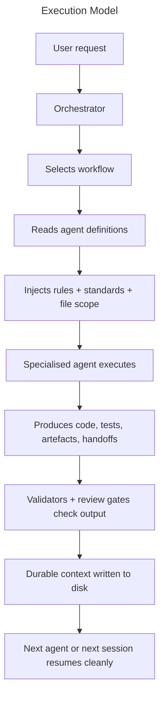

# Hive Mind: Designing an Orchestration Framework for Multi-Agent Software Delivery

**Document Status**: Draft  
**Version**: 0.3.0  
**Last Updated**: 10 September 2026  
**Word Count**: ~3,500 words  
**Reading Time**: ~15 minutes

**Companion**: *Hive Mind: Framework Reference* (`context/docs/agentic-framework-reference.md`)

---

## Solving The Coordination Problem

Getting an LLM to write a function is table stakes in 2026. Getting *nineteen* of them to build a system together without losing their context is not.

Without deliberate coordination, multi-agent workflows break in familiar ways. Agents do not know what the previous agent did so risk redoing work that has already been done. And it's done slightly differently, because each agent makes slightly different judgements. Reviewers lack a consistent standard to check against. Testers write tests against the code as-built rather than the intended interface, ossifying bugs into the test suite. Sessions compact mid-sprint, systemising forgetfulness. The symptoms look unpredictable, a different thing going wrong each time. But the outcome is the same: wasted effort, no consistency, incorrect assumptions, and no mechanism to prevent any of it. These are coordination problems, and they require coordination solutions.

This document describes a framework designed to solve them. It is structured as a portable `context/` directory that encodes who does work, how work should be done, when work happens, what gets produced, and how quality is maintained. The patterns it applies (specialisation, explicit orchestration, durable context, verification over assertion) draw on established practices in distributed systems engineering and software delivery, adapted here for multi-agent coordination.

---

## Scope

This is an **orchestration framework**, not an application architecture. It does not prescribe how to structure FastAPI routes or React components. It prescribes how AI agents should coordinate whilst building them.

It answers five questions:

- **Who** does work? Specialised agent definitions.
- **How** should work be done? Standards and rules.
- **When** does work happen? Workflow phase definitions.
- **What** gets produced? Templates and output conventions.
- **How is quality maintained?** Review gates, tests, and validators.

---

## Design Principles

Three strategic ideas shape every structural decision: if it matters, it should be code (everything as code); humans govern the verification systems rather than reviewing every line (humans above the loop); and the binding constraint keeps moving, so the framework must move with it (elevate the next constraint). The principles below are the framework's specific expression of those ideas.

**Everything important is code.** Specifications, rules, agent definitions, workflows, templates, and handoffs are all versioned artefacts in the repository. The `context/` directory is the codified operating model. If knowledge is not committed and governed, it drifts, and drifted context degrades agent output more reliably than a weak model does.

**Optimise for Autonomy, Tokenomics, and Intent Preservation.** These three Non-Functional Requirements (NFRs) replace the legacy iron triangle of Time, Cost, and Scope. Autonomy measures how long an agentic system can run without human intervention. Tokenomics measures the fully loaded cost of verifying output, not just generating it. Intent Preservation ensures human design intent survives delegation and context compaction. The framework's operating triangle balances these three axes.

**Context durability has higher leverage than code quality.** Code quality is downstream of context quality. An agent that receives a clear handoff, a focused task, and the correct rules will produce better code than a capable agent operating blind. The critical path is usually context plus workflow, not model capability; a better model with poor context loses to a weaker model with strong context. The framework treats documentation, tasks, and handoffs as first-class deliverables, not optional support material.

**Policy and explanation serve different purposes.** Rules are short, binary, and cheap to inject into agent prompts. Standards are rich, contextual, and expensive to load. Merging them would force a choice between token-efficient prompts and comprehensive reference material. Separating them serves both needs without compromise. (The token cost analysis appears in [The Rules-Standards Split](#the-rules-standards-split) below.)

**Specialist agents outperform generalists at the cost of coordination overhead.** A single large prompt that covers all responsibilities tends toward diluted output. Eighteen focused agents, each with a bounded responsibility, a curated rule set, and a defined workflow position, produce more reliable work and cleaner handoffs. The trade-off is real: 18 agents means 18 handoff boundaries and 18 prompt injections. For production-quality work, the improved output quality and accountability justify this cost.

**The orchestrator controls the blast radius.** The orchestrator selects the agent, constrains the files it may touch, injects only the relevant rules and standards, monitors progress, and sequences the commits. No agent has unconstrained access to the repository. This is why the framework defaults to a hive model rather than a swarm: specialist agents work within bounded scopes under centralised coordination, rather than exploring the problem space independently. The orchestrator carries the coordination cost so that individual agents remain focused and their impact remains contained.

**Coordination must be explicit.** Agents need context, not instructions. They do not attend stand-ups, read between the lines, or ask clarifying questions mid-task. Implicit coordination (relying on agents to infer the correct sequence, ownership boundaries, or quality bar) is where hidden coupling and inconsistent behaviour originate. The framework encodes dependencies, gates, file ownership, and parallel execution boundaries in workflow YAML. Where context is ambiguous, agent rules encourage escalation rather than assumption. What is not in the file is not in the process.

**Speed and rigour are sequenced, not opposed.** The New DevX workflow sequences four phases (Prototype, Specify, Build, Deploy), each with a different standard of rigour matched to its purpose. Not all work needs 18 agents and mandatory quality gates. `prototype.yaml` provides fast iteration with minimal agents and no gates, because exploration matters more than engineering discipline when prototyping. `build.yaml` provides the full TDD cycle with parallel specialists, review sequencing, and coverage gates, because production quality is non-negotiable for deployed code. The workflow determines the rigour.

**Humans govern above the loop.** TDD phases, coverage gates, browser screenshots, review agents, and pre-commit validators bias the framework toward outputs that can be checked rather than merely asserted. An agent reporting "all tests pass" is not evidence. A command's stdout showing green is. Human attention moves from reviewing every line to designing the verification systems, classifying risk, and intervening where automated checks are insufficient.

**The constraint keeps moving.** Accelerating code generation does not eliminate bottlenecks; it relocates them. The binding constraint will migrate from code to review, from review to deployment, from deployment to intent clarity. The operating model must follow the constraint, not defend a fixed process. The `continuous-improvement` workflow is the mechanism for this: in incident mode, failures are traced through a causal chain (symptom, mechanism, file, gap) to a fixable defect in the framework itself; in retrospective mode, commit telemetry, interruption logs, and incident patterns are parsed to surface recurring weaknesses in rules, standards, or templates. Both modes target the coordination and verification systems, not just the code those systems govern.

**Portability is a structural requirement.** Agent definitions are markdown files. Workflows are YAML. The framework includes deterministic adapter generators for Antigravity/Gemini, Claude Code, GitHub Copilot, and OpenAI/Codex. Illustrative guidance for LangGraph, CrewAI, AutoGen, and IDE-based systems is maintained in the reference document for runtimes without a built adapter. The design ensures that no single tool is a hard dependency. See `context/docs/agentic-framework-reference.md` (Portability and Framework Adapters) for cross-runtime integration guidance.

---

## The Layer Model

The framework is organised as a context hierarchy: a layered directory structure ordered below by how frequently each layer is accessed during execution. The layers that touch every agent spawn sit at the top; the layers consulted once per task or occasionally sit at the bottom.

| Layer | Location | Responsibility | Access frequency |
|-------|----------|---------------|-----------------|
| Rules | `context/rules/` | State *what must happen*: short, binary, injectable constraints | Every agent spawn: glob-matched and injected into the prompt |
| Agents | `context/agents/` | Define *who*: specialised roles with frontmatter linking rules and standards | Every agent spawn: orchestrator reads the definition to resolve rules, standards, and file scope |
| Templates | `context/templates/` | Define *what shape*: standardised formats for reviews, tasks, handoffs, design docs | Every output: agents consult templates when producing artefacts |
| Standards | `context/standards/` | Explain *why* and *how*: engineering rationale for coding, testing, security, documentation | On demand: agents load a standard when deeper reference is needed |
| Scripts | `context/scripts/` | Enforce *everything above*: validators, generators, git hooks | Every commit: pre-commit validators check output against rules |
| Workflows | `context/workflows/` | Define *when*: phase order, dependencies, gates, outputs, recovery | Once per task: orchestrator reads at the start to plan the work |
| Docs | `context/docs/` | Provide *further reading*: design rationale, strategic context, orchestration patterns, workflow guides, portability how-tos | Human reference: guides and design documents for contributors and operators, not consumed by agents |
| Personas | `context/persona/` | Provide *voice*: writing style for human-facing content only | Content workflows only: applied when writing human-facing material |

The layering determines where changes should be made. To change what agents do, edit a workflow. To change how they do it, edit a standard or rule. To change who does it, edit an agent definition. To change what the output looks like, edit a template. Nothing bleeds across boundaries unless explicitly designed to.

---

## Execution Model

1. The **orchestrator** selects a workflow based on the task type (e.g. `build.yaml` for feature work, `bugfix.yaml` for defect resolution).
2. The workflow defines the phase sequence: plan, then write failing tests, then implement, then refactor, then review.
3. For each phase, the orchestrator reads the agent definition, resolves which rules apply by glob-matching the task's files against each rule's scope, and injects them into the spawn prompt.
4. The agent executes within its assigned file scope. Agents do not commit; only the orchestrator commits, one at a time, preventing ref-lock collisions when parallel agents finish simultaneously.
5. Validators and review gates check the output against the workflow's validation criteria.
6. Handoffs, task updates, and generated registries record what happened, ensuring the next agent or next session can resume without reconstruction.

The core design decision: orchestration state lives on disk, not in a conversation. Conversations are ephemeral. Disk is durable.

---

## Source of Truth Hierarchy

Not all framework files carry equal authority. Some define behaviour; others project or summarise it. Editing the wrong tier is a common contributor mistake.

| Tier | Examples | Action |
|------|----------|--------|
| **Authoritative** | `context/workflows/*.yaml`, `context/agents/*.md`, `context/rules/*.mdc`, `context/standards/*.md`, `context/models.yaml` | Edit these to change framework behaviour |
| **Derived** | `AGENTS.md`, `CLAUDE.md`, `GEMINI.md`, `.agents/skills/`, `.github/prompts/`, `.openai/` | Read for orientation; never hand-edit. Regenerate from source. |
| **Operator guidance** | `context/docs/*.md`, `README.md`, this document | Use to understand and apply the framework |
| **Enforcement** | `context/scripts/validators/*`, `context/scripts/prepare-commit-msg.*` | Use to keep the repository aligned with the design |

The principle: change the authoritative source, let derived projections follow.

---

## The Rules-Standards Split

This is the most consequential design decision in the framework.

**Rules** are under 200 tokens each. Examples: "use `uv run pytest`, not bare `pytest`"; "agents do not commit; the orchestrator commits on their behalf." They are designed for repeated injection into spawn prompts without significant context window cost.

**Standards** run to hundreds of lines. They explain *why* the framework uses `uv`, how TDD phases relate to each other, what constitutes a good handoff, and when to escalate versus assume. They are reference material, consulted on demand.

The split is driven by the operating triangle: execution time, token cost, and autonomy horizon. Specifically the token cost axis. A typical agent spawn injects 5-8 rules at ~100-200 tokens each, plus the agent definition at ~500-1,000 tokens, totalling roughly 1,500-2,500 tokens of framework overhead. Loading a single full standard would add 2,000-5,000 tokens, doubling or tripling the injection cost for material the agent may not need. The split keeps the execution path lean and the reference path comprehensive.

An agent executing a simple Python task needs the 15-token rule that says "run tests with `uv run pytest`." A reviewer evaluating whether the tests are sufficient needs the full testing standard. The framework serves both without forcing either to carry the other's weight.

---

## The Agent Roster

The framework defines 19 specialised agents, organised by kind of judgement rather than technology alone:

- **Discovery**: `product-expert` (elicits requirements), `product-owner` (formalises them)
- **Design**: `solution-architect`, `database-designer`, `api-designer`, `ui-designer`
- **Implementation**: `python-coder`, `typescript-coder`
- **Testing**: `functional-tester` (TDD), `ui-tester` (browser automation)
- **Review**: `tech-lead` (the gate), `code-reviewer`, `principles-reviewer`, `security-tester`
- **Operations**: `devops`, `documentation`, `workflow-analyst`, `tokenomics-analyst`
- **Coordination**: `orchestrator`

Each agent's frontmatter declares which rules and standards it requires. The orchestrator resolves the applicable rules by matching file globs against the task scope, injecting only what is relevant.

This produces narrow, focused prompts with clear handoff boundaries. The roster is extensible: copy the agent template, fill in the frontmatter, add the agent to a workflow phase, and regenerate.

**Adapters are generated, not authored.** The `generate_adapters.py` CLI compiles all four native runtime projections (Antigravity/Gemini, Claude Code, GitHub Copilot, and OpenAI/Codex) from the same canonical sources in a single invocation, with smart change detection and per-target filtering. This is a unified CLI, not a single-file generator. It produces `AGENTS.md`, `CLAUDE.md`, `GEMINI.md`, and runtime-specific prompts and skills. The generator is a thin adapter; the sources are the portable asset. The generator is also the enforcement point for consistency. If an agent definition references a rule that does not exist, or a workflow references an agent that has no definition, the mismatch surfaces at generation time rather than at runtime. Editing derived projections by hand is always wrong; editing the sources and regenerating is the only valid path.

---

## Workflow Architecture

Workflows are YAML files encoding phase dependencies, agent assignments, quality gates, validation criteria, state recovery procedures, and execution rules. The framework ships nine:

| Workflow | Purpose |
|----------|---------|
| **design** | Discovery through design review; run before build |
| **build** | Primary TDD loop: plan, red, green, blue, review, regress, docs cleanup |
| **prototype** | Fast iteration, no quality gates; rewrite before production |
| **deploy** | GCP cloud deployment after local verification |
| **bugfix** | Empirical reproduction, diagnosis, fix, verification |
| **full-test** | Complete regression across all modules |
| **content** | Human-facing writing with personas |
| **continuous-improvement** | Incident response and retrospective analysis |
| **retrospective** | Process review and pattern identification |

Per-file summaries, phase tables, and how **design → build → deploy** compose as default delivery: `context/docs/agentic-framework-reference.md` (Workflows).

Storing orchestration logic in versionable YAML rather than ad hoc conversation makes it inspectable, diffable, reviewable, and recoverable after context compaction. The orchestration process itself is a governed, versioned artefact. The trade-off is reduced flexibility for novel situations. The `prototype.yaml` workflow addresses this by providing a minimal path with no gates or rigid sequencing, suited to exploratory work where speed matters more than rigour. For production-quality work, inspectable process consistently outperforms adaptive improvisation.

---

## Orchestration Patterns

The framework documents five coordination patterns, from simple to complex:

1. **Single Agent**: one specialist, one task, no dependencies
2. **Sequential Chain**: agents in strict order (A then B then C)
3. **Hive**: parallel agents sharing artefacts (tests, API specs, plans) with coordination points before and after — this is what `parallel: true` means in shipped workflow YAML
4. **Iterative Loop**: review-fix cycles until approval

**Parallel swarm** (independent agents exploring alternative solutions in parallel) is **not** encoded in `context/workflows/*.yaml`; it appears only as forward-looking product narrative in `context/docs/vision.md` and under **Limitations** below.

Production workflows combine these. **Design** adds one parallel phase (database and API designers on the same architecture handoff). **Build** uses a sequential chain for planning, a **hive** for parallel Python and TypeScript implementation against the **same** test contract (with disjoint file scopes), parallel **review** passes that still share one plan or codebase, and iterative loops at quality gates. Most `parallel: true` phases in the shipped YAML are hive-style coordination, not independent “swarms.” The hive pattern is the hardest to manage well and where explicit orchestration adds the most value. The framework's title reflects this emphasis.

---

## Recovery Design

Context compaction during active work is a routine occurrence in long-running agent sessions: all accumulated state vanishes and the next agent starts from zero. The framework treats this systemised forgetfulness as a first-class design concern rather than an edge case.

Every workflow YAML includes a `state_recovery` section listing the files an orchestrator should read to reconstruct its position. Every agent handoff writes durable state to disk. The `HANDOFF.md` file records the active phase *before* agents are spawned, not after they report back. This ensures the phase survives even if compaction occurs during execution.

Agent session telemetry is recorded in git commits via a `prepare-commit-msg` hook. This multi-runtime token extractor reads telemetry from Antigravity (SQLite protobuf), GitHub Copilot (JSONL), Claude Code (JSONL), and Codex, using per-runtime watermark files for incremental delta computation. It injects `tokens=<in>K/<out>K` into every `Agent-Session:` commit trailer, and never blocks the commit on extraction failure. Token usage, duration, and interaction count are all reconstructable from `git log`, eliminating the need for a separate metrics database.

The overhead is real: pre-spawn handoff writes, `state_recovery` blocks in every workflow, telemetry in every commit. The justification is straightforward: a single failed recovery (agents re-reading entire codebases, duplicating completed work, losing review context) wastes more tokens than the cumulative cost of pre-emptive state recording. Durable context is also the primary defence against the comprehension gap, where agent throughput outpaces the organisation's ability to understand what changed. If the trail of decisions is inspectable, both agents and humans can reconstruct what happened without relying on conversation memory.

---

## Templates and Validators

The framework ships 14 output templates and 8 pre-commit validators.

**Templates** standardise recurring artefacts: requirements, tasks, bugs, reviews, handoffs, design docs, commit messages, PR descriptions, and agent definitions. Standardised shapes reduce cognitive load for both producing and consuming agents, and make downstream automation reliable.

**Validators** enforce rules at commit time. A rule without a validator is a suggestion that we trust agents will follow. A rule with a validator is an enforceable standard.

| Validator | How it works |
|-----------|-------------|
| `conventional_commits.py` | Reads `.git/COMMIT_EDITMSG`. Regex-checks the subject line against `type(scope): description` format, validates max 72 chars, imperative mood heuristic, and `Agent-Session:` trailer format if present. Runs at `commit-msg` stage. |
| `british_english.py` | Receives file paths from pre-commit. Scans lines outside code blocks for American spellings (`color`, `behavior`, `organize`, `center`, `license`). Brittle: the word list is hardcoded — new pairs need adding manually. |
| `ears_notation.py` | Receives file paths. Matches lines containing "shall" against six EARS patterns (`THE x SHALL`, `WHEN y, THE x SHALL`, etc.). Only triggers on files under `artefacts/product/`. |
| `design_system.py` | Scans `frontend/src/` for CSS violations: multiple CSS files, Tailwind concrete colour classes, direct `@heroicons` imports outside the barrel, and off-scale spacing tokens. Hardcoded to `frontend/src/` relative to repo root. |
| `metrics_logging.py` | Receives JSONL file paths. Validates each line has required fields (`ts`, `task`, `agent`, `event`, `tokens`), valid event types, and correct token source annotations. |
| `supabase_boundary.py` | Receives file paths. Regex-checks for `import supabase` or `from supabase import` outside the database service. |
| `framework_docs_staleness.py` | Queries `git diff --cached` for staged `context/` files. If any are found, blocks unless `agentic-framework-reference.md` is also staged; warns if `agentic-framework.md` is missing. `[docs-ok]` in the commit message bypasses the check (auditable via `git log --grep='docs-ok'`). Only hardcoded exclusion: the two framework docs themselves, to avoid circular triggering. |
| `adapter_drift.py` | Receives staged file paths under `context/`, `AGENTS.md`, `GEMINI.md`, `CLAUDE.md`, `.claude/`, `.github/`, `.openai/`, `.agents/skills/`. Regenerates all adapter projections in-memory and compares against committed files. Fails if any projection is missing, modified, or orphaned. Runs at `pre-commit` stage. |

Consistency compounds. Drift taxes. The templates and validators exist to keep that equation favourable over time.

---

## Limitations

**This is not an application architecture.** It does not prescribe service boundaries, data models, or UI patterns. It prescribes how agents coordinate whilst building those things.

**Rule compliance is probabilistic.** Injecting a rule into a spawn prompt does not guarantee the agent will follow it. Models sometimes ignore injected instructions, particularly under context pressure. Validators catch some violations post-hoc, but real-time enforcement during agent execution is not currently possible.

**Personal agent settings and memories undermine framework authority.** Most agent runtimes load user-level configuration before project-level files. Claude Code reads `~/.claude/CLAUDE.md` and accumulated session memories before it reads the project's `CLAUDE.md` or `AGENTS.md`. Cursor reads user-scoped rules and settings before workspace rules. This means personal preferences, habits, and stale memories can silently override framework rules, standards, and workflows. The framework cannot enforce its operating model if the runtime has already loaded contradictory instructions at higher precedence.

**This is not a replacement for human judgement.** Human judgement sits at review gates, design approvals, escalation boundaries, and framework evolution decisions. The framework automates the mechanical coordination so that human attention is spent governing above the loop rather than embedded in every step.

**This is not the only viable approach.** Simpler configurations (a single well-prompted agent with good context) can be effective for smaller or less demanding projects where supervision overhead is acceptable. A swarm model (multiple agents exploring different approaches in parallel, with the best result selected) trades coordination overhead for exploration breadth and may suit problems where the optimal solution is unclear. This framework defaults to a hive model because production-quality work benefits more from coordinated specialisation than parallel exploration.

---

## Further Reading

The framework's design principles are not novel; they adapt ideas from distributed systems, software engineering, and domain-driven design. The following references ground each principle in its source material.

**Specialisation and bounded responsibilities:**

- Newman, S. (2021). *Building Microservices: Designing Fine-Grained Systems*, 2nd ed. O'Reilly. Chapters on modelling service boundaries around bounded contexts, and the trade-offs between cohesion and coupling in fine-grained systems.
- Evans, E. (2003). *Domain-Driven Design: Tackling Complexity in the Heart of Software*. Addison-Wesley. The original treatment of bounded contexts: explicit boundaries within which a model applies, with well-defined interfaces between them.

**Explicit orchestration over implicit choreography:**

- Richardson, C. (2018). *Microservices Patterns: With Examples in Java*. Manning. Chapters 4-5 on saga orchestration vs choreography: when a central coordinator should manage workflow state and when event-driven coordination is preferable.
- Helland, P. (2007). "Life beyond Distributed Transactions: an Apostate's Opinion." *CIDR 2007*. The case for managing state through explicit workflow and messaging rather than distributed transactions, and why uncertainty at a distance must be designed for rather than abstracted away.

**Durable context and externalised state:**

- Kleppmann, M. (2017). *Designing Data-Intensive Applications*. O'Reilly. Chapter 11 on stream processing, event sourcing, and deriving state from immutable logs. The principle that state should be reconstructable from a durable record rather than held only in memory.

**Verification over assertion:**

- Beck, K. (2002). *Test-Driven Development: By Example*. Addison-Wesley. The foundational TDD cycle (red, green, refactor) and the discipline of writing executable verification before implementation.
- Fowler, M. (2007). "Mocks Aren't Stubs." martinfowler.com. The distinction between state verification (checking outcomes) and interaction verification (checking method calls), and why observable evidence is more trustworthy than reported behaviour.

**Portability and tool-agnostic design:**

- Fowler, M. and Lewis, J. (2014). "Microservices." martinfowler.com. The principle of smart endpoints and dumb pipes: keeping logic in the services (agents) rather than coupling it to the transport or runtime infrastructure.

**Strategic principles and operating model:**

- Sinharay, A. (2026). *New DevX Vision*. `context/docs/vision.md`. Establishes the three strategic principles (Elevate the Next Constraint, Everything as Code, Humans Above The Loop) and three shifts in perspective (Sequence Speed and Rigour, Work the Way Agents Work, Navigate Don't Arrive) that this framework implements. Covers the four-phase workflow, context hierarchy, risk-based oversight, and the autonomy horizon.
- Sinharay, A. (2026). *Journey to New DevX*. `context/docs/journey.md`. The implementation companion to the Vision. Introduces the operating triangle (execution time, token cost, autonomy horizon), AgentOps as an operational discipline, the comprehension gap, the three maturity stages (DevX as Supervisor, Reviewer, Orchestrator), and context infrastructure. This framework implements those concepts as a portable directory structure.
- Sinharay, A. (2026). *Roadmap: Planning the Journey to New DevX*. `context/docs/roadmap.md`. Adoption planning and measurement companion. Covers readiness assessment, present-forward vs future-back postures, stage benchmarks, the RACER operating loop for constraint elevation, and the metrics taxonomy (Focus, Speed, Predictability, Quality, Durability).

---

<!-- typst-skip-start -->

## Related Documents

- [GitHub Repository](https://github.com/Schmoiger/start-here): framework source code and adapters
- `context/docs/agentic-framework-reference.md`: directory-level reference map
- `context/README.md`: framework entry point
- `context/docs/agentic-framework-reference.md`: workflows, coordination patterns, portability adapters
- `context/standards/context-framework.md`: context theory
- `context/agents/orchestrator.md`: orchestrator behaviour

<!-- typst-skip-end -->
