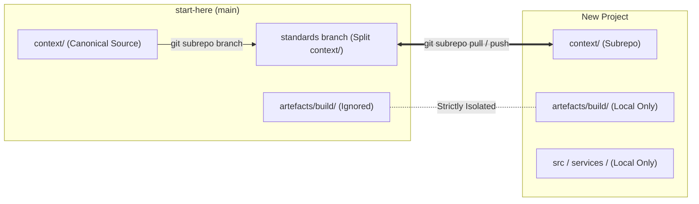

# Downstream Integration Guide: `git-subrepo` Standards Synchronisation

This guide describes how downstream projects import canonical standards, rules, workflows, and agents from `start-here`, how to keep them synchronized bi-directionally using `git-subrepo`, and how to isolate project-specific state (`artefacts/build/`, application code).

---

## 1. Distribution Architecture

The framework distributes canonical context as a self-contained directory (`context/`). Project-specific artefacts (such as `artefacts/build/`, `artefacts/product/`, and service source code) remain 100% local to each downstream repository and are physically excluded from the subrepo boundary.



---

## 2. Prerequisites

Downstream workstations and CI runners require:
1. **Git** (version 2.30+)
2. **`git-subrepo`**:
   ```bash
   brew install git-subrepo
   ```
   *Note: Ensure Bash 4+ is available in your PATH (`brew install bash`).*
3. **`uv`**:
   ```bash
   curl -LsSf https://astral.sh/uv/install.sh | sh
   ```

---

## 3. Initial Project Setup

To adopt the framework in a new or existing repository:

### Step 1: Import Canonical Context
Run `git subrepo clone` targeting the upstream `standards` branch:

```bash
git subrepo clone git@github.com:your-org/start-here.git context -b standards
```

This creates a local `context/` directory with its own `.gitrepo` tracking file. To developers on your team, `context/` appears as regular files in git—no detached `HEAD` states or recursive submodule commands are needed.

### Step 2: Configure Pre-Commit Hooks
Add the adapter drift validator to your downstream `.pre-commit-config.yaml`:

```yaml
repos:
  - repo: local
    hooks:
      - id: adapter-drift
        name: Validate Runtime Adapter Drift
        entry: uv run python context/scripts/validators/adapter_drift.py
        language: system
        files: ^(context/|AGENTS\.md|GEMINI\.md|CLAUDE\.md|\.agents/|\.claude/|\.github/|\.openai/)
```

Install the pre-commit hook:
```bash
uv run pre-commit install
```

### Step 3: Compile Runtime Projections
Run the adapter generator to produce runtime projections (`AGENTS.md`, `GEMINI.md`, `CLAUDE.md`, etc.):

```bash
uv run python context/scripts/generators/generate_adapters.py
```

Commit the generated projections:
```bash
git add .
git commit -m "chore(infra): import standards via git-subrepo and compile projections"
```

---

## 4. Ongoing Synchronisation Workflows

### Pulling Upstream Updates
When standards, rules, or agent definitions are updated in `start-here`, pull changes into your downstream repository:

```bash
# 1. Pull upstream changes into context/
git subrepo pull context

# 2. Re-compile runtime adapter projections
uv run python context/scripts/generators/generate_adapters.py

# 3. Verify zero drift
uv run python context/scripts/validators/adapter_drift.py

# 4. Commit updated projections
git add -A
git commit -m "chore(standards): update canonical context and regenerate adapters"
```

### Pushing Improvements Back Upstream
If your project enhances or fixes a standard, rule, or agent prompt inside `context/`, you can push the improvement back to the upstream `standards` branch:

```bash
# 1. Ensure tests and drift checks pass
uv run python context/scripts/validators/adapter_drift.py
uv run pytest context/scripts/tests -v

# 2. Push context/ changes directly upstream
git subrepo push context
```

Once pushed, open a Pull Request in `start-here` from the `standards` branch to `main` for review.

---

## 5. Testing Downstream Standards

All validator, adapter, and compilation tests are packaged inside `context/scripts/tests/` and accompany `context/` when cloned via subrepo. Downstream projects can run the test suite at any time:

```bash
uv run pytest context/scripts/tests -v
```

---

## 6. Upstream Maintenance (`start-here`)

In the `start-here` repository, maintainers update the public `standards` distribution branch using native `git-subrepo` commands:

```bash
# 1. Extract context/ commits into subrepo branch
git subrepo branch context -f

# 2. Push to remote standards branch
git push origin subrepo/context:standards
```
