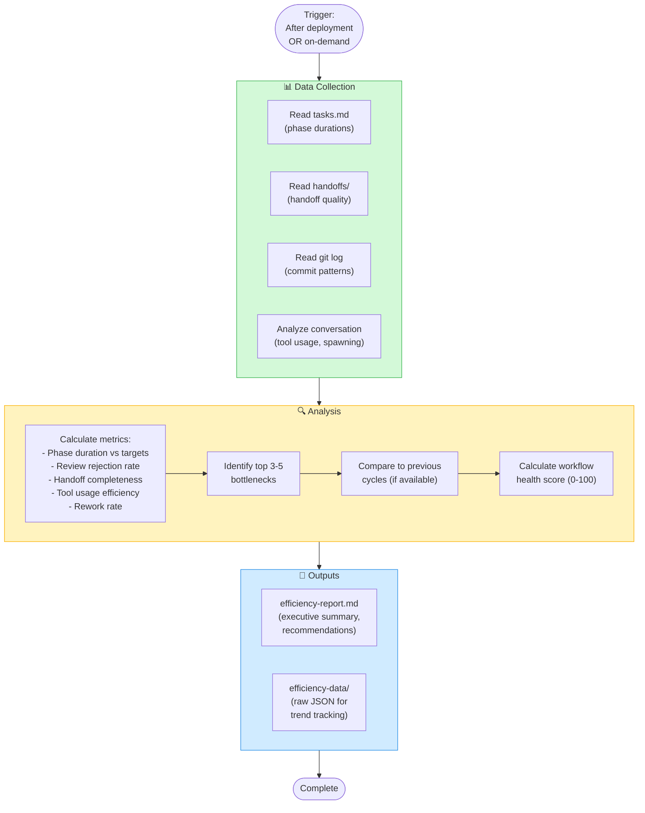

# Agent Effectiveness Analysis Guide

**Workflow Addon**: `context/workflows/agent-effectiveness.yaml`
**Agent**: `@workflow-analyst`
**Use for**: Post-deployment retrospectives, mid-cycle health checks, workflow optimization

---

## When to Use

✅ **Use agent effectiveness analysis when**:
- After completing deployment (post-mortem)
- Mid-cycle health checks (identify bottlenecks early)
- Workflow feels inefficient (diagnose issues)
- Comparing cycles (trend analysis)
- Onboarding new agents (establish baselines)

❌ **Don't use agent effectiveness analysis when**:
- Urgent deployments (skip to save time)
- First cycle with new workflow (no baseline yet)
- Insufficient data (< 5 phases completed)

---

## Overview

**Purpose**: Analyze agent and workflow efficiency to identify bottlenecks and improve future cycles

### Visual Diagram



**What it measures**:
- Phase duration (which phases take longest?)
- Agent effectiveness (token usage, task completion)
- Handoff quality (clear transitions?)
- Bottlenecks (where does work stall?)
- Trend analysis (improving or degrading over time?)

**Duration**: ~30min

---

## How to Use

### Option 1: Add to Workflow (Automated)

Add to `default.yaml` or `prototype.yaml`:

```yaml
  - id: retrospective
    name: Workflow Efficiency Analysis
    depends_on: [deployment-review]  # Or last phase of workflow
    optional: true
    agents:
      - workflow-analyst
    outputs:
      - artefacts/build/efficiency-report.md
      - artefacts/build/efficiency-data/
```

**Invoke**: Workflow automatically triggers after deployment

---

### Option 2: Standalone Analysis (On-Demand)

Run independently for mid-cycle health checks:

```
@workflow-analyst Analyze workflow efficiency for [feature/cycle name]

Analyze data from:
- artefacts/build/tasks.md
- artefacts/shared/handoffs/
- git log (last N commits)
- Current conversation

Focus on: [specific concern, e.g., "why is testing taking so long?"]
```

**When**: Anytime during or after a workflow cycle

---

## What Gets Analyzed

### 1. Task Data
**Source**: `artefacts/build/tasks.md`

**Metrics**:
- Phase duration (time between task start → complete)
- Task blockers (tasks waiting on dependencies)
- Task churn (tasks reopened or modified)

### 2. Handoff Quality
**Source**: `artefacts/shared/handoffs/integration-status.md`, `{service}/HANDOFF.md`

**Metrics**:
- Handoff completeness (all required fields present?)
- Handoff clarity (ambiguous transitions?)
- Handoff frequency (too many? too few?)

### 3. Git Activity
**Source**: `git log`

**Metrics**:
- Commit frequency (commits per phase)
- Commit message quality (conventional-commits compliance)
- Agent-Session triplets (which agents active?)
- Rework rate (commits fixing previous work)

### 4. Conversation Flow
**Source**: Current conversation transcript

**Metrics**:
- Agent spawning (parallel vs sequential)
- Tool usage (correct tools? permission delays?)
- User interruptions (clarifications, approvals)
- Token usage (efficient context management?)

---

## Output Format

### Efficiency Report

**Location**: `artefacts/build/efficiency-report.md`

**Contents**:

```markdown
# Workflow Efficiency Report: [Feature Name]

## Executive Summary
- Workflow: default
- Duration: 2.5 days
- Phases completed: 13/14 (retrospective skipped)
- Overall health score: 72/100 (Good)

## Top Bottlenecks
1. Integration testing: 4 hours (2x expected)
2. Quality review: 3 rejections (design debt)
3. Deployment review: Coverage gap (95% → 97%)

## Phase Breakdown
| Phase | Duration | Status | Notes |
|-------|----------|--------|-------|
| discovery | 30min | ✅ | Baseline |
| design | 2h | ✅ | Parallel swarm worked well |
| design-review | 1.5h | ⚠️ | 1 rejection (architecture) |
...

## Recommendations
1. **Integration testing**: Add mock fixtures to reduce setup time
2. **Quality review**: Run principles-reviewer during design phase
3. **Coverage gap**: Add tests during tdd-blue, not after

## Trend Analysis
- Cycle 1 → Cycle 2: +15% efficiency gain
- Phase durations converging toward targets
- Review rejections decreasing (3 → 1)
```

### Raw Data

**Location**: `artefacts/build/efficiency-data/`

**Files**:
- `tasks-timeline.json` - Task start/end times
- `handoff-analysis.json` - Handoff quality scores
- `git-activity.json` - Commit metrics
- `agent-usage.json` - Agent spawn patterns, tool usage

**Use for**: Custom analysis, dashboards, trend tracking

---

## Validation Criteria

Before effectiveness analysis is complete:

- [ ] All data sources analyzed (tasks, handoffs, git, conversation)
- [ ] Metrics calculated for all phases
- [ ] Top 3-5 bottlenecks identified
- [ ] Actionable recommendations provided (not just observations)
- [ ] Workflow health score calculated (0-100)
- [ ] Trend comparison (if previous cycles exist)

---

## Interpreting Health Scores

**Score ranges**:
- **90-100**: Excellent - Workflow operating smoothly
- **70-89**: Good - Minor optimizations possible
- **50-69**: Fair - Clear bottlenecks, actionable improvements needed
- **Below 50**: Poor - Major workflow issues, investigate immediately

**Score factors**:
- Phase duration vs targets (30%)
- Review rejection rate (20%)
- Handoff quality (20%)
- Tool usage efficiency (15%)
- Rework rate (15%)

---

## Common Patterns & Solutions

### Pattern: Long Integration Testing
**Symptom**: Integration tests take 2-3x expected duration
**Cause**: Missing mock fixtures, slow database setup
**Solution**: Create `artefacts/shared/fixtures/` with reusable test data

### Pattern: Multiple Review Rejections
**Symptom**: Quality gates require 2+ iterations
**Cause**: Design phase skipped critical considerations
**Solution**: Run lightweight review (tech-lead only) after design phase

### Pattern: Coverage Gaps at Deployment
**Symptom**: Quality review passes (95%) but deployment review fails (97%)
**Cause**: Tests added after implementation, not during tdd-blue
**Solution**: Add tests during tdd-blue refactor phase, verify 97% before quality-review

### Pattern: Agent Tool Misuse
**Symptom**: Frequent permission prompts, slow execution
**Cause**: Agents using bash for file operations instead of Write/Edit tools
**Solution**: Enhance agent prompts with explicit tool requirements (see AGENTS.md)

### Pattern: Parallel Execution Overhead
**Symptom**: Parallel phases take longer than sequential
**Cause**: Context duplication, merge conflicts, coordination overhead
**Solution**: Use parallel only for truly independent work (design phase, not tdd-green)

---

## Best Practices

### During Analysis
1. **Run after deployment** - Full cycle data available
2. **Compare to baseline** - Track improvement over time
3. **Focus on top 3 bottlenecks** - Don't try to fix everything
4. **Actionable recommendations** - "Add fixtures" not "tests are slow"

### After Analysis
1. **Share report with team** - Transparency improves collaboration
2. **Implement top recommendation** - Start with highest-impact change
3. **Track improvement** - Measure change in next cycle
4. **Update workflow** - Modify YAML if patterns emerge

### Anti-Patterns
1. ❌ Running analysis too early (< 5 phases completed)
2. ❌ Blaming agents for systemic issues (poor tool usage = orchestrator problem)
3. ❌ Ignoring trends (one slow cycle is variance, three is a pattern)
4. ❌ Over-optimizing (diminishing returns below 80% health score)

---

## Comparison with Other Workflows

| Workflow | Analysis Frequency | Focus |
|----------|-------------------|-------|
| **Default** | After deployment (optional) | Full cycle efficiency |
| **Prototype** | Rarely (prototype is throwaway) | Learning, not efficiency |
| **Custom** | Configurable | Depends on workflow goals |

---

## Orchestration Pattern

Agent effectiveness analysis uses:

- **Single Agent**: `@workflow-analyst` runs independently
- **Reads multiple sources**: tasks, handoffs, git, conversation
- **Writes multiple outputs**: report, raw data

See `context/docs/orchestration-patterns.md` for pattern details.

---

## See Also

- `context/workflows/agent-effectiveness.yaml` - Workflow addon definition
- `context/agents/workflow-analyst.md` - Agent definition
- `context/docs/how-to-measure-agent-effectiveness.md` - Detailed measurement examples
- `context/docs/orchestration-patterns.md` - Orchestration pattern reference
- `AGENTS.md` - Auto-generated agent reference
