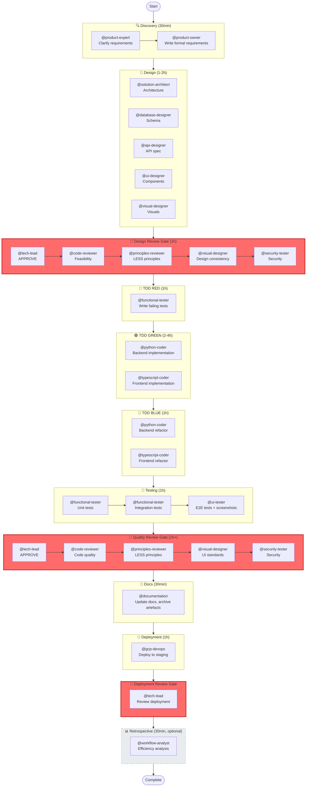

# Default Workflow Usage Guide

**Workflow**: `context/workflows/default.yaml`
**Pattern**: Full TDD with comprehensive reviews and testing
**Use for**: Production code, critical features, quality-focused development

---

## When to Use

✅ **Use default workflow when**:
- Building production features
- Quality and maintainability matter
- You need comprehensive testing (95%+ coverage)
- Multiple quality gates are acceptable
- Team collaboration required (reviews)

❌ **Don't use default workflow when**:
- Prototyping or experimenting
- Speed > quality (use prototype.yaml)
- Throwaway code (POC, demo)
- Solo exploration without reviews

---

## Workflow Overview

**14 phases** | **3 quality gates** | **18 agents** | **Duration**: 2-3 days typical feature

```
discovery → design → design-review (GATE) →
tdd-red → tdd-green → tdd-blue →
unit-test → integration-test → e2e-test →
quality-review (GATE) → docs-cleanup →
deployment → deployment-review (GATE) → retrospective (optional)
```

### Visual Diagram



---

## Phase-by-Phase Guide

### Phase 1: Discovery (Requirements & Planning)
**Agents**: `@product-expert` → `@product-owner` (sequential)

**Purpose**: Clarify vague ideas, formalize requirements

**You invoke**:
```
@product-expert Clarify requirements for [feature]
# Wait for clarification

@product-owner Write formal requirements for [feature]
# Wait for requirements.md
```

**Outputs**:
- `artefacts/product/requirements.md`
- `artefacts/product/user-stories.md`

**Duration**: ~30min

---

### Phase 2: Design (Architecture & Design)
**Agents**: 5 agents in parallel

**Purpose**: Design system architecture, DB schema, API, UI, visuals

**You invoke**:
```
Spawn in parallel:
@solution-architect Design architecture
@database-designer Design schema
@api-designer Create OpenAPI spec
@ui-designer Design components
@visual-designer Create visual assets
```

**Outputs**:
- `artefacts/architecture/architecture.md`
- `artefacts/architecture/data-model.md`
- `artefacts/architecture/openapi.yaml`
- `artefacts/design/design-system.md`
- `artefacts/design/visuals/`

**Duration**: ~1-2 hours

**Pattern**: Parallel Swarm (see orchestration-patterns.md)

---

### Phase 3: Design Review (Quality Gate)
**Agents**: 5 reviewers sequential: `@tech-lead` → `@code-reviewer` → `@principles-reviewer` → `@visual-designer` → `@security-tester`

**Purpose**: Approve design before implementation begins

**You invoke**:
```
@tech-lead Review architecture for soundness
# MUST APPROVE before next reviewer

@code-reviewer Review for implementation feasibility
@principles-reviewer Review against LESS principles
@visual-designer Review design consistency
@security-tester Review security architecture
```

**Outputs**:
- `artefacts/build/tech-review.md`
- `artefacts/build/code-review.md`
- `artefacts/build/principles-review.md`
- `artefacts/build/security-review.md`

**Validation**:
- tech-lead MUST approve before other reviewers
- CHANGES REQUIRED → return to design phase
- All reviewers must approve to proceed

**Duration**: ~1 hour

**Pattern**: Sequential Chain with Approval Gate

---

### Phase 4: TDD RED (Write Failing Tests)
**Agent**: `@functional-tester`

**Purpose**: Write tests that define behavior BEFORE implementation

**You invoke**:
```
@functional-tester Write failing tests for [feature] based on architecture.md
```

**Outputs**:
- `tests/unit/test_*.py`
- `tests/integration/test_*.py`

**Validation**:
- All tests MUST fail when first run
- Coverage targets defined (95%+)

**Duration**: ~1 hour

**Critical**: Do NOT skip this phase. Tests define the contract.

---

### Phase 5: TDD GREEN (Implement to Pass Tests)
**Agents**: `@python-coder` + `@typescript-coder` (parallel)

**Purpose**: Implement code to make tests pass (no more, no less)

**You invoke**:
```
Spawn in parallel:
@python-coder Implement backend to pass tests
@typescript-coder Implement frontend to pass tests
```

**Validation**:
- All tests MUST pass
- NO test modifications allowed

**Duration**: ~2-4 hours

**Pattern**: Hive (parallel coders, shared test suite)

**Critical**: Coders make tests pass. They don't modify tests.

---

### Phase 6: TDD BLUE (Refactor)
**Agents**: `@python-coder` + `@typescript-coder` (parallel)

**Purpose**: Improve code quality without changing behavior

**You invoke**:
```
Spawn in parallel:
@python-coder Refactor backend (remove duplication, improve naming)
@typescript-coder Refactor frontend (simplify logic, clarify structure)
```

**Validation**:
- Tests MUST still pass (100%)
- Code quality improved
- NO new functionality added

**Duration**: ~1 hour

**Focus**: Remove duplication, improve naming, simplify logic

---

### Phase 7-9: Testing (Unit → Integration → E2E)
**Agents**: `@functional-tester` (unit, integration) + `@ui-tester` (e2e)

**Purpose**: Verify coverage, test integration, test UI workflows

**You invoke**:
```
@functional-tester Run unit tests and verify coverage
# Sequential wait

@functional-tester Run integration tests (API contracts, DB)
# Sequential wait

@ui-tester Run E2E tests with screenshots
```

**Outputs**:
- `artefacts/test-results/unit/coverage.txt`
- `artefacts/test-results/integration/results.txt`
- `artefacts/test-results/e2e/screenshots/`

**Validation**:
- Coverage >= 95% (development phase)
- All tests pass
- E2E screenshots exist

**Duration**: ~1 hour

---

### Phase 10: Quality Review (Quality Gate)
**Agents**: 5 reviewers sequential (same as design-review)

**Purpose**: Approve implementation before deployment

**Validation**:
- Coverage >= 95%
- No critical security issues
- UI meets design standards
- LESS principles followed

**Pattern**: Sequential Chain with Iterative Loop (may need fixes)

**Duration**: ~1 hour + fixes

---

### Phase 11: Documentation Cleanup
**Agent**: `@documentation`

**Purpose**: Update docs, cleanup artefacts, update handoffs

**You invoke**:
```
@documentation Clean up documentation and artefacts
```

**Outputs**:
- Updated README.md
- API documentation
- Archived old artefacts
- Updated HANDOFF.md

**Duration**: ~30min

---

### Phase 12-13: Deployment (Infrastructure & Review)
**Agents**: `@gcp-devops` → `@tech-lead`

**Purpose**: Deploy to staging, review deployment, prepare production

**You invoke**:
```
@gcp-devops Deploy to staging environment
# Wait for deployment

@tech-lead Review deployment (monitoring, rollback plan)
```

**Validation** (deployment-review gate):
- Coverage >= 97% (pre-deployment phase - higher threshold!)
- Deployment successful
- Monitoring configured
- Rollback tested

**Duration**: ~1 hour

---

### Phase 14: Retrospective (Optional)
**Agent**: `@workflow-analyst`

**Purpose**: Analyze workflow efficiency, identify bottlenecks

**You invoke**:
```
@workflow-analyst Analyze workflow efficiency for [feature] deployment
```

**Outputs**:
- `artefacts/build/efficiency-report.md`
- `artefacts/build/efficiency-data/`

**Duration**: ~30min

**Skip when**: Urgent deployments, time-sensitive releases

---

## Quality Gates Summary

| Gate | Phase | Thresholds |
|------|-------|------------|
| **Design Review** | After design | 0 architecture blockers, 0 design security issues |
| **Quality Review** | After testing | 95% coverage, 0 critical issues, 1+ screenshot, visual regression pass |
| **Deployment Review** | Before production | 97% coverage, 0 critical issues |

**Phase-based coverage thresholds**:
- Development (quality-review): 95%
- Pre-deployment (deployment-review): 97%

See `context/standards/testing-standards.md §Phase-Based Thresholds`

---

## Orchestration Patterns Used

This workflow combines multiple patterns:

- **Sequential Chain**: discovery, testing phases, review gates
- **Parallel Swarm**: design phase (5 independent designers)
- **Hive**: tdd-green, tdd-blue (parallel coders, shared tests)
- **Iterative Loop**: quality gates (may require fixes)

See `context/docs/orchestration-patterns.md` for details

---

## Tips & Best Practices

### Before Starting
1. Ensure requirements are clear (run discovery if not)
2. Check you have time for full workflow (~2-3 days)
3. Prepare for potential review rejections (build in buffer)

### During Workflow
1. Don't skip TDD RED phase (tests define contract)
2. Don't modify tests during GREEN/BLUE phases
3. Wait for tech-lead approval before other reviewers
4. Update HANDOFF.md after each major phase

### Quality Gates
1. Address all blocker feedback before re-review
2. Track why gates fail (recurring issues?)
3. Don't skip gates for production code

### Token Optimization
1. Run parallel phases in single message (5 agents = 1 call)
2. Use sequential for dependent work (avoid wasted parallel tokens)
3. Skip retrospective if token budget is tight

---

## Common Issues

**Issue**: Tests fail in GREEN phase
**Fix**: Debug implementation, don't modify tests

**Issue**: Coverage below 95%
**Fix**: Add tests for uncovered branches, or document gaps with rationale

**Issue**: Design review rejects architecture
**Fix**: Address feedback, re-run design agents, resubmit for review

**Issue**: Deployment review fails (97% coverage required)
**Fix**: Increase coverage from 95% → 97% before deployment

**Issue**: UI tests don't have screenshots
**Fix**: Re-run @ui-tester, ensure screenshots/ directory exists

---

## Comparison with Prototype Workflow

| Aspect | Default | Prototype |
|--------|---------|-----------|
| **Phases** | 14 | 4 |
| **Quality Gates** | 3 | 0 |
| **Coverage** | 95-97% | Optional |
| **Duration** | 2-3 days | Hours to 1 day |
| **Use For** | Production | POCs, experiments |
| **Reviews** | Required | Optional |

**Migration**: Prototype code should NOT be promoted to production without rewriting with default workflow.

---

## See Also

- `context/workflows/default.yaml` - Workflow definition (source of truth)
- `context/docs/orchestration-patterns.md` - Pattern details
- `context/docs/workflow-prototype.md` - Alternative fast workflow
- `AGENTS.md` - Auto-generated comprehensive agent reference
- `context/standards/testing-standards.md` - Coverage thresholds
