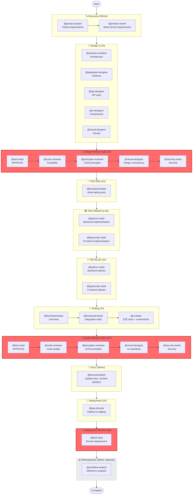
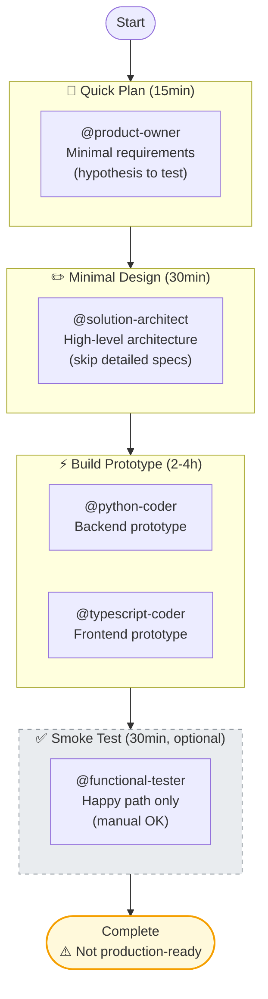
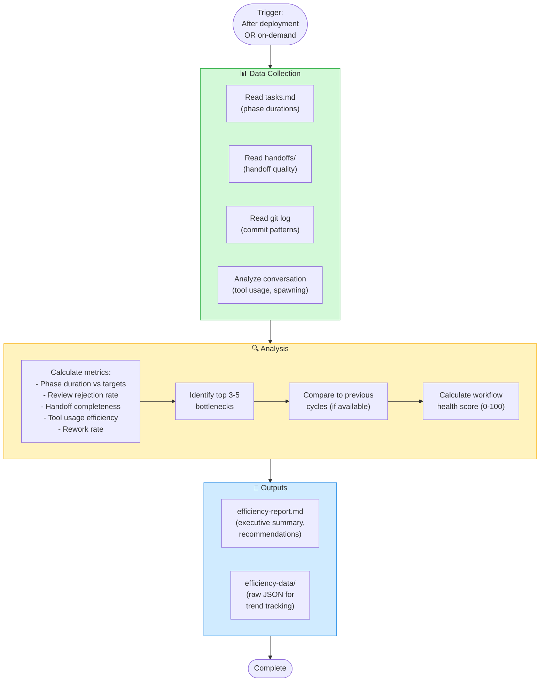
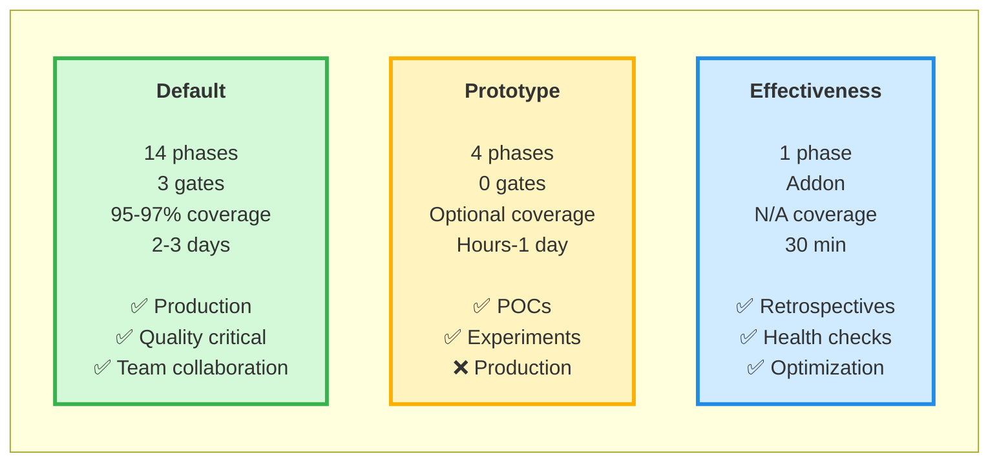
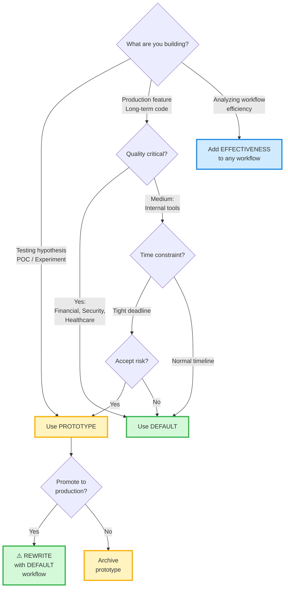
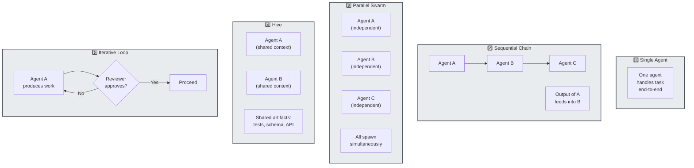

# Workflow Diagrams

Visual comparison of all available workflows.

---

## Default Workflow (Full TDD)

**14 phases | 3 quality gates | 18 agents | 2-3 days**

**Coverage thresholds**:
- Development (quality-review): 95%
- Pre-deployment (deployment-review): 97%

**Quality gates block progress** until criteria met.

---

## Prototype Workflow (Fast Iteration)

**4 phases | 0 quality gates | 5 agents | Hours to 1 day**

**⚠️ Warning**: Prototype code should NOT go to production. If successful, rewrite with default workflow.

**Trade-offs**:
- ✅ Fast: Hours vs days
- ✅ Proves concept quickly
- ❌ No tests (optional smoke tests only)
- ❌ No reviews (quality/security gaps)
- ❌ Technical debt acceptable
- ❌ Must rewrite for production

---

## Agent Effectiveness Analysis (Addon)

**1 phase | Can attach to any workflow | 30min**

**Use cases**:
1. **Post-deployment retrospective** - After deployment-review gate
2. **Mid-cycle health check** - During any workflow phase (on-demand)
3. **Trend analysis** - Compare efficiency across cycles

**Agent**: `@workflow-analyst`

**Outputs**:
- Health score (90-100: Excellent, 70-89: Good, 50-69: Fair, <50: Poor)
- Top bottlenecks with actionable recommendations
- Phase-by-phase breakdown
- Trend comparison (if previous data exists)

---

## Workflow Comparison Matrix

---

## Decision Tree: Which Workflow?

---

## Orchestration Patterns (Used Across Workflows)

**Pattern usage in workflows**:

| Pattern | Default Workflow | Prototype Workflow |
|---------|------------------|-------------------|
| Single Agent | docs-cleanup, retrospective | quick-plan, sketch-design |
| Sequential Chain | discovery, testing phases, review gates | All phases (linear) |
| Parallel Swarm | design (5 designers) | build (2 coders) |
| Hive | tdd-green, tdd-blue (shared tests) | build (shared prototype) |
| Iterative Loop | quality gates (with feedback) | None (no gates) |

See `orchestration-patterns.md` for detailed examples, token optimization strategies, and decision tree.

---

## See Also

- **Workflow definitions**: `context/workflows/*.yaml`
- **Usage guides**: `context/docs/workflow-*.md`
- **Orchestration patterns**: `context/docs/orchestration-patterns.md`
- **Generated reference**: `AGENTS.md` (auto-generated, always up-to-date)
