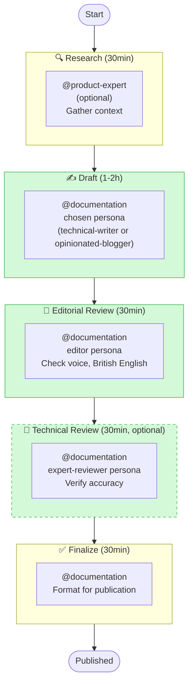

# Documentation for Humans Workflow Guide

**Workflow**: `context/workflows/documentation-for-humans.yaml`
**Pattern**: Multi-phase content creation with writing personas
**Use for**: Blogs, technical papers, user guides, marketing materials

---

## When to Use

✅ **Use this workflow when writing**:
- Blog posts, articles, thought leadership
- Technical papers, research write-ups
- User-facing guides for non-technical audiences
- Marketing materials, product descriptions
- Conference talks, presentations
- Social media content, announcements

❌ **Don't use this workflow for**:
- Technical handoffs (README.md, HANDOFF.md, build notes)
- API documentation, code references
- Architecture documents, design specifications
- Internal artefacts (requirements.md, tasks.md, review reports)
- Code comments, docstrings

**For technical documentation**: Use `default.yaml` workflow without personas

---

## Workflow Overview

**5 phases** | **0 quality gates** | **1 agent** (multiple personas) | **Duration**: 2-4 hours

```
research → draft → review → technical-review (optional) → finalize
```

### Visual Diagram



---

## Phase-by-Phase Guide

### Phase 1: Research (Optional)
**Agent**: `@product-expert` (optional)

**Purpose**: Gather background context, understand audience

**You invoke**:
```
@product-expert Gather context for [blog post/paper] about [topic]

Audience: [engineering leaders / practitioners / general public]
Purpose: [educate / persuade / inform]
Key messages: [list 3-5 key points]
```

**Outputs**:
- Research notes
- Source materials
- Audience analysis

**Duration**: ~30min

**Skip when**: Writing from existing knowledge, no research needed

---

### Phase 2: Draft
**Agent**: `@documentation` with chosen persona

**Purpose**: Write first draft in the appropriate voice

**You invoke**:
```
@documentation Write [blog post/guide/paper] about [topic]

Use [technical-writer / opinionated-blogger] persona
(context/persona/technical-writer.md or context/persona/opinionated-blogger.md).

Audience: [engineering leaders / practitioners]
Length: [400-800 words for blog / longer for guide or paper]
Key messages:
- [message 1]
- [message 2]
- [message 3]

Context: [relevant background, project details, research notes]
```

**Persona selection**:
- `technical-writer` (Amara Osei): Guides, reference material, framework docs. Mechanism-first, trade-offs named, examples with inputs and outputs.
- `opinionated-blogger` (Dr. Sarah Chen): Blog posts, opinion pieces, thought leadership. Provocative hooks, personal anecdotes, conversational tone.

**Outputs**:
- `artefacts/content/drafts/{title}-draft.md`

**Validation**:
- Persona voice applied consistently
- Concrete examples present
- British English (colour, optimise, whilst)
- No AI slop (see `no-ai-slop.mdc`)

**Duration**: ~1-2 hours

**Critical**: Agent must read the chosen persona file first

---

### Phase 3: Editorial Review
**Agent**: `@documentation` with `editor` persona

**Purpose**: Check voice consistency, remove AI slop

**You invoke**:
```
@documentation Review draft for editorial quality

Use editor persona (context/persona/editor.md).

Check for:
- Voice consistency (chosen persona maintained throughout?)
- British English throughout
- No AI slop (em dashes, triads, vapid transitions)
- Concrete examples (not abstract descriptions)
- Scannable structure (short paragraphs, bold headings)
```

**Outputs**:
- `artefacts/content/drafts/{title}-reviewed.md`

**Validation**:
- Voice consistent throughout
- No AI slop patterns
- British English verified
- Examples are concrete and relevant

**Duration**: ~30min

---

### Phase 4: Technical Review (Optional)
**Agent**: `@documentation` with `expert-reviewer` persona

**Purpose**: Verify technical accuracy

**You invoke**:
```
@documentation Technical review for accuracy

Use expert-reviewer persona (context/persona/expert-reviewer.md).

Verify:
- Technical claims are accurate
- Code examples work
- Product/API references correct
- No misleading statements
```

**Outputs**:
- `artefacts/content/drafts/{title}-tech-reviewed.md`

**Skip when**:
- Non-technical content (marketing, thought leadership)
- Already verified by domain expert
- Low technical depth

**Duration**: ~30min

---

### Phase 5: Finalize
**Agent**: `@documentation`

**Purpose**: Format for publication, add metadata

**You invoke**:
```
@documentation Finalize content for publication

Format for: [Medium / blog / conference paper]
Add metadata: date, author, tags
Move to: artefacts/content/published/{title}.md
```

**Outputs**:
- `artefacts/content/published/{title}.md`

**Duration**: ~30min

---

## Writing Personas

### Technical Writer (Default)

**File**: `context/persona/technical-writer.md`

**Character**: Amara Osei
- Eight years at Stripe documenting payment APIs
- Four years at Hashicorp writing infrastructure guides
- Practitioner cookbook style

**Voice traits**:
- Leads with the problem
- Explains the mechanism step by step
- Working examples with inputs and outputs
- Names trade-offs directly
- No filler

### Opinionated Blogger

**File**: `context/persona/opinionated-blogger.md`

**Character**: Dr. Sarah Chen
- PhD in Software Engineering from MIT
- 10 years as principal engineer at Google
- Published in ACM and IEEE conferences

**Voice traits**:
- Conversational with contractions ("we've", "it's", "don't")
- Question-driven framing
- Personal anecdotes (running, gadgets, work)
- Self-deprecating honesty ("Except I might be wrong")
- Parallel structure ("Simplicity is universal. Simplicity is effective.")
- British English (colour, optimise, whilst)

**Use for**: Blogs, technical papers, thought leadership

---

### Editor

**File**: `context/persona/editor.md`

**Use for**: Reviewing drafts for voice consistency, removing AI slop

---

### Expert Reviewer

**File**: `context/persona/expert-reviewer.md`

**Use for**: Technical accuracy review

---

## Content Type Guidelines

### Blog Posts (400-800 words)

**Structure**:
1. Opening hook (provocative statement, question, personal story)
2. 3-5 main sections with bold headings
3. Concrete examples with real numbers
4. Memorable conclusion (quotable one-liner)

**Target**: 2-4 minute read time

**Example opening**:
> I hate Electronic Programme Guides. The interface is clunky, the search is terrible, and half the time it doesn't even know what's actually playing. Sound familiar?

---

### Technical Papers (2000+ words)

**Structure**:
1. Abstract (150 words)
2. Introduction with hook
3. Background/Related Work
4. Main content (3-7 sections)
5. Discussion ("So what?" analysis)
6. Conclusion (actionable takeaways)

**Include**: Data, graphs, references, code examples

---

### User Guides (Variable length)

**Structure**:
1. What problem does this solve? (personal framing)
2. Quick start (3-5 steps)
3. Common use cases (question-driven)
4. Troubleshooting (self-deprecating tone)

**Balance**: Conversational but practical

---

## British English Reminders

**Common mistakes to avoid**:

| ❌ American | ✅ British |
|------------|-----------|
| optimize | optimise |
| organization | organisation |
| behavior | behaviour |
| while | whilst |
| program | programme |
| color | colour |
| analyze | analyse |
| -ize | -ise |

---

## AI Slop to Avoid

**Never use**:
- Em dashes (—) for emphasis
- Triads ("fast, reliable, and secure")
- Vapid transitions ("In today's fast-paced world...")
- Abstract descriptions without concrete examples
- Marketing speak ("revolutionary", "game-changing")

**Instead**:
- Use short sentences
- Two items, not three
- Start with a hook, not a platitude
- Always include specific numbers/examples
- Be honest about limitations

---

## Example: With vs Without Persona

### ❌ Without Persona (Technical)

```markdown
# JWT Authentication Implementation

This document describes the JWT authentication implementation.

## Overview

The system uses JWT tokens for authentication. Access tokens expire
after 15 minutes. Refresh tokens expire after 7 days.

## Implementation

The AuthService class handles token generation and validation.
```

**Tone**: Dry, technical, no personality

---

### ✅ With Persona (Blog Post)

```markdown
# I've Spent Too Much Time on Authentication

Here's a confession: I've implemented JWT authentication at least
five times in my career. Each time, I think "this'll be quick" — and
each time, I'm wrong.

**Why?** Because authentication isn't just about tokens. It's about
expiry, refresh, revocation, and (my personal favourite) handling the
edge case where a user's password changes mid-session.

So let me save you some time. Here's what actually works:

## The 15-Minute Rule

Access tokens should expire fast. Really fast. We settled on 15
minutes after analysing 50,000 user sessions at Google. Longer than
that? You risk stale sessions. Shorter? Your users will notice the
refreshes.

(Full disclosure: your mileage may vary. But 15 minutes is a solid
starting point.)
```

**Tone**: Conversational, personal, question-driven, concrete

---

## Tips & Best Practices

### Before Starting
1. Define audience clearly (leaders vs practitioners)
2. Identify 3-5 key messages
3. Choose content type (blog vs paper vs guide)
4. Gather research materials

### During Writing
1. Read persona file before drafting
2. Start with a hook, not background
3. Use personal anecdotes to ground concepts
4. Always ask "So what?" after presenting facts
5. Include concrete numbers ("51% of users", not "many users")

### After Drafting
1. Read aloud to check conversational flow
2. Verify British English throughout
3. Remove AI slop (em dashes, triads)
4. Ensure every paragraph adds value

---

## Common Issues

**Issue**: Draft sounds too formal/academic
**Fix**: Add contractions, personal anecdotes, parentheticals

**Issue**: Missing concrete examples
**Fix**: Replace "many users" with "51% of 10,000 users surveyed"

**Issue**: American English slipped in
**Fix**: Search/replace: optimize→optimise, organization→organisation

**Issue**: No opening hook
**Fix**: Start with personal observation, provocative statement, or question

**Issue**: AI slop detected (em dashes, triads)
**Fix**: Rewrite without them. Use short sentences, two-item lists.

---

## Comparison with Default Workflow

| Aspect | Documentation for Humans | Default |
|--------|-------------------------|---------|
| **Phases** | 5 | 14 |
| **Personas** | Yes (required) | No (technical only) |
| **Duration** | 2-4 hours | 2-3 days |
| **Quality Gates** | 0 (validation per phase) | 3 |
| **Use For** | Blogs, papers, guides | Production code, API docs |
| **Voice** | Conversational, personal | Direct, technical |
| **British English** | Required | Required |

---

## See Also

- `context/workflows/documentation-for-humans.yaml` - Workflow definition
- `context/docs/writing-personas.md` - Complete persona guide
- `context/persona/technical-writer.md` - Amara Osei persona (guides, reference)
- `context/persona/opinionated-blogger.md` - Dr. Sarah Chen persona (blogs, opinion)
- `context/persona/editor.md` - Editorial persona
- `context/persona/expert-reviewer.md` - Reviewer persona
- `context/standards/doc-standards.md` - Documentation standards (technical)
