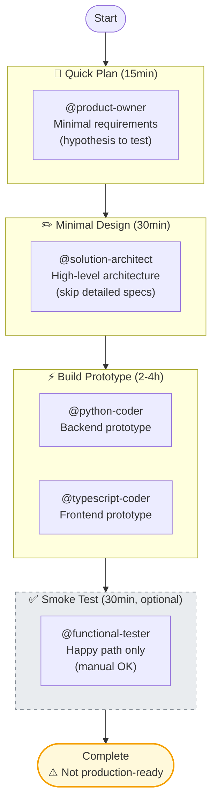

# Prototype Workflow Usage Guide

**Workflow**: `context/workflows/prototype.yaml`
**Pattern**: Fast iteration without quality gates
**Use for**: POCs, experiments, spikes, throwaway code

---

## When to Use

✅ **Use prototype workflow when**:
- Validating technical feasibility
- Testing hypotheses quickly
- Building throwaway demos
- Exploring new technologies
- Speed matters more than quality
- No production deployment planned

❌ **Don't use prototype workflow when**:
- Building production features
- Code will be maintained long-term
- Quality/security critical
- Team collaboration required
- Compliance requirements exist

---

## Workflow Overview

**4 phases** | **0 quality gates** | **5 agents** | **Duration**: Hours to 1 day

```
quick-plan → sketch-design → build → validate (optional)
```

### Visual Diagram



**⚠️ Warning**: Prototype code should NOT go to production. If successful, rewrite with default workflow.

---

## Phase-by-Phase Guide

### Phase 1: Quick Planning
**Agent**: `@product-owner`

**Purpose**: Lightweight requirements for hypothesis testing

**You invoke**:
```
@product-owner Write minimal requirements for [prototype idea]

Keep it brief - focus on the hypothesis to test, not exhaustive requirements.
```

**Outputs**:
- `artefacts/product/requirements.md` (lightweight)

**Duration**: ~15min

**Focus**: Core hypothesis, not exhaustive requirements

---

### Phase 2: Minimal Design
**Agent**: `@solution-architect`
**Depends On**: `quick-plan`

**Purpose**: High-level architecture only

**You invoke**:
```
@solution-architect Design high-level architecture for [prototype]

Skip detailed API specs. Document key decisions only.
```

**Outputs**:
- `artefacts/architecture/architecture.md` (high-level)

**Duration**: ~30min

**Skip**: Detailed API specs, database schemas, component diagrams

---

### Phase 3: Build Prototype
**Agents**: `@python-coder` + `@typescript-coder` (parallel)
**Depends On**: `sketch-design`
**Execution**: Parallel

**Purpose**: Working prototype to test hypothesis

**You invoke**:
```
Spawn in parallel:
@python-coder Build backend prototype
@typescript-coder Build frontend prototype
```

**Outputs**:
- Working prototype code

**Duration**: ~2-4 hours

**Acceptable**:
- No tests
- Technical debt
- Hard-coded values
- Skip error handling (happy path only)

**Critical**: Mark code clearly as prototype

---

### Phase 4: Smoke Test (Optional)
**Agent**: `@functional-tester`
**Depends On**: `build`
**Optional**: Can be skipped

**Purpose**: Verify happy path works

**You invoke**:
```
@functional-tester Run basic smoke tests for [prototype]

Manual testing is acceptable. Cover happy path only, skip edge cases.
```

**Outputs**:
- Basic smoke tests (optional)

**Duration**: ~30min

**Skip**: Edge cases, error scenarios, integration testing

---

## No Quality Gates

**Zero quality gates** - speed over quality

- No design reviews
- No code reviews
- No coverage requirements
- No security audits
- No deployment reviews

**Warning**: This is intentional for prototypes. Do NOT use for production.

---

## Workflow Rules

1. **Speed over quality** - Prototype code prioritizes learning over maintainability
2. **No formal reviews** - Skip design/code/security reviews
3. **Documentation optional** - Minimal docs acceptable
4. **Tests optional** - Smoke tests only (manual OK)
5. **Skip infrastructure** - No deployment configs
6. **Mark prototype code** - Clear comments/naming
7. **Plan for rewrite** - If promoting to production, rewrite with default workflow

---

## Tips & Best Practices

### Before Starting
1. Define clear hypothesis to test
2. Set time limit (hours, not days)
3. Accept that code will be throwaway

### During Workflow
1. Focus on proving/disproving hypothesis
2. Hard-code values to save time
3. Skip edge cases and error handling
4. Document key learnings, not exhaustive docs

### After Completion
1. **Prototype succeeded** → Rewrite with default workflow before production
2. **Prototype failed** → Document learnings, archive code
3. **Prototype uncertain** → Iterate with another prototype cycle

---

## Common Issues

**Issue**: Prototype takes 2+ days
**Fix**: Scope too large. Reduce to single hypothesis.

**Issue**: Team wants to deploy prototype
**Fix**: STOP. Rewrite with default workflow first. No shortcuts to production.

**Issue**: Prototype has merge conflicts
**Fix**: Prototype should be on separate branch. Never merge prototype to main.

**Issue**: Prototype lacks basic functionality
**Fix**: Acceptable. Prototype tests hypothesis, not complete feature.

---

## Comparison with Default Workflow

| Aspect | Prototype | Default |
|--------|-----------|---------|
| **Phases** | 4 | 14 |
| **Quality Gates** | 0 | 3 |
| **Coverage** | Optional | 95-97% |
| **Duration** | Hours to 1 day | 2-3 days |
| **Use For** | POCs, experiments | Production |
| **Reviews** | Optional | Required |
| **Tests** | Smoke only | Unit+integration+E2E |
| **Documentation** | Minimal | Comprehensive |
| **Technical Debt** | Acceptable | Avoided |

---

## Migration Path: Prototype → Production

**If prototype validates hypothesis and you want to deploy:**

1. **Archive prototype** - Move to `prototype-archive/` branch
2. **Extract learnings** - Document what worked/didn't
3. **Start fresh** - Use default workflow from scratch
4. **Don't copy-paste** - Prototype code has technical debt
5. **Write tests first** - TDD from the beginning
6. **Include reviews** - All quality gates apply

**Why not just "clean up" prototype?**
- Technical debt is deeply embedded (architecture, error handling, testing)
- Cleaning prototype takes longer than rewriting
- Rewrite with TDD produces better code
- Reviews catch issues missed during prototyping

---

## Orchestration Patterns Used

This workflow uses:

- **Sequential Chain**: quick-plan → sketch-design → build → validate
- **Parallel Swarm**: build phase (python-coder + typescript-coder)

See `context/docs/orchestration-patterns.md` for pattern details.

---

## See Also

- `context/workflows/prototype.yaml` - Workflow definition
- `context/docs/orchestration-patterns.md` - Pattern details
- `context/docs/workflow-default.md` - Production workflow
- `AGENTS.md` - Auto-generated agent reference
