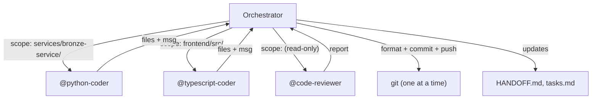

# Multi-Agent Workflows Skill

---

## Overview

This skill details the procedural workflow for multi-agent collaboration, specifically Orchestrator escalation triage and handoff archival procedures. All actions MUST comply with the invariants defined in `context/rules/multi-agent-collaboration.md`.

---

## 1. Orchestrator Triage

When the orchestrator receives an escalation from a subagent, it decides whether to resolve or forward:

| Situation | Action | Example |
|-----------|--------|---------|
| Single obvious remediation, no trade-offs | Resolve: create a task and dispatch | Add a TTL sweep to a growing table |
| Implementation detail within agreed architecture | Resolve: decide and document | Choose between cron job vs lazy cleanup when architecture already specifies the service boundary |
| Multiple viable approaches with different trade-offs | **Forward to human** | TTL sweep vs partitioned tables vs external scheduler — each has cost/complexity implications |
| Scope, budget, or timeline implications | **Forward to human** | Remediation adds a new service dependency or delays the sprint |

---

## 2. Handoff Archival

As a workflow progresses, the `HANDOFF.md` file will accumulate history. To keep the context window lean:
1. When a phase completes (e.g., moving from implementation to testing), archive the old handoff notes.
2. Move them to `artefacts/build/archive/handoff-{date}.md`.
3. Keep only the active sprint/phase tasks in the primary `HANDOFF.md`.

---

## 3. Agent Handoffs

### Handoff Format

Each handoff entry shall include:
- **Timestamp**: ISO 8601 with timezone (e.g., `2026-01-27T18:45:32Z`)
- **From/To**: Source and destination agent names
- **Tasks**: Task IDs covered by this handoff
- **Status**: ✅ Complete | 🚧 In Progress | ⚠️ Blocked | 🔴 Failed
- **Summary**: Brief description of work completed
- **Notes**: Critical information for next agent
- **Artefacts**: Paths to relevant files (code, tests, docs)
- **Blockers**: Any blockers preventing progress
- **Commit**: Git commit hash linking handoff to code

### Handoff Workflow

When completing a group of tasks:
1. Update the HANDOFF.md file in service directory (intra-domain)
2. If completing integration-ready work, update `artefacts/shared/handoffs/integration-status.md` (inter-domain)
3. If API endpoints are stable, create/update `artefacts/shared/handoffs/{service}-api.md` (inter-domain)
4. Commit changes with handoff updates included
5. Mark tasks as complete in task list

### Integration Readiness

Before marking a service as "Ready for Integration", the agent shall ensure:
- All Phase 2 (TDD GREEN) tasks complete
- Phase 3 (Review) approved
- Test coverage >= 90%
- API endpoints match OpenAPI specification
- HANDOFF.md exists in service directory
- Mock client provided in `artefacts/shared/mocks/`
- Example responses in `artefacts/shared/fixtures/`
- Integration status updated in `artefacts/shared/handoffs/integration-status.md`

### Templates

- **Intra-domain**: Use `artefacts/shared/HANDOFF-TEMPLATE.md`
- **Inter-domain**: Use `artefacts/shared/handoffs/TEMPLATE-service-api.md`

---

## 4. Interruptions Logging

An interruption is any moment that required the user's or orchestrating agent's attention before work could continue. Agents shall log interruptions to `artefacts/build/agent-interruptions.md` under a heading matching the current sprint or phase.

**When to log**: append the entry immediately after the interruption is resolved — do not batch at end of sprint.

**Format (question / tool approval):**

```
### [Sprint N — Phase] Short title
**Agent**: @agent-name
**Type**: Question | Tool approval
**Question/Tool**: What did you need to know, or what tool needed approval?
**Answered by/Approved by**: Orchestrating agent | User
**Resolution**: What was decided?
```

**Format (escalation):**

```
### [Sprint N — Phase] Short title
**Agent**: @agent-name
**Type**: Escalation
**Impact**: High — brief reason (e.g. unbounded data growth, schema change)
**Escalated to**: Orchestrator | Human
**Options considered**: What approaches were identified?
**Resolution**: What was decided, and by whom?
```

---

## 5. Orchestrator Git Strategy

The orchestrator prevents collisions by assigning each agent a **file scope** — the set of paths the agent may write to and commit.

### File Scope Assignment

The orchestrator assigns each agent a file scope at dispatch time. The scope goes in the spawn prompt under `FILE SCOPE`.

**Rules:**
1. Scopes must be **disjoint** — no two parallel agents may share a writable path
2. Agents shall only write or edit files within their scope — the orchestrator stages and commits on their behalf
3. **Shared state files** (HANDOFF.md, tasks.md, bugs.md) are **orchestrator-owned** — agents report back; the orchestrator updates these files
4. Read access is unrestricted — any agent may read any file

**Scope types:**

| Scope | Example | Use case |
|-------|---------|----------|
| Service directory | `services/bronze-service/` | Implementation agent working on one service |
| Test directory | `services/bronze-service/tests/` | Functional tester for one service |
| Artefact directory | `artefacts/design/` | Design agent producing specs |
| Specific files | `services/bronze-service/src/main.py`, `src/routers/health.py` | Narrow fix or refactor |

**Example parallel dispatch:**

```
Agent A (@python-coder):   FILE SCOPE: services/bronze-service/src/, services/bronze-service/tests/
Agent B (@typescript-coder): FILE SCOPE: frontend/src/, frontend/tests/
Agent C (@code-reviewer):   FILE SCOPE: (read-only — no commits)
```

### Parallel Agent Safety

When spawning parallel agents, the orchestrator shall:

1. **Define disjoint scopes** — verify no path overlap before dispatching
2. **Reserve shared files** — HANDOFF.md, tasks.md, bugs.md are not in any agent's scope
3. **Sequence shared-type work** — if multiple agents need to modify `packages/shared-types/`, run them sequentially, not in parallel
4. **Commit and push sequentially** — when parallel agents report back, the orchestrator formats, commits, and pushes one at a time (format → stage → commit → push) to avoid ref-lock collisions and ensure work is persisted remotely immediately




### Read-Only Agents

Review agents (tech-lead, code-reviewer, security-tester, principles-reviewer) typically produce **feedback**, not code. Their scope should be:

- **Writable**: their artefact output path only (e.g. `artefacts/reviews/`)
- **Readable**: everything

This prevents reviewers from accidentally committing code changes while still allowing them to persist review reports.

### Scope Violations

If an agent needs to write outside its assigned scope:
1. **Stop and report** to the orchestrator with the file path and reason
2. The orchestrator may expand the scope, reassign the file, or handle the write itself
3. The agent shall **not** write outside scope and hope for the best
