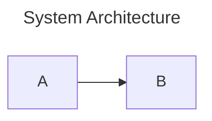

# Typst Pipeline Skill

**Applies to**: Authoring or editing Markdown documents destined for PDF output, registering new documents in `build.yaml`, running builds, and iterating on covers.

---

## 1. Stack Overview

The pipeline is: **Markdown source → Pandoc → Typst → PDF**. Mermaid diagrams are extracted, rendered to SVG via `mermaid.ink`, then substituted back before the Typst compile pass. Everything is driven from the repo root via `make` or `uv run`.

| Tool | Min version | Install |
|------|-------------|---------|
| Typst | 0.12 | `brew install typst` |
| Pandoc | 3.1 | `brew install pandoc` |
| Python | 3.14 | managed by `uv` |
| Python packages | — | `uv add pdf2image pillow pyyaml "qrcode[pil]" tenacity` |

---

## 2. Markdown Authoring Constraints

These are **hard requirements** enforced by the linter and the Typst parser. Violations cause build errors or layout bugs.

### 2.1 YAML Frontmatter

Every document MUST open with:

```yaml
---
title: "Document Title"
subtitle: "Explanatory Subtitle"
author: "Mind Rocket"
date: "March 2026"
---
```

### 2.2 Section Breaks

Every `## Level 2` heading MUST be preceded by a `---` horizontal rule:

```markdown
---

## Section Title
```

**Exception**: headings immediately following the YAML frontmatter block do not need a preceding rule.

### 2.3 Diagram Spacing

All Mermaid fences and manual diagram image references MUST be followed by **at least 2 blank lines**:

````markdown



Next paragraph here.
````

Always include a `title:` in Mermaid frontmatter — it appears in the Typst figure caption.

### 2.4 Manual Diagram Overrides

To use a hand-crafted PNG/SVG instead of the auto-rendered Mermaid diagram, place the image reference **directly before** the fence. The pipeline detects the override and suppresses automated rendering:

```markdown


```

The manual image must exist at `docs/diagrams/{filename}`.

### 2.5 Excluding Content from PDF

Wrap GitHub-only content (revision history, internal notes) in skip markers:

```markdown
<!-- typst-skip-start -->

## Revision History

| Version | Date | Changes |
...

<!-- typst-skip-end -->
```

---

## 3. Build Commands

Always run from the **repo root**. All commands use `uv run` — never call Python or Typst directly.

### Standard builds

```bash
# Full production build (all documents and books, default brand)
make pdf

# Draft build — skips image optimisation, fast iteration
make pdf-draft

# Single document
make pdf-doc DOC=agentic-framework BRAND=mindrocket

# Single book
make pdf-book BOOK=agentic-hive-mind BRAND=mindrocket

# Choose brand
make pdf BRAND=neutral          # Clean monochrome, no logos
make pdf BRAND=mindrocket       # Teal palette, procedural covers
make pdf BRAND=plandek          # Plandek corporate theme
```

### Linting (run after every edit)

```bash
# Verify all docs/drafts/ — reports violations
make lint-typst

# Auto-fix violations in place
uv run python typst/scripts/verify-typst-formatting.py --fix

# Check only staged files (run by pre-commit hook automatically)
uv run python typst/scripts/verify-typst-formatting.py --staged
```

**Always run the linter after editing any Markdown file** before committing. The pre-commit hook runs `--staged` automatically; the `--fix` flag resolves the two most common violations (missing blank lines after diagrams, missing `---` before headings).

### Cover iteration

Cover compilation is fast (<0.1s) — it skips Pandoc and diagram rendering entirely:

```bash
# Preview default cover
make cover BRAND=mindrocket

# Try a specific seed
make cover BRAND=mindrocket SEED=42

# Try a layout style
make cover BRAND=mindrocket COVER_STYLE=minimal SEED=100
make cover BRAND=mindrocket COVER_STYLE=full-bleed SEED=88

# Batch render multiple seeds to build/covers/ for side-by-side comparison
make cover BRAND=mindrocket SEEDS="0 7 13 25 42 77 88 99"
```

### Cleaning

```bash
make clean    # Removes build/ entirely (intermediates + PDFs)
```

---

## 4. Brand Packs

| Brand ID | Character | When to use |
|----------|-----------|-------------|
| `neutral` | Clean monochrome, no third-party branding | Generic or internal documents |
| `mindrocket` | Teal `#69ABB9` accent, procedural algorithmic covers | Mind Rocket publications |
| `plandek` | Deep navy, Plandek logo, CeTZ network cover, QR codes | Plandek corporate deliverables |

### Cover styles (`mindrocket` only)

| Style | Layout |
|-------|--------|
| `split-mesh` *(default)* | 55/45 split — typography left, procedural geometry right |
| `minimal` | Full width, high whitespace, vertical accent stripe |
| `full-bleed` | Immersive dark gradient wash, full cover |

Notable seeds: `42` (harmonic balance), `77` (high-contrast atmosphere), `88` (cross-page gradient), `99` (turbulent nexus). Batch-render to compare.

---

## 5. Registering a New Document

Add an entry to the `documents:` section of `build.yaml` at the repo root:

```yaml
documents:
  my-new-doc:
    src: docs/drafts/my-new-doc.md
    title: "Document Title\nWith Line Break"
    subtitle: "Explanatory subtitle"
    date: "September 2026"
    cover-style: split-mesh   # optional; mindrocket only
    seed: 42                  # optional; controls procedural cover
```

The `title` field supports `\n` for two-line display on the cover. The `src` path is relative to the repo root.

To include the document in an existing **book**, add a part entry under `books:`:

```yaml
books:
  my-book:
    parts:
      - type: interstitial
        params:
          style: part-divider
          label: "Part N"
          title: "Part Title"
          contents: true
          depth: 2
      - type: document
        doc: my-new-doc
```

---

## 6. Output Locations

| Artefact | Path |
|----------|------|
| Final PDFs | `build/pdf/{doc-id}-{brand}.pdf` |
| Book PDFs | `build/pdf/{book-id}.pdf` |
| Mermaid source | `build/mermaid/{doc-id}/{slug}.mmd` |
| Rendered SVGs | `build/diagrams/{doc-id}/{slug}.svg` |
| Optimised images | `build/diagrams-opt/` |
| Typst wrappers | `build/typst/{doc-id}-{brand}.typ` |
| Cover previews | `build/covers/` |

The entire `build/` directory is gitignored. Never commit build artefacts.

---

## 7. Troubleshooting

| Symptom | Cause | Fix |
|---------|-------|-----|
| Build fails with layout error | Missing `---` before `##` heading | Run `--fix` linter |
| Mermaid block renders blank | Missing 2 blank lines after fence | Run `--fix` linter |
| Image not in PDF | Wrong path or missing from `docs/diagrams/` | Check path relative to repo root |
| Cover looks identical across seeds | Wrong `COVER_STYLE` or `BRAND` | Only `mindrocket` supports procedural seeds |
| PDF too large (>3MB) | Image optimisation skipped | Use `make pdf` not `make pdf-draft` |
| `subrepo` needed for typst | `typst/` is a git subrepo | Pull updates with `PATH="/opt/homebrew/bin:/usr/local/bin:$PATH" git subrepo pull typst` |
