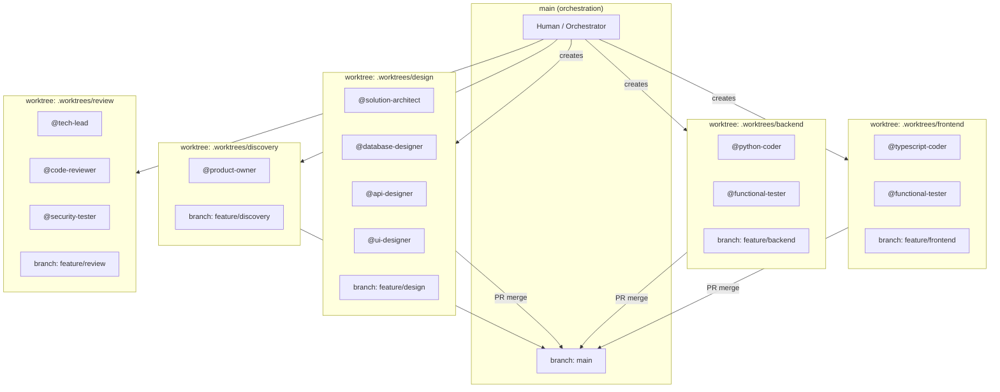
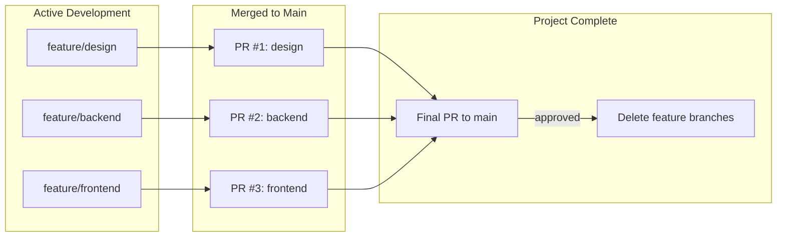
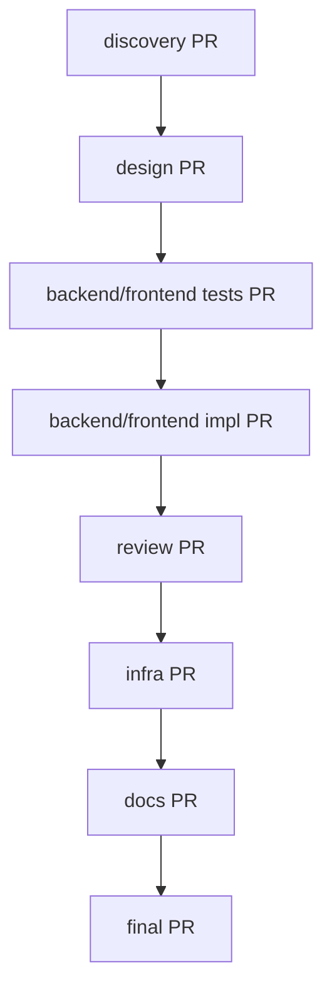

# Agent Interaction Standards

## 1. Introduction

This document outlines the standards for how AI agents shall interact with this software development project. Its purpose is to create a predictable and reliable environment where agents can act as effective and autonomous partners in development.

## 1.1. Standards Compliance

All agents shall follow the standards defined in `./context/standards/` and rules defined in `./context/rules/`. Agents are not required to explicitly reference individual standards—compliance is inherited by operating within this project.

## 1.2. Where Agents Write

Agents write project work output to `./artifacts/`. Shared knowledge (standards, rules, agents, MCP) lives in `./context/`. Structure, locations, and separation of concerns are defined in `context/standards/doc-standards.md` (sections 2.1 and 2.2).

## 2. Agent Context Setup Workflow

When an agent is assigned to work on a new product or feature, it shall follow this context setup workflow to ensure proper project initialization and documentation:

### 2.1. Product Description Verification

*   If no product description is provided in the initial context, the agent shall request one from the user.
*   The product description shall include sufficient detail about the purpose, target users, and key functionality to enable proper requirements analysis.

### 2.2. Documentation Creation Sequence

After obtaining the product description, the agent shall create or amend documents in `artifacts/` in strict order. Locations and recommended structure are defined in `context/standards/doc-standards.md` (section 2.2). At minimum:

1. **`artifacts/product/requirements.md`** (or equivalent): Functional and non-functional requirements using EARS notation as specified in `context/rules/EARS-notation-requirements.mdc`.

2. **`artifacts/architecture/`** (or equivalent): Architecture and design decisions (e.g. `architecture.md`, `data-model.md`).

3. **`artifacts/tasks/`**: Task breakdown for implementation, verified against standards in `context/standards`.

**For each document created or amended, the agent shall pause and wait for explicit human review and approval before proceeding to the next document.**

### 2.3. Placeholder Document Creation

Following the core specification documents, the agent shall create blank placeholder documents as needed (e.g. `artifacts/tasks/todo.md`, `artifacts/bugs/`). See doc-standards section 2.2 for the full recommended structure.

### 2.4. Documentation Standards Compliance

All documentation created during this workflow shall conform to `context/standards/doc-standards.md`, including file locations under `artifacts/`, content formatting, and required elements for requirements (EARS), design, and tasks.

### 2.5. Start scripts

The agent shall create `(project)/scripts/start.sh` for local development startup and a root-level start script for the monorepo. The root-level script orchestrates starting all the needed local services.

### 2.6. Build script

The agent shall create `scripts/build.yaml` following the standards in `context/standards/build-standards.md`.

### 2.7. Workflow Completion

* Upon completion of all build work, the agent shall review common documents as outlined in `context/standards/doc-standards.md` and make very concise changes as required, in particular:
- `README.md`
- Project-specific documentation in `artifacts/`

* Upon completion of all documents, the agent shall summarize what was created and confirm with the user before beginning any implementation work.
*   The agent shall not commence task execution until all context documents have been reviewed and approved by humans.

## 3. Agent Behaviour

To operate autonomously but safely, agents shall adhere to the following behaviours:

### 3.1. Agent Planning and Execution

*   When an agent is assigned a multi-step task, it shall first create a plan and present it for approval.
*   If an agent is to perform a destructive action, then it shall seek confirmation before proceeding. A destructive action is one that is not easily reversible. This includes, but is not limited to, deleting untracked files or running commands that permanently alter a remote resource.
*   When an agent completes a task, it shall state what it did and why.
*   If an agent is in doubt about the project's state, then it shall ask for clarification or read the relevant documentation.

### 3.2. Agent Boundaries

*   The agent shall not perform work that is outside the scope of the currently assigned task.
*   The agent shall not perform any action that contradicts the standards defined in the project and common documentation.
*   The agent shall not modify files outside the directory of the current project.
*   The agent shall not proceed based on their own assumptions until the assumptions are validated with the user.

### 3.3. Version Control

*   The agent shall commit its changes to the version control system after completing each task.
*   The agent shall write a clear and concise commit message that summarizes the purpose of the changes.
*   The commit message shall include the task ID and follow the format specified in `context/standards/coding-standards.md`.

### 3.4. Agent Handoffs

Handoff *locations* are defined in `context/standards/doc-standards.md` (section 2.2.1). This section defines format, required elements, workflow, and handoffs to humans.

#### 3.4.0. Intra-Domain Handoff Format (`HANDOFF.md`)

Each handoff entry shall include:
*   **Timestamp**: ISO 8601 with timezone (e.g. `2026-01-27T18:45:32Z`)
*   **From/To**: Source and destination agent names (e.g. @functional-tester → @python-coder)
*   **Tasks**: Task IDs covered (e.g. DS-001 through DS-008)
*   **Status**: ✅ Complete | 🚧 In Progress | ⚠️ Blocked | 🔴 Failed
*   **Summary**: Brief description of work completed (2–3 sentences)
*   **Notes for Next Agent**: Critical information, gotchas, files to review
*   **Artifacts**: Paths to code, tests, fixtures, documentation
*   **Blockers**: Any issues preventing progress
*   **Commit**: Git commit hash linking handoff to code

Example:
```markdown
### From: @functional-tester
**To**: @python-coder
**Timestamp**: 2026-01-27T18:45:32Z
**Tasks**: DS-001 through DS-008
**Status**: ✅ Complete

**Summary**: All data-service tests written and failing. Test coverage includes yfinance integration, Bronze/Silver stores, cache management, and API endpoints.

**Notes for Next Agent**:
- Test fixtures in tests/fixtures/
- Mock yfinance responses in tests/mocks/
- Expected cache behaviour documented in DS-005

**Artifacts**:
- Tests: `services/data-service/tests/`
- Fixtures: `services/data-service/tests/fixtures/`

**Commit**: abc1234 - test(data-service): DS-001-008 add failing tests
```

#### 3.4.1. Inter-Domain API Handoff Format (`{service}-api.md`)

Required elements for API handoffs:
*   **Endpoint Status**: ✅ Stable | 🚧 In Development | ⚠️ Breaking Change | 🔴 Blocked
*   **Since Timestamp**: When endpoint became stable
*   **OpenAPI Reference**: Lines in openapi.yaml
*   **Example Response**: Path to fixture file
*   **Mock Client**: Path to mock implementation
*   **Consumers**: Which services depend on this endpoint
*   **Dependencies**: Which services this endpoint depends on
*   **Known Issues**: Any bugs or limitations
*   **Breaking Changes**: Upcoming changes with ETAs

#### 3.4.2. Handoff Workflow

When completing a group of tasks:
1. Update the HANDOFF.md file in service directory (intra-domain; format above)
2. If completing integration-ready work, update `artifacts/shared/handoffs/integration-status.md` (inter-domain)
3. If API endpoints are stable, create or update `artifacts/shared/handoffs/{service}-api.md` (inter-domain)
4. Commit changes with handoff updates included
5. Mark tasks as complete in task list

#### 3.4.3. Integration Readiness

Before marking a service as "Ready for Integration", the agent shall ensure:
- All Phase 2 (TDD GREEN) tasks complete
- Phase 3 (Review) approved
- Test coverage >= 90%
- API endpoints match OpenAPI specification
- HANDOFF.md exists in service directory
- Mock client provided in `artifacts/shared/mocks/`
- Example responses in `artifacts/shared/fixtures/`
- Integration status updated in `artifacts/shared/handoffs/integration-status.md`

#### 3.4.4. Templates

Use `artifacts/shared/HANDOFF-TEMPLATE.md` (intra-domain) and `artifacts/shared/handoffs/TEMPLATE-service-api.md` (inter-domain). Locations in doc-standards 2.2.1.

#### 3.4.5. Handoffs to Humans

When an agent pauses or completes work and hands off to a human (e.g. end of day, reboot, or approval gate), it shall create or update a single handoff file so the human knows exactly what to do next.

**Location**: `artifacts/HANDOFF-TO-HUMAN.md` (one file per project; overwrite on each handoff so there is a single place to look.)

**Format**: Concise, clear, and prescriptive. The next step is the primary content.

**Required sections (in order):**

1. **Next step** (required): One to four concrete actions. One line per action. Use imperative mood. No explanation in this section.
2. **State**: One short paragraph or bullet list: what is done, what is in progress, what is blocked. Optionally one-line metrics (e.g. tests 307/406).
3. **Context** (if needed): Paths, branch, commit, or key file the next reader needs to execute the next step. Omit if redundant.

**Optional sections (only when needed):**

- **Commands**: Copy-paste commands for the next step.
- **Blockers**: One line per blocker; omit if none.

**Do not include:** Long narratives, "what went well", "lessons learned", troubleshooting unless it is the next step, or multiple alternative flows. Omit or put elsewhere.

**Example** (concise handoff):

```markdown
# Handoff to Human — 2026-01-28T14:00:00Z

## Next step
1. Resume agent aafa0cf to complete data-service (52 tests left).
2. Resume agent a06f15f to complete vis-service (47 tests left).
3. When both pass, run full suite: 406/406 expected.

## State
Phase 2 (TDD GREEN) 76% complete. llm-service 106/106 done. data-service 111/163; vis-service 69/116. All committed on branch `first-version`.

## Context
- data-service HANDOFF: `services/data-service/HANDOFF.md`
- vis-service HANDOFF: `services/visualisation-service/HANDOFF.md`
- Run tests: `cd services/data-service && uv run pytest tests/ -v`
```

**Template**: Use `artifacts/shared/TEMPLATE-handoff-to-human.md` when creating or updating the handoff. Doc-standards section 2.2 lists this file under `artifacts/shared/`.

## 4. Build, Test, and Automation Artifacts

*   The agent shall store all tests in a `tests/` directory within the project.
*   The agent shall store all scripts used for automation in a `scripts/` directory.
*   The agent shall store all documentation generated during the build process in an `artifacts/guides` directory (or equivalent under `artifacts/`) within the project. See doc-standards section 2.2 for structure.

## 5. Worktree Isolation

To limit the blast radius of agent changes and enable parallel work, agents shall be isolated into **context domains** using git worktrees.

### 5.1. Context Domains

A context domain groups agents that need to share files or context directly. Agents within the same domain work in the same worktree; agents in different domains work in separate worktrees.

#### Generic Domains (Phase-Based)

These domains apply during discovery, design, and review phases:

| Domain | Agents | Shared Context |
|--------|--------|----------------|
| **discovery** | product-owner | requirements.md, user-stories.md |
| **design** | solution-architect, database-designer, api-designer, ui-designer, visual-designer | architecture.md, api-contract.json, data-model.md, schema.sql, openapi.yaml, design/ |
| **review** | tech-lead, code-reviewer, security-tester | All code (read-only), review reports |
| **infra** | gcp-devops | ./artifacts/gcp/, terraform/ |
| **docs** | documentation | ./artifacts/, all specs (read-only) |

#### Project-Specific Domains (Implementation Phase)

For multi-service architectures, define project-specific domains based on service boundaries. These replace the generic `backend` and `frontend` domains during implementation.

**Example: Bollinger Bands Application**

| Domain | Path | Agents | Shared Context |
|--------|------|--------|----------------|
| **shared-types** | `packages/shared-types/` | python-coder, typescript-coder | Pydantic models, TypeScript types, API contracts |
| **data-service** | `services/data-service/` | python-coder, functional-tester | Bronze/Silver stores, market data, caching |
| **vis-service** | `services/visualisation-service/` | python-coder, functional-tester | Bollinger calculator, backtest engine, config |
| **llm-service** | `services/llm-service/` | python-coder, functional-tester | OpenRouter client, narrative generator |
| **frontend** | `frontend/` | typescript-coder, functional-tester | React UI, state management, API clients |

**Domain Dependencies:**
- `shared-types` must complete before parallel service work begins
- Services communicate via REST APIs, not shared code
- Each domain provides mock implementations for testing during parallel development

**See:** Project architecture documentation (`artifacts/architecture.md`) for complete domain definitions, interface contracts, and mock implementation patterns.

### 5.2. Worktree Structure



### 5.3. Cross-Domain Context Sharing

Agents in different domains share context through **pull requests**. This provides:
- Version-controlled handoffs
- Review gates between phases
- Rollback capability
- Audit trail

**Rules for cross-domain sharing:**

1. **Producer domain completes work** → Creates PR to main
2. **Reviewer approves PR** → tech-lead, solution-architect, or human
3. **PR merges to main** → Context now available to all domains
4. **Consumer domain pulls from main** → Gets latest shared context
5. **Branch retention** → Do NOT delete feature branches until the final project PR is merged (enables rollback and debugging)

### 5.4. Branch Lifecycle



**Branch deletion rules:**
- Feature branches remain until the **final project PR** is approved and merged
- Final PR aggregates all domain work into a single reviewable unit
- Only after final PR approval: `./coordinate.sh cleanup` removes worktrees and branches
- This ensures rollback capability throughout the project lifecycle

### 5.5. Merge Sequence

Domains merge in dependency order:



**Review requirements per PR:**

| PR | Reviewers |
|----|-----------|
| discovery → main | Human approval |
| design → main | solution-architect + human |
| tests → main | functional-tester self-review + human |
| backend/frontend → main | tech-lead + human |
| review → main | Human approval |
| infra → main | gcp-devops self-review + human |
| docs → main | Human approval |
| final → main | tech-lead + human |

### 5.6. Worktree Commands

The `coordinate.sh` script manages worktrees:

```bash
# Create all worktrees for a feature
./coordinate.sh worktree create my-feature

# List active worktrees
./coordinate.sh worktree list

# Switch to a domain's worktree
./coordinate.sh worktree switch backend

# Pull latest main into a worktree
./coordinate.sh worktree sync backend

# Create PR from a domain
./coordinate.sh worktree pr backend "Implement task service"

# Cleanup after final PR approved
./coordinate.sh worktree cleanup my-feature
```

### 5.7. Agent Worktree Awareness

Agents shall be aware of their worktree context:

- **Check current worktree**: Before writing files, verify you're in the correct domain worktree
- **Don't cross boundaries**: Never write to paths outside your domain's artifacts
- **Signal completion**: When domain work is complete, notify the orchestrator to create PR
- **Wait for sync**: If you need context from another domain, wait for their PR to merge and sync

**Example agent workflow:**
```
1. Orchestrator: ./coordinate.sh worktree create auth-feature
2. Orchestrator: ./coordinate.sh worktree switch design
3. @solution-architect designs auth system
4. @api-designer creates OpenAPI spec
5. Orchestrator: ./coordinate.sh worktree pr design "Auth system design"
6. Human reviews and approves PR
7. Orchestrator: ./coordinate.sh worktree switch backend
8. Orchestrator: ./coordinate.sh worktree sync backend  # pulls design
9. @functional-tester writes failing tests
10. @python-coder implements auth service
... continues through domains ...
```
