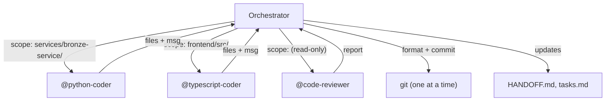

# Agent Interaction Standards

## 1. Introduction

This document outlines the standards for how AI agents shall interact with this software development project. Its purpose is to create a predictable and reliable environment where agents can act as effective and autonomous partners in development.

## 1.1. Standards Compliance

All agents shall follow the standards defined in `./context/standards/` and rules defined in `./context/rules/`. Agents are not required to explicitly reference individual standards; compliance is inherited by operating within this project.

### Rule Injection

Subagents do not auto-load rules. The orchestrator injects rules into each spawn prompt via Rule Resolution (see `context/agents/orchestrator.md`):

1. **Always-apply rules** are hardcoded in the orchestrator definition and included for every agent. When adding a new rule with `alwaysApply: true`, you must also add it to the orchestrator's always-apply list.
2. **Agent-specific rules** come from the agent's `rules:` frontmatter, filtered by glob match against the task's files.

This means a rule with `alwaysApply: true` in its `.mdc` frontmatter will NOT be injected unless it is also listed in the orchestrator's always-apply list.

## 1.2. Input Standards vs Output Artefacts

Agents read from input standards and write to output artefacts. For full directory layout see [doc-standards.md §2.1](doc-standards.md#21-directory-structure).

| Directory | Purpose | Lifecycle |
|----------|---------|-----------|
| `/context/` | Input standards and rules for agents to follow | Persistent; version controlled |
| `{service}/artefacts/` | Service-specific working outputs (bugs, tasks, test results) | Persistent; version controlled |
| `/artefacts/` | System-wide artefacts (architecture, requirements, API contracts) | Persistent; version controlled |

**Workflow**: Agents read standards from `/context/` and write outputs to `{service}/artefacts/` for service-specific work or `/artefacts/` for system-wide artefacts. All artefacts are version controlled and do not require promotion.

## 2. State Recovery After Compaction

When context is compacted or a new session begins mid-project, the agent shall re-orient using two steps:

1. **Glob `**/artefacts/README.md`** and read all matches. Each `artefacts/` directory (root and service-level) maintains a `README.md` describing current state — active tasks, recent decisions, blockers, and key file pointers. See [doc-standards.md §2.3](doc-standards.md#23-service-package-artefact-files) for the format.

2. **Run `git log --oneline -5`** to understand what has changed recently.

These two steps are sufficient for orientation. The agent shall not attempt to re-read all standards or reconstruct project state from scratch.

## 3. Agent Context Setup Workflow

When an agent is assigned to work on a new product or feature, it shall follow this context setup workflow to ensure proper project initialisation and documentation:

### 3.1. Product Description Verification

*   If no product description is provided in the initial context, the agent shall request one from the user.
*   The product description shall include sufficient detail about the purpose, target users, and key functionality to enable proper requirements analysis.

### 3.2. Documentation Creation Sequence

After obtaining the product description, the agent shall create or amend the following documents in strict order:

1. **`/artefacts/requirements.md`**: Functional and non-functional requirements using EARS notation as specified in `/context/rules/EARS-notation-requirements.mdc`.

2. **`/artefacts/architecture.md`**: Architectural and design decisions that describe how the product will be implemented.

3. **`{service}/artefacts/tasks.md`**: Comprehensive task breakdown for implementation, verified against standards in `/context/standards/`.

**For each document created or amended, the agent shall pause and wait for explicit human review and approval before proceeding to the next document.**

### 3.3. Placeholder Document Creation

Following the core specification documents, the agent shall create blank placeholder documents:

*   **`{service}/artefacts/todo.md`**: For listing smaller items, technical debt, or future improvements.
*   **`{service}/artefacts/bugs.md`**: For listing current and past bugs.

### 3.4. Documentation Standards Compliance

All documentation created during this workflow shall conform to the standards outlined in `/context/standards/doc-standards.md`, including:

*   Proper file location within the project structure (system-wide in `/artefacts/`, service-specific in `{service}/artefacts/`)
*   Content formatting and structure requirements
*   Required elements for requirements (EARS notation), design decisions, and task specifications

### 3.5. Start scripts

The agent shall create `(project)/scripts/start.sh` for local development startup and a root-level start script for the monorepo. The root-level script orchestrates starting all the needed local services.

### 3.6. Build script

The agent shall create `scripts/build.yaml` following the standards in `/context/standards/build-standards.md`.

### 3.7. Workflow Completion

* Upon completion of all build work, the agent shall review common documents as outlined in `/context/standards/doc-standards.md` and make very concise changes as required, in particular:
- `README.md` (service root)
- Project-specific artefacts in `{service}/artefacts/`

* Upon completion of all documents, the agent shall summarise what was created and confirm with the user before beginning any implementation work.
*   The agent shall not commence task execution until all context documents have been reviewed and approved by humans.

## 4. Agent Behaviour

To operate autonomously but safely, agents shall adhere to the following behaviours:

### 4.1. Agent Planning and Execution

*   When an agent is assigned a multi-step task, it shall first create a plan and present it for approval.
*   If an agent is to perform a destructive action, then it shall seek confirmation before proceeding. A destructive action is one that is not easily reversible. This includes, but is not limited to, deleting untracked files or running commands that permanently alter a remote resource.
*   When an agent completes a task, it shall state what it did and why.
*   If an agent is in doubt about the project's state, then it shall ask for clarification or read the relevant documentation.

### 4.2. Agent Boundaries

*   The agent shall not perform work that is outside the scope of the currently assigned task.
*   The agent shall not perform any action that contradicts the standards defined in the project and common documentation.
*   The agent shall not modify files outside the directory of the current project.
*   The agent shall not proceed based on their own assumptions until the assumptions are validated with the user.

### 4.3. Tool Usage

Agents have access to multiple tools for different purposes. To minimise user interruption and maximise efficiency, agents shall follow these tool selection policies:

#### 4.3.1. File Operations

*   **Prefer Write/Edit tools** for creating and modifying files. These tools do not require user permission and provide immediate feedback.
*   **Avoid Bash for file operations** such as `cat`, `echo >`, `sed`, `awk`, or heredoc redirection. These require user permission and slow down execution.
*   **Exception**: Bash may be used for file operations when the operation is part of a larger script that includes non-file operations (e.g., git commit with file creation).
*   **Read immediately before each Edit**: The Edit tool validates its changes against a snapshot taken at the most recent Read. If another Edit has run since the last Read, the snapshot is stale and the Edit will fail. Always issue a Read immediately before each Edit — never batch a single Read with multiple subsequent Edits.

#### 4.3.2. Command Execution

*   **Use Bash** for running tests, validation commands, git operations, and other system commands.
*   **Use Bash** when multiple dependent operations must run sequentially (e.g., `uv add package && uv run pytest`).
*   **Preferred pattern**: Use Write/Edit to create files, then Bash to execute tests/validation on those files.

#### 4.3.3. Code Search

*   **Use Glob** for finding files by pattern (e.g., `**/*.py`).
*   **Use Grep** for searching file contents by keyword or regex.
*   **Avoid Bash alternatives** like `find`, `grep`, `rg` commands unless necessary for complex operations.

#### 4.3.4. Tool Selection Summary

| Operation | Preferred Tool | Avoid |
|-----------|---------------|-------|
| Create/modify files | Write, Edit | `echo >`, `cat <<EOF`, `sed` |
| Run tests | Bash (`uv run`, `yarn test`) | Bare `pytest`, `vitest`, `python -m pytest` |
| Git operations | Bash | N/A |
| Find files | Glob | `find`, `ls` |
| Search contents | Grep | `grep`, `rg`, `ack` |
| Install dependencies | Bash (`uv add`, `yarn add`) | Manual edits to lock files, `pip`, `npm` |

#### 4.3.5. Failure-Mode Transparency and Fail-Fast Rule (Strict Invariant)

When standard-mandated tooling (such as `uv`, `yarn dlx`, or specified linter commands) fails due to missing dependencies, path mismatches, or sandbox permissions:
*   Agents **SHALL NOT** silently substitute unapproved alternatives (e.g. falling back to system `python`, `python3`, `pip`, or injecting ad-hoc `PYTHONPATH` exports).
*   Silent fallback masks defects, creates untracked drift, and violates reproducibility.
*   Agents shall treat tool execution failures as environment defects: diagnose the root cause, fix the project configuration, or escalate uncertainty per `context/rules/escalation.mdc`.

### 4.4. Version Control

**Agents do not commit.** The orchestrator commits on their behalf, one at a time. This prevents ref-lock collisions when parallel agents finish around the same time.

*   The agent shall lint its own code before reporting back (see COMMIT section in task-prompt-template.md).
*   The agent shall write a commit message to `/tmp/{task-id}_commit_msg.txt` following `context/templates/commit-message-template.md`.
*   The agent shall report back with the exact file paths it changed and the commit message file path.
*   The orchestrator formats, stages, and commits per agent report: `uv run --project /abs/path ruff format {files}` → `git add {files}` → `git commit -F {message}`.
*   The orchestrator shall push to the remote after completing each sprint (or equivalent logical unit of work).

**Push cadence**: commit per task (orchestrator), push per sprint (orchestrator).

### 4.5. Agent Handoffs

Agents shall communicate context and status through structured handoff documents to enable coordination.

#### 4.5.1. Handoff Types

**Intra-domain handoffs** (within same service/package):
- Location: `{service-directory}/HANDOFF.md`
- Purpose: Coordinate between agents working on the same context domain
- Example: functional-tester → python-coder → tech-lead

**Inter-domain handoffs** (between services):
- Location: `artefacts/shared/handoffs/{service}-api.md`
- Purpose: Coordinate between agents working on different context domains
- Example: bronze-service → vis-service, vis-service → frontend

#### 4.5.2. Handoff Format

Each handoff entry shall include:
- **Timestamp**: ISO 8601 with timezone (e.g., `2026-01-27T18:45:32Z`)
- **From/To**: Source and destination agent names
- **Tasks**: Task IDs covered by this handoff
- **Status**: ✅ Complete | 🚧 In Progress | ⚠️ Blocked | 🔴 Failed
- **Summary**: Brief description of work completed
- **Notes**: Critical information for next agent
- **Artefacts**: Paths to relevant files (code, tests, docs)
- **Blockers**: Any blockers preventing progress
- **Commit**: Git commit hash linking handoff to code

#### 4.5.3. Handoff Workflow

When completing a group of tasks:
1. Update the HANDOFF.md file in service directory (intra-domain)
2. If completing integration-ready work, update `artefacts/shared/handoffs/integration-status.md` (inter-domain)
3. If API endpoints are stable, create/update `artefacts/shared/handoffs/{service}-api.md` (inter-domain)
4. Commit changes with handoff updates included
5. Mark tasks as complete in task list

#### 4.5.4. Integration Readiness

Before marking a service as "Ready for Integration", the agent shall ensure:
- All Phase 2 (TDD GREEN) tasks complete
- Phase 3 (Review) approved
- Test coverage >= 90%
- API endpoints match OpenAPI specification
- HANDOFF.md exists in service directory
- Mock client provided in `artefacts/shared/mocks/`
- Example responses in `artefacts/shared/fixtures/`
- Integration status updated in `artefacts/shared/handoffs/integration-status.md`

#### 4.5.5. Templates

- **Intra-domain**: Use `artefacts/shared/HANDOFF-TEMPLATE.md`
- **Inter-domain**: Use `artefacts/shared/handoffs/TEMPLATE-service-api.md`

### 4.6. Interruptions Logging

An interruption is any moment that required the user's or orchestrating agent's attention before work could continue. Agents shall log interruptions to `artefacts/build/agent-interruptions.md` under a heading matching the current sprint or phase.

**Three types:**

1. **Question** — agent raised a spec ambiguity or blocker it could not resolve autonomously
2. **Tool approval** — user was prompted to approve a tool use before the agent could proceed
3. **Escalation** — subagent flagged a high-impact issue per `escalation.mdc`; orchestrator triaged and either resolved autonomously or forwarded to the human

**What to log**: only interruptions that required external attention. Do NOT log autonomous decisions, design trade-offs, self-resolved linter issues, or other choices the agent made without asking anyone.

**Format (question / tool approval):**

```
### [Sprint N — Phase] Short title
**Agent**: @agent-name
**Type**: Question | Tool approval
**Question/Tool**: What did you need to know, or what tool needed approval?
**Answered by/Approved by**: Orchestrating agent | User
**Resolution**: What was decided?
```

**Format (escalation):**

```
### [Sprint N — Phase] Short title
**Agent**: @agent-name
**Type**: Escalation
**Impact**: High — brief reason (e.g. unbounded data growth, schema change)
**Escalated to**: Orchestrator | Human
**Options considered**: What approaches were identified?
**Resolution**: What was decided, and by whom?
```

**When to log**: append the entry immediately after the interruption is resolved — do not batch at end of sprint.

## 5. Build, Test, and Automation Artefacts

*   The agent shall store all tests in a `tests/` directory within the project.
*   The agent shall store all scripts used for automation in a `scripts/` directory.
*   The agent shall store all test results and build artefacts in the `{service}/artefacts/` directory within the project.

## 6. Git Strategy: Single Branch + Scoped Commits

All agents work on the **same branch**. The orchestrator prevents collisions by assigning each agent a **file scope** — the set of paths the agent may write to and commit. No worktrees, no branch merging, no integration step.

### 6.1. Why Not Worktrees

Worktrees create branch divergence that must be reconciled via merge or rebase. For AI agents this causes:
- **Silent overwrites** — auto-merge picks the wrong side on shared files (HANDOFF.md, tasks.md, artefact files)
- **Stale divergence** — by the time one branch merges, others are based on old state
- **Unresolvable conflicts** — agents lack the context to choose "ours" vs "theirs"

Single-branch with scoped commits eliminates all three by preventing divergence entirely.

### 6.2. File Scope Assignment

The orchestrator assigns each agent a file scope at dispatch time. The scope goes in the spawn prompt under `FILE SCOPE`.

**Rules:**
1. Scopes must be **disjoint** — no two parallel agents may share a writable path
2. Agents shall only write or edit files within their scope — the orchestrator stages and commits on their behalf
3. **Shared state files** (HANDOFF.md, tasks.md, bugs.md) are **orchestrator-owned** — agents report back; the orchestrator updates these files
4. Read access is unrestricted — any agent may read any file

**Scope types:**

| Scope | Example | Use case |
|-------|---------|----------|
| Service directory | `services/bronze-service/` | Implementation agent working on one service |
| Test directory | `services/bronze-service/tests/` | Functional tester for one service |
| Artefact directory | `artefacts/design/` | Design agent producing specs |
| Specific files | `services/bronze-service/src/main.py`, `src/routers/health.py` | Narrow fix or refactor |

**Example parallel dispatch:**

```
Agent A (@python-coder):   FILE SCOPE: services/bronze-service/src/, services/bronze-service/tests/
Agent B (@typescript-coder): FILE SCOPE: frontend/src/, frontend/tests/
Agent C (@code-reviewer):   FILE SCOPE: (read-only — no commits)
```

### 6.3. Commit Cadence

Agents shall request commits at **natural checkpoints**, not only at task completion:

| Checkpoint | Example |
|------------|---------|
| Test written and failing (RED) | `test(bronze): add ticker_info validation tests` |
| Implementation passing (GREEN) | `feat(bronze): implement ticker_info validation` |
| Refactor complete (BLUE) | `refactor(bronze): extract validation helpers` |
| File group complete | `feat(bronze): add all ohlcv router endpoints` |

At each checkpoint, the agent writes a commit message to `/tmp/{task-id}_commit_msg.txt` and reports the file list + message path. The orchestrator commits on their behalf.

**Never** use `git add`, `git commit`, `git add -A`, `git add .`, or `git add --all`. Agents do not touch git. Report changed files; the orchestrator handles the rest.

### 6.4. Parallel Agent Safety

When spawning parallel agents, the orchestrator shall:

1. **Define disjoint scopes** — verify no path overlap before dispatching
2. **Reserve shared files** — HANDOFF.md, tasks.md, bugs.md are not in any agent's scope
3. **Sequence shared-type work** — if multiple agents need to modify `packages/shared-types/`, run them sequentially, not in parallel
4. **Commit sequentially** — when parallel agents report back, the orchestrator formats and commits one at a time (format → stage → commit) to avoid ref-lock collisions



### 6.5. Read-Only Agents

Review agents (tech-lead, code-reviewer, security-tester, principles-reviewer) typically produce **feedback**, not code. Their scope should be:

- **Writable**: their artefact output path only (e.g. `artefacts/reviews/`)
- **Readable**: everything

This prevents reviewers from accidentally committing code changes while still allowing them to persist review reports.

### 6.6. Scope Violations

If an agent needs to write outside its assigned scope:
1. **Stop and report** to the orchestrator with the file path and reason
2. The orchestrator may expand the scope, reassign the file, or handle the write itself
3. The agent shall **not** write outside scope and hope for the best

This is enforced by convention, not tooling. The orchestrator validates scope compliance when reviewing agent reports.
