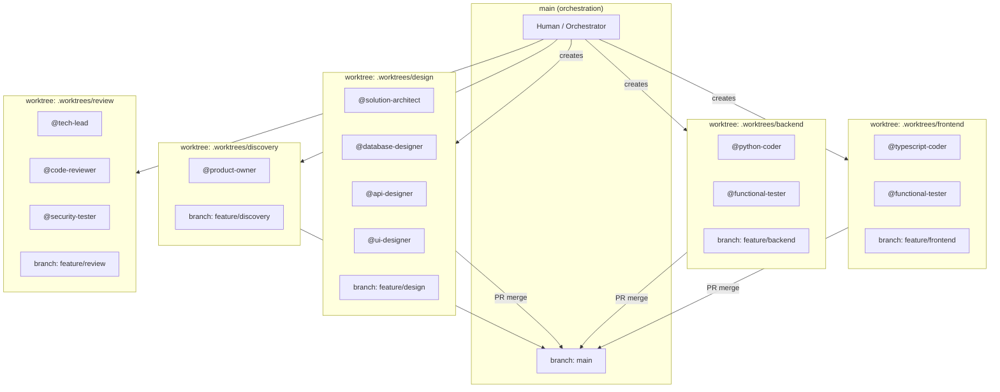
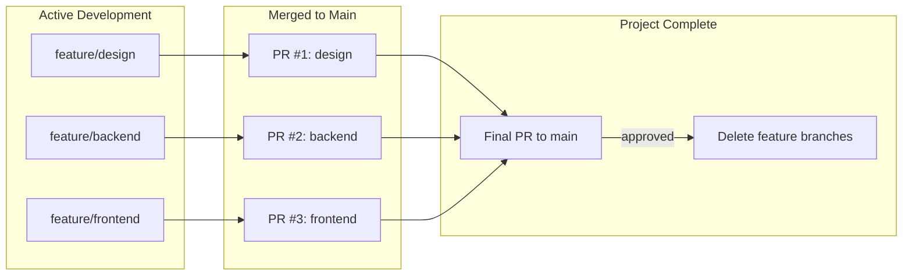
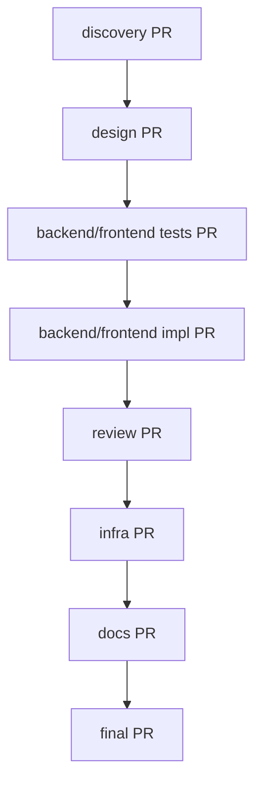

# Agent Interaction Standards

## 1. Introduction

This document outlines the standards for how AI agents shall interact with this software development project. Its purpose is to create a predictable and reliable environment where agents can act as effective and autonomous partners in development.

## 1.1. Standards Compliance

All agents shall follow the standards defined in `./context/standards/` and rules defined in `./context/rules/`. Agents are not required to explicitly reference individual standards; compliance is inherited by operating within this project.

## 1.2. Input Standards vs Output Artefacts

Agents read from input standards and write to output artefacts. For full directory layout see `doc-standards.md` §2.1.

| Directory | Purpose | Lifecycle |
|----------|---------|-----------|
| `/context/` | Input standards and rules for agents to follow | Persistent; version controlled |
| `{service}/artefacts/` | Service-specific working outputs (bugs, tasks, test results) | Persistent; version controlled |
| `/artefacts/` | System-wide artefacts (architecture, requirements, API contracts) | Persistent; version controlled |

**Workflow**: Agents read standards from `/context/` and write outputs to `{service}/artefacts/` for service-specific work or `/artefacts/` for system-wide artefacts. All artefacts are version controlled and do not require promotion.

## 2. Agent Context Setup Workflow

When an agent is assigned to work on a new product or feature, it shall follow this context setup workflow to ensure proper project initialisation and documentation:

### 2.1. Product Description Verification

*   If no product description is provided in the initial context, the agent shall request one from the user.
*   The product description shall include sufficient detail about the purpose, target users, and key functionality to enable proper requirements analysis.

### 2.2. Documentation Creation Sequence

After obtaining the product description, the agent shall create or amend the following documents in strict order:

1. **`/artefacts/requirements.md`**: Functional and non-functional requirements using EARS notation as specified in `/context/rules/EARS-notation-requirements.mdc`.

2. **`/artefacts/architecture.md`**: Architectural and design decisions that describe how the product will be implemented.

3. **`{service}/artefacts/tasks.md`**: Comprehensive task breakdown for implementation, verified against standards in `/context/standards/`.

**For each document created or amended, the agent shall pause and wait for explicit human review and approval before proceeding to the next document.**

### 2.3. Placeholder Document Creation

Following the core specification documents, the agent shall create blank placeholder documents:

*   **`{service}/artefacts/todo.md`**: For listing smaller items, technical debt, or future improvements.
*   **`{service}/artefacts/bugs.md`**: For listing current and past bugs.

### 2.4. Documentation Standards Compliance

All documentation created during this workflow shall conform to the standards outlined in `/context/standards/doc-standards.md`, including:

*   Proper file location within the project structure (system-wide in `/artefacts/`, service-specific in `{service}/artefacts/`)
*   Content formatting and structure requirements
*   Required elements for requirements (EARS notation), design decisions, and task specifications

### 2.5. Start scripts

The agent shall create `(project)/scripts/start.sh` for local development startup and a root-level start script for the monorepo. The root-level script orchestrates starting all the needed local services.

### 2.6. Build script

The agent shall create `scripts/build.yaml` following the standards in `/context/standards/build-standards.md`.

### 2.7. Workflow Completion

* Upon completion of all build work, the agent shall review common documents as outlined in `/context/standards/doc-standards.md` and make very concise changes as required, in particular:
- `README.md` (service root)
- Project-specific artefacts in `{service}/artefacts/`

* Upon completion of all documents, the agent shall summarise what was created and confirm with the user before beginning any implementation work.
*   The agent shall not commence task execution until all context documents have been reviewed and approved by humans.

## 3. Agent Behaviour

To operate autonomously but safely, agents shall adhere to the following behaviours:

### 3.1. Agent Planning and Execution

*   When an agent is assigned a multi-step task, it shall first create a plan and present it for approval.
*   If an agent is to perform a destructive action, then it shall seek confirmation before proceeding. A destructive action is one that is not easily reversible. This includes, but is not limited to, deleting untracked files or running commands that permanently alter a remote resource.
*   When an agent completes a task, it shall state what it did and why.
*   If an agent is in doubt about the project's state, then it shall ask for clarification or read the relevant documentation.

### 3.2. Agent Boundaries

*   The agent shall not perform work that is outside the scope of the currently assigned task.
*   The agent shall not perform any action that contradicts the standards defined in the project and common documentation.
*   The agent shall not modify files outside the directory of the current project.
*   The agent shall not proceed based on their own assumptions until the assumptions are validated with the user.

### 3.3. Tool Usage

Agents have access to multiple tools for different purposes. To minimise user interruption and maximise efficiency, agents shall follow these tool selection policies:

#### 3.3.1. File Operations

*   **Prefer Write/Edit tools** for creating and modifying files. These tools do not require user permission and provide immediate feedback.
*   **Avoid Bash for file operations** such as `cat`, `echo >`, `sed`, `awk`, or heredoc redirection. These require user permission and slow down execution.
*   **Exception**: Bash may be used for file operations when the operation is part of a larger script that includes non-file operations (e.g., git commit with file creation).

#### 3.3.2. Command Execution

*   **Use Bash** for running tests, validation commands, git operations, and other system commands.
*   **Use Bash** when multiple dependent operations must run sequentially (e.g., `uv add package && uv run pytest`).
*   **Preferred pattern**: Use Write/Edit to create files, then Bash to execute tests/validation on those files.

#### 3.3.3. Code Search

*   **Use Glob** for finding files by pattern (e.g., `**/*.py`).
*   **Use Grep** for searching file contents by keyword or regex.
*   **Avoid Bash alternatives** like `find`, `grep`, `rg` commands unless necessary for complex operations.

#### 3.3.4. Tool Selection Summary

| Operation | Preferred Tool | Avoid |
|-----------|---------------|-------|
| Create/modify files | Write, Edit | `echo >`, `cat <<EOF`, `sed` |
| Run tests | Bash | N/A |
| Git operations | Bash | N/A |
| Find files | Glob | `find`, `ls` |
| Search contents | Grep | `grep`, `rg`, `ack` |
| Install dependencies | Bash (`uv add`, `yarn add`) | Manual edits to lock files |

### 3.4. Version Control

*   The agent shall commit its changes to the version control system after completing each task.
*   The agent shall write a clear and concise commit message that summarises the purpose of the changes.
*   The commit message shall include the task ID and follow the format specified in `/context/standards/coding-standards.md`.

### 3.5. Agent Handoffs

Agents shall communicate context and status through structured handoff documents to enable coordination.

#### 3.5.1. Handoff Types

**Intra-domain handoffs** (within same service/package):
- Location: `{service-directory}/HANDOFF.md`
- Purpose: Coordinate between agents working on the same context domain
- Example: functional-tester → python-coder → tech-lead

**Inter-domain handoffs** (between services):
- Location: `artefacts/shared/handoffs/{service}-api.md`
- Purpose: Coordinate between agents working on different context domains
- Example: data-service → vis-service, vis-service → frontend

#### 3.5.2. Handoff Format

Each handoff entry shall include:
- **Timestamp**: ISO 8601 with timezone (e.g., `2026-01-27T18:45:32Z`)
- **From/To**: Source and destination agent names
- **Tasks**: Task IDs covered by this handoff
- **Status**: ✅ Complete | 🚧 In Progress | ⚠️ Blocked | 🔴 Failed
- **Summary**: Brief description of work completed
- **Notes**: Critical information for next agent
- **Artefacts**: Paths to relevant files (code, tests, docs)
- **Blockers**: Any blockers preventing progress
- **Commit**: Git commit hash linking handoff to code

#### 3.5.3. Handoff Workflow

When completing a group of tasks:
1. Update the HANDOFF.md file in service directory (intra-domain)
2. If completing integration-ready work, update `artefacts/shared/handoffs/integration-status.md` (inter-domain)
3. If API endpoints are stable, create/update `artefacts/shared/handoffs/{service}-api.md` (inter-domain)
4. Commit changes with handoff updates included
5. Mark tasks as complete in task list

#### 3.5.4. Integration Readiness

Before marking a service as "Ready for Integration", the agent shall ensure:
- All Phase 2 (TDD GREEN) tasks complete
- Phase 3 (Review) approved
- Test coverage >= 90%
- API endpoints match OpenAPI specification
- HANDOFF.md exists in service directory
- Mock client provided in `artefacts/shared/mocks/`
- Example responses in `artefacts/shared/fixtures/`
- Integration status updated in `artefacts/shared/handoffs/integration-status.md`

#### 3.5.5. Templates

- **Intra-domain**: Use `artefacts/shared/HANDOFF-TEMPLATE.md`
- **Inter-domain**: Use `artefacts/shared/handoffs/TEMPLATE-service-api.md`

## 4. Build, Test, and Automation Artefacts

*   The agent shall store all tests in a `tests/` directory within the project.
*   The agent shall store all scripts used for automation in a `scripts/` directory.
*   The agent shall store all test results and build artefacts in the `{service}/artefacts/` directory within the project.

## 5. Worktree Isolation

To limit the blast radius of agent changes and enable parallel work, agents shall be isolated into **context domains** using git worktrees.

### 5.1. Context Domains

A context domain groups agents that need to share files or context directly. Agents within the same domain work in the same worktree; agents in different domains work in separate worktrees.

#### Generic Domains (Phase-Based)

These domains apply during discovery, design, and review phases:

| Domain | Agents | Shared Context |
|--------|--------|----------------|
| **discovery** | product-owner | requirements.md, user-stories.md |
| **design** | solution-architect, database-designer, api-designer, ui-designer, visual-designer | architecture.md, api-contract.json, data-model.md, schema.sql, openapi.yaml, design/ |
| **review** | tech-lead, code-reviewer, security-tester | All code (read-only), review reports |
| **infra** | gcp-devops | ./artefacts/gcp/, terraform/ |
| **docs** | documentation | ./artefacts/docs/, all specs (read-only) |

#### Project-Specific Domains (Implementation Phase)

For multi-service architectures, define project-specific domains based on service boundaries. These replace the generic `backend` and `frontend` domains during implementation.

**Example: Bollinger Bands Application**

| Domain | Path | Agents | Shared Context |
|--------|------|--------|----------------|
| **shared-types** | `packages/shared-types/` | python-coder, typescript-coder | Pydantic models, TypeScript types, API contracts |
| **data-service** | `services/data-service/` | python-coder, functional-tester | Bronze/Silver stores, market data, caching |
| **vis-service** | `services/visualisation-service/` | python-coder, functional-tester | Bollinger calculator, backtest engine, config |
| **llm-service** | `services/llm-service/` | python-coder, functional-tester | OpenRouter client, narrative generator |
| **frontend** | `frontend/` | typescript-coder, functional-tester | React UI, state management, API clients |

**Domain Dependencies:**
- `shared-types` must complete before parallel service work begins
- Services communicate via REST APIs, not shared code
- Each domain provides mock implementations for testing during parallel development

**See:** Project architecture documentation (`artefacts/architecture.md`) for complete domain definitions, interface contracts, and mock implementation patterns.

### 5.2. Worktree Structure



### 5.3. Cross-Domain Context Sharing

Agents in different domains share context through **pull requests**. This provides:
- Version-controlled handoffs
- Review gates between phases
- Rollback capability
- Audit trail

**Rules for cross-domain sharing:**

1. **Producer domain completes work** → Creates PR to main
2. **Reviewer approves PR** → tech-lead, solution-architect, or human
3. **PR merges to main** → Context now available to all domains
4. **Consumer domain pulls from main** → Gets latest shared context
5. **Branch retention** → Do NOT delete feature branches until the final project PR is merged (enables rollback and debugging)

### 5.4. Branch Lifecycle



**Branch deletion rules:**
- Feature branches remain until the **final project PR** is approved and merged
- Final PR aggregates all domain work into a single reviewable unit
- Only after final PR approval: `./coordinate.sh cleanup` removes worktrees and branches
- This ensures rollback capability throughout the project lifecycle

### 5.5. Merge Sequence

Domains merge in dependency order:



**Review requirements per PR:**

| PR | Reviewers |
|----|-----------|
| discovery → main | Human approval |
| design → main | solution-architect + human |
| tests → main | functional-tester self-review + human |
| backend/frontend → main | tech-lead + human |
| review → main | Human approval |
| infra → main | gcp-devops self-review + human |
| docs → main | Human approval |
| final → main | tech-lead + human |

### 5.6. Worktree Commands

The `coordinate.sh` script manages worktrees:

```bash
# Create all worktrees for a feature
./coordinate.sh worktree create my-feature

# List active worktrees
./coordinate.sh worktree list

# Switch to a domain's worktree
./coordinate.sh worktree switch backend

# Pull latest main into a worktree
./coordinate.sh worktree sync backend

# Create PR from a domain
./coordinate.sh worktree pr backend "Implement task service"

# Cleanup after final PR approved
./coordinate.sh worktree cleanup my-feature
```

### 5.7. Agent Worktree Awareness

Agents shall be aware of their worktree context:

- **Check current worktree**: Before writing files, verify you're in the correct domain worktree
- **Don't cross boundaries**: Never write to paths outside your domain's artefacts
- **Signal completion**: When domain work is complete, notify the orchestrator to create PR
- **Wait for sync**: If you need context from another domain, wait for their PR to merge and sync

**Example agent workflow:**
```
1. Orchestrator: ./coordinate.sh worktree create auth-feature
2. Orchestrator: ./coordinate.sh worktree switch design
3. @solution-architect designs auth system
4. @api-designer creates OpenAPI spec
5. Orchestrator: ./coordinate.sh worktree pr design "Auth system design"
6. Human reviews and approves PR
7. Orchestrator: ./coordinate.sh worktree switch backend
8. Orchestrator: ./coordinate.sh worktree sync backend  # pulls design
9. @functional-tester writes failing tests
10. @python-coder implements auth service
... continues through domains ...
```
