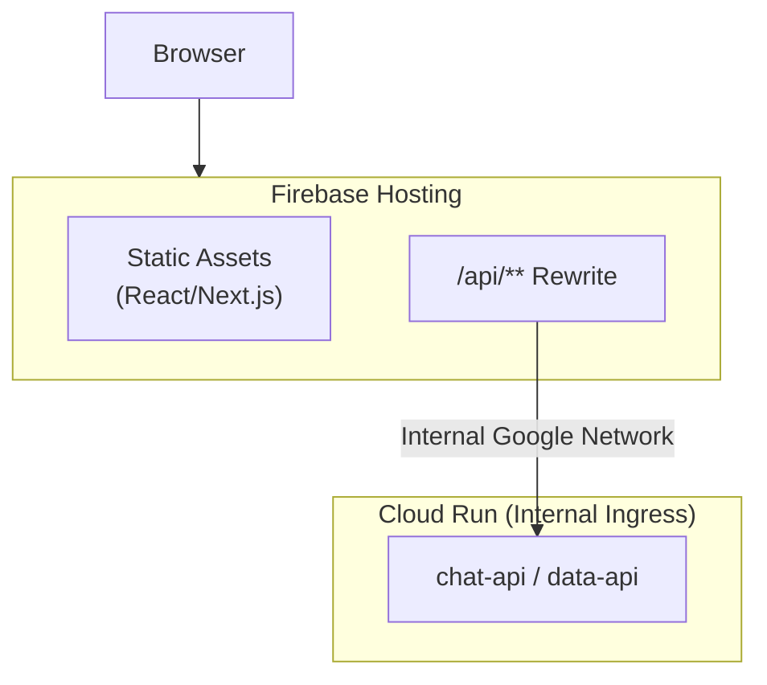

# withineve Build & Deployment Standards

## Overview

This document outlines the standards for preparing projects for CI/CD deployment within the monorepo. Our system uses a hybrid, template-based architecture powered by Google Cloud Build.

## Core Concepts

### 1. Centralized Templates & Decentralized Manifests
Our CI/CD system balances central control with developer autonomy:
- **Centralized Build Templates**: All build, test, and deployment logic is defined in reusable templates located in `workflows/gcp-build/templates/`. This ensures consistency, security, and optimized resource usage.
- **Decentralized Application Manifests**: Each application declares its deployment needs in a `scripts/build.yaml` file. This manifest points to a central template and provides the necessary parameters (substitutions).

### 2. Dynamic Dispatcher
A single `cloudbuild.yaml` at the root of the repository acts as a dynamic dispatcher. On every push, it identifies changed applications and triggers the appropriate build template using the parameters from the application's manifest. The dispatcher includes conflict detection to prevent resource conflicts between parallel builds (see `workflows/gcp-build/artifacts/requirements.md` for details).

### 3. Pre-flight Validation (Fail Fast)
Validation is a key part of the dispatcher pipeline. Before executing a template, the dispatcher MUST validate the application's manifest to ensure all required substitutions are present for the chosen template. This saves time and compute resources by failing fast.

## CI/CD Configuration

### Application Manifest (`scripts/build.yaml`)
**Purpose**: Declares an application's deployment requirements by referencing a central template and providing parameters.

**Technical Requirements**:
- MUST be located in the application's `scripts/` directory.
- MUST specify a `template` that corresponds to a file in `workflows/gcp-build/templates/`.
- MUST provide all required `substitutions` for the chosen template.

### Deployment Region
**Standard Region**: `europe-west2` (London)
**LLM Models**: `europe-west1` (Belgium)

### Secrets Manager Integration
Secrets MUST be managed in GCP Secret Manager.
- The Cloud Build service account requires the "Secret Manager Secret Accessor" role.
- Templates access secrets securely at build time using the `secretEnv` property within the `cloudbuild.yaml` template. Secrets are never hardcoded.

## Service Identity & Authentication

### Workload Identity
All backend services MUST use **Workload Identity** for authentication. This eliminates the need for service account key files.

**How it works**:
- Each Cloud Run service runs with an attached service account
- The service automatically receives credentials via the GCP metadata server
- No JSON key files to manage, rotate, or secure

### Service Account Requirements
Each backend service MUST have its own dedicated service account:

| Service | Service Account |
|---------|-----------------|
| llm-orchestrator | `llm-orchestrator@PROJECT_ID.iam.gserviceaccount.com` |
| chat-api | `chat-api@PROJECT_ID.iam.gserviceaccount.com` |
| data-api | `data-api@PROJECT_ID.iam.gserviceaccount.com` |
| pii-scrubber | `pii-scrubber@PROJECT_ID.iam.gserviceaccount.com` |

**Rationale**:
- Enables fine-grained access control (principle of least privilege)
- Allows audit logging per service
- Simplifies service-to-service authentication

### Ingress Settings
Backend services MUST NOT be publicly accessible. Use the following ingress configuration:

```bash
--ingress internal-and-cloud-load-balancing
--no-allow-unauthenticated
```

**Allowed traffic sources**:
- Other Cloud Run services in the same project
- Cloud Functions, App Engine, GKE in the same project
- Cloud Load Balancers (for API gateway patterns)
- **Firebase Hosting rewrites** (for frontend → backend routing)

**Blocked traffic**:
- Direct public internet access

## Frontend-to-Backend Routing (Firebase Hosting Rewrites)

Frontend applications deployed to Firebase Hosting access backend Cloud Run services through Firebase Hosting rewrites. This eliminates CORS issues and keeps backends secure.

### Architecture



### Configuration

**Firebase Hosting (`firebase.json`)**:
```json
{
  "hosting": {
    "rewrites": [
      {
        "source": "/api/**",
        "run": {
          "serviceId": "chat-api",
          "region": "europe-west2"
        }
      },
      { "source": "**", "destination": "/index.html" }
    ]
  }
}
```

**Frontend API Client**:
```typescript
// Production: '/api' (relative path, Firebase routes to Cloud Run)
// Development: 'http://localhost:8001/api' (direct backend connection)
const API_URL = process.env.VITE_CHAT_API_URL || 'http://localhost:8001/api'
```

**Backend Route Prefix**:
```python
# All routes prefixed with /api for Firebase Hosting rewrite compatibility
app.include_router(conversations_router, prefix="/api")
```

### Benefits

| Aspect | Direct Cloud Run | Firebase Hosting Rewrite |
|--------|-----------------|-------------------------|
| CORS | Required (cross-origin) | Not needed (same origin) |
| Backend ingress | Must allow public | Internal only |
| IAM | `allUsers` or token forwarding | Not needed |
| Security | Exposed to internet | Protected behind Firebase |

### Implementation Checklist

- [ ] Backend routes prefixed with `/api`
- [ ] Firebase `firebase.json` includes Cloud Run rewrite
- [ ] Frontend uses relative `/api` path in production
- [ ] Cloud Run service uses `internal-and-cloud-load-balancing` ingress
- [ ] No `allUsers` IAM binding on Cloud Run service

### Related Documentation

- Firebase Hosting + Cloud Run: https://firebase.google.com/docs/hosting/cloud-run
- Project-specific routing guides should be documented in service README.md files

### Service-to-Service Authentication
For one service to call another (e.g., chat-api calling llm-orchestrator):

1. **Grant invoker permission**:
   ```bash
   gcloud run services add-iam-policy-binding TARGET_SERVICE \
     --region=europe-west2 \
     --member="serviceAccount:CALLER_SERVICE_ACCOUNT" \
     --role="roles/run.invoker"
   ```

2. **Calling service fetches identity token** (automatic via metadata server):
   ```typescript
   const tokenResponse = await fetch(
     `http://metadata.google.internal/computeMetadata/v1/instance/service-accounts/default/identity?audience=${targetUrl}`,
     { headers: { 'Metadata-Flavor': 'Google' } }
   );
   const token = await tokenResponse.text();
   ```

3. **Include token in request**:
   ```typescript
   const response = await fetch(targetUrl, {
     headers: { 'Authorization': `Bearer ${token}` }
   });
   ```

## Source-based Deployment

Preferred for most deployments. This approach involves deploying the source code directly and letting the cloud provider (e.g., Google Cloud Run) handle the containerization using buildpacks. This method is equally applicable to Python and TypeScript backend services.

**Core Requirements**:
- The application MUST have a valid language-specific project file that defines its dependencies:
  - **Python**: `requirements.txt`, `pyproject.toml`, or `poetry.lock`
  - **TypeScript/Node.js**: `package.json` (with associated `package-lock.json` or `yarn.lock`)
- The `template` specified in the `scripts/build.yaml` manifest MUST support source-based deployments (e.g., a template that uses `gcloud run deploy --source`).

**Buildpack Support**:
- **Python Services**: Google Cloud automatically detects Python projects and installs dependencies using pip/poetry
- **TypeScript Services**: Google Cloud automatically compiles TypeScript and installs Node.js dependencies

**Rationale**:
- Simplifies the development workflow by removing the need to write and maintain a `Dockerfile`.
- Leverages Google Cloud's optimized buildpacks for both Python and TypeScript ecosystems.
- Enables consistent deployment workflows across different backend technologies.

### Production Startup Configuration

Buildpacks require language-specific configuration to determine how to start the application in production:

#### Python Services
**File**: `Procfile` (in application root)

```
web: uvicorn main:app --host 0.0.0.0 --port $PORT
```

- The `$PORT` environment variable is automatically set by Cloud Run
- Use `uvicorn` for FastAPI applications
- The `Procfile` is REQUIRED for Python buildpacks to know how to start the service

#### TypeScript/Node.js Services
**File**: `package.json` (start script)

```json
{
  "scripts": {
    "start": "node dist/src/server.js"
  }
}
```

- Node.js buildpacks automatically use the `start` script from `package.json`
- Ensure the `start` script runs the compiled JavaScript (not TypeScript)
- No `Procfile` is needed for Node.js applications

### Local Development vs Production

| Aspect | Local Development (`scripts/start.sh`) | Production (Buildpack) |
|--------|----------------------------------------|------------------------|
| **Purpose** | Developer convenience | Cloud Run deployment |
| **Hot Reload** | Yes (`--reload` flag) | No |
| **Dependencies** | Uses `uv sync` / `yarn install` | Buildpack handles |
| **Port** | Fixed (e.g., 8003) | `$PORT` env variable |
| **Env Vars** | Loaded from `.env` | Set in Cloud Run config |

## Container-based Deployment

User for specialised components e.g. LLM model deployment. This approach involves deploying the source code into a Docker container and letting the container provider (e.g. Google Cloud Build) handle deployment.

### Deployment Startup Script (`start.sh`)
**Purpose**: Initialises and runs the application in the container.

## Local Development

### Development Startup Script (`start.sh`)
**Purpose**: Initializes and runs the application in a local development mode.

**Technical Requirements**:
- Should mimic the production environment as closely as possible.
- Must handle environment variable loading from a local `.env` file.
- Should provide clear startup status and accessibility information.
- Must handle proper signal handling for a clean shutdown.
