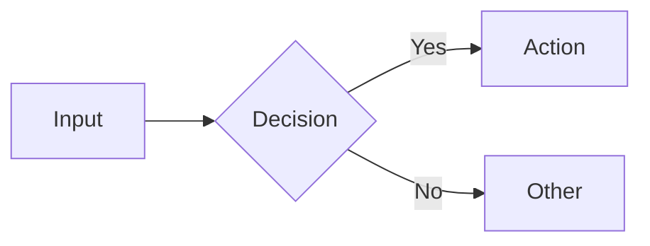

# Documentation Standards

## 1. Introduction

This document outlines the standards for documentation across the software projects in this monorepo. Its purpose is to ensure consistent, discoverable, and useful documentation for all developers and AI agents.

## 2. Project Context

### 2.1. Directory Structure

This repository is a monorepo, containing multiple projects (services and packages).

*   **Monorepo Root:** The top-level directory of the repository.
*   **Project Root:** A directory within the monorepo that contains a specific project (e.g., `/services/data-service/`, `/packages/shared-types/python/`).

The documentation shall be structured as follows:

*   **`/context/`**: Input files at monorepo root containing standards and rules for all projects
    *   `/context/standards/`: Development standards (coding, testing, documentation, workflow)
    *   `/context/rules/`: Development guidelines (EARS notation, TDD practices)
*   **`/artefacts/`**: Output files representing work completed
    *   Monorepo root `/artefacts/`: System-wide artefacts (architecture, requirements, API contracts, design)
    *   Project-level `{service}/artefacts/`: Service-specific artefacts (bugs, tasks, todo, test results)

For example:

```
/ (monorepo root)
├── context/                         # INPUT: Standards & rules
│   ├── standards/
│   │   ├── coding-standards.md
│   │   ├── doc-standards.md
│   │   └── testing-standards.md
│   └── rules/
│       └── EARS-notation-requirements.mdc
│
├── artefacts/                       # OUTPUT: System-wide
│   ├── product/                     # Product & requirements
│   │   ├── requirements.md
│   │   ├── user-stories.md
│   │   └── open-questions.md
│   ├── architecture/                # System architecture
│   │   ├── architecture.md
│   │   ├── data-model.md
│   │   └── api-catalogue.md
│   ├── api/                         # API specifications
│   │   ├── openapi.yaml
│   │   └── api-design-guide.md
│   ├── design/                      # UI/UX design
│   │   ├── design-tokens.json
│   │   ├── components.md
│   │   ├── wireframes.md
│   │   ├── user-flows.md
│   │   └── accessibility.md
│   ├── build/                       # Project management & quality gates
│   │   ├── bugs.md
│   │   ├── tasks.md
│   │   ├── todo.md
│   │   ├── code-review.md
│   │   ├── tech-review.md
│   │   └── architecture-review.md
│   ├── test-results/                # Test execution outputs only
│   │   ├── functional-tests.json
│   │   ├── test-gaps.md
│   │   ├── security-audit/
│   │   └── ui-test-results/
│   └── shared/                      # Cross-service resources
│       ├── handoffs/
│       ├── fixtures/
│       └── mocks/
│
├── services/data-service/           # Service example
│   ├── artefacts/                   # OUTPUT: Service-specific
│   │   ├── bugs.md
│   │   ├── tasks.md
│   │   ├── todo.md
│   │   ├── test-results/
│   │   └── fixtures/
│   ├── HANDOFF.md                   # Intra-service coordination
│   ├── src/
│   ├── tests/
│   └── README.md
│
└── packages/shared-types/python/    # Package example
    ├── artefacts/
    │   ├── bugs.md
    │   ├── tasks.md
    │   ├── todo.md
    │   └── test-results/
    ├── bollinger_types/
    ├── tests/
    └── README.md
```

### 2.2. Artifact Organization Principle

**Rule**: Context is organised by domain boundary.

*   **Service-specific artefacts** → `{service}/artefacts/`
    *   Example: Bugs only affecting data-service go in `services/data-service/artefacts/bugs.md`
*   **System-wide artefacts** → `/artefacts/` (monorepo root)
    *   Example: System architecture affecting all services goes in `/artefacts/architecture.md`
*   **Cross-service coordination** → `/artefacts/shared/`
    *   Example: Integration handoffs go in `/artefacts/shared/handoffs/`

### 2.3. Service/Package Artifact Files

Each service or package shall maintain the following files in its `artefacts/` directory:

*   **`bugs.md`**: Current and past bugs (per bug-standards.md format)
    *   Format: One line per bug with status, description, file path, and link
    *   Example: `[TODO] | Cache isolation bug INSTEAD shared cache | src/routers/cache.py:83 | #BUG-001`
*   **`tasks.md`**: Current, past, and future tasks
    *   The project root shall be defined and all file paths shall be relative to the project root
    *   For each task assigned to an agent, `tasks.md` shall specify whether the agent shall commit its changes automatically upon completion or shall wait for user approval before committing
    *   Each task description shall provide the necessary and sufficient context for an agent to execute the task, assuming it operates in a standalone context
*   **`todo.md`**: Technical debt and future improvements
    *   Smaller items not urgent enough for tasks.md
    *   Deferred low-priority bugs
    *   Future enhancements and optimisations
*   **`code-review.md`**: Code review findings (quality gate, created by @code-reviewer)
*   **`tech-review.md`**: Technical lead review findings (architecture compliance gate, created by @tech-lead)
*   **`test-results/`**: Test execution outputs only (functional-tests.json, coverage reports)
*   **`fixtures/`**: Service-specific test data (optional)

### 2.4. Agent Handoff Files

The system shall maintain handoff documentation for agent coordination:

#### Service-Level Handoffs (`HANDOFF.md`)

Each service directory shall contain a `HANDOFF.md` file at its root for intra-domain coordination:

*   **Location**: `{service-directory}/HANDOFF.md`
*   **Purpose**: Track handoffs between agents working on the same context domain
*   **Format**: Use template from `/artefacts/shared/HANDOFF-TEMPLATE.md`

Required elements:
*   **Timestamp**: ISO 8601 with timezone (e.g., `2026-01-27T18:45:32Z`)
*   **From/To Agents**: Source and destination agent names with @ prefix
*   **Task IDs**: Range of tasks covered (e.g., `DS-001 through DS-008`)
*   **Status**: ✅ Complete | 🚧 In Progress | ⚠️ Blocked | 🔴 Failed
*   **Summary**: Brief description of work completed (2-3 sentences)
*   **Notes for Next Agent**: Critical information, gotchas, files to review
*   **Artifacts**: Paths to code, tests, fixtures, documentation
*   **Blockers**: Any issues preventing progress
*   **Commit Hash**: Git commit linking handoff to code changes

Example:
```markdown
### From: @functional-tester
**To**: @python-coder
**Timestamp**: 2026-01-27T18:45:32Z
**Tasks**: DS-001 through DS-008
**Status**: ✅ Complete

**Summary**: All data-service tests written and failing. Test coverage
includes yfinance integration, Bronze/Silver stores, cache management,
and API endpoints.

**Notes for Next Agent**:
- Test fixtures in tests/fixtures/
- Mock yfinance responses in tests/mocks/
- Expected cache behaviour documented in DS-005

**Artifacts**:
- Tests: `tests/`
- Fixtures: `tests/fixtures/`
- Tasks: `artefacts/tasks.md`

**Commit**: abc1234 - test(data-service): DS-001-008 add failing tests
```

#### Cross-Domain Handoffs

For coordination between services, use `/artefacts/shared/handoffs/`:

*   **Integration Status**: `/artefacts/shared/handoffs/integration-status.md`
  - Master coordination file showing readiness of all domains
  - Updated when services reach integration-ready state

*   **Service API Status**: `/artefacts/shared/handoffs/{service}-api.md`
  - Documents API endpoint stability for consumers
  - Created when endpoints are stable and ready for integration
  - Template: `/artefacts/shared/handoffs/TEMPLATE-service-api.md`

Required elements for API handoffs:
*   **Endpoint Status**: ✅ Stable | 🚧 In Development | ⚠️ Breaking Change | 🔴 Blocked
*   **Since Timestamp**: When endpoint became stable
*   **OpenAPI Reference**: Lines in openapi.yaml
*   **Example Response**: Path to fixture file in `/artefacts/shared/fixtures/`
*   **Mock Client**: Path to mock implementation in `/artefacts/shared/mocks/`
*   **Consumers**: Which services depend on this endpoint
*   **Dependencies**: Which services this endpoint depends on
*   **Known Issues**: Any bugs or limitations
*   **Breaking Changes**: Upcoming changes with ETAs

### 2.5. Project `README.md`

The system shall maintain a `README.md` file in the root of each project. The `README.md` file shall describe:

-   The project's purpose
-   Instructions for setting up the development environment and running common commands
-   A summary of important architectural or technical decisions
-   A list of other projects or services that this project depends on
-   Location of project artefacts (e.g., "See `artefacts/` for bugs, tasks, and test results")

## 3. Common Context Resources

The system maintains shared standards and rules in `/context/` for use across all projects.

```
/ (monorepo root)
├── context/
│   ├── standards/           # Development standards
│   │   ├── agent-standards.md
│   │   ├── bug-standards.md
│   │   ├── coding-standards.md
│   │   ├── doc-standards.md
│   │   ├── testing-standards.md
│   │   └── workflow-standards.md
│   └── rules/              # Development rules
│       └── EARS-notation-requirements.mdc
└── services/               # Projects reference context/
```

### 3.1. Common Context Resources

*   **`context/standards/`**: Development standards covering coding, testing, building, documentation, and workflow processes
*   **`context/rules/`**: Development guidelines including EARS requirements notation and TDD practices

### 3.2. Context File Quality Standards

All project context files shall be reviewed from the perspective of an expert context engineer to ensure they are:

*   **Necessary**: Each piece of information serves a clear purpose in understanding or developing the project
*   **Sufficient**: Contains all essential information needed for autonomous agent understanding and execution
*   **Human-Friendly**: Easily understandable by humans without requiring specialised knowledge, avoiding unnecessary technical jargon
*   **Non-Verbose**: Concise and focused, avoiding redundancy while not consuming unnecessary tokens in AI context windows
*   **Actionable**: Provides clear, specific guidance that enables effective decision-making and implementation

## 4. System-Wide Artefacts

The monorepo root `/artefacts/` directory contains system-wide artefacts that affect multiple services, organised by category:

### 4.1. Product (`/artefacts/product/`)

*   **`discovery-notes.md`**: Refined problem statement from exploratory conversations (created by @product-expert)
*   **`requirements.md`**: System-wide functional and non-functional requirements (EARS notation)
*   **`user-stories.md`**: End-to-end user stories spanning multiple services
*   **`open-questions.md`**: Unresolved questions about requirements or scope

### 4.2. Architecture (`/artefacts/architecture/`)

*   **`architecture.md`**: System architecture describing all services, their interactions, and data flow
*   **`data-model.md`**: Conceptual data model showing entities and relationships across the system
*   **`api-catalogue.md`**: Catalogue of all service APIs with their purposes and relationships
*   Other architecture documents (e.g., reliability strategies, ADRs)

### 4.3. API Specifications (`/artefacts/api/`)

*   **`openapi.yaml`**: Complete API specification for all services
*   **`api-design-guide.md`**: API design standards and conventions

### 4.4. Design System (`/artefacts/design/`)

*   **`design-tokens.json`**: Design system tokens (colours, typography, spacing)
*   **`components.md`**: Reusable component specifications
*   **`wireframes.md`**: UI wireframes and layouts
*   **`user-flows.md`**: User journey and flow diagrams
*   **`accessibility.md`**: Accessibility requirements and guidelines
*   **`visuals/`**: Generated mockups and diagrams

### 4.5. Build & Project Management (`/artefacts/build/`)

Project management artefacts and quality gate decisions:

*   **`bugs.md`**: System-wide bugs affecting multiple services
*   **`tasks.md`**: Current, past, and future tasks for system-level work
*   **`todo.md`**: Technical debt and future improvements spanning multiple services
*   **`code-review.md`**: Code review findings (quality gate)
*   **`tech-review.md`**: Technical lead review findings (architecture compliance gate)
*   **`architecture-review.md`**: Architecture review findings (design gate)
*   **`test-and-fix-plan.md`**: Plans for addressing test failures or bugs

### 4.6. Test Results (`/artefacts/test-results/`)

Automated test execution outputs only (no human reviews):

*   **`functional-tests.json`**: pytest/vitest execution output
*   **`test-gaps.md`**: Test coverage gap analysis
*   **`security-audit/`**: Security testing results (OWASP, vulnerabilities)
*   **`ui-test-results/`**: UI/browser test outputs and screenshots

### 4.7. Shared Resources (`/artefacts/shared/`)

*   **`handoffs/`**: Cross-service coordination files
*   **`fixtures/`**: Test data used by multiple services (e.g., `AAPL_1y.json`)
*   **`mocks/`**: Mock implementations for cross-service testing

## 5. Decision Criteria

When creating a new artifact, apply these rules:

**Q1**: Is this artifact only relevant to one service/package?
- ✅ YES → Put in `{service}/artefacts/`
- ❌ NO → Continue to Q2

**Q2**: Does this artifact describe system-wide architecture/contracts?
- ✅ YES → Put in root `/artefacts/`
- ❌ NO → Continue to Q3

**Q3**: Is this artifact for coordination between services?
- ✅ YES → Put in `/artefacts/shared/`
- ❌ NO → Re-evaluate Q1-Q3

**Q4**: Is this a standard/rule for developers to follow?
- ✅ YES → Put in `/context/standards/` or `/context/rules/`
- ❌ NO → It's an output, use artefacts per Q1-Q3
## 6. Diagram Standards

### 6.1. Prefer Mermaid

Use Mermaid notation for all diagrams. Renders natively in GitHub, GitLab, Notion.

**Diagram Types:**

| Type | Use For | Syntax Start |
|------|---------|--------------|
| flowchart | Workflows, processes | `flowchart TD` |
| sequenceDiagram | API calls, interactions | `sequenceDiagram` |
| stateDiagram-v2 | State machines | `stateDiagram-v2` |
| erDiagram | Data models | `erDiagram` |
| classDiagram | Class hierarchies | `classDiagram` |

**Example:**


**Exceptions:**
- Inline code where ASCII is the code itself
- Terminal output representations
- Simple one-liners: `A → B → C`

## 7. Writing Quality Standards

### 7.1. Avoid AI Slop Patterns

**Patterns to Avoid:**

| Pattern | Example | Fix |
|---------|---------|-----|
| Em dash overuse | text — more text — even more | Use colons, semicolons, or split sentences |
| Triads | "fast, efficient, reliable" | Vary list lengths |
| Vapid transitions | "Furthermore", "Moreover" | Cut or be specific |
| Empty preambles | "In this section we will..." | Start with content |
| Hedging | "It's important to note that" | Just state the thing |
| Generic analogies | Vague metaphors | Use concrete examples |
| Monotonous rhythm | Same sentence length | Vary length |

**Self-Check Before Submitting:**
- No em dashes (use commas/semicolons)
- No three-beat patterns
- No filler transitions
- Every sentence adds value
- Varied sentence length
- Specific examples, not vague claims

**Core Test:** Human writing has intent behind every choice. If removing a sentence loses nothing, remove it.

## 8. Documentation Maintenance

### 8.1. Automated Integrity Checks

CI validates cross-file references on PR to main.

**Check Scope:**
- Parse: README.md, tasks.md, bugs.md, context/*
- Validate refs: `[tasks.md#L25](./tasks.md#L25)`
- Verify target exists, line in bounds

**Enforcement:** Broken ref → CI fails → Fix before merge.

### 8.2. UX/UI Documentation Standards

**Component Documentation:**
- Include state variations (default, hover, focus, error, loading, disabled)
- Document responsive breakpoints
- Specify accessibility requirements (ARIA labels, keyboard navigation)
- Provide usage examples with code snippets

**Design System Documentation:**
- Maintain design tokens in `artefacts/design/design-tokens.json`
- Document component relationships and dependencies
- Include visual examples (screenshots or Mermaid diagrams)
- Specify when to use vs when not to use each component

**User Flow Documentation:**
- Use Mermaid sequence diagrams or flowcharts
- Show happy path and error cases
- Document decision points and branching logic
- Include user feedback and loading states
