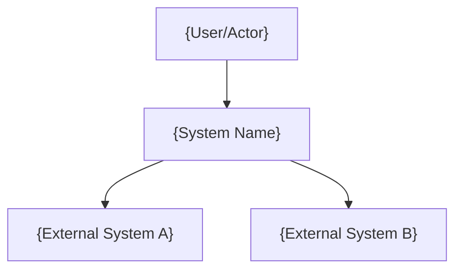
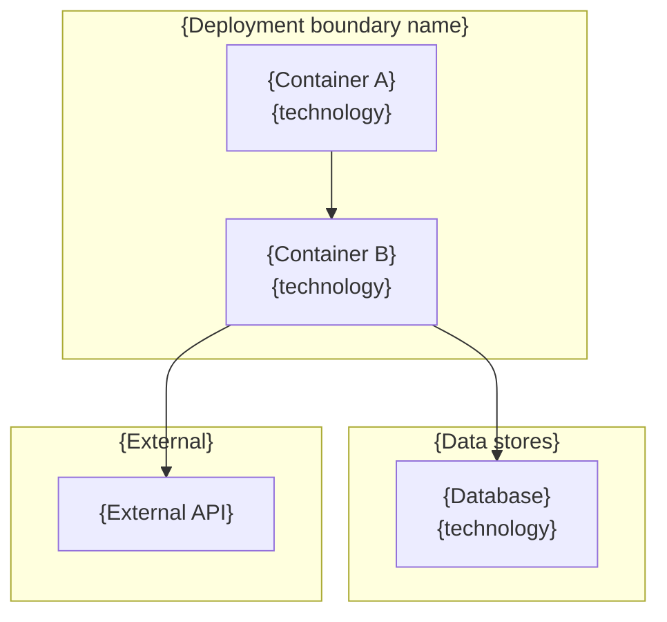
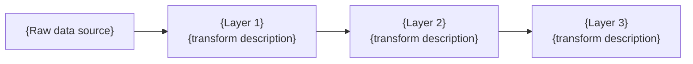
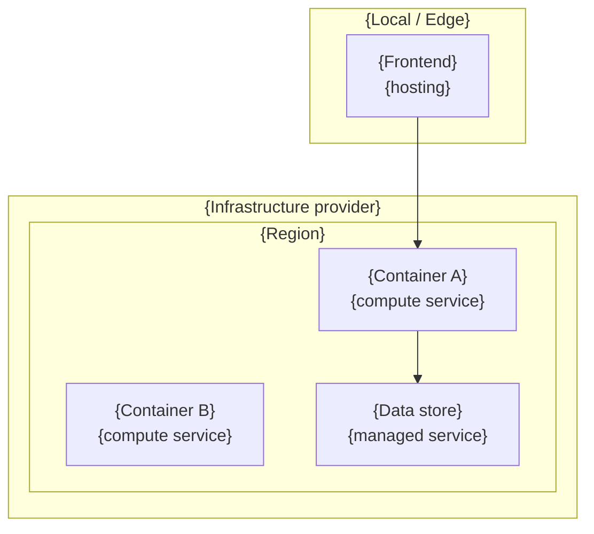

# Architecture: {System Name}

> This document is the authoritative reference for how the system is built. Create it once the system has a deployed or locally-running form. Update it when the system changes — never let it describe intent; only describe reality. Consumed by: solution-architect, python-coder, typescript-coder, database-designer, api-designer, tech-lead.

**Canonical references** (link, do not duplicate):
> - **API specification**: `{path to openapi.yaml or api-endpoints.md}`
> - **Architecture decisions**: `{path to ADR log}`
> - **Deployment config**: `{path to IaC or deploy config}`

---

## 1. System Purpose

{2-4 sentences: what the system does, who uses it, and the core value proposition. Write in present tense. Do not describe roadmap items.}

---

## 2. Key Design Decisions

<!-- Record the decisions that shape the system's structure. Each entry answers "why is it built this way?" For lightweight projects, inline the decisions here. For larger projects, link to a separate ADR log and summarise only the decision and rationale here. -->

### {Decision title}

<!-- Repeat this block for each key decision. Order by architectural impact, not chronology. -->

**Decision**: {What was decided — one sentence.}

**Rationale**: {Why this option was chosen over alternatives — 2-3 sentences. Name the rejected alternatives if they would surprise a reader.}

**Consequences**: {What this decision enables and constrains — 1-2 sentences.}

<!-- Link to full ADR if a separate log exists: See [ADR-NNN]({path}#adr-nnn-title) -->

---

## 3. System Context

<!-- C4 Level 1: show the system as a single box, its users, and the external systems it interacts with. This is the "zoom out" view. -->



| Actor / External System | Interaction | Protocol |
|------------------------|-------------|----------|
| {User/Actor} | {What they do with the system} | {HTTP, gRPC, UI, etc.} |
| {External System A} | {What data or service is exchanged} | {Protocol} |

---

## 4. Container Map

<!-- C4 Level 2: the deployable units (services, apps, databases, message queues) and their relationships. For a monolith, show the application and its data stores. For microservices, show each service. Use a Mermaid diagram for the relationships, then a table for the details. -->



### Container Details

<!-- One subsection per container. Include only what another developer needs to understand the container's role. -->

#### {Container Name}

- **Responsibility**: {Single sentence — what this container does and does not do.}
- **Technology**: {Language, framework, key libraries.}
- **Owns**: {Data or state this container is authoritative for.}
- **Exposes**: {API surface — endpoint groups or topic names, not every endpoint. Link to API spec for full detail.}
- **Consumes**: {Other containers or external systems this depends on.}

<!-- Repeat for each container. -->

<!-- Include if microservices -->
### Communication Rules

| Boundary | Mechanism | Notes |
|----------|-----------|-------|
| {e.g. Inter-service sync} | {e.g. HTTP/REST} | {e.g. Timeout policy, retry behaviour} |
| {e.g. Async events} | {e.g. Message queue, pg_notify} | {e.g. At-least-once delivery} |
<!-- End microservices section -->

---

## 5. Cross-Cutting Concerns

<!-- Patterns and decisions that apply across multiple containers. Include only concerns that are actually implemented — not aspirational. Each row should be verifiable in the codebase. -->

| Concern | Approach | Where Implemented |
|---------|----------|-------------------|
| {e.g. Authentication} | {e.g. JWT via Firebase Auth} | {e.g. Frontend + vis-service middleware} |
| {e.g. Resilience} | {e.g. Circuit breaker (pybreaker)} | {e.g. bronze-service, llm-service} |
| {e.g. Logging} | {e.g. Structured JSON logs} | {e.g. All services} |
| {e.g. Error handling} | {e.g. Problem Details RFC 9457} | {e.g. All HTTP services} |

<!-- Add subsections for any cross-cutting concern that needs more than a table row to explain. -->

---

## 6. Data Architecture

<!-- Describe the storage strategy: what is stored where, and the rules that govern the split. If using a single database, a table inventory is sufficient. If using multiple stores, explain the split rule first. -->

### Storage Split Rule

<!-- Omit this subsection if only one data store exists. -->

{State the rule that determines which store owns which data. The rule should be a single predicate, not a list of exceptions.}

| Store | Technology | Purpose | Data Characteristics |
|-------|-----------|---------|---------------------|
| {Store A} | {e.g. PostgreSQL} | {e.g. All domain and computation data} | {e.g. Relational, queried together} |
| {Store B} | {e.g. Firebase} | {e.g. Auth and session-start preferences} | {e.g. Needed before main DB connection} |

### Data Model

<!-- Show the key entities and their relationships. Use a Mermaid ER diagram for relational stores. For document stores, describe the document shapes in a table. Include only the entities that matter for understanding the architecture — not every column. -->

```mermaid
erDiagram
    {ENTITY_A} ||--o{ {ENTITY_B} : "{relationship}"
    {ENTITY_B} ||--o{ {ENTITY_C} : "{relationship}"
```

| Table / Collection | Layer / Domain | Purpose | Key Characteristics |
|-------------------|---------------|---------|---------------------|
| {table_name} | {e.g. Bronze, User, Config} | {What this table stores} | {e.g. TimescaleDB hypertable, soft-delete} |

<!-- Include if the system has a data pipeline or medallion architecture -->
### Data Flow



{1-2 sentences describing the pipeline stages and what each transformation accomplishes.}
<!-- End data pipeline section -->

---

## 7. Deployment Topology

<!-- Show how containers map to infrastructure. Use a Mermaid deployment diagram or a table. Include only what is deployed — not what might be deployed later. -->



| Container | Compute | Region | Scaling | Notes |
|-----------|---------|--------|---------|-------|
| {Container A} | {e.g. Cloud Run} | {e.g. europe-west2} | {e.g. 0-3 instances} | {e.g. Single instance constraint for job state} |
| {Frontend} | {e.g. Local / Firebase Hosting} | {N/A or region} | {N/A} | {e.g. Static SPA} |

---

## 8. Risks and Constraints

<!-- Known technical risks, scaling limits, and architectural constraints. Each entry should be a fact about the current system, not a worry about the future. -->

| Risk / Constraint | Impact | Mitigation |
|-------------------|--------|------------|
| {e.g. In-memory job state limits horizontal scaling} | {e.g. Max 1 instance for bronze-service} | {e.g. Persist to DB before scaling out} |

---

## Related Documents

<!-- Link to documents that complement this one. Do not duplicate their content here. -->

- **API specification**: `{path}`
- **Architecture decisions**: `{path}`
- **Design documents**: `{path to design docs directory}`
- **Domain rules**: `{path}`
