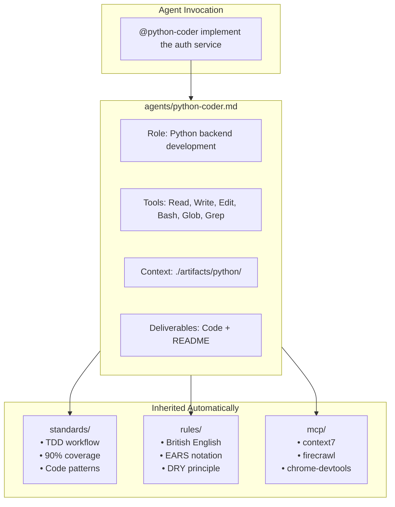

# Documentation Context Architecture

This directory contains four types of context that guide AI agents and human developers. Understanding the separation of concerns between them is critical for maintaining a coherent, non-redundant system.

## The Four Context Types

```
docs/
├── agents/      # WHO does the work (roles, responsibilities, tools)
├── standards/   # HOW to do the work (processes, patterns, quality bars)
├── rules/       # WHAT constraints apply (specific requirements, conventions)
└── mcp/         # WHAT tools are available (external capabilities)
```

## Context Type Definitions

### 1. Agents (`./agents/`)

**Purpose**: Define WHO does what work and WHEN they are invoked.

**Contains**:
- Role definitions (product-owner, python-coder, tech-lead, etc.)
- Tool permissions (which tools each agent can use)
- Context paths (what files each agent reads/writes)
- Deliverables (what each agent produces)
- Sequencing rules (which agents run before others)

**Does NOT contain**:
- How to write code (that's in standards)
- Specific conventions to follow (that's in rules)
- Tool configurations (that's in mcp)

**Example**: `python-coder.md` defines that the Python coder role writes to `./artifacts/python/`, has access to Read/Write/Edit/Bash tools, and should not write tests (that's functional-tester's job).

---

### 2. Standards (`./standards/`)

**Purpose**: Define HOW work should be done consistently.

**Contains**:
- Process workflows (testing-standards, workflow-standards)
- Quality bars (90% coverage minimum, TDD cycle)
- Patterns to follow (component structure, error handling)
- Tool configurations (pytest, vitest, Terraform patterns)
- Anti-patterns to avoid (forbidden practices)

**Does NOT contain**:
- Who does the work (that's in agents)
- Specific language conventions (that's in rules)
- External tool setup (that's in mcp)

**Example**: `testing-standards.md` defines the TDD cycle, coverage requirements, testing pyramid, and forbidden anti-patterns—but doesn't say which agent runs tests.

---

### 3. Rules (`./rules/`)

**Purpose**: Define WHAT specific constraints apply in specific contexts.

**Contains**:
- Language conventions (British English, naming conventions)
- Format requirements (EARS notation for requirements)
- Technology-specific constraints (Swift UI rules, React Native rules)
- Principles to apply (DRY, Twelve-Factor App)

**Does NOT contain**:
- Processes or workflows (that's in standards)
- Who applies the rules (that's in agents)
- Tool configurations (that's in mcp)

**Example**: `british-english.mdc` specifies that all documentation uses British spelling—but doesn't describe the documentation process or who writes docs.

---

### 4. MCP Servers (`./mcp/`)

**Purpose**: Define WHAT external tools are available to agents.

**Contains**:
- Tool configurations (API keys, command paths)
- Available capabilities (firecrawl, context7, chrome-devtools)
- Auto-approval settings (which actions don't need confirmation)

**Does NOT contain**:
- When to use tools (that's in agents)
- How to use tools effectively (that's in standards)
- Constraints on tool usage (that's in rules)

**Example**: `mcp.json` configures the chrome-devtools MCP server—but the `ui-tester.md` agent defines when and how to use it.

---

## Separation of Concerns Matrix

| Question | Context Type | Example |
|----------|--------------|---------|
| Who writes Python code? | Agents | `python-coder.md` |
| How should Python code be structured? | Standards | `coding-standards.md` |
| What spelling should docs use? | Rules | `british-english.mdc` |
| What tools can scrape websites? | MCP | `mcp.json` (firecrawl) |
| Who reviews code before testing? | Agents | `tech-lead.md` |
| How should code reviews be conducted? | Standards | `testing-standards.md` |
| What format should requirements use? | Rules | `EARS-notation-requirements.mdc` |
| What browser automation is available? | MCP | `mcp.json` (playwright) |

## Why This Separation Matters

### 1. Avoids Redundancy
Without clear boundaries, the same information ends up in multiple places:
- ❌ Each agent file repeats "use British English"
- ✅ One rule file defines British English; agents inherit it

### 2. Enables Independent Updates
Each context type can evolve without affecting others:
- Update coverage requirement in standards → all agents inherit it
- Add new MCP tool → agents can use it without file changes
- Change naming convention in rules → applies everywhere

### 3. Clarifies Ownership
When something needs to change, you know where to look:
- Agent not doing its job? → Check `agents/`
- Process not being followed? → Check `standards/`
- Convention being violated? → Check `rules/`
- Tool not working? → Check `mcp/`

### 4. Reduces Cognitive Load
Agents don't need to know everything—just their role:
- Agent reads its own definition + shared standards apply automatically
- No need to cross-reference multiple files for basic operations

## Inheritance Model



Agents don't explicitly reference standards/rules—compliance is **inherited** by operating within this project.

## File Format Conventions

| Directory | Format | Extension | Rationale |
|-----------|--------|-----------|-----------|
| agents/ | Markdown with YAML frontmatter | `.md` | Claude Code native subagent format |
| standards/ | Markdown | `.md` | Human-readable process docs |
| rules/ | Markdown | `.mdc` | Cursor rules format (also readable as MD) |
| mcp/ | JSON | `.json` | MCP server configuration |

## Quick Reference

**Need to add a new role?** → Create in `agents/`

**Need to change a process?** → Update `standards/`

**Need to add a constraint?** → Create in `rules/`

**Need to add a tool?** → Configure in `mcp/`

**Need to know who does what?** → Read `agents/CLAUDE.md`

**Need to know how things should be done?** → Read `standards/`

## Invoking Agents

These agent definitions can be used with multiple AI frameworks. The core content (role, constraints, deliverables) is portable; only the invocation mechanism differs.

### Claude Code (Native)

Claude Code natively supports subagents via the `@agent-name` syntax.

**Setup**:
```bash
# Copy agent files to your project
mkdir -p your-project/.claude/agents
cp docs/agents/*.md your-project/.claude/agents/

# Copy CLAUDE.md to project root for orchestration context
cp docs/agents/CLAUDE.md your-project/
```

**Invocation**:
```bash
# In Claude Code terminal
@product-owner define requirements for a task management API
@python-coder implement the task service
@tech-lead review the implementation
```

**How it works**:
- Claude Code reads `.claude/agents/*.md` files
- YAML frontmatter defines `name`, `description`, `allowed_tools`
- `{$ARGUMENTS}` placeholder receives the user's task
- Agents inherit project context from CLAUDE.md

---

### Cursor

Cursor uses `.cursorrules` or `.mdc` files for context injection.

**Setup**:
```bash
# Option 1: Copy rules directly
cp docs/rules/*.mdc your-project/.cursor/rules/

# Option 2: Reference agents as rules
# Create .cursorrules that includes agent definitions
```

**Invocation**:
- Cursor doesn't have native multi-agent orchestration
- Use rules to inject context, then prompt manually
- Or use Cursor Composer with explicit role instructions

**Adaptation**:
```markdown
# .cursorrules
You are a Python backend developer. Follow these constraints:
- Write type hints on all functions (Python 3.10+)
- Each module should have a single, clear responsibility
- Document public APIs with docstrings
- Write code to ./artifacts/python/
```

---

### Aider

Aider uses convention files and can be prompted with agent roles.

**Setup**:
```bash
# Create .aider.conf.yml with project conventions
# Reference standards and rules
```

**Invocation**:
```bash
# Provide agent context in the prompt
aider --message "Acting as a Python coder following docs/agents/python-coder.md, implement the auth service"
```

**Adaptation**:
- Aider doesn't have native subagent support
- Prepend agent definition to prompts
- Use `--read` flag to include context files

---

### LangChain / LangGraph

Agent definitions can be converted to LangChain agent configurations.

**Adaptation**:
```python
from langchain.agents import AgentExecutor
from langchain_core.prompts import ChatPromptTemplate

# Load agent definition
with open("docs/agents/python-coder.md") as f:
    agent_def = f.read()

# Extract system prompt from markdown
system_prompt = extract_system_prompt(agent_def)

# Create agent with tools from frontmatter
tools = [ReadTool(), WriteTool(), EditTool(), BashTool()]
agent = create_agent(llm, tools, system_prompt)
```

**Key mappings**:
| Agent MD Field | LangChain Equivalent |
|----------------|---------------------|
| `name` | Agent name/identifier |
| `description` | Agent description for routing |
| `allowed_tools` | Tools list |
| System prompt body | `SystemMessage` content |
| `{$ARGUMENTS}` | `HumanMessage` input |

---

### CrewAI

CrewAI's agent/task model maps well to this structure.

**Adaptation**:
```python
from crewai import Agent, Task, Crew

python_coder = Agent(
    role="Python Backend Developer",
    goal="Write clean, testable Python code",
    backstory="Expert Python engineer focused on production-grade code",
    tools=[ReadTool(), WriteTool(), EditTool()],
    allow_delegation=False  # No nested spawning
)

task = Task(
    description="Implement the auth service",
    agent=python_coder,
    expected_output="Python code in ./artifacts/python/"
)
```

**Key mappings**:
| Agent MD Field | CrewAI Equivalent |
|----------------|-------------------|
| Role description | `backstory` |
| Constraints | `goal` + task `description` |
| `allowed_tools` | `tools` |
| Deliverables | `expected_output` |

---

### AutoGen

Microsoft's AutoGen supports multi-agent conversations.

**Adaptation**:
```python
from autogen import AssistantAgent, UserProxyAgent

python_coder = AssistantAgent(
    name="python_coder",
    system_message=open("docs/agents/python-coder.md").read(),
    llm_config={"model": "gpt-4"}
)

tech_lead = AssistantAgent(
    name="tech_lead",
    system_message=open("docs/agents/tech-lead.md").read(),
    llm_config={"model": "gpt-4"}
)

# Sequential workflow
user_proxy.initiate_chat(python_coder, message="Implement auth service")
user_proxy.initiate_chat(tech_lead, message="Review the implementation")
```

---

### OpenAI Assistants API

Agent definitions can create OpenAI Assistants.

**Adaptation**:
```python
from openai import OpenAI
client = OpenAI()

# Create assistant from agent definition
assistant = client.beta.assistants.create(
    name="python-coder",
    instructions=open("docs/agents/python-coder.md").read(),
    model="gpt-4-turbo",
    tools=[
        {"type": "code_interpreter"},
        {"type": "file_search"}
    ]
)
```

---

### Generic Prompt Template

For any LLM without framework support, use this template:

```markdown
# Role
You are a [ROLE FROM AGENT FILE].

# Context
Read from: [CONTEXT PATHS]
Write to: [DELIVERABLES]

# Constraints
[CONSTRAINTS FROM AGENT FILE]

# Standards
Follow all standards in ./docs/standards/ and rules in ./docs/rules/.

# Task
[USER'S REQUEST]
```

---

## Portability Notes

### What's Portable
- Role definitions and responsibilities
- Constraints and deliverables
- Context paths (file locations)
- Workflow sequencing logic

### What Needs Adaptation
- Tool names (Claude's `Read` vs LangChain's `ReadFileTool`)
- Invocation syntax (`@agent` vs function calls)
- Orchestration mechanism (native vs code)
- Model configuration (frontmatter `model:` field)

### YAML Frontmatter Reference

```yaml
---
name: agent-name           # Identifier for invocation
description: What it does  # Used for agent routing
model: sonnet              # opus | sonnet | haiku (Claude-specific)
allowed_tools:             # Tool whitelist
  - Read
  - Write
  - Edit
  - Bash
  - Glob
  - Grep
---
```

Other frameworks may ignore unknown fields; the markdown body is the universal system prompt.

## Related Documentation

- [Agent Orchestration Guide](./agents/CLAUDE.md) - Complete workflow and agent coordination
- [Agent Setup README](./agents/README.md) - How to set up and use agents
- [Agent Interaction Standards](./standards/agent-standards.md) - How agents should behave
- [Testing Standards](./standards/testing-standards.md) - TDD workflow and coverage requirements
