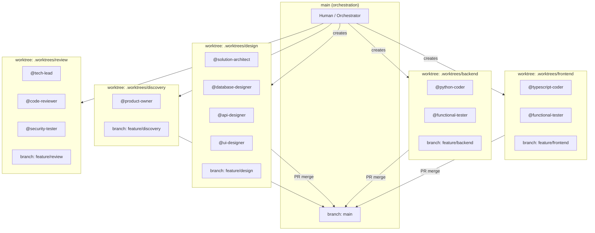
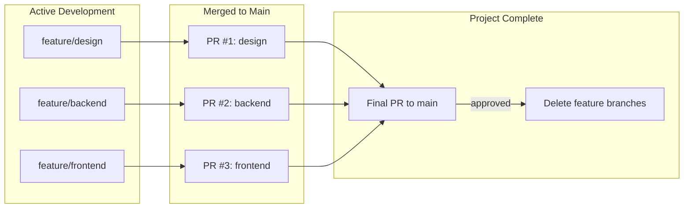
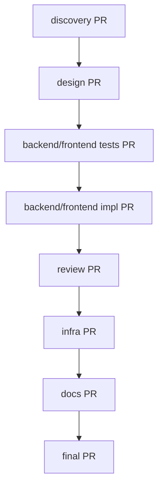

# Agent Interaction Standards

## 1. Introduction

This document outlines the standards for how AI agents shall interact with this software development project. Its purpose is to create a predictable and reliable environment where agents can act as effective and autonomous partners in development.

## 1.1. Standards Compliance

All agents shall follow the standards defined in `./docs/standards/` and rules defined in `./docs/rules/`. Agents are not required to explicitly reference individual standards—compliance is inherited by operating within this project.

## 1.2. Working Directory vs Final Documentation

Agents use two distinct locations for their outputs:

| Location | Purpose | Lifecycle |
|----------|---------|-----------|
| `./artifacts/` | Working directory for agent outputs during development | Ephemeral—cleared between sprints |
| `./docs/` | Final documentation after human review and approval | Persistent—version controlled |

**Workflow**: Agents write to `./artifacts/` during development. Upon completion and approval, outputs are promoted to appropriate `./docs/` locations (specs, build, guides).

## 2. Agent Context Setup Workflow

When an agent is assigned to work on a new product or feature, it shall follow this context setup workflow to ensure proper project initialization and documentation:

### 2.1. Product Description Verification

*   If no product description is provided in the initial context, the agent shall request one from the user.
*   The product description shall include sufficient detail about the purpose, target users, and key functionality to enable proper requirements analysis.

### 2.2. Documentation Creation Sequence

After obtaining the product description, the agent shall create or amend the following documents in strict order:

1. **`docs/specs/requirements.md`**: Functional and non-functional requirements using EARS notation as specified in `docs/rules/EARS-notation-requirements.mdc`.

2. **`docs/specs/design.md`**: Architectural and design decisions that describe how the product will be implemented.

3. **`docs/build/tasks.md`**: Comprehensive task breakdown for implementation, verified against standards in `docs/standards`.

**For each document created or amended, the agent shall pause and wait for explicit human review and approval before proceeding to the next document.**

### 2.3. Placeholder Document Creation

Following the core specification documents, the agent shall create blank placeholder documents:

*   **`docs/build/todo.md`**: For listing smaller items, technical debt, or future improvements.
*   **`docs/build/bugs.md`**: For listing current and past bugs.

### 2.4. Documentation Standards Compliance

All documentation created during this workflow shall conform to the standards outlined in `docs/standards/doc-standards.md`, including:

*   Proper file location within the project structure (specs in `docs/specs/`, build artifacts in `docs/build/`)
*   Content formatting and structure requirements
*   Required elements for requirements (EARS notation), design decisions, and task specifications

### 2.5. Start scripts

The agent shall create `(project)/scripts/start.sh` for local development startup and a root-level start script for the monorepo. The root-level script orchestrates starting all the needed local services.

### 2.6. Build script

The agent shall create `scripts/build.yaml` following the standards in `docs/standards/build-standards.md`.

### 2.7. Workflow Completion

* Upon completion of all build work, the agent shall review common documents as outlined in `docs/standards/doc-standards.md` and make very concise changes as required, in particular:
- `README.md`
- Project-specific documentation in `docs/`

* Upon completion of all documents, the agent shall summarize what was created and confirm with the user before beginning any implementation work.
*   The agent shall not commence task execution until all context documents have been reviewed and approved by humans.

## 3. Agent Behaviour

To operate autonomously but safely, agents shall adhere to the following behaviours:

### 3.1. Agent Planning and Execution

*   When an agent is assigned a multi-step task, it shall first create a plan and present it for approval.
*   If an agent is to perform a destructive action, then it shall seek confirmation before proceeding. A destructive action is one that is not easily reversible. This includes, but is not limited to, deleting untracked files or running commands that permanently alter a remote resource.
*   When an agent completes a task, it shall state what it did and why.
*   If an agent is in doubt about the project's state, then it shall ask for clarification or read the relevant documentation.

### 3.2. Agent Boundaries

*   The agent shall not perform work that is outside the scope of the currently assigned task.
*   The agent shall not perform any action that contradicts the standards defined in the project and common documentation.
*   The agent shall not modify files outside the directory of the current project.
*   The agent shall not proceed based on their own assumptions until the assumptions are validated with the user.

### 3.3. Version Control

*   The agent shall commit its changes to the version control system after completing a significant group of related tasks.
*   The agent shall write a clear and concise commit message that summarizes the purpose of the changes.

## 4. Build, Test, and Automation Artifacts

*   The agent shall store all tests in a `tests/` directory within the project.
*   The agent shall store all scripts used for automation in a `scripts/` directory.
*   The agent shall store all documentation generated during the build process in a `docs/guides` directory within the project.

## 5. Worktree Isolation

To limit the blast radius of agent changes and enable parallel work, agents shall be isolated into **context domains** using git worktrees.

### 5.1. Context Domains

A context domain groups agents that need to share files or context directly. Agents within the same domain work in the same worktree; agents in different domains work in separate worktrees.

| Domain | Agents | Shared Context |
|--------|--------|----------------|
| **discovery** | product-owner | requirements.md, user-stories.md |
| **design** | solution-architect, database-designer, api-designer, ui-designer, visual-designer | architecture.md, api-contract.json, data-model.md, schema.sql, openapi.yaml, design/ |
| **backend** | python-coder, functional-tester (Python) | ./artifacts/python/, tests/ |
| **frontend** | typescript-coder, functional-tester (TypeScript) | ./artifacts/typescript/, tests/ |
| **review** | tech-lead, code-reviewer, security-tester | All code (read-only), review reports |
| **infra** | gcp-devops | ./artifacts/gcp/, terraform/ |
| **docs** | documentation | ./artifacts/docs/, all specs (read-only) |

### 5.2. Worktree Structure



### 5.3. Cross-Domain Context Sharing

Agents in different domains share context through **pull requests**. This provides:
- Version-controlled handoffs
- Review gates between phases
- Rollback capability
- Audit trail

**Rules for cross-domain sharing:**

1. **Producer domain completes work** → Creates PR to main
2. **Reviewer approves PR** → tech-lead, solution-architect, or human
3. **PR merges to main** → Context now available to all domains
4. **Consumer domain pulls from main** → Gets latest shared context
5. **Branch retention** → Do NOT delete feature branches until the final project PR is merged (enables rollback and debugging)

### 5.4. Branch Lifecycle



**Branch deletion rules:**
- Feature branches remain until the **final project PR** is approved and merged
- Final PR aggregates all domain work into a single reviewable unit
- Only after final PR approval: `./coordinate.sh cleanup` removes worktrees and branches
- This ensures rollback capability throughout the project lifecycle

### 5.5. Merge Sequence

Domains merge in dependency order:



**Review requirements per PR:**

| PR | Reviewers |
|----|-----------|
| discovery → main | Human approval |
| design → main | solution-architect + human |
| tests → main | functional-tester self-review + human |
| backend/frontend → main | tech-lead + human |
| review → main | Human approval |
| infra → main | gcp-devops self-review + human |
| docs → main | Human approval |
| final → main | tech-lead + human |

### 5.6. Worktree Commands

The `coordinate.sh` script manages worktrees:

```bash
# Create all worktrees for a feature
./coordinate.sh worktree create my-feature

# List active worktrees
./coordinate.sh worktree list

# Switch to a domain's worktree
./coordinate.sh worktree switch backend

# Pull latest main into a worktree
./coordinate.sh worktree sync backend

# Create PR from a domain
./coordinate.sh worktree pr backend "Implement task service"

# Cleanup after final PR approved
./coordinate.sh worktree cleanup my-feature
```

### 5.7. Agent Worktree Awareness

Agents shall be aware of their worktree context:

- **Check current worktree**: Before writing files, verify you're in the correct domain worktree
- **Don't cross boundaries**: Never write to paths outside your domain's artifacts
- **Signal completion**: When domain work is complete, notify the orchestrator to create PR
- **Wait for sync**: If you need context from another domain, wait for their PR to merge and sync

**Example agent workflow:**
```
1. Orchestrator: ./coordinate.sh worktree create auth-feature
2. Orchestrator: ./coordinate.sh worktree switch design
3. @solution-architect designs auth system
4. @api-designer creates OpenAPI spec
5. Orchestrator: ./coordinate.sh worktree pr design "Auth system design"
6. Human reviews and approves PR
7. Orchestrator: ./coordinate.sh worktree switch backend
8. Orchestrator: ./coordinate.sh worktree sync backend  # pulls design
9. @functional-tester writes failing tests
10. @python-coder implements auth service
... continues through domains ...
```
